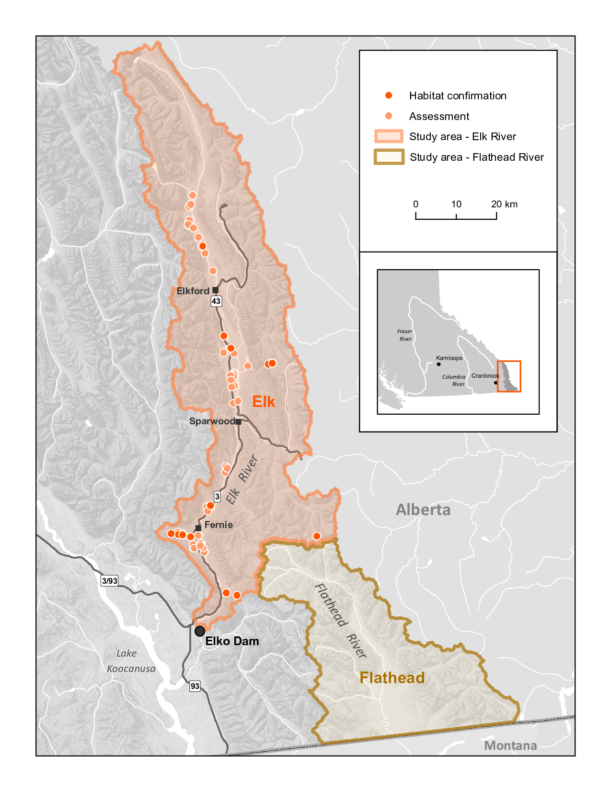
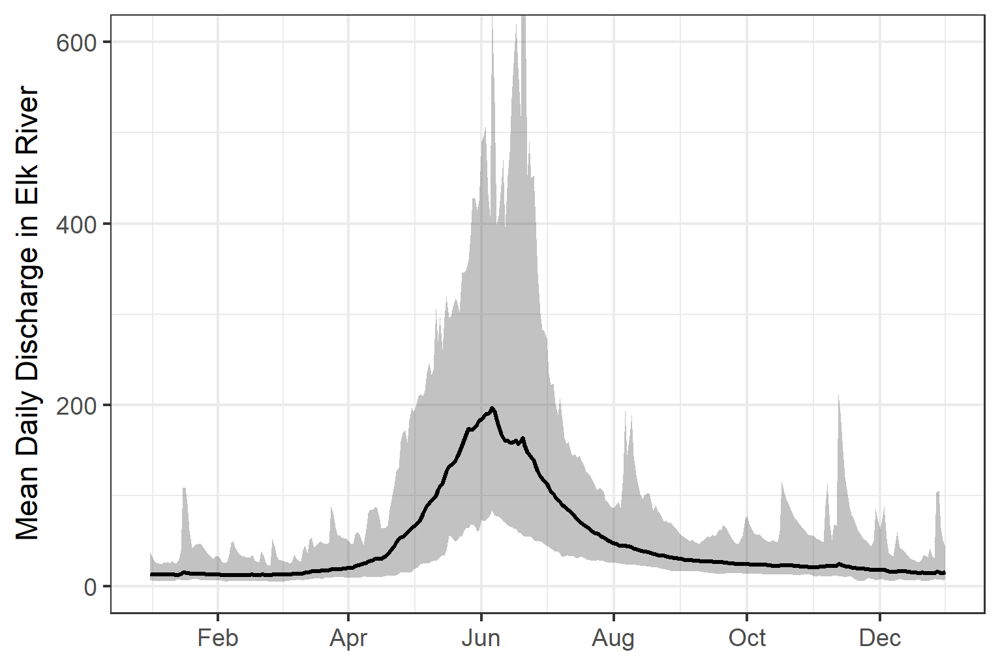
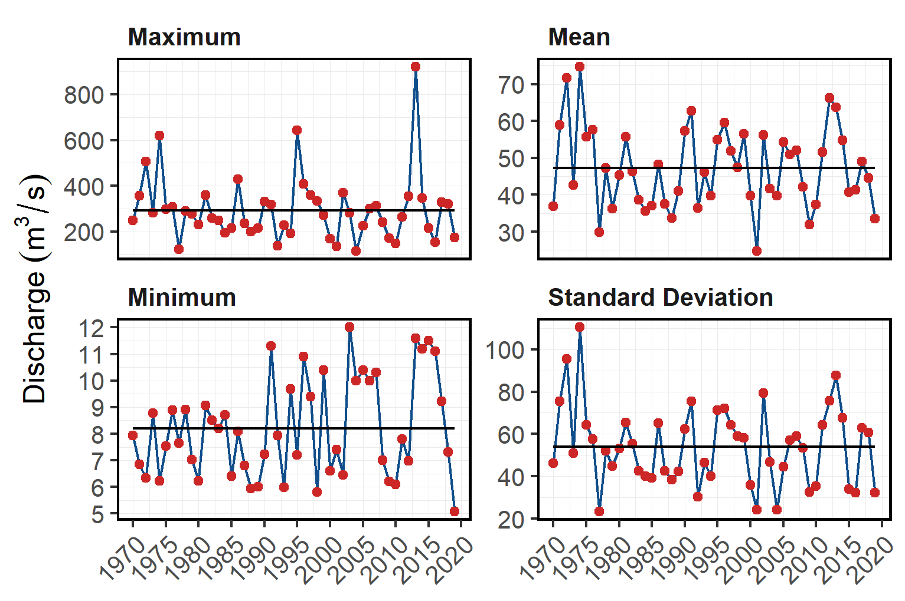

# Background

As a result of high-level direction from the provincial government, a Fish Passage Strategic Approach protocol has been developed for British Columbia to ensure that the greatest opportunities for restoration of fish passage are pursued.  A Fish Passage Technical Working Group has been formed to coordinate the protocol and data is continuously amalgamated within the Provincial Steam Crossing Inventory System (PSCIS).  The strategic approach protocol involves a four-phase process as described in @fishpassagetechnicalworkinggroupFishPassageStrategic2014 :

 * Phase 1: Fish Passage Assessment – Fish stream crossings within watersheds with high fish values are assessed to determine barrier status of structures and document a general assessment of adjacent habitat quality and quantity.
 * Phase 2: Habitat Confirmation – Assessments of crossings prioritized for follow up in Phase 1 studies are conducted to confirm quality and quantity of habitat upstream and down as well as to scope for other potential nearby barriers that could affect the practicality of remediation.
 * Phase 3: Design – Site plans and designs are drawn for priority crossings where high value fish habitat has been confirmed. 
 * Phase 4: Remediation – Reconnection of isolated habitats through replacement, rehabilitation or removal of prioritized crossing structure barriers. 
 
  
 <br>
 
The scope of 2020/2021 project activities reported on in this document includes planning for and implementation of the first two phases of fish passage assessment in the Elk River watershed upstream of the Elko Dam.

<br>

## Project Location

To focus the project area on habitat with high value for conservation of westslope cutthrout trout, the project was focused within the upper Elk River watershed upstream of the Elko Dam located at Elko, BC with planning also conducted for the Flathead River watershed (Figure \@ref(fig:overview-map).  

<br>

The Elk River has a mean annual discharge of `r round(fasstr::calc_longterm_mean(station_number = "08NK002")$LTMAD,1)` m^3^/s with flow patterns typical of high elevation watersheds on the west side of the northern Rocky Mountains which receive large amounts of precipitation as snow leading to peak levels of discharge during snowmelt, typically from May to July (Figures \@ref(fig:hydrology-plot) - \@ref(fig:hydrology-stats)). 

<br>

```{r overview-map, fig.cap = 'Overview map of Study Areas'}

```

<br>

```{r hydrology-plot, fig.cap = 'Hydrograph for Elk River at Fernie (Station #08NK002). Available daily discharge data from 1970 to 2018.'}

```

<br>

```{r hydrology-stats, fig.cap = 'Summary of hydrology statistics in Elk River at Fernie (Station #08NK002)'}

```


<br>

### Ktunaxa Nation

The project location is within the traditional territory of the Ktunaxa Nation [@KtunaxaNation2020] with Elk River components within an area known as Qukin ʔamakʔis, or Raven’s Land [@ministryofforests2020ElkValley]. When Europeans settled in the Kootenay Region around 200 hundred years ago, the Indian Reserves were created which lead to the seven Indian Bands:

 * ʔakisq̓nuk- Columbia Lake Band (Windermere, BC);
 * ʔaq̓am- St. Mary's Band (Cranbrook, BC);
 * ʔakink̓umǂasnuqǂiʔit- Tobacco Plains Band (Grasmere, BC);
 * yaqan nuʔkiy- Lower Kootenay Band (Creston, BC);
 * kyaknuqǂiʔit- Shuswap Band (Invermere, BC);
 * ʔaq̓anqmi- Kootenai Tribe of Idaho (Bonners Ferry, Idaho);
 * k̓upawi¢q̓nuk- Ksanka Band (Elmo, Montana)

<br>

@KtunaxaNation2020 report the vision statement of the Ktunaxa as:

<br>

"Kȼmak̓qa ksukⱡuⱡa·k kuk̓qani ȼ k̓itqakiⱡ haqa ksiʔⱡ ȼxa ʔa·kⱡukqaʔis ksukiⱡq̓ukaʔmi·k kiʔin Ktunaxa naʔs ʔamak̓ʔis. Qus pik̓aksȼ naʔs ȼxaⱡ yaqanakiⱡ haqaʔki. K̓itqawiȼmu kakiⱡwiȼkiⱡ ʔamakʔis k̓isnikȼik kȼxaⱡ qa kiⱡkk̓axuxami·k k̓itqakiⱡ haqa ȼ k̓isʔin ʔaknumuȼtiⱡʔis."

<br>

The vision statement has been translated to english as:

<br>

"Strong, healthy citizens and communities, speaking our languages and celebrating who we are and our history in our ancestral homelands, working together, managing our lands and resources, within a self-sufficient, self-governing Nation."


<br>

### Elk Valley Cumulative Effects Management Framework

Coal deposits are located in the Elk River and Flathead coalfields which extend fromthe Canada-USA border to the northwest for 175km along the Rocky Mountains with cumulative coal thickness ranging up to 70m. Subsurface resource exploration and develpment is prohibited in the Flathead River watershed due to legislation enacted in 2011.  At the time of reporting there were four active coal mines in the Elk River watershed (Fording River, Greenhills, Line Creek and Elkview) on closed mine (Coal Mountain) and multiple exploration projects as well as proposed new mines [@ministryofenergy2020EastKootenay].

<br>

First Nations, stakeholders, proponents and provincial and municipal governments recognize that the region has been impacted by historic and current coal operations as well as other stresses such as forestry operations, wildfire, residential development, recreational activities and transportation.  To assess the historic, current and potential future conditions of valued component and to support resource management decisions within the region the Provincial Cumulative Effects Framework, the Elk Valley Cumulative Effects Management Framework (EV-CEMF) has been formed with  joint management between the Ktunaxa Nation Council and the B.C. Ministry of Forests, Lands, Natural Resource Operations and Rural Development (FLNRORD). A working group consisting of the Ktunaxa Nation Council, industry, community, organizations, and provincial government ministries has been put in place to provide guidance and oversight for EV-CEMF activities.  Valued component technical reports for Grizzly Bear, Riparian and westslope cutthroat trout [@davidson_etal2018AquaticEcosystems], bighorn sheep, and old and mature forest have been drafted, integrated into an overarching Cumulative Effects Assessment and Management Report [@elkvalleycumulativeeffectsmanagementframeworkworkinggroup2018ElkValley], endorsed by the Working Group, and will be submitted to FLNRORD Regional Executive Director and KNC for final approval. These reports describe the historical, current, and future assessment of cumulative effects in the Elk Valley and provide management and mitigation recommendations. Next step include the development of an Implementation Plan to identify priority actions and spatial locations for to focus management and mitigation of cumulative effect in the valley [@ministryofforests2020ElkValley].

<br>


### Elk River Alliance

The Elk River Alliance is a community-based water group that aims to improve and preserve watershed health through projects that raise watershed literacy, inform sustainable water decision-making, collect scientific data to prioritize restoration opportunities and promote safe and sustainable river recreation [@ElkRiverAlliance2020]. Following a large flood event in 2013 that caused significant property and infrastructure damage throughout the valley, the Elk River Alliance developed a comprehensive Flood Strategy report to provide a review of watershed functioning, forecast streamflow/flooding in the Elk Valley, describe the effects of flooding on the community and provide strategies to mitigate against future flood risk [@walker_etal2016ElkRiver]. Building on the 2016 Flood Strategy, the Elk River Cutthroat Trout Research Initiative is a Elk River Alliance project which focuses on habitat evaluation, identification of restoration opportunities and the communication of westslope cutthrout trout information to the community by conducting redd surveys, habitat assessments and the drafting of restoration plans for future habitat improvements [@elkriveralliance2020ElkRiver]. 

<br>


## Fisheries

Fish species recorded in the Elk River watershed group are detailed in Table \@ref(tab:fiss-species-table) [@data_fish_obs].  Bull trout and westslope cutthrout trout are considered of special concern (blue-listed) provincially and westslope cutthrout trout (Pacific populations) are are listed under the *Species at Risk Act* by the Committee on the Status of Endangered Wildlife in Canada as a species of special concern [@bcspeciesecosystemexplorer2020Salvelinusconfluentusa; @bcspeciesecosystemexplorer2020Oncorhynchusclarkii; @schweigert_etal2017COSEWICassessment].  The focus of 2020 field work was to assess potential impacts of road-stream crossings on habitat connectivity for westslope cutthrout trout.

<br>

```{r fiss-species-table}
readr::read_csv(file = paste0(getwd(), '/data/raw_input/fiss_species_table.csv')) %>% 
  filter(`Species Code` != 'CT') %>% 
  my_kable(caption_text = 'Fish species recorded in the Elk River watershed group.')


```

<br>

### Westslope Cutthrout Trout

There are multiple life history strategies for westslope cutthrout trout including stream-resident, fluvial and adfluvial.  All have habitat requirements during life history stages that include cold clean water and varied forms of cover (undercut banks, pool-riffle habitat and riparian vegetation).  Stream-resident fish inhabitat headwater streams above barriers, complete their life cycle within a relatively small range and typically remain relatively small (i.e. <200mm in length).  Fluvial fish are migratory subpopulations that migrate between small spawning/rearing tributaries to and larger adult rearing rivers. Lengths of fluvial fish generally reach more than 400mm.  Finally, adfluvial subpopulations  rear in lakes and migrate to spawning/rearing tributaries with lengths often exceeding 500mm [@schweigert_etal2017COSEWICassessment].


<br>

Spawning habitat for resident and fluvial subpopulations are documented as within the tailouts of deep pools at moderate to high-flow events within small, low-gradient streams with cold well-oxygenated water and clean unsilted gravels [@schmetterling2001SeasonalMovements]. Proximity to large woody debris, boulder or bedrock cover is important for spawning fish while residing in spawning tributaries as high mortality may result when suitable cover is lacking.  The dominant substrate used for spawning ws gravel (1.8 - 3.3cm diameter) with spawning occurring in late May and June towards the end of the spring freshet with rising water temperatures between 7-11$^\circ$C.  Nine of 11 westslope cutthrout trout radio-tagged in the Blackfoot River drainage, Montana by @schmetterling2001SeasonalMovements made movements to tributaries presumable for spawning. While in tributaries, fish movements averaged 12.5km and stayed within a 100m reach during the spawning period for between 15 and 63 days.

<br>

Small perennial streams with a diversity of cover are important for juvenile rearing with young-of-year fish inhabiting low energy lateral habitats (i.e. shallow riffle or backwatered areas) with cover available.  Larger juveniles move into pools with social dominance behaviors prevalent and based on fish size.  Availability of pool habitat is important and limiting for parr which have large territories [@schweigert_etal2017COSEWICassessment; @schmetterling2001SeasonalMovements].

<br>

The suitability of overwintering habitat is determined by groundwater influx and the absence of anchor ice with fluvial adults congregating in slow deep pools in the winter.  Boulders and other large in-stream structurues or off-channel habitat (beaver bonds and sloughs) provide cover for juveniles with adfluvial fish overwintering in lakes [@schweigert_etal2017COSEWICassessment; @brown_mackay1995Spawningecology; @cope_etal2017UpperFording]. 

<br>


In a swimming performance study conducted in an open-channel flume @blank_etal2020SwimmingPerformance estimated the overall average swim speeds of westlope cutthrout trout (150mm - 290mm in length) at 0.84m/s with a maximum observed swim speed of 3.55m/s. 

<br>

```{r fish-wct-fiss-summary}
wct_elkr_grad <- readr::read_csv(file = paste0(getwd(), '/data/raw_input/wct_elkr_grad.csv'))
```


A summary of historical westslope cutthrout trout observations in the Elk River watershed group by average gradient category of associated stream segment is provided in Figure \@ref(fig:fish-wct-bar). Of `r wct_elkr_grad %>% filter(gradient_id == 3) %>% pull(total)` observations, `r wct_elkr_grad %>% filter(gradient_id == 3) %>% pull(Percent) + wct_elkr_grad %>% filter(gradient_id == 5) %>% pull(Percent) + wct_elkr_grad %>% filter(gradient_id == 8) %>% pull(Percent)`% were within stream segments with average gradients ranging from 0 - 8%.  A total of `r wct_elkr_grad %>% filter(gradient_id == 3) %>% pull(Percent)`% of historic observations were within stream segments with gradients between 0 - 3%, `r wct_elkr_grad %>% filter(gradient_id == 5) %>% pull(Percent)`% were within stream segments with gradients ranging from 3 - 5% and `r wct_elkr_grad %>% filter(gradient_id == 5) %>% pull(Percent)`% were within stream segments with gradients between 5 - 8% [@data_fish_obs; @norris2020bcfishobs]. 

<br>

```{r fish-wct-bar, out.width = photo_width, fig.cap= 'Summary of historic westslope cutthrout trout observations vs. stream gradient category.'}
##bar graph
plot_wct_elkr_grad <- wct_elkr_grad %>% 
  ggplot(aes(x = Gradient, y = Percent)) +
  geom_bar(stat = "identity")+
  theme_bw(base_size = 8)+
  labs(x = "Stream Gradient", y = "WCT Occurrences (%)")
plot_wct_elkr_grad

```

  
