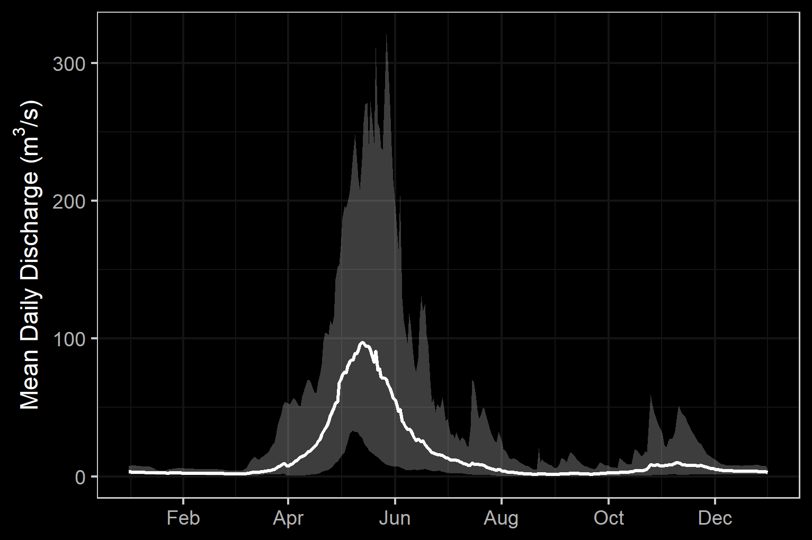

# Background

The study area includes the Bulkley River and Morice River watershed groups (Figure \@ref(fig:overview-map)) and is  within the  traditional territories of the Gitxsan and Wet'suwet'en. The valley  bottom has  seen  extensive  settlement  over  the  past hundred years with major population centers including the Village of Hazelton, the Town of Smithers, the Village of Telkwa and the District Municipality of Houston.  The watersheds are within the Skeena, Stikine, and the Nadina Natural Resource Districts. 

<br>


## Wet'suwet'en

Wet'suwet'en hereditary territory covers an area of 22,000km^2^ including the Bulkley River and Morice River watersheds and portions of the Nechako River watershed.  The Wet'suwet'en people are a matrilineal society organized into the Gilseyhu (Big Frog), Laksilyu (Small Frog), Tsayu (Beaver clan), Gitdumden (Wolf/Bear) and Laksamshu (Fireweed) clans. Within each of the clans there are are a number of kin-based groups known as Yikhs or House groups. The Yikh is a partnership between the people and the territory. Thirteen Yikhs with Hereditary Chiefs manage a total of 38 distinct territories upon which they have jurisdiction.  Within a clan, the head Chief is entrusted with the stewardship of the House territory to ensure the Land is managed in a sustainable manner. Inuk Nu’at’en (Wet'suwet'en law) governing the harvesting of fish within their lands are based on values founded on thousands of years of social, subsistence and environmental dynamics. The Yintahk (Land) is the centre of life as well as culture and it's management is intended to provide security for sustaining salmon, wildlife, and natural foods to ensure the health and well-being of the Wet'suwet'en [@officeofthewetsuweten2013Wetsuwet; @OfficeoftheWetsuweten2021; @flnrord2017NaturalResource].


<br>

## Gitxsan

The Gitxsan Laxyip (traditional territories) covers an area of 33,000km^2^ within the Skeena River and Nass River watersheds.  The Laxyip is governed by 60 Simgiigyet (Hereditary Chiefs), within the traditional hereditary system made up of Wilps (House groups).  Traditional governance of the Gitxsan is guided by the principles of Ayookw (Gitxsan law) [@GitxsanHuwilpGovernment2021]. 

<br>


## Project Location
### Bulkley River

The Bukley River is an 8th  order stream that drains an area of 7,762 km^2^ in a generally northerly direction from Bulkley Lake on the Nechako Plateau to its confluence with the Skeena River at Hazleton. It has a mean annual discharge of `r round(fasstr::calc_longterm_mean(station_number = "08EE004")$LTMAD,1)` m^3^/s at station 08EE004 located near Quick and `r round(fasstr::calc_longterm_mean(station_number = "08EE003")$LTMAD,1)` m^3^/s at station 08EE003 located upstream near Houston.  Flow patterns are typical of high elevation watersheds on the west side of the northern Rocky Mountains which receive large amounts of precipitation as snow leading to peak levels of discharge during snowmelt, typically from May to July (Figures \@ref(fig:hydrology-plot) - \@ref(fig:hydrology-stats)). Fisheries are discussed in the Fisheries Section below.

<br>


Numerous water licenses are held within the watershed with a potential over-allocation of flows identified during low flow  periods  [@ilmb2007MoriceLand].  Changes  to  the  climate  systems  are  causing  impacts  to  natural  and  human systems  on  all  continents  with  alterations  to  hydrological  systems  caused  by  changing  precipitation  or melting  snow  and  ice  increasing  the  frequency  and  magnitude  of  extreme  events  such  as  floods  as droughts [@ipcc2014Climatechange; @eccc2016Climatedata].  These changes are resulting in modifications to the quantity and quality of water resources throughout British Columbia and are likely to compound issues related to drought and flooding in the Bulkley River watershed. 

<br>

As  a  major  access  corridor  to  northwestern  British  Columbia,  Highway  16  and  the  Canadian  National Railway  are  major  linear  developments  that  run  along  the  Bulkley  River  within  and  adjacent  to  the floodplain with numerous crossing structures blocking fish access to important fish habitats.  Additionally, as the valley bottom  contains some of the most productive land in the area, there has been extensive conversion  of  riparian  ecosystems  to  hayfields  and  pastures  leading  to  alterations  in  flow  regimes, increases  in  water  temperatures,  reduced  streambank  stability,  loss  of  overstream  cover  and channelization [@ilmb2007MoriceLand; @wilson_rabnett2007FishPassage]. 

<br>


```{r overview-map, fig.cap = 'Overview map of Study Areas',eval=T}
knitr::include_graphics("fig/BulkelyMoriceOverview2.jpeg")
```

<br>

```{r fig-sub, fig.cap='two plots', fig.show="hold", out.width="50%", eval=F}
par(mar = c(4, 4, .1, .1))
plot(1:10)
plot(rnorm(10), pch=19)
```


```{r hydrology-plot, fig.cap = 'Hydrograph for Bulkley River at Quick (Station #08EE004 - daily discharge data from 1930 to 2018) and near Houston (Station #08EE003 - daily discharge data from 1980 to 2018.', fig.show="hold", out.width= c("49.5%","1%","49.5%"), eval=T}
knitr::include_graphics("fig/hydrograph_08EE004.png")
knitr::include_graphics("fig/pixel.png")

```

<br>

```{r hydrology-stats, fig.cap = 'Summary of hydrology statistics for Bulkley River at Quick (Station #08EE004) and near Houston (Station #08EE003).', fig.show="hold", out.width= c("49.5%","1%","49.5%"), eval=T}

knitr::include_graphics("fig/hydrology_stats_08EE004.png")
knitr::include_graphics("fig/pixel.png")
knitr::include_graphics("fig/hydrology_stats_08EE003.png")

```


<br>


## Fisheries

Fish species recorded in the Bulkley River and Morice watershed groups are detailed in Table \@ref(tab:fiss-species-table) [@data_fish_obs].  Coastal cutthrout trout and bull trout are considered of special concern (blue-listed) provincially. 

<br>


```{r fiss-species-table}
fiss_species_table <- readr::read_csv(paste0(getwd(), '/data/extracted_inputs/fiss_species_table.csv'))
  # filter(`Species Code` != 'CT') %>% 
fiss_species_table %>%  
  my_kable(caption_text = 'Fish species recorded in the Bulkley River and Morice River watershed groups.')


```

### Bulkley River

Traditionally, the salmon stocks in the Bulkley River were the principal food source for the Gitxsan and Wet’suwet’en people with numerous fishing  areas located within the lower Bulkley  drainage (from  the confluence of the Skeena to the confluence with the Telkwa River) and the upper Bulkley drainage which includes the mainstem Bulkley River and tributaries upstream of the Telkwa River confluence [@wilson_rabnett2007FishPassage]. 

<br>

 
Within the lower Bulkley drainage the principle Gitxsan and Wet’suwet’en fishing areas were located on four mainstem locations:  Hagwilget Canyon downstream of Hagwilget Village, Hagwilget Canyon at the village, Bulkley mainstem upstream of the Suskwa confluence and Moricetown Canyon.  Historically, one of the largest aboriginal fisheries on the Skeena was located within the Hagwilget Canyon.  The majority of  the  sites  that  traditionally fished within the canyon are no longer utilized  since the  Department of Fisheries blasted the rocks that concentrated the fish close to the canyon walls in the winter of 1958-59 [@wilson_rabnett2007FishPassage]. 


<br>


Approximately 11.3 km downstream of the Bulkley Lake outlet and just upstream of Watson Creek, the upper Bulkley falls is an approximately 4m high narrow rock sill that crosses the Bulkley River, producing a steep cascade section.  This obstacle to fish passage is recorded as an almost complete barrier to fish passage for salmon during low water flows.  Coho have not been observed beyond the falls since 1972 [@wilson_rabnett2007FishPassage].

<br>

Renowned as a world class recreational steelhead and coho fishery, the Bulkley River receives some of the heaviest angling pressure in the province.  In response to longstanding angler concerns with respect to overcrowding, quality of experience and conflict amongst anglers, an Angling Management Plan was drafted for the river following the initiation of the Skeena Quality Waters Strategy process in 2006 and an extensive multi-year consultation process.   The plan  introduces a number of  regulatory measures with the intent to provide Canadian resident anglers with quality steelhead fishing opportunities.  Regulatory measures introduced with the Angling Management Plan include prohibited angling for non-guided non-resident aliens on Saturdays and Sundays, Sept 1 - Oct 31 within the Bulkley River, angling prohibited for non-guided non-resident aliens on Saturdays and Sundays, all year within the Suskwa River and angling prohibited for non-guided non-resident aliens Sept 1 - Oct 31 in the Telkwa River.  The Bukley River is considered Class II waterand there is no fshing permitted upstream of the Morice/Bulkley River Confluence [@flnro2013BulkleyRiver; @flnro2013OverviewAngling; @flnrord2019FreshwaterFishing].

<br>

### Morice River


```{r fish-fiss-summary, eval=F}
fiss_sum <- readr::read_csv(file = paste0(getwd(), '/data/extracted_inputs/fiss_sum.csv'))
fiss_sum_grad <- readr::read_csv(file = paste0(getwd(), '/data/extracted_inputs/fiss_sum_grad.csv'))
fiss_sum_width <- readr::read_csv(file = paste0(getwd(), '/data/extracted_inputs/fiss_sum_width.csv'))

# A summary of historical westslope cutthrout trout observations in the Elk River watershed group by average gradient category of associated stream segment is provided in Figure \@ref(fig:fish-wct-bar). Of `r wct_elkr_grad %>% filter(gradient_id == 3) %>% pull(total)` observations, `r wct_elkr_grad %>% filter(gradient_id == 3) %>% pull(Percent) + wct_elkr_grad %>% filter(gradient_id == 5) %>% pull(Percent) + wct_elkr_grad %>% filter(gradient_id == 8) %>% pull(Percent)`% were within stream segments with average gradients ranging from 0 - 8%.  A total of `r wct_elkr_grad %>% filter(gradient_id == 3) %>% pull(Percent)`% of historic observations were within stream segments with gradients between 0 - 3%, `r wct_elkr_grad %>% filter(gradient_id == 5) %>% pull(Percent)`% were within stream segments with gradients ranging from 3 - 5% and `r wct_elkr_grad %>% filter(gradient_id == 5) %>% pull(Percent)`% were within stream segments with gradients between 5 - 8% [@data_fish_obs; @norris2020bcfishobs]. 

```

```{r fish-plot-grad, out.width = photo_width, fig.cap= 'Summary of historic salmonid observations vs. stream gradient category for the Bulkley River watershed group.', eval=F}
##bar graph
plot_grad <- fiss_sum_grad %>% 
  filter(gradient_id != 99) %>% 
  ggplot(aes(x = Gradient, y = Percent)) +
  geom_bar(stat = "identity")+
  facet_wrap(~species_code, ncol = 2)+
  theme_bw(base_size = 11)+
  labs(x = "Average Stream Gradient", y = "Occurrences (%)")
plot_grad

```

```{r fish-plot-width, out.width = photo_width, fig.cap= 'Summary of historic salmonid observations vs. channel width category for the Bulkley River watershed group.', eval=F}
##bar graph
plot_width <- fiss_sum_width %>% 
  filter(!is.na(width_id)) %>%
  ggplot(aes(x = Width, y = Percent)) +
  geom_bar(stat = "identity")+
  facet_wrap(~species_code, ncol = 2)+
  theme_bw(base_size = 11)+
  labs(x = "Channel Width", y = "Occurrences (%)")
plot_width
```

```{r fish-plot-wshed, out.width = photo_width, fig.cap= 'Summary of historic salmonid observations vs. watershed size category for the Bulkley River watershed group.', eval=F}
##bar graph
fiss_sum_wshed_filter <- fiss_sum %>% 
  filter(upstream_area_ha < 10000)

bin_1 <- 0
# bin_1 <- floor(min(fiss_sum_wshed_filter$upstream_area_ha, na.rm = TRUE)/5)*5
bin_n <- ceiling(max(fiss_sum_wshed_filter$upstream_area_ha, na.rm = TRUE)/5)*5
bins <- seq(bin_1,bin_n, by = 1000)

plot_wshed_hist <- ggplot(fiss_sum_wshed_filter, aes(x=upstream_area_ha
                                           # fill=alias_local_name
                                           # color = alias_local_name
)) +
  geom_histogram(breaks = bins, 
                 position="identity", size = 0.75)+
  labs(x = "Upstream Watershed Area (ha)", y = "Count Fish (#)") +
  facet_wrap(~species_code, ncol = 2)+
  # scale_color_grey() +
  # scale_fill_grey() +
  theme_bw(base_size = 11)+
  scale_x_continuous(breaks = bins[seq(1, length(bins), by = 2)])+
  # scale_color_manual(values=c("grey90", "grey60", "grey30", "grey0"))+
  # theme(axis.text.x = element_text(angle = 45, hjust = 1))+
  geom_histogram(aes(y=..density..), breaks = bins, alpha=0.5,
                 position="identity", size = 0.75)
plot_wshed_hist
```

<br>

## Fish Passage Restoration and Implementation

As a result of high-level direction from the provincial government, a Fish Passage Strategic Approach protocol has been developed for British Columbia to ensure that the greatest opportunities for restoration of fish passage are pursued.  A Fish Passage Technical Working Group has been formed to coordinate the protocol and data is continuously amalgamated within the Provincial Steam Crossing Inventory System (PSCIS).  The strategic approach protocol involves a four-phase process as described in @fishpassagetechnicalworkinggroupFishPassageStrategic2014 :

 * Phase 1: Fish Passage Assessment – Fish stream crossings within watersheds with high fish values are assessed to determine barrier status of structures and document a general assessment of adjacent habitat quality and quantity.
 * Phase 2: Habitat Confirmation – Assessments of crossings prioritized for follow up in Phase 1 studies are conducted to confirm quality and quantity of habitat upstream and down as well as to scope for other potential nearby barriers that could affect the practicality of remediation.
 * Phase 3: Design – Site plans and designs are drawn for priority crossings where high value fish habitat has been confirmed. 
 * Phase 4: Remediation – Reconnection of isolated habitats through replacement, rehabilitation or removal of prioritized crossing structure barriers. 
 
  
<br>
