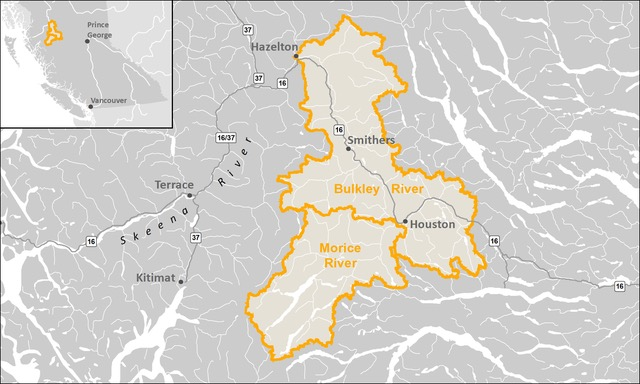
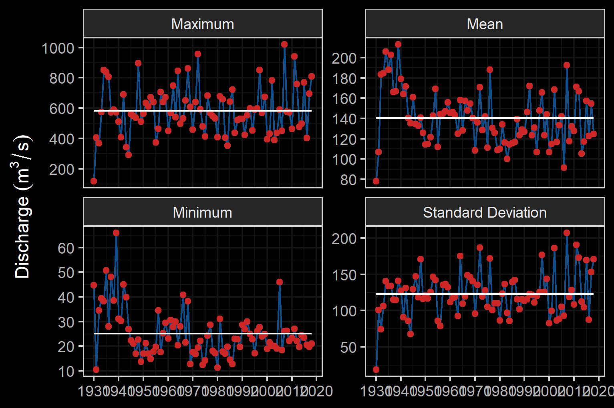

# Background

As a result of high-level direction from the provincial government, a Fish Passage Strategic Approach protocol has been developed for British Columbia to ensure that the greatest opportunities for restoration of fish passage are pursued.  A Fish Passage Technical Working Group has been formed to coordinate the protocol and data is continuously amalgamated within the Provincial Steam Crossing Inventory System (PSCIS).  The strategic approach protocol involves a four-phase process as described in @fishpassagetechnicalworkinggroupFishPassageStrategic2014 :

 * Phase 1: Fish Passage Assessment – Fish stream crossings within watersheds with high fish values are assessed to determine barrier status of structures and document a general assessment of adjacent habitat quality and quantity.
 * Phase 2: Habitat Confirmation – Assessments of crossings prioritized for follow up in Phase 1 studies are conducted to confirm quality and quantity of habitat upstream and down as well as to scope for other potential nearby barriers that could affect the practicality of remediation.
 * Phase 3: Design – Site plans and designs are drawn for priority crossings where high value fish habitat has been confirmed. 
 * Phase 4: Remediation – Reconnection of isolated habitats through replacement, rehabilitation or removal of prioritized crossing structure barriers. 
 
  
<br>

## Project Location

To focus the project area on habitat with high value for conservation of westslope cutthrout trout, the project included the upper Elk River watershed upstream of the Elko Dam with planning also conducted for the Flathead River watershed (Figure \@ref(fig:overview-map).  

<br>

The Bukley River has a mean annual discharge of `r round(fasstr::calc_longterm_mean(station_number = "08EE004")$LTMAD,1)` m^3^/s at station 08EE004 located near Quick and `r round(fasstr::calc_longterm_mean(station_number = "08EE003")$LTMAD,1)` m^3^/s at station 08EE003 located upstream near Houston.  Flow patterns are typical of high elevation watersheds on the west side of the northern Rocky Mountains which receive large amounts of precipitation as snow leading to peak levels of discharge during snowmelt, typically from May to July (Figures \@ref(fig:hydrology-plot) - \@ref(fig:hydrology-stats)). 

<br>

```{r overview-map, fig.cap = 'Overview map of Study Areas',eval=T}

```

<br>

```{r fig-sub, fig.cap='two plots', fig.show="hold", out.width="50%", eval=F}
par(mar = c(4, 4, .1, .1))
plot(1:10)
plot(rnorm(10), pch=19)
```


```{r hydrology-plot, fig.cap = 'Hydrograph for Bulkley River at Quick (Station #08EE004 - daily discharge data from 1930 to 2018) and near Houston (Station #08EE003 - daily discharge data from 1980 to 2018.', fig.show="hold", out.width= c("49.5%","1%","49.5%"), eval=T}
knitr::include_graphics("fig/hydrograph_08EE004.png")
knitr::include_graphics("fig/pixel.png")
knitr::include_graphics("fig/hydrograph_08EE003.png")
```

<br>

```{r hydrology-stats, fig.cap = 'Summary of hydrology statistics for Bulkley River at Quick (Station #08EE004) and near Houston (Station #08EE003).', fig.show="hold", out.width= c("49.5%","1%","49.5%"), eval=T}


knitr::include_graphics("fig/pixel.png")
knitr::include_graphics("fig/hydrology_stats_08EE003.png")

```


<br>

```{r}
### Wet'suwet'en

### Gitxsan
```


<br>


## Fisheries


<br>

```{r fiss-species-table, eval=F}
readr::read_csv(file = paste0(getwd(), '/data/raw_input/fiss_species_table.csv')) %>% 
  filter(`Species Code` != 'CT') %>% 
  my_kable(caption_text = 'Fish species recorded in the Bulkley River watershed group.')


# Fish species recorded in the Elk River watershed group are detailed in Table \@ref(tab:fiss-species-table) [@data_fish_obs].  Bull trout and westslope cutthrout trout are considered of special concern (blue-listed) provincially and westslope cutthrout trout (Pacific populations) are are listed under the *Species at Risk Act* by the Committee on the Status of Endangered Wildlife in Canada as a species of special concern [@bcspeciesecosystemexplorer2020Salvelinusconfluentusa; @bcspeciesecosystemexplorer2020Oncorhynchusclarkii; @schweigert_etal2017COSEWICassessment].  The focus of 2020 field work was to assess potential impacts of road-stream crossings on habitat connectivity for westslope cutthrout trout.

```

<br>

 

<br>

```{r fish-fiss-summary, eval=T}
fiss_sum <- readr::read_csv(file = paste0(getwd(), '/data/extracted_inputs/fiss_sum.csv'))
fiss_sum_grad <- readr::read_csv(file = paste0(getwd(), '/data/extracted_inputs/fiss_sum_grad.csv'))
fiss_sum_width <- readr::read_csv(file = paste0(getwd(), '/data/extracted_inputs/fiss_sum_width.csv'))

# A summary of historical westslope cutthrout trout observations in the Elk River watershed group by average gradient category of associated stream segment is provided in Figure \@ref(fig:fish-wct-bar). Of `r wct_elkr_grad %>% filter(gradient_id == 3) %>% pull(total)` observations, `r wct_elkr_grad %>% filter(gradient_id == 3) %>% pull(Percent) + wct_elkr_grad %>% filter(gradient_id == 5) %>% pull(Percent) + wct_elkr_grad %>% filter(gradient_id == 8) %>% pull(Percent)`% were within stream segments with average gradients ranging from 0 - 8%.  A total of `r wct_elkr_grad %>% filter(gradient_id == 3) %>% pull(Percent)`% of historic observations were within stream segments with gradients between 0 - 3%, `r wct_elkr_grad %>% filter(gradient_id == 5) %>% pull(Percent)`% were within stream segments with gradients ranging from 3 - 5% and `r wct_elkr_grad %>% filter(gradient_id == 5) %>% pull(Percent)`% were within stream segments with gradients between 5 - 8% [@data_fish_obs; @norris2020bcfishobs]. 

```


<br>

```{r fish-plot-grad, out.width = photo_width, fig.cap= 'Summary of historic salmonid observations vs. stream gradient category for the Bulkley River watershed group.', eval=T}
##bar graph
plot_grad <- fiss_sum_grad %>% 
  filter(gradient_id != 99) %>% 
  ggplot(aes(x = Gradient, y = Percent)) +
  geom_bar(stat = "identity")+
  facet_wrap(~species_code, ncol = 2)+
  theme_bw(base_size = 11)+
  labs(x = "Average Stream Gradient", y = "Occurrences (%)")
plot_grad

```

<br>

```{r fish-plot-width, out.width = photo_width, fig.cap= 'Summary of historic salmonid observations vs. channel width category for the Bulkley River watershed group.', eval=T}
##bar graph
plot_width <- fiss_sum_width %>% 
  filter(!is.na(width_id)) %>%
  ggplot(aes(x = Width, y = Percent)) +
  geom_bar(stat = "identity")+
  facet_wrap(~species_code, ncol = 2)+
  theme_bw(base_size = 11)+
  labs(x = "Channel Width", y = "Occurrences (%)")
plot_width
```

<br>

```{r fish-plot-wshed, out.width = photo_width, fig.cap= 'Summary of historic salmonid observations vs. watershed size category for the Bulkley River watershed group.', eval=T}
##bar graph
fiss_sum_wshed_filter <- fiss_sum %>% 
  filter(upstream_area_ha < 10000)

bin_1 <- 0
# bin_1 <- floor(min(fiss_sum_wshed_filter$upstream_area_ha, na.rm = TRUE)/5)*5
bin_n <- ceiling(max(fiss_sum_wshed_filter$upstream_area_ha, na.rm = TRUE)/5)*5
bins <- seq(bin_1,bin_n, by = 1000)

plot_wshed_hist <- ggplot(fiss_sum_wshed_filter, aes(x=upstream_area_ha
                                           # fill=alias_local_name
                                           # color = alias_local_name
)) +
  geom_histogram(breaks = bins, 
                 position="identity", size = 0.75)+
  labs(x = "Upstream Watershed Area (ha)", y = "Count Fish (#)") +
  facet_wrap(~species_code, ncol = 2)+
  # scale_color_grey() +
  # scale_fill_grey() +
  theme_bw(base_size = 11)+
  scale_x_continuous(breaks = bins[seq(1, length(bins), by = 2)])+
  # scale_color_manual(values=c("grey90", "grey60", "grey30", "grey0"))+
  # theme(axis.text.x = element_text(angle = 45, hjust = 1))+
  geom_histogram(aes(y=..density..), breaks = bins, alpha=0.5,
                 position="identity", size = 0.75)
plot_wshed_hist
```

