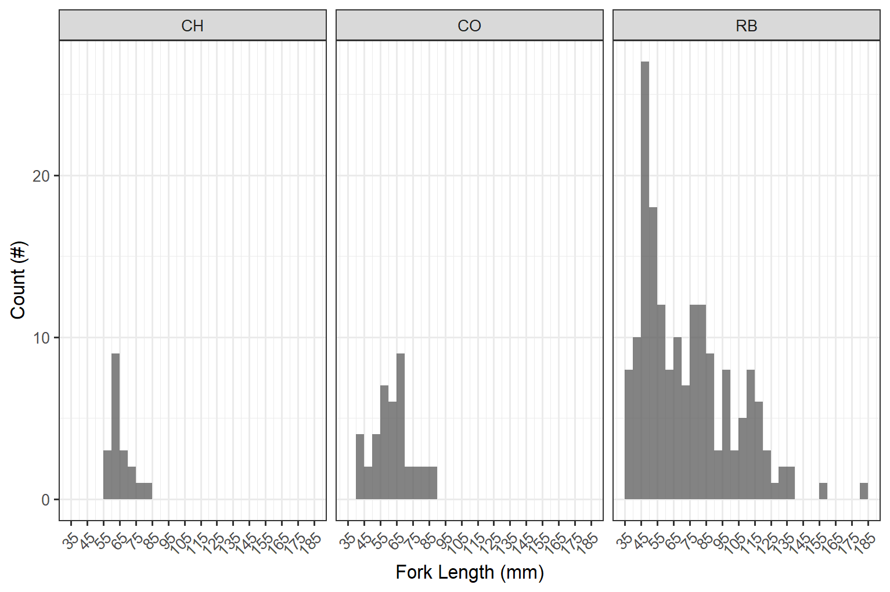

# Results and Discussion

Field assessments were conducted between `r format(min(pscis$date), format="%B %d %Y")` and `r format(max(pscis$date), format="%B %d %Y")` by Allan Irvine, R.P.Bio, Kyle Prince, P,Biol, Mark Fjeld, BiT and Chad Hughes, Ecologist. Results of Phase 1 and Phase 2 assessments are `r if(html_on)knitr::asis_output("summarized in Figure \\@ref(fig:map-interactive) with additional details ")` provided in sections below.

<br>

```{r map-interactive, eval= html_on, fig.cap='Map of fish passage and habitat confirmation results'}
##make colors for the priorities
pal <- 
   colorFactor(palette = c("red", "yellow", "grey", "black"), 
               levels = c("high", "moderate", "low", "no fix"))

pal_phase1 <- 
   colorFactor(palette = c("red", "yellow", "grey", "black"), 
               levels = c("high", "moderate", "low", NA))
#https://stackoverflow.com/questions/61026700/bring-a-group-of-markers-to-front-in-leaflet
# marker_options <- markerOptions(  
#   zIndexOffset = 1000)
tracks <- sf::read_sf("./data/habitat_confirmation_tracks.gpx", layer = "tracks") 
wshds <- sf::read_sf('data/fishpass_mapping.gpkg', layer = 'hab_wshds_ltree') %>% 
  filter(!pscis_crossing_id %in% c(62423, 62426, 50181, 50159)) %>% ##these ones are not correct - fix later
  st_transform(crs = 4326)
wshd_study_elk <- sf::read_sf('data/fishpass_mapping.gpkg', layer = 'wshd_study_elk') %>% 
  st_transform(crs = 4326)
wshd_study_flathead <- sf::read_sf('data/fishpass_mapping.gpkg', layer = 'wshd_study_flathead') %>% 
  st_transform(crs = 4326) 
photo_metadata <- readr::read_csv(file = 'data/photo_metadata.csv')
  
  
map <- leaflet(height=500, width=780) %>%
  # leaflet() %>% 
  addTiles() %>%
  # leafem::addMouseCoordinates(proj4 = 26911) %>% ##can't seem to get it to render utms yet
  # addProviderTiles(providers$"Esri.DeLorme") %>% 
  addProviderTiles("Esri.WorldTopoMap", group = "Topo") %>%
  addProviderTiles("Esri.WorldImagery", group = "ESRI Aerial") %>% 
  addPolygons(data = wshds, color = "#0859C6", weight = 1, smoothFactor = 0.5,
    opacity = 1.0, fillOpacity = 0.25,
    fillColor = "#00DBFF") %>%
  addPolygons(data = wshd_study_elk, color = "#F29A6E", weight = 1, smoothFactor = 0.5,
    opacity = 1.0, fillOpacity = 0.25,
    fillColor = "#F29A6E", label = 'Upper Elk River') %>% 
  addPolygons(data = wshd_study_flathead, color = "#C39D50", weight = 1, smoothFactor = 0.5,
    opacity = 1.0, fillOpacity = 0.25,
    fillColor = "#C39D50", label = 'Flathead River') %>%
  # addMeasure() %>% 
  # setView(lng = -105.644, lat = 51.618, zoom = 3)
  
  # addPolylines(data=drake::readd(fish_habitat_model_lines),  opacity=1, color = '#6498d2',
  #              fillOpacity = 0.75, weight=2) %>% 
  # addPolylines(data=forest_tenure_road_lines,  opacity=1, color = '#ff7f00',
  #              fillOpacity = 0.75, weight=2) %>%
    addLegend(
    position = "topright",
    colors = c("red", "yellow", "grey", "black"),
    labels = c("High", "Moderate", "Low", 'No fix'), opacity = 1,
    title = "Fish Passage Priorities",
  ) %>% 
    addPolylines(data=tracks,  opacity=0.75, color = '#e216c4',
               fillOpacity = 0.75, weight=5, group = "Phase 2") %>%
  addAwesomeMarkers(lng = photo_metadata$gpslongitude,lat = photo_metadata$gpslatitude,
                    popup = leafpop::popupImage(photo_metadata$url, src = "remote"),
                    clusterOptions = markerClusterOptions(),
                    group = "Phase 2") %>%
    addCircleMarkers(
    data=tab_hab_map,
    label = tab_hab_map$pscis_crossing_id, 
    labelOptions = labelOptions(noHide = T, textOnly = TRUE),
    popup = leafpop::popupTable(x = select((tab_hab_map %>% st_set_geometry(NULL)), 
                                           Site = pscis_crossing_id, Priority = priority, Stream = stream_name, Road = road_name, `Habitat (m)`= upstream_habitat_length_m, Comments = comments),
                                feature.id = F,
                                row.numbers = F), 
    radius = 9,
    fillColor = ~pal(priority),
    color= "#ffffff",
    stroke = TRUE, 
    fillOpacity = 1.0,
    weight = 2,
    opacity = 1.0,
    group = "Phase 2"
    ) %>% 
  addCircleMarkers(
    data=tab_phase1_map,
    label = tab_phase1_map$ID,
    labelOptions = labelOptions(noHide = F, textOnly = TRUE),
    popup = leafpop::popupTable(x = select((tab_phase1_map %>% st_set_geometry(NULL)),
                                           Site = ID, Priority = priority_phase1, Stream = stream_name, Road = road_name, `Habitat value`= habitat_value, `Barrier Result` = barrier_result, `Data Link` = link),
                                feature.id = F,
                                row.numbers = F),
    radius = 9,
    fillColor = ~pal_phase1(priority_phase1),
    color= "#ffffff",
    stroke = TRUE,
    fillOpacity = 1.0,
    weight = 2,
    opacity = 1.0,
    group = "Phase 1"
    ) %>%

  #     # addScaleBar(position = 'bottomleft', options = scaleBarOptions(imperial = FALSE)) %>% 
  addLayersControl(
    baseGroups = c(
      "Esri.DeLorme",
      "ESRI Aerial"),
    overlayGroups = c("Phase 1", "Phase 2"),
    options = layersControlOptions(collapsed = F)) %>%
  leaflet.extras::addFullscreenControl() %>% 
  addMiniMap(tiles = providers$"Esri.NatGeoWorldMap",
             zoomLevelOffset = -6, width = 100, height = 100)

map %>% 
  hideGroup("Phase 2") 
```


## Planning

Sites selected for follow up with Phase 1 and 2 assessments in the upper Elk River and Flathead River watersheds are included as Google Earth kml files [here](https://github.com/NewGraphEnvironment/fish_passage_elk_2020_reporting_cwf/tree/master/data/planning_kmls).  

## Phase 1

A total of `r n_distinct(pscis$my_crossing_reference)` phase 1 assessments were conducted with `r pscis %>% filter(barrier_result == 'Passable') %>% nrow()` crossings considered "passable", `r pscis %>% filter(barrier_result == 'Potential') %>% nrow()` crossings considered 'potential' barriers and `r pscis %>% filter(barrier_result == 'Barrier') %>% nrow()` crossings considered barriers.  Site details and photos are presented in [Appendix - Phase 1 Fish Passage Assessment Data and Photos].  A rough cost benefit analysis for Phase 1 sites there were determined to be barriers or potential barriers is presented in Table \@ref(tab:cost-est-phase-1). 

<br>

Barrier passability criteria used in this project follows @fish_passage_assessments, and reflects an estimation for the passage of a juvenile salmon or small resident rainbow trout [@clarkinNationalInventoryAssessment2005 ;@bellFisheriesHandbookEngineering1991; @thompsonAssessingFishPassage2013].  As noted in @bourne_etal2011Barriersfish, with a detailed review of different criteria in @kemp_ohanley2010Proceduresevaluating, passability of barriers can be quantified in many different ways. Fish physiology (i.e. species, length, swim speeds) as well as the temporal variation of physical characteristics (ex. due to flow volumes/velocities a particular culvert is passable 50% of the time to fish with a defined physiological capacity) make defining passability difficult with important implications for watershed connectivity modelling [@bourne_etal2011Barriersfish; @shaw_etal2016Importancepartial; @mahlum_etal2014EvaluatingBarrier; @kemp_ohanley2010Proceduresevaluating].

<br>

```{r cost-est-phase-1}
if(html_on){
  tab_cost_est_phase1 %>% 
  my_kable_scroll(caption_text = 'Upstream habitat estimates and cost benefit analysis for Phase 1 assessments.  IDs are PSCIS idenfifiers with exception of those with * which are interim references.')
} else tab_cost_est_phase1 %>% 
  my_kable(caption_text = 'Upstream habitat estimates and cost benefit analysis for Phase 1 assessments.  IDs are PSCIS idenfifiers with exception of those with * which are interim references.')
```

<br>

## Phase 2

 
Habitat confirmation assessments were conducted at `r hab_site_priorities %>% nrow()` sites with a total of approximately 15 km of stream assessed. `r hab_site_priorities %>% filter(priority %ilike% 'high') %>% nrow() %>% english::as.english() %>% str_to_title()` crossings were rated as high priorities for proceeding to design for replacement, `r hab_site_priorities %>% filter(priority %ilike% 'Moderate') %>% nrow() %>% english::as.english() %>% str_to_title()` crossings were rated as moderate priorities for proceeding to design for replacement, `r hab_site_priorities %>% filter(priority %ilike% 'Low') %>% nrow() %>% english::as.english()` crossings were rated as a low priority and `r hab_site_priorities %>% filter(priority %ilike% 'no fix') %>% nrow() %>% english::as.english()` rated as "no fix". Results are summarized in `r if(html_on){knitr::asis_output("Figure \\@ref(fig:map-interactive) and ")}`Tables \@ref(tab:tab-overview) - \@ref(tab:tab-habitat-summary) with raw habitat and fish sampling data included in digital format as [Attachment 2](https://github.com/NewGraphEnvironment/fish_passage_elk_2020_reporting/raw/master/data/habitat_confirmations.xls).  Detailed information for each site assessed with Phase 2 assessments is included within site specific reports included as appendices to this document.


<br>

```{r tab-overview}
if(html_on){
tab_overview %>% 
  select(-Tenure) %>%
  my_tab_overview_scroll(caption_text = 'Overview of habitat confirmation sites.')
} else tab_overview %>% 
  select(-Tenure) %>%
  my_tab_overview(caption_text = 'Overview of habitat confirmation sites.')
```

<br>

\pagebreak

```{r}
make_tab_cv(dat = pscis2) %>% 
  my_kable(caption_text = 'Summary of Phase 2 fish passage reassessments.')
```

<br>

```{r cost-est-phase-2}
tab_cost_est_phase2_report %>% 
  my_kable(caption_text = 'Cost benefit analysis for Phase 2 assessments.')
  # kable(caption = 'Modelled upstream habitat estimate and cost benefit.',
  #       escape = T) %>% 
  # kableExtra::kable_styling(c("condensed"), full_width = T, font_size = 11) %>% 
  # kableExtra::scroll_box(width = "100%", height = "500px")

```

<br>

```{r tab-habitat-summary}
tab_hab_summary %>% 
  filter(Location %ilike% 'upstream') %>% 
  select(-Location) %>% 
  rename(`PSCIS ID` = Site) %>% 
  my_kable(caption_text = 'Summary of Phase 2 habitat confirmation details.')

```

<br>

## Fish Sampling

Fish sampling was conducted at five sites with a total of `r tab_fish_summary %>% filter(species_code == 'WCT') %>% pull(count_fish) %>% sum()` westslope cutthout trout,  `r tab_fish_summary %>% filter(species_code == 'EB') %>% pull(count_fish) %>% sum()` eastern brook trout and `r tab_fish_summary %>% filter(species_code == 'BT') %>% pull(count_fish) %>% sum()` bull trout captured.  Westslope cutthrout trout were captured at three of the sites sampled with fork length data delineated into life stages: fry (&le;60mm), parr (>60 to 110mm), juvenile (>110mm to 140mm) and adult (>140mm) by visually assessing the histogram presented in Figure \@ref(fig:fish-histogram).  Fish sampling results are presented in detail within individual habitat confirmation site memos within the appendices of this document with westslope cutthrout trout density results also presented in Figure \@ref(fig:plot-fish-all).  

<br>

```{r fish-histogram, fig.cap= 'Histogram of westslope cutthrout trout captured during electrofishing surveys.'}


```

<br>

```{r plot-fish-all, fig.cap='Boxplots of densities (fish/100m2) of westslope cutthrout trout captured by life stage and site for data collected during habitat confirmation assessments.'}
plot_fish_box_all()
```

