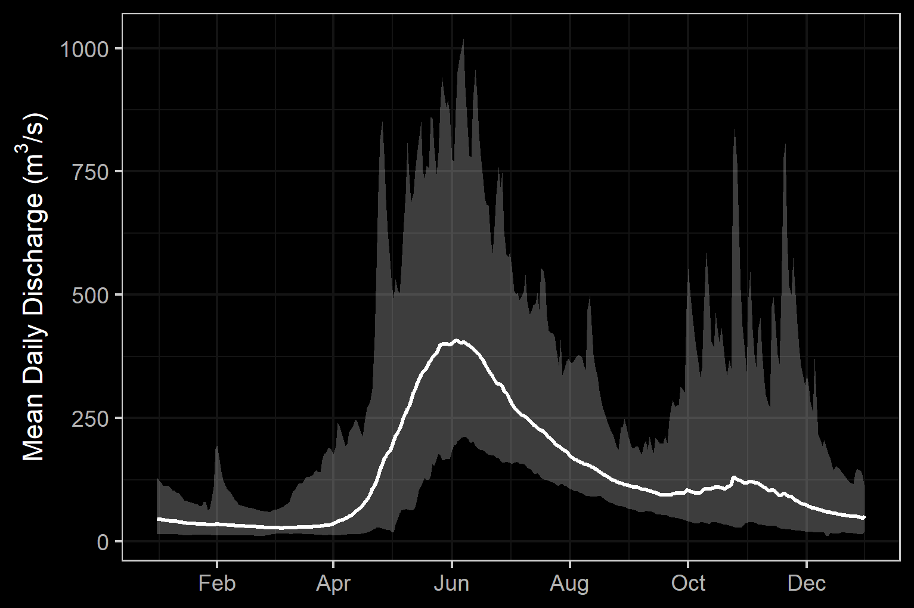

--- 
title: "Bulkley River and Morice River Watershed Groups Fish Passage Restoration Planning"
author: |
 |
 | Prepared for
 | Habitat Conservation Trust Foundation - CAT21-6-288
 | BC Fish Passage Remediation Program
 | Canadian Wildlife Federation
 |
 |
 | Prepared by
 | Al Irvine, B.Sc., R.P.Bio.
 | New Graph Environment
 | on behalf of
 | Society for Ecosytem Restoration Northern BC
date: |
 |
 | Version 0.1.1
 | `r format(Sys.Date(), "%Y-%m-%d")`
toc-title: Table of Contents
site: bookdown::bookdown_site
output: bookdown::gitbook
nocite: |
  @busch_etal2013LandscapeLevelModel, 
  @woll_etal2017SalmonEcological,
  @kirsch_etal2014Fishinventory,
  @cooney_holzer2006AppendixInterior,
  @roberge_etal2002LifeHistory,
  @sloat_etal2017Streamnetworka,
  @woll_etal2017SalmonEcological,
  @porter_etal2008DevelopingFish,
  @rosenfeld_etal2000Habitatfactorsa
documentclass: book
bibliography: [book.bib, references.bib, packages.bib]
biblio-style: apalike
link-citations: no
github-repo: rstudio/bookdown-demo
description: "My Description."

---


```{r setup, include = TRUE, echo =FALSE, message=FALSE, warning=FALSE}
gitbook_on <- TRUE
# gitbook_on <- FALSE  ##we just need turn  this on and off to switch between gitbook and pdf via paged.js


knitr::opts_chunk$set(echo=FALSE, message=FALSE, warning=FALSE, dpi=60, out.width = "100%")
options(scipen=999)
options(knitr.kable.NA = '--') #'--'
options(knitr.kable.NAN = '--')


```

```{r settings-gitbook, eval= gitbook_on}
photo_width <- "100%"
font_set <- 11

```

```{r settings-paged-html, eval= identical(gitbook_on, FALSE)}
photo_width <- "80%"
font_set <- 9
```


```{r}
source('R/packages.R')
source('R/functions.R')
source('R/functions-phase2.R')
source('R/0310-tables.R')
source('R/0320-tables-phase2.R')
source('R/0330-tables-phase1-cost-estimate.R')
source('R/0340-tables-phase2-cost-estimate.R') ##the order of these matters to much - should fix.  need to make cost estimate table seperate
source('R/0350-tables-reporting.R')
source('R/0380-extract-fish-to-hab-con-density-summary.R')
source('R/functions-fish.R')
source('R/0315-tables-bcfishpass.R')
```


```{r include=FALSE}
# automatically create a bib database for R packages
knitr::write_bib(c(
  .packages(), 'bookdown', 'knitr', 'rmarkdown'
), 'packages.bib')
```

# Acknowledgement {.front-matter .unnumbered}

The Bulkley River and Morice River watersheds are within Wet’suwet’en and Gitxsan territory. 

<br>

Modern civilization has a long journey ahead to acknowledge and address the historic and ongoing impacts of colonialism that have resulted in harm to the ecosystems in Northern British Columbia.  That harm naturally extends to the cultures and livelihoods of those that have lived in harmony with the Yintahk/Laxyip (land) for many thousands of years.

<br>

The Skeena Fisheries Commission honoured us when they put us in touch with their members in the fall of 2019 and hosted a forum for us to give a presentation about our project in the spring of 2020.  Thank you for having the patience to listen to our story which is a story you told us. Thank you Stu Barnes, Ryneld Starr, Allison Oliver, and the rest of the teams.

<br>


Mike Risdale, David Dewit, walter Joseph and Dallas Nikal from the Office of Wet'suwet'en (and the Witset First Nation) were incredibly generous with our team, provided a letter of support for the project, allowed us into their territory and shared some of their timeless knowledge of the Yintahk.  This continues to open our eyes to incredibly wise perspectives.  Misiyh.

<br>


The Gitskan Watershed Authority had the grace to share their past fish passage work with us and provide valuable input into our study plan. Ham i yaa Alecia Fernando and the rest of the teams.

<br>

Thank you to Kenny Rabnett for all the great work over the years that fed much of the background information for this report as well as for taking the time to answer questions and provide encouragement in 2017.

<br>


The contribution of all the Bulkley River watershed fish passage working group members has been wonderful and critical. Thank you Maureen Luggi, Jesse Stoeppler, Bill Blackwater, Brian Williams, Gordon Sebastian, Sean Staplin, Elaine Sampson and the rest of the current as well as future members.

<br>


We are very grateful for the financial support of the the Habitat Conservation Trust Fund, the Provincial Fish Passage Remediation Program and the Canadian Wildlife Federation. Thank you.

<br>


Our fish passage connection to the watershed began with the trust of Craig Mount, Richard Thompson, Dave Maloney and the rest of the British Columbia Fish Passage Technical Working group through a 2017 project commissioned by the Ministry of Environment and Climate Change Strategy (MoE). Thank you.


<br>


Much gratitude to Simon Norris from Hillcrest Geographics and Craig Mount from MoE for leveraging decades of hard work and ongoing investments towards the database management, GIS, modeling and mapping that has been absolutely essential to this work since the beginning. 

<br>


We feel privileged to benefit from a great amount of hard work and meaningful investments of the Canadian Wildlife Federation towards the open source tools we use and develop for the analysis of study area streams/watersheds/landscapes/climates.  We also recognize that CWF's work to coordinate the Bulkley River Fish Passage Working Group is one more massive step towards actionable plans. Thank you Nick LaPointe, David Browne, Betty Rebellato, Nick Mazany-Wright, Sarah Sra, olivia Baudet, Alex Laudadio, Sami Kurani, Nick O'Hanley and Dave Hillary.  

<br>

Thank you to David Wilford, Glen Buhr, Greg Tamblyn, Robyn Vaniderstine, Jesse Fraser, Chris Schell, Kenji Miyazaki, Dean Peard, Brian Kolman, Megan Peloso, Troy Larden, Beth Eagles and Julie Sheppard from FLNRORD for your insight, advise, and assistance. Among the manyu other things you have done for us, helping us tie our project to some of the numerous initiatives in your areas has been invaluable.

<br>

Thank you to Ron Ptolemy from MoE for enlightening discussions regarding the fish density modelling work  he has been developing over many years.

<br>


Thank you to Karla Graf from CN Rail and Kathryn Graham from the Ministry of Transportation and Infrastructure (MoTi) for reviewing target sites, providing insight/background for individual crossings, for providing letters of support for the project and for their continuous encouragement. 

<br>


Thank you so much to Steve Page, Darren Loverin, Ron Donnelly, Tom Bosch, Mark Dewit, Visti Mosumgaard and Miro Kosalko from the FLNRORD northern engineering and forestry team for sharing their experience, knowledge and know-how related to road engineering in their regions. 

<br>


Thank you to the crew at DFO who put us in touch with the powers and places that be, attended numerous meetings while providing support and encouragement. Thank you Sandra Devcic, Peter Dekoning, Lana Miller and Natalie Newman.

<br>


Thank you to Don Morgan from MoE, Lars Reese-Hanson from FLNRORD, Mike Risdale from the Office of Wet'suwet'en, Jesse Fraser from FLNRORD (and many others) for sharing their work with watershed status indicators and efforts/systems of the Environmental Stewardship Initiative.  Thank you also for introducing us to amazing places in the Owen Creek watershed. Whoa. Thank you.

<br>


Thank you to the crew at Eclipse Geomatics for all your help since 2017 and your invaluable curating of important knowledge and technology. Thank you Johanna Pfalz, Lizzy Hoffman and Ekaterina Daviel.

<br>


Thank you to Marc Gaboury for making space to discuss his work with Wet’suwet’en First Nation and Mike Smith (LGL Limited) to prescribe/implement fish passage restoration works and a series of other innovative restoration prescriptions within the upper Bulkley River.

<br>


We are extremely glad that Jonathan Van Barneveld, Forester - FLNRORD hunts waterfalls and is very very good at it. His input was monstrous for connectivity planning in the watershed. Thank you.

<br>


Michael Price is busy enough to undertake huge amounts of research with enormous depth yet found the time to attend our meetings and explore options for collaboration. Thank you.

<br>


Ian Sharpe helps coordinate incredible stewardship programs (Morice Watershed Monitoring Trust) of great importance and authors wonderful documents (including one that inspired this report's acknowledgment section - Upper Bulkley and Morice Water and Salmon Sustainability Views - 2019) yet also finds the time to return phone calls, share details of local initiatives and provide encouragement.

<br>


Cindy Verbeek from the Upper Bulkley Streamkeepers took time off from running the Canfor Buck Creek hatchery and from building the new Watershed Stewardship Centre in Houston to tour us on some key sites in the field, fill us in on important Upper Bulkley River context and to vouch for us with the kind and generous local land owner - Roger Groot. Thank you.

<br>


Thank you to Matt Sear and Dave Ripmeester from Pacific Inland Resources as well as Jesse Ahtiainen, Kevin Skarda and Vince Ross from Canadian Forest Products Ltd.  You saved us a ton of field work by taking the time for meetings, answering emails and sharing your valuable information.  

<br>


Thank you Jeff Anderson from Geomorphic Consulting for helping us see a bigger picture.

<br>


Our gratitude to Phil MacDonald from BC Timber Sales, Matt Hawkins from MoTI and Steve Page from FLNRORD for sharing their experience to help advise on how to devise tools to estimate costs for remedial works.

<br>

Thank you to Lee Hesketh from British Columbia Cattlemen’s Association for some encouraging conversations about a promising future for salmon in our  agriculturally modified landscapes.

<br>

Thanks so much to Living Lakes for finding the space for Kyle Prince to team up on the project.  We all know he is about as good as it gets in the field and a certified riot to work with. Thank you Kat Hartwig, Raegan Malinson and the rest of the teams. 

<br>


Thank you to Joe Thorley from Poisson Consulting Ltd.  The probability of better advise is negligible.


<br>


Many thanks to John DeGagne and Marc Steynen from SERNbc for their guidance, insight and encouragement for numerous aspects of the project. 

<br>


Field work for the project was completed by Allan Irvine, R.P.Bio. and Kyle Prince, P.Biol. Hard work, good times, cold water and open sky.  Misiyh. Ham i yaa. Thank you.

<br>


There are many others to which we owe our gratitude and please accept our apologies for leaving people out. It has been a great journey catching up to you all and we are so thankful for everyone willing to help.  Please reach out if we did not include you or others yet since the acknowledgment is well deserved.  

<br>


Fish passage is a wonderful example of how all things are connected and interdependent.  The barriers that divide will eventually fall once we understand together where, how and why they stand between.

<br>


Dzïn scudïlh’iy misiyh. Hami yaa nee loosim.


```{js, logo-header, echo = FALSE, eval= T}
title=document.getElementById('header');
title.innerHTML = '' + title.innerHTML
```


<!--chapter:end:index.Rmd-->


# Executive Summary {.front-matter .unnumbered} 

The health and viability of freshwater fish populations can depend on access to tributary and off channel areas which provide refuge during high flows, opportunities for foraging, overwintering habitat, spawning habitat and summer rearing habitat [@Bramblett_2002; @swalesRoleOffChannelPonds1989; @diebel_etal2015EffectsRoad].  Culverts can present barriers to fish migration due to low water depth, increased water velocity, turbulence, a vertical drop at the culvert outlet and/or maintenance issues [@slaneyFishHabitatRehabilitation1997; @cote_etal2005Fishpassage]. As road crossing structures are commonly upgraded or removed there are numerous opportunities to restore connectivity by ensuring that fish passage considerations are incorporated into repair, replacement, relocation and deactivation designs. 

<br>

Through this initiative, the Provincial Fish Passage Remediation Program and connectivity restoration planning led by the Canadian Wildlife Federation and funded by the British Columbia Salmon Restoration and Innovation Fund, `bcfishpass` has been designed to prioritize potential fish passage barriers for assessment or remediation. The software is under continual development and has been designed and constructed by @norris2021smnorrisbcfishpass using of sql and python based shell script libraries to generate a simple model of aquatic habitat connectivity which includes tools to assess the intrinsic value of habitat upstream of potential barrier locations.

<br>

Following review of background literature, fisheries information, Provincial Stream Crossing Inventory System (PSCIS) and `bcfishpass` outputs, `r tab_plan_sf %>% nrow()` modelled and PSCIS crossings were reviewed to select sites for follow up with Phase 1 and 2 fish passage assessments in the Morice River watershed. Although planning for field assessments ws still underway at the time of reporting through ongoing modelling, engagement with the Office of Wet’suwet’en, DFO, FLNRORD, BC Ministry of Environment, the Morice Watershed Monitoring Trust and numerous others, `r tab_plan_sf %>% filter(Priority == 'high') %>%  nrow()` crossings were ranked as high priority for future follow up with Phase 1 and/or Phase 2 assessments, `r tab_plan_sf %>% filter(Priority == 'moderate') %>%  nrow()` crossings ranked as moderate priorities, and `r tab_plan_sf %>% filter(Priority == 'low') %>%  nrow()` crossings ranked as low priorities. Online interactive and georeferenced field maps were produced and a field plan for future on the ground assessments formulated.  Some key areas targeted for future fieldwork activity include assessments within the Owen Creek, Lamprey Creek, McBride Lake, Nanika Lake, and Morice Lake watersheds.

<br>


During 2020 fieldwork, a total of `r n_distinct(pscis_phase1_reassessments$my_crossing_reference)` fish passage assessments were conducted with `r pscis_phase1_reassessments %>% filter(barrier_result == 'Passable') %>% nrow()` crossings considered "passable", `r pscis_phase1_reassessments %>% filter(barrier_result == 'Potential') %>% nrow() %>% english::as.english()` crossings considered "potential" barriers and `r pscis_phase1_reassessments %>% filter(barrier_result == 'Barrier') %>% nrow()` crossings considered "barriers" according to threshold values based on culvert embedment, outlet drop, slope, diameter (relative to channel size) and length. "Barrier" and "Potential Barrier" rankings used in this project followed @fish_passage_assessments and reflect an assessment of passability for juvenile salmon or small resident rainbow trout at any flows potentially present throughout the year [@clarkinNationalInventoryAssessment2005 ;@bellFisheriesHandbookEngineering1991; @thompsonAssessingFishPassage2013].

<br>

Habitat confirmation assessments were conducted at `r hab_site_priorities %>% nrow() - 1` sites in the Bulkley River watershed group and one site in the Morice River watershed group.  A total of approximately 18 km of stream was assessed using standardized site assessment procedures [@resourcesinventorycommittee2001Reconnaissance20], fish sampling utilizing electrofishing and/or minnowtrapping was conducted at eight sites, and three sites were mapped using remotely piloted aircraft. All data is included in reporting and whenever possible, workflows have been scripted either in `R`, `SQL` or `Python` to facilitate workflow tracking, collaboration, transparency and continually improving research. 

<br>

As collaborative decision making was ongoing at the time of reporting, habitat confirmation site prioritization can be considered preliminary.  In total, `r hab_site_priorities %>% filter(priority %ilike% 'high') %>% nrow() %>% english::as.english() %>% str_to_title()` crossings were rated as high priorities for proceeding to design for replacement, `r hab_site_priorities %>% filter(priority %ilike% 'Moderate') %>% nrow() %>% english::as.english()` crossings were rated as moderate priorities, and `r hab_site_priorities %>% filter(priority %ilike% 'Low') %>% nrow() %>% english::as.english()` crossings were rated as low priorities.

<br>

Recommendations for potential incorporation into collaborative watershed connectivity planning for the Bulkley River and Morice River watershed groups include:


 * Continue to develop `bcfishpass`,`bcfishobs`, `fwapg` and other open source data analysis and presentation tools that are scalable and facilitate continual improvement and collaborative adaptation.  
 
 * Continue to conduct fish passage and habitat confirmation assessments at road and rail stream crossings at sites in the study areas prioritized through this project and future connectivity analysis/modelling. In the Bulkley River watershed group, particular sites of note where future Phase 1 and Phase 2 assessments are recommended include John Brown Creek, Toboggan Creek, Cesford Creek, Watson Creek and Ailport Creek.
 
 * Continue to acquire funding to procure site plans and replacement designs for structures collaboratively identified as high priorities for restoration. Explore cost benefits and ethics of crossing structure upgrades alongside the cost benefits and ethics of alternative restoration activities and look for opportunities to leverage initiatives together for maximum restoration benefits.
 
 * Refine barrier thresholds for road-stream crossing structures to explore passability metrics specific to life stage and life history types of species of interest. 
 
 * Model fish densities (fish/m^2^) vs. habitat/water quality characteristics (i.e. gradient, watershed size, channel size, alkalinity, elevation, etc.) using historically gathered electrofishing data to inform crossing prioritization, future data acquisition needs, and the monitoring of subsequent restoration actions.
 
 * Expand the Bulkley River fish passage working group focus area to include the greater Skeena River watershed. 
 
 * Build relationships with other working groups (ex. Washington Wildlife Habitat Connectivity Working Group) to share knowledge and biuld capacity related to large scale connectivity remediation.
 
 * Continue to collaborate with potential partners to build relationships, explore perspectives and develop “road maps” for fish passage restoration in different situations (MoT roads, rail lines, permit roads of different usages, FSRs, etc.) – documenting the people involved, discussions and processes that are undertaken, funding options, synergies, measures of success, etc. 


<!--chapter:end:0040-executive_summary.Rmd-->


# Introduction {#intro}

`r if(identical(gitbook_on, FALSE))knitr::asis_output("This report is available as pdf and as an online [interactive report](https://newgraphenvironment.github.io/fish_passage_bulkley_2020_reporting/) at https://newgraphenvironment.github.io/fish_passage_bulkley_2020_reporting/. We recommend viewing online as the web-hosted html version contains more features and is more easily navigable.")` 


`r if(identical(gitbook_on, FALSE)){knitr::asis_output("<br>")}`


The health and viability of freshwater fish populations can depend on access to tributary and off channel areas which provide refuge during high flows, opportunities for foraging, overwintering habitat, spawning habitat and summer rearing habitat [@Bramblett_2002; @swalesRoleOffChannelPonds1989; @diebel_etal2015EffectsRoad].  Culverts can present barriers to fish migration due to low water depth, increased water velocity, turbulence, a vertical drop at the culvert outlet and/or maintenance issues [@slaneyFishHabitatRehabilitation1997; @cote_etal2005Fishpassage]. As road crossing structures are commonly upgraded or removed there are numerous opportunities to restore connectivity by ensuring that fish passage considerations are incorporated into repair, replacement, relocation and deactivation designs. 

<br>

In April of 2020, the Society for Ecosystem Restoration Northern British Columbia (SERNbc) undertook an initiative to plan and conduct fish passage restoration planning activities in the Bulkley River and Morice River watershed groups which are sub-basins of the Skeena River watershed.  The initiative was supported by a grant from the Habitat Conservation Trust Fund that leveraged funds committed in the fall of 2019 from the Provincial Fish Passage Remediation Program and the Canadian Wildlife Federation.  New Graph Environment and Hillcrest Geographics were the project team subcontracted to devise the study plan, submit proposals and complete the work which included information gathering, updating/implementation of open source data analysis tools, fish passage assessments and habitat confirmation assessments.  Although fish passage restoration planning was conducted for both the Morice River watershed group and the Bulkley River watershed group, on the ground surveys in 2020 focused primarily within Bulkley River tributaries.


<br>

In August of 2020, following a province wide prioritization exercise and a series of workshops, the Canadian Wildlife Federation selected the Bulkley River watershed group as a target watershed for connectivity planning efforts supported by a grant from the British Columbia Salmon Restoration and Innovation Fund.  Recognizing synergies between the two initiatives, select project activities of both initiatives became a collaboration between SERNbc and CWF with extensive input from numerous organizations and individuals connected to the watersheds. 


<br>

Spearheaded by the Canadian Wildlife Federation, a Fish Passage Working Group consisting of First Nations, non-profits, stakeholder groups and regulators was established for the Bulkley River watershed group in the fall of 2020. At the time of reporting, collaborative decision making processes regarding connectivity issues were underway through monthly meetings with results forthcoming in a watershed connectivity remediation plan. At the time of reporting, the scope of connectivity planning explored by the Working Group included the Bulkley River watershed group and not yet the Morice River and other sub-basins of the Skeena River watershed.

<br>

Although remediation and replacement of stream crossing structures can have benefits to local fish populations, the costs of remedial works can be significant and the impacts of the work often complex to evaluate and quantify.  Additionally, allocation of ecosystem restoration funding towards infrastructure upgrades on transportation right of ways are not always considered ethical under all circumstances from all perspectives.  When funds are finite and invested groups are engaged in fund raising, cost benefits and the ethics of crossing replacements should be explored collaboratively alongside the cost benefits and ethics of alternative investment activities including transportation corridor relocation/deactivation, land procurement/covenant, cattle exclusion, riparian restoration, habitat complexing, water conservation, commercial/recreational fishing management, salt water interventions and research.


<!--chapter:end:0100-intro.Rmd-->


# Background

The study area includes the Bulkley River and Morice River watershed groups (Figure \@ref(fig:overview-map)) and is  within the  traditional territories of the Gitxsan and Wet'suwet'en.  

<br>


## Wet'suwet'en

Wet'suwet'en hereditary territory covers an area of 22,000km^2^ including the Bulkley River and Morice River watersheds and portions of the Nechako River watershed.  The Wet'suwet'en people are a matrilineal society organized into the Gilseyhu (Big Frog), Laksilyu (Small Frog), Tsayu (Beaver clan), Gitdumden (Wolf/Bear) and Laksamshu (Fireweed) clans. Within each of the clans there are are a number of kin-based groups known as Yikhs or House groups. The Yikh is a partnership between the people and the territory. Thirteen Yikhs with Hereditary Chiefs manage a total of 38 distinct territories upon which they have jurisdiction.  Within a clan, the head Chief is entrusted with the stewardship of the House territory to ensure the Land is managed in a sustainable manner. Inuk Nu’at’en (Wet'suwet'en law) governing the harvesting of fish within their lands are based on values founded on thousands of years of social, subsistence and environmental dynamics. The Yintahk (Land) is the centre of life as well as culture and it's management is intended to provide security for sustaining salmon, wildlife, and natural foods to ensure the health and well-being of the Wet'suwet'en [@officeofthewetsuweten2013Wetsuwet; @OfficeoftheWetsuweten2021; @flnrord2017NaturalResource].


<br>

## Gitxsan

The Gitxsan Laxyip (traditional territories) covers an area of 33,000km^2^ within the Skeena River and Nass River watersheds.  The Laxyip is governed by 60 Simgiigyet (Hereditary Chiefs), within the traditional hereditary system made up of Wilps (House groups). Anaat are fisheries tenures found throughout the Laxyip. Traditional governance within a matrilineal society operates under the principles of Ayookw (Gitxsan law) [@GitxsanHuwilpGovernment2021]. 

```{r}
# Salmon is considered the source of life and always treated with high regard.  It was brought by the Raven who also taught people how to fish and hunt.

```

<br>


## Project Location

```{r overview-map, fig.cap = 'Overview map of Study Areas',eval=T}
knitr::include_graphics("fig/BulkelyMoriceOverview2.jpeg")
```

<br>

### Bulkley River

The Bukley River is an 8th  order stream that drains an area of 7,762 km^2^ in a generally northerly direction from Bulkley Lake on the Nechako Plateau to its confluence with the Skeena River at Hazleton. It has a mean annual discharge of `r round(fasstr::calc_longterm_mean(station_number = "08EE004")$LTMAD,1)` m^3^/s at station 08EE004 located near Quick (~27km south of Telkwa) and `r round(fasstr::calc_longterm_mean(station_number = "08EE003")$LTMAD,1)` m^3^/s at station 08EE003 located upstream near Houston.  Flow patterns at Quick are heavily influenced by inflows from the Morice River (enters just downstream of Houston) resulting in flow patterns typical of high elevation watersheds which receive large amounts of precipitation as snow leading to peak levels of discharge during snowmelt, typically from May to July (Figures \@ref(fig:hydrology-plot) - \@ref(fig:hydrology-stats1)). The hydrograph peaks faster and generally earlier (May - June) for the Bulkley River upstream of Houston where the topography is of lower lower elevation (Figures \@ref(fig:hydrology-plot) and \@ref(fig:hydrology-stats2)).  

<br>


Changes  to  the  climate  systems  are  causing  impacts  to  natural  and  human systems  on  all  continents  with  alterations  to  hydrological  systems  caused  by  changing  precipitation  or melting  snow  and  ice  increasing  the  frequency  and  magnitude  of  extreme  events  such  as  floods  and droughts [@ipcc2014Climatechange; @eccc2016Climatedata].  These changes are resulting in modifications to the quantity and quality of water resources throughout British Columbia and are likely to compound issues related to drought and flooding in the Bulkley River watershed where numerous water licenses are held with a potential over-allocation of flows identified during low flow  periods  [@ilmb2007MoriceLand]. 

<br>

The valley  bottom has  seen  extensive  settlement  over  the  past hundred years with major population centers including the Village of Hazelton, the Town of Smithers, the Village of Telkwa and the District Municipality of Houston.  As  a  major  access  corridor  to  northwestern  British  Columbia,  Highway  16  and  the  Canadian  National Railway  are  major  linear  developments  that  run  along  the  Bulkley  River  within  and  adjacent  to  the floodplain with numerous crossing structures impeding fish access into and potentially out from important fish habitats.  Additionally, as the valley bottom  contains some of the most productive land in the area, there has been extensive conversion  of  riparian  ecosystems  to  hayfields  and  pastures  leading  to  alterations  in  flow  regimes, increases  in  water  temperatures,  reduced  streambank  stability,  loss  of  overstream  cover  and channelization [@ilmb2007MoriceLand; @wilson_rabnett2007FishPassage]. 


<br>


```{r hydrology-plot, fig.cap = 'Hydrograph for Bulkley River at Quick (Station #08EE004) and near Houston (Station #08EE003).', fig.show="hold", out.width= c("49.5%","1%","49.5%"), eval=T}

knitr::include_graphics("fig/pixel.png")
knitr::include_graphics("fig/hydrograph_08EE003.png")
```

<br>

```{r hydrology-stats1, fig.cap = 'Summary of hydrology statistics for Bulkley River at Quick (Station #08EE004 - daily discharge data from 1930 to 2018).', eval=T}
knitr::include_graphics("fig/hydrology_stats_08EE004.png")
```

<br>

```{r hydrology-stats2, fig.cap = 'Summary of hydrology statistics for Bulkley River near Houston (Station #08EE003 - daily discharge data from 1980 to 2018).', eval=T}

knitr::include_graphics("fig/hydrology_stats_08EE003.png")

```

<br>

```{r hydrology-stats-old, fig.cap = 'Summary of hydrology statistics for Bulkley River at Quick (Station #08EE004) and near Houston (Station #08EE003).', fig.show="hold", out.width= c("49.5%","1%","49.5%"), eval=F}

knitr::include_graphics("fig/hydrology_stats_08EE004.png")
knitr::include_graphics("fig/pixel.png")
knitr::include_graphics("fig/hydrology_stats_08EE003.png")

```

### Morice River

The Morice River watershed drains 4,379 km^2^ of Coast Mountains and Interior Plateau in a generally south-eastern direction.  The Morice River is an 8th order stream that flows approximatley 80km from Morice Lake to the confluence with the upper Bulkley River just north of Houston. Major tributaries include the Nanika River, the Atna River, Gosnell Creek and the Thautil River.  There area numerous large lakes situated on the south side of the watershed including Morice Lake, McBride Lake, Stepp Lake, Nanika Lake, Kid Price Lake, Owen Lake and others. There is one active hydrometric station on the mainstem of the Morice River near the outlet of Morice Lake and one historic station that was located at the mouth of the river near Houston that gathered data in 1971 only [@environmentandclimatechangecanada2021NationalWater].  An estimate of mean annual discharge for the one year of data available for the Morice near it's confluence with the Bulkley River is `r round(fasstr::calc_longterm_mean(station_number = "08ED003")$LTMAD,1)` m^3^/s.  Mean annual discharge is estimated at `r round(fasstr::calc_longterm_mean(station_number = "08ED002")$LTMAD,1)` m^3^/s at station 08ED002 located near the outlet of Morice Lake.  Flow patterns are typical of high elevation watersheds influenced by coastal weather patterns which receive large amounts of winter precipitation as snow in the winter and large precipitation events in the fall.  This leads to peak levels of discharge during snowmelt, typically from May to July with isolated high flows related to rain and rain on snow events common in the fall (Figures \@ref(fig:hydrology-plot2) - \@ref(fig:hydrology-stats3)).   

<br>

```{r hydrology-plot2, fig.cap = 'Left: Hydrograph for Morice River near Houston (Station #08ED003 - 1971 data only). Right: Hydrograph for Morice River near outlet of Morice Lake (Station #08ED002).', fig.show="hold", out.width= c("49.5%","1%","49.5%"), eval=T}

knitr::include_graphics("fig/pixel.png")

```

<br>

```{r hydrology-stats3, fig.cap = 'Summary of hydrology statistics for Morice River near outlet of Morice Lake (Station #08ED002 - Lat 54.116829 Lon -127.426582). Available daily discharge data from 1961 to 2018.', eval=T}


```


## Fisheries

In 2004, @ibmbusinessconsultingservices2006ValuationWild estimated the value of Skeena Fisheries at an annual average of $110 million dollars.  The Bulkley-Morice watershed is an integral part of the salmon production in the Skeena drainage and supports an internationally renown steelhead, chinook and coho sport fishery [@tamblyn2005PlanConserve].  

### Bulkley River

Traditionally, the salmon stocks passing through and spawning in Bulkley River were the principal food source for the Gitxsan and Wet’suwet’en people living there [@wilson_rabnett2007FishPassage]. @wilson_rabnett2007FishPassage detail numerous fishing  areas located within the lower Bulkley  drainage (from  the confluence of the Skeena to the confluence with the Telkwa River) and the upper Bulkley drainage which includes the mainstem Bulkley River and tributaries upstream of the Telkwa River confluence. Anadromous lamprey passing through and spawning in the upper Bulkley River were traditionally also an important food source for the Wet'suwet'en  (Wilson and Rabnett 2007; pers comm. Mike Ridsdale, Environmental Assessment Coordinator, Office of the Wet'suwet'en).

<br>

 
Approximately 11.3 km downstream of the Bulkley Lake outlet and just upstream of Watson Creek, the upper Bulkley falls is an approximately 4m high narrow rock sill that crosses the Bulkley River, producing a steep cascade section.  This obstacle to fish passage is recorded as an almost complete barrier to fish passage for salmon during low water flows.  Coho have not been observed beyond the falls since 1972 [@wilson_rabnett2007FishPassage].

<br>

Renowned as a world class recreational steelhead and coho fishery, the Bulkley River receives some of the heaviest angling pressure in the province.  In response to longstanding angler concerns with respect to overcrowding, quality of experience and conflict amongst anglers, an Angling Management Plan was drafted for the river following the initiation of the Skeena Quality Waters Strategy process in 2006 and an extensive multi-year consultation process.   The plan  introduces a number of  regulatory measures with the intent to provide Canadian resident anglers with quality steelhead fishing opportunities.  Regulatory measures introduced with the Angling Management Plan include prohibited angling for non-guided non-resident aliens on Saturdays and Sundays, Sept 1 - Oct 31 within the Bulkley River, angling prohibited for non-guided non-resident aliens on Saturdays and Sundays, all year within the Suskwa River and angling prohibited for non-guided non-resident aliens Sept 1 - Oct 31 in the Telkwa River.  The Bukley River is considered Class II waterand there is no fshing permitted upstream of the Morice/Bulkley River Confluence [@flnro2013BulkleyRiver; @flnro2013OverviewAngling; @flnrord2019FreshwaterFishing].

<br>

### Morice River

Detailed reviews of Morice River watershed fisheries can be found in @bustard_schell2002ConservingMorice,  @gottesfeld_etal2002ConservingSkeena, @schell2003BriefOverview, @gottesfeld_rabnett2007SkeenaFish, and @ilmb2007MoriceLand with a comprehensive review of water quality by @oliver2018Analysiswater.  Overall, the Morice watershed contains high fisheries values as a major producer of chinook, pink, sockeye, coho and steelhead.  

<br>

#### Fish Species

Fish species recorded in the Bulkley River and Morice River watershed groups are detailed in Table \@ref(tab:fiss-species-table) [@data_fish_obs].  Coastal cutthrout trout and bull trout are considered of special concern (blue-listed) provincially. Summaries of some of the Skeena and Bulkley River fish species life history, biology, stock status, and traditional use are documented in  @schell2003BriefOverview,  @wilson_rabnett2007FishPassage,   @gottesfeld_etal2002ConservingSkeena and @officeofthewetsuweten2013Wetsuwet.  @wilson_rabnett2007FishPassage discuss chinook, pink, sockeye, coho, steelhead and indigenous freshwater Bulkley River fish stocks within the context of key lower and upper Bulkley River habitats such as the Suskwa River, Station  Creek,  Harold  Price  Creek,  Telkwa  River  and  Buck  Creek.    Key  areas  within  the  upper  Bulkley River  watershed  with  high  fishery  values,   documented  in  @schell2003BriefOverview,  are  the  upper  Bulkley mainstem, Buck Creek,  Dungate Creek, Barren Creek, McQuarrie Creek, Byman Creek, Richfield Creek, Johnny David Creek, Aitken Creek and Emerson Creek. 

<br>

Some key areas of high fisheries values for chinook, sockeye and coho are noted in @bustard_schell2002ConservingMorice as McBride Lake, Nanika Lake, and Morice Lake watersheds. A draft gantt chart for select species in the Morice River and Bulkley River watersheds was derived from reviews of the aforementioned references and is included as Figure \@ref(fig:fish-gantt-morice).  The data is considered in draft form and will be refined over the spring and summer of 2021 with local fisheries technicians and knowledge holders during the collaboratory assessment planning and fieldwork activities planned.

<br>

In the 1990's the Morice River watershed, @gottesfeld_rabnett2007SkeenaFish estimated that chinook comprised 30% of the total Skeena system chinook escapements. It is estimated that Morice River coho comprise approximatley 4% of the Skeena escapement with a declining trend noted since the 1950 in @gottesfeld_rabnett2007SkeenaFish.  Coho spawn in major tributaries and small streams ideally at locations where downstream dispersal can result in seeding of prime off channel habitats including warm productive sloughs and side channels.  Of all the salmon species, coho rely on small tributaries the most [@bustard_schell2002ConservingMorice]. @bustard_schell2002ConservingMorice report that much of the distribution of coho into non-natal tributaries occurs during high flow periods of May - early July with road culverts blocking migration into these habitats.


```{r}
##### Chinook
#  In the 1990's Morice River watershed, @gottesfeld_rabnett2007SkeenaFish estimated that chinook comprised 30% of the total Skeena system chinook escapements. @buckwalter_kirsch2012Fishinventory have recorded juvenile chinook rearing in small non natal streams. 

# @buckwalter_kirsch2012Fishinventory have uvenile chinook have been recorded rearing in small non natal streams 


#It is estimated that Morice River coho comprise approximatley 4% of the Skeena escapement with a declining trend noted since the 1950 in @gottesfeld_rabnett2007SkeenaFish.  Coho spawn in major tributaries and small streams ideally at locations where downstream dispersal can result in seeding of prime off channel habitats including warm productive sloughs and side channels.  Of all the salmon species, coho rely on small tributaries the most [@bustard_schell2002ConservingMorice]. @bustard_schell2002ConservingMorice report that much of the distribution of coho into non-natal tributaries occurs during high flow periods of May - early July with road culverts blocking migration into these habitats.
```


<br>


Summaries of historical fish observations in the Bulkley River and Morice River watershed groups (n=4033), graphed by remotely sensed average gradient as well as measured or modelled channel width categories for their associated stream segments where calculated with `bcfishpass` and `bcfishobs` and are provided in Figures \@ref(fig:fish-plot-grad) - \@ref(fig:fish-plot-width). 

`r if(gitbook_on){knitr::asis_output("<br>")} else knitr::asis_output("<br><br><br><br>")`


```{r fiss-species-table}
fiss_species_table <- readr::read_csv(paste0(getwd(), '/data/extracted_inputs/fiss_species_table.csv'))
  # filter(`Species Code` != 'CT') %>% 
# fiss_species_table %>%  
#   my_kable(caption_text = 'Fish species recorded in the Bulkley River and Morice River watershed groups.')


if(gitbook_on){
fiss_species_table %>% 
  my_kable_scroll(caption_text = 'Fish species recorded in the Bulkley River and Morice River watershed groups.')
} else fiss_species_table[1:41, ] %>% 
  my_kable(caption_text = 'Fish species recorded in the Bulkley River and Morice River watershed groups.')

if(identical(gitbook_on, FALSE)){fiss_species_table[42:nrow(fiss_species_table), ] %>% 
  my_kable()}

```

<br>

 
```{r fish-gantt-morice, fig.cap = 'Gantt chart for select species in the Morice River and Bulkley River watersheds.  To be updated in consultation with local fisheries techicians and knowledge holders.', eval=T}
gantt_raw <- read_csv("data/inputs_raw/fish_species_life_history_gantt.csv")


##start with just the morice to keep it simple
# ungroup()
##start with just the morice to keep it simple
gantt <- gantt_raw %>%
  select(Species,
         life_stage,
         morice_start2,
         morice_end2) %>%
  filter(
    life_stage != 'Rearing' &
      life_stage != 'Upstream fry migration' &
      !is.na(life_stage),
    !is.na(morice_start2)
  )%>%
  mutate(
    morice_start2 = lubridate::as_date(morice_start2),
    morice_end2 = lubridate::as_date(morice_end2),
    life_stage = factor(life_stage, levels =
                          c('Migration', 'Overwintering', 'Spawning', 'Incubation', 'Emergence', 'Outmigration')),
    life_stage = forcats::fct_rev(life_stage) ##last line was upside down!
  ) %>%
  filter(life_stage != 'Overwintering')


##make a plot
ggplot(gantt, aes(xmin = morice_start2,
                  xmax = morice_end2,
                  y = life_stage,
                  color = life_stage)) +
  geom_linerange(size = 2) +
  labs(x=NULL, y=NULL)+
  # theme_bw()+
  ggdark::dark_theme_bw(base_size = 11)+
  theme(legend.position = "none")+
  scale_x_date(date_labels = "%B")+
  facet_wrap(~Species, ncol = 1)
```


<br>

```{r fish-fiss-summary, eval=T}
# fiss_sum <- readr::read_csv(file = paste0(getwd(), '/data/extracted_inputs/fiss_sum.csv'))
fiss_sum_grad <- readr::read_csv(file = paste0(getwd(), '/data/extracted_inputs/fiss_sum_grad.csv'))
fiss_sum_width <- readr::read_csv(file = paste0(getwd(), '/data/extracted_inputs/fiss_sum_width.csv'))

# A summary of historical westslope cutthrout trout observations in the Elk River watershed group by average gradient category of associated stream segment is provided in Figure \@ref(fig:fish-wct-bar). Of `r wct_elkr_grad %>% filter(gradient_id == 3) %>% pull(total)` observations, `r wct_elkr_grad %>% filter(gradient_id == 3) %>% pull(Percent) + wct_elkr_grad %>% filter(gradient_id == 5) %>% pull(Percent) + wct_elkr_grad %>% filter(gradient_id == 8) %>% pull(Percent)`% were within stream segments with average gradients ranging from 0 - 8%.  A total of `r wct_elkr_grad %>% filter(gradient_id == 3) %>% pull(Percent)`% of historic observations were within stream segments with gradients between 0 - 3%, `r wct_elkr_grad %>% filter(gradient_id == 5) %>% pull(Percent)`% were within stream segments with gradients ranging from 3 - 5% and `r wct_elkr_grad %>% filter(gradient_id == 5) %>% pull(Percent)`% were within stream segments with gradients between 5 - 8% [@data_fish_obs; @norris2020bcfishobs]. 

```

```{r fish-plot-grad, out.width = photo_width, fig.cap= 'Summary of historic salmonid observations vs. stream gradient category for the Bulkley River watershed group.', eval=T}
##bar graph
plot_grad <- fiss_sum_grad %>% 
  filter(gradient_id != 99) %>% 
  ggplot(aes(x = Gradient, y = Percent)) +
  geom_bar(stat = "identity")+
  facet_wrap(~species_code, ncol = 2)+
  ggdark::dark_theme_bw(base_size = 11)+
  labs(x = "Average Stream Gradient", y = "Occurrences (%)")
plot_grad

```

<br>


```{r fish-plot-width, out.width = photo_width, fig.cap= 'Summary of historic salmonid observations vs. channel width category for the Bulkley River watershed group.', eval=T}
##bar graph
plot_width <- fiss_sum_width %>% 
  filter(!is.na(width_id)) %>%
  ggplot(aes(x = Width, y = Percent)) +
  geom_bar(stat = "identity")+
  facet_wrap(~species_code, ncol = 2)+
  ggdark::dark_theme_bw(base_size = 11)+
  labs(x = "Channel Width", y = "Occurrences (%)")
plot_width
```

<br>

```{r fish-plot-wshed, out.width = photo_width, fig.cap= 'Summary of historic salmonid observations vs. watershed size category for the Bulkley River watershed group.', eval=F}
##bar graph
fiss_sum_wshed_filter <- fiss_sum %>% 
  filter(upstream_area_ha < 5000) %>% 
  mutate(upstream_area_km = upstream_area_ha/100)

bin_1 <- 0
# bin_1 <- floor(min(fiss_sum_wshed_filter$upstream_area_ha, na.rm = TRUE)/5)*5
bin_n <- ceiling(max(fiss_sum_wshed_filter$upstream_area_km, na.rm = TRUE)/5)*5
bins <- seq(bin_1,bin_n, by = 5)

plot_wshed_hist <- ggplot(fiss_sum_wshed_filter, aes(x=upstream_area_km
                                           # fill=alias_local_name
                                           # color = alias_local_name
)) +
  geom_histogram(breaks = bins, 
                 position="identity", size = 0.75)+
  labs(x = "Upstream Watershed Area (km)", y = "Count Fish (#)") +
  facet_wrap(~species_code, ncol = 2)+
  # scale_color_grey() +
  # scale_fill_grey() +
  ggdark::dark_theme_bw(base_size = 11)+
  scale_x_continuous(breaks = bins[seq(1, length(bins), by = 2)])+
  # scale_color_manual(values=c("grey90", "grey60", "grey30", "grey0"))+
  # theme(axis.text.x = element_text(angle = 45, hjust = 1))+
  geom_histogram(aes(y=..density..), breaks = bins, alpha=0.5,
                 position="identity", size = 0.75)
plot_wshed_hist
```


<br>


## Fish Passage Restoration Planning and Implementation


As a result of high-level direction from the provincial government, a Fish Passage Strategic Approach protocol has been developed for British Columbia to ensure that the greatest opportunities for restoration of fish passage are pursued.  A Fish Passage Technical Working Group has been formed to coordinate the protocol and data is continuously amalgamated within the Provincial Steam Crossing Inventory System (PSCIS).  The strategic approach protocol involves a four-phase process as described in @fishpassagetechnicalworkinggroupFishPassageStrategic2014 :

 * Phase 1: Fish Passage Assessment – Fish stream crossings within watersheds with high fish values are assessed to determine barrier status of structures and document a general assessment of adjacent habitat quality and quantity.
 * Phase 2: Habitat Confirmation – Assessments of crossings prioritized for follow up in Phase 1 studies are conducted to confirm quality and quantity of habitat upstream and down as well as to scope for other potential nearby barriers that could affect the practicality of remediation.
 * Phase 3: Design – Site plans and designs are drawn for priority crossings where high value fish habitat has been confirmed. 
 * Phase 4: Remediation – Re-connection of isolated habitats through replacement, rehabilitation or removal of prioritized crossing structure barriers. 
 
  
<br>

```{r}

```


### Bulkley River

There is a rich history of fish passage restoration planning in the Bulkley River watershed group with not all the work documented in the PSCIS system.  A non-exhaustive list of historic fish passage reports for the watershed includes @wilson_rabnett2007FishPassage, @mccarthy_fernando20152015Inventory,@smith2018AssessingBarriers @casselman_stanley2010BulkleyFulton and @irvine2018AnalysisPriority.

<br>

Review of the PSCIS database indicated that prior to 2020, `r pscis_historic_phase1 %>% filter(watershed_group_code %ilike% 'BULK' & assessment_date < '2020-01-01') %>% nrow()` assessments for fish passage (Phase 1) at crossing structures within the Bulkley River watershed group have been recorded in the PSCIS database [@moe2021PSCISAssessments]. No habitat confirmations are recorded in the PSCIS database [@moe2021PSCISHabitat].  Within the Bulkley River watershed group, a number of remediation projects have been completed over the years with backwatering works conducted on Toboggan Creek, Coffin Creek, Moan Creek, Johnny David Creek and potentially others. Three culvert replacements (with open bottom structures) in the watershed group have been tracked in PSCIS and include works on Barren Creek as well as two tributaries to Harold Prince Creek [@moe2021PSCISRemediation].  McDowell Creek at Highway 16 was replaced with a horizontally drilled baffled structure in 2017 and a design is currently being drafted for the Highway 16 crossing over Taman Creek (pers. comm. Kathryn Graham, Regional Manager Environmental Services - Ministry of Transportation and Infrastructure).

<br>

## Morice river


Within the Morice River watershed group prior to 2020, `r pscis_historic_phase1 %>% filter(watershed_group_code %ilike% 'MORR' & assessment_date < '2020-01-01') %>% nrow()` fish passage assessments (Phase 1) had been recorded in the PSCIS database [@moe2021PSCISAssessments]. At the time of reporting, no habitat confirmations had been recorded  [@moe2021PSCISHabitat]. Two culvert replacements (with open bottom structures) in the watershed group have been tracked in PSCIS in the  and include works on a tributary to the Morice River located at km 39.2 of the Morice River FSR and on bridge installation at km 4 of McBride Road on a tributary to McBride Lake [@moe2021PSCISRemediation]. 


<!--chapter:end:0200-background.Rmd-->

# Methods

Workflows for the project have been classified into planning, fish passage assessments, habitat confirmation assessments, reporting and mapping. All components leveraged `R`, `SQL` or `Python` programming languages to facilitate workflow tracking, collaboration, transparency and continually improving research. Project workflows utilized local and remote `postgreSQL` databases as well as a "snapshot" of select datasets contained within a local `sqlite` database. A data and script repository to facilitate this reporting is located on [Github](https://github.com/NewGraphEnvironment/fish_passage_bulkley_2020_reporting).  


```{r eval=F}
source('R/packages.R')
source('R/tables.R')
# or the development version
# devtools::install_github("rstudio/bookdown")
```

## Planning

 
To identify priorities for crossing structure rehabilitation, background literature, fisheries information, PSCIS, `Fish Habitat Model` outputs modified from @fish_habitat_model and `bcfishpass` [@norris2021smnorrisbcfishpass] outputs were reviewed. The `Fish Habitat Model` was developed by the BC Ministry of Environment to provide estimates of the amount of fish habitat that would potentially be accessible upstream of crossing locations based on the ability of fish to swim upstream against user defined gradient thresholds [@fish_habitat_model]. `bcfishpass` is an updated open-source code repository comprised of tools ported over from the `Fish Habitat Model` along with a number of significant upgrades and new features. Scripts within `bcfishpass` also pull and analyze data using other open-source tools such as `bcdata` [@norris2021smnorrisbcdata], `bcfishobs` [@norris2021smnorrisbcfishobs], and `fwapg` [@norris2021smnorrisfwapg] which serve numerous functions related to open-data access as well as the analysis of the BC Freshwater Atlas, fish and fish habitat in British Columbia.


 
<br>

### Accessible Habitat 

The `Fish Habitat Model` calculates the average gradient of BC Freshwater Atlas stream network lines at minimum 100m long intervals starting from the downstream end of the streamline segment and working upstream.  The network lines are broken into max gradient categories with new segments created if and when the average slope of the stream line segment exceeds user provided thresholds. For this project, the user provided gradient thresholds used to delineate "potentially accessible habitat" were based on estimated max gradients that salmon (15%) and steelhead (20%) are likely to be capable of ascending. Although not housed within `bcfishpass` at the time of reporting, plans were in place to port over of the latest model version (V2.3.1) of the stream profile analysis tools from `FWAToolsArchive` into `bcfishpass`.  

<br>


Through this initiative, the Provincial Fish Passage Remediation Program and connectivity restoration planning led by Canadian Wildlife Federation and funded by the British Columbia Salmon Restoration and Innovation Fund, `bcfishpass` has been designed to prioritize potential fish passage barriers for assessment or remediation. The software is under continual development and has been designed and constructed by @norris2021smnorrisbcfishpass using of sql and python based shell script libraries to generate a simple model of aquatic habitat connectivity.  The model identifes natural barriers (ex. steep gradients for extended distances) and hydroelectric dams to classifying the accessibility upstream by fish [@norris2021smnorrisbcfishpass]. On potentially accessible streams, scripts identify known barriers (ex. waterfalls >5m high) and additional anthropogenic features which are primarily road/railway stream crossings (i.e. culverts) that are potentially barriers. To prioritize these features for assessment or remediation, scripts report on how much modelled potentially accessible aquatic habitat the barriers may obstruct. The model can be refined with known fish observations upstream of identified barriers and for each crossing location, the area of lake and wetland habitat upstream, species documented upstream/downstream, an estimate of watershed area (on 2nd order and higher streams), mean annual precipitation weighted to upstream watershed area and channel width can be collated using `bcfishpass`, `fwapg` and `bcfishobs`.  This, information, can be used to provides an indication of the potential quantity and quality of habitat potentially gained should fish passage be restored by comparing to user defined thresholds for the aforementioned parameters. A discussion of the methodology to derive channel width is below.
 
 <br>

Gradient, channel size and stream discharge are key determinants of channel morphology and subsequently fish distribution. High value  rearing, overwintering  and spawning habitat preferred by numerous species/life stages of fish is often located within channel types that have relatively low gradients and large channel widths (also quantified by the amount of flow in the stream).  Following delineation of "potentially accessible habitat", the average gradient of each stream segment within habitat classified as below the 15% threshold as well as the 20% threshold was calculated and summed within species and life stage specific gradient categories.  Average gradient of stream line segments can be calculated from elevations contained in the provincial freshwater atlas streamline dataset. To obtain estimates of channel width upstream of crossing locations, Where available, `bcfishpass` was utilized to pull average channel gradients from Fisheries Information Summary System (FISS) site assessment data [@moeStreamInventorySample] or PSCIS assessment data [@moe2021PSCISAssessments] and associate with stream segment lines. To model channel width for 2nd order and above stream segments without associated FISS or PSCIS sites, first `fwapg` was used to estimate the drainage area upstream of the segment.  Then, rasters from ClimateBC [@wang_etal2012ClimateWNAHighResolution] were sampled for all stream segments and a mean annual precipitation weighted by upstream watershed area was calculated. Mean annual precipitation was then combined with the channel widths and BEC zone information (gathered through a spatial query tied to the bottom of the stream segment) into a dataset (n = 22990) for analysis.  The details of this analysis and resulting formula used to estimate channel width on stream segments in the Bukley River and Morice River watersheds is included as a technical appendix at https://github.com/NewGraphEnvironment/fish_passage_bulkley_2020_reporting/raw/master/docs/channel-width-21.pdf. 

<br>


`bcfishpass` and associated tools have been designed to be flexible in analysis, accepting user defined gradient, channel width and stream discharge categories [@moeStreamInventorySample].  Although currently in draft form, and subject to development revisions, gradient and channel width thresholds for habitat with the highest intrinsic value for a number of fish species in the Bulkley River and Morice River watersheds groups have been specified and applied to model habitat upstream of stream crossing locations with the highest intrinsic value (Table \@ref(tab:tab-fish-spawning-rearing)).  Thresholds were derived based on a literature review with references provided in Table \@ref(tab:tab-fish-spawning-rearing-references). 


`r if(gitbook_on){knitr::asis_output("<br>")} else knitr::asis_output("<br><br><br>")`


```{r tab-fish-spawning-rearing}
#`r if(identical(gitbook_on, FALSE)){knitr::asis_output("<br><br><br>")}`
bcfishpass_spawn_rear_model %>% 
  mutate(Species = fishbc::fbc_common_name(species_code), 
         spawn_gradient_max = round(spawn_gradient_max * 100 ,1),
         rear_gradient_max = round(rear_gradient_max * 100 ,1)) %>%
  select(Species, 
         `Spawning Gradient  Max (%)`= spawn_gradient_max,
         `Spawning Width Min (m)` = spawn_channel_width_min,
         # `Spawning Width Max (m)` = spawn_channel_width_max,
         # `Spawning MAD Min (m3/s)` = spawn_mad_min,
         # `Spawning MAD Max (m3/s)` = spawn_mad_max,
         `Rearing Gradient Max (%)` = rear_gradient_max) %>% 
         # `Rearing MAD Min (m3/s)` = rear_mad_min,
         # `Rearing MAD Max (m3/s)` = rear_mad_max,
         # `Rearing Wetland Multiplier` = rear_wetland_multiplier,
         # `Rearing Lake Multiplier` = rear_lake_multiplier) %>% 
  t() %>% 
  as_tibble(rownames = "row_names") %>% 
  janitor::row_to_names(row_number = 1) %>% 
  rename(Variable = Species) %>% 
  my_kable(caption_text = 'Stream gradient, width and mean annual discharge thresholds used in habitat modelling.')

```

<br>

```{r tab-fish-spawning-rearing-references}
# bcfishpass_spawn_rear_model_references <- readr::read_csv(file = 'data/width_modelling/model_spawning_rearing_habitat.csv')
bcfishpass_spawn_rear_model_references <- readr::read_csv(file = 'data/width_modelling/model_spawning_rearing_habitat_ref.csv') %>% 
  select(species_code, contains('ref'), -contains(c('multiplier','mad')))
  
bcfishpass_spawn_rear_model_references %>% 
  mutate(Species = fishbc::fbc_common_name(species_code)) %>% 
  select(Species, 
         `Spawning Gradient  Max (%)`= spawn_gradient_max_ref,
         `Spawning Width Min (m)` = spawn_channel_width_min_ref,
         # `Spawning Width Max (m)` = spawn_channel_width_max_ref,
         # `Spawning MAD Min (m3/s)` = spawn_mad_min,
         # `Spawning MAD Max (m3/s)` = spawn_mad_max,
         `Rearing Gradient Max (%)` = rear_gradient_max_ref) %>% 
         # `Rearing Wetland Multiplier` = rear_wetland_multiplier,
         # `Rearing Lake Multiplier` = rear_lake_multiplier) %>% 
         # `Rearing MAD Min (m3/s)` = rear_mad_min,
         # `Rearing MAD Max (m3/s)` = rear_mad_max) %>% 
  t() %>% 
  as_tibble(rownames = "row_names") %>% 
  janitor::row_to_names(row_number = 1) %>% 
  rename(Variable = Species) %>% 
  my_kable(caption_text = 'References for stream gradient, width and mean annual discharge thresholds used in habitat modelling. Preliminary and subject to revisions.')
```


```{r tablethreshaverage, eval= F}
#to quantify upstream habitat potentially available for salmonids and facilitate stream line symbology based on stream morphology.
# while high gradient sections typically  present  upstream  migration  barriers  and  less  available  habitat.  Additionally, the size of the stream (indicated by channel width) is an important determinant for habitat suitability for different species as well as specific life stages of those species. 

# `bcfishpass` was used to categorize and sum potentially accessible stream segments in the study area watersheds within gradient and width categories for each stream segment. 
# (0 - 3%, 3 - 5%, 5 - 8%, 8 - 15%, 15 - 20%) with these outputs further amalgamated to summarize and symbolize potential upstream habitat in three categories: riffle/cascade (0 - 5%), step-pool (5 - 15%) and step-pool very steep (15-20%) (Table \@ref(tab:tablethreshaverage)).  


#threshold and average gradient table
table_thresh_average <- tibble::tibble(`Gradient` = c('0 - 5%', '5 - 15%', '15 - 20%', '>20%'),
                                       `Channel Type` = c('Riffle and cascade pool', 'Step pool', 'Step pool - very steep', 'Non fish habitat'))

table_thresh_average %>% 
    my_kable(caption_text = 'Stream gradient categories (threshold and average) and associated channel type.')

```


<br>


### PSCIS and Modelled Stream Crossing Review

To prepare for Phase 1 and 2 assessments in the study area, past fish passage assessment reports for the Bulkley River and Morice River watershed groups were first reviewed to identify crossing structures not yet assessed or previously ranked as priorities for rehabilitation [@casselman_stanley2010BulkleyFulton; @irvine2018AnalysisPriority; @mccarthy_fernando20152015Inventory; @smith2018AssessingBarriers; @wilson_rabnett2007FishPassage].  To determine which of those crossings had not yet been assessed with Phase 1 and Phase 2 assessments we cross-referenced these reports with the PSCIS database, available background info and viewed sites within the output of the `Fish Habitat Model` and `bcfishpass`.  Outputs for modelled and PSCIS crossings (barriers and potential barriers) that met the following criteria underwent a detailed review to facilitate prioritization for Phase1 - Fish Passage Assessments and Phase 2 - Habitat Confirmations.

 * Confirmed fish presence upstream of the structure.
 * Stream width documented as > 2.0m in PSCIS.
 * Linear lengths of modelled upstream habitat <8% gradient for ≥1km. 
 * Crossings located on streams classified as 3rd order or higher.
 * Crossings located on streams with >5 ha of modeled wetland and/or lake habitat upstream.
 * Habitat value rated as "medium" or “high” in PSCIS.  
 

<br>


## Fish Passage Assessments

In the field, crossings prioritized for follow-up were first assessed for fish passage following the procedures outlined in “Field Assessment for Determining Fish Passage Status of Closed Bottomed Structures” [@fish_passage_assessments]. Crossings surveyed included closed bottom structures (CBS), open bottom structures (OBS) and crossings considered “other” (i.e. fords).  Photos were taken at surveyed crossings and when possible included images of the road, crossing inlet, crossing outlet, crossing barrel, channel downstream and channel upstream of the crossing and any other relevant features.  The following information was recorded for all surveyed crossings: date of inspection, crossing reference, crew member initials, Universal Transverse Mercator (UTM) coordinates, stream name, road name and kilometer, road tenure information, crossing type, crossing subtype, culvert diameter or span for OBS, culvert length or width for OBS.  A more detailed “full assessment” was completed for all closed bottom structures and included the following parameters: presence/absence of continuous culvert embedment (yes/no), average depth of embedment, whether or not the culvert bed resembled the native stream bed, presence of and percentage backwatering, fill depth, outlet drop, outlet pool depth, inlet drop, culvert slope, average downstream channel width, stream slope, presence/absence of beaver activity, presence/absence of fish at time of survey, type of valley fill, and a habitat value rating.  Habitat value ratings were based on channel morphology, flow characteristics (perennial, intermittent, ephemeral), fish migration patterns, the presence/absence of deep pools, un-embedded boulders, substrate, woody debris, undercut banks, aquatic vegetation and overhanging riparian vegetation (Table \@ref(tab:tab-hab-value)).  For crossings determined to be potential barriers or barriers based on the data (see [Barrier Scoring]), a culvert fix and recommended diameter/span was proposed.  

<br>


 
```{r tab-hab-value}
tab_habvalue %>% 
  knitr::kable(caption = 'Habitat value criteria (Fish Passage Technical Working Group, 2011).', booktabs = T) %>% 
    kableExtra::column_spec(column = 1, width_min = '1.5in') %>% 
    kableExtra::kable_styling(c("condensed"), full_width = T, font_size = font_set) 
  
```
 
`r if(gitbook_on){knitr::asis_output("<br>")} else knitr::asis_output("\\pagebreak")`

### Barrier Scoring

Fish passage potential was determined for each stream crossing identified as a closed bottom structure as per @fish_passage_assessments.  The combined scores from five criteria: depth and degree to which the structure is embedded, outlet drop, stream width ratio, culvert slope, and culvert length were used to screen whether each culvert was a likely barrier to some fish species and life stages (Table \@ref(tab:tab-barrier-scoring), Table \@ref(tab:tab-barrier-result). These criteria were developed based on data obtained from various studies and reflect an estimation for the passage of a juvenile salmon or small resident rainbow trout [@clarkinNationalInventoryAssessment2005 ;@bellFisheriesHandbookEngineering1991; @thompsonAssessingFishPassage2013].  

<br>

```{r tab-barrier-scoring, eval=T}
tab <- as_tibble(t(tab_barrier_scoring)) %>% 
  mutate(V4 = names(tab_barrier_scoring)) %>% 
  select(V4, everything()) %>% 
  janitor::row_to_names(1) %>%  ##turn the table sideways
  mutate(Risk = case_when(Risk == 'Value' ~ '  Value',
                          T ~ Risk))

tab %>% 
  my_kable(caption_text = 'Fish Barrier Risk Assessment (MoE 2011).')

```

<br>


```{r tab-barrier-result}
tab_barrier_result %>% 
  my_kable(caption_text = 'Fish Barrier Scoring Results (MoE 2011).') 

```

<br>

### Cost Benefit Analysis

A cost benefit analysis was conducted for each crossing determined to be a barrier based on an estimate of cost associated with remediation or replacement of the crossing with a structure that facilitates fish passage and the amount of potential habitat that would be made available by remediating fish passage at the site (habitat gain index).  

<br>

#### Habitat Gain Index

The habitat gain index is the quantity of modelled habitat upstream of the subject crossing and represents an estimate of habitat gained with remediation of fish passage at the crossing.  For this project, a gradient threshold between accessible and non-accessible habitat was set at 20% (for a minimimum length of 100m) intended to represent the maximum gradient of which the strongest swimmers of anadromous species (steelhead) are likely to be able to migrate upstream.  

<br>

For reporting of Phase 1 - fish passage assessments within the body of this report (Table \@ref(tab:tab-barrier-scoring)), a "total" value of habitat <20% output from `bcfishpass` was used to estimate the amount of habitat upstream of each crossing less than 20% gradient before a falls of height >5m - as recorded in @ProvincialObstaclesFish or documented in other `bcfishpass` online documentation. To generate areas of habitat upstream, the estimated linear length was multiplied by the downstream channel width measured as part of the fish passage assessment protocol.  Although these estimates are not generally conservative, have low accuracy and do not account for upstream stream crossing structures they do allow a rough screening of the best candidates for follow up with more detailed Phase 2 assessments. 

<br>

For Phase 2 - habitat confirmation sites, conservative estimates of the linear quantity of habitat to be potentially gained by fish passage restoration, mainstem and large tributary streams (>1st order streams) segments upstream of each crossing that were <20%, below natural barriers and downstream of documented culvert barriers were measured by hand with the measure tool within QGIS [@QGIS_software]. To generate estimates of the area of habitat upstream of these sites, the length of habitat was multiplied by the upstream average channel width that was measured in the field.

<br>


Potential options to remediate fish passage were selected from @fish_passage_assessments and included:  

 + Removal (RM) - Complete removal of the structure and deactivation of the road. 
 + Open Bottom Structure (OBS) - Replacement of the culvert with a bridge or other open bottom structure.  For this project we considered bridges as the only viable option for OBS type based on consultation with FLNR road crossing engineering experts.  It should be noted however, that box culverts could be considered a viable and economical option as they have been observed as successfully facilitating fish passage on the west coast of the province (Betty Rebellato, Canadian Wildlife Federation - Project Biologist).
 + Streambed Simulation (SS) - Replacement of the structure with a streambed simulation design culvert.  Often achieved by embedding the culvert by 40% or more. Based on consultation with FLNR engineering experts, we considered crossings on streams with a channel width of <2m and a stream gradient of <8% as candidates for replacement with streambed simulations.
 + Additional Substrate Material (EM) - Add additional substrate to the culvert and/or downstream weir to embed culvert and reduce overall velocity/turbulence.  This option was considered only when outlet drop = 0, culvert slope <1.0% and stream width ratio < 1.0.
 + Backwater (BW) - Backwatering of the structure to reduce velocity and turbulence. This option was considered only when outlet drop < 0.3m, culvert slope <2.0%, stream width ratio < 1.2 and stream profiling indicates it would be effective..
 
 <br>

Cost estimates for structure replacement with bridges and embedded culverts were generated based on the channel width, slope of the culvert, depth of fill, road class and road surface type. Road details were sourced from @flnrordForestTenureRoad2020 and @flnrordDigitalRoadAtlas2020 through `bcfishpass`. Interviews with Phil MacDonald, Engineering Specialist FLNR - Kootenay, Steve Page, Area Engineer - FLNR - Northern Engineering Group and Matt Hawkins - MoTi - Design Supervisor for Highway Design and Survey - Nelson were utilized to helped refine estimates.  

<br>

Base costs for installation of bridges on forest service roads and permit roads with surfaces specified in provincial GIS road layers as rough and loose was estimated at \$12500/linear m and assumed that the road could be closed during construction and a minimum bridge span of 10m. For streams with channel widths <2m, embedded culverts were reported as an effective solution with total installation costs estimated at $25k/crossing (pers. comm. Phil MacDonald, Steve Page). For larger streams (>6m), span width increased proportionally to the size of the stream (ex. for an 8m wide stream a 12m wide span was prescribed).  For crossings with large amounts of fill (>3m), the replacement bridge span was increased by an additional 3m for each 1m of fill >3m to account for cutslopes to the stream at a 1.5:1 ratio. To account for road type, a multiplier table was also generated to estimate incremental cost increases with costs estimated for structure replacement on paved surfaces, railways and arterial/highways costing up to 20 times more than forest service roads due to expenses associate with design/engineering requirements, traffic control and paving.  The cost multiplier table (Table \@ref(tab:tab-cost-mult)) should be considered very approximate with refinement recommended for future projects.  

`r if(gitbook_on){knitr::asis_output("<br>")} else knitr::asis_output("\\pagebreak")`

```{r tab-cost-mult}
# print_tab_cost_mult(caption_text = 'Cost multiplier table based on road class and surface type.')
tab_cost_rd_mult_report %>%
  my_kable(caption_text = 'Cost multiplier table based on road class and surface type.')
```

<br>

## Habitat Confirmation Assessments

Following fish passage assessments, habitat confirmations were completed in accordance with procedures outlined in the document “A Checklist for Fish Habitat Confirmation Prior to the Rehabilitation of a Stream Crossing” [@confirmation_checklist_2011]. The main objective of the field surveys was to document upstream habitat quantity and quality and to determine if any other obstructions exist above or below the crossing.  Habitat value was assessed based on channel morphology, flow characteristics (perennial, intermittent, ephemeral), the presence/absence of deep  pools, un-embedded  boulders, substrate, woody debris, undercut banks, aquatic vegetation and overhanging riparian vegetation. Criteria used to rank habitat value was based on guidelines in @confirmation_checklist_2011 (Table \@ref(tab:tab-hab-value)). 

<br>

During habitat confirmations, to standardize data collected and facilitate submission of the data to provincial databases, information was collated on ["Site Cards"](https://www2.gov.bc.ca/gov/content/environment/natural-resource-stewardship/laws-policies-standards-guidance/inventory-standards/aquatic-ecosystems). Habitat characteristics recorded included channel widths, wetted widths, residual pool depths, gradients, bankfull depths, stage, temperature, conductivity, pH, cover by type, substrate and channel morphology (among others). When possible, the crew surveyed downstream of the crossing to the point where fish presence had been previously confirmed and upstream to a minimum distance of 600m. Any  potential  obstacles  to  fish  passage  were  inventoried  with  photos, physical  descriptions  and  locations  recorded on site cards.  Surveyed routes were recorded with time-signatures on handheld GPS units.   

<br>

Fish sampling was conducted a subset of sites when biological data was considered to add significant value to the physical habitat assessment information. When possible, electrofishing was utilized within discrete site units both upstream and downstream of the subject crossing with electrofisher settings, water quality parameters (i.e. conductivity, temperature and ph), start location, length of site and wetted widths (average of a minimum of three) recorded.  For each fish captured, fork length and species was recorded, with results included within the fish data submission spreadsheet.  Fish information and habitat data will be submitted to the province under scientific fish collection permit CB20-611971.

<br>

\pagebreak

## Reporting

Reporting was generated with `bookdown` [@bookdown2016] from `Rmarkdown` [@R-rmarkdown] with primarily `R` [@rcoreteam2020languageenvironment] and `SQL` scripts. In addition to numerous spatial layers sourced through the BC Data Catalogue then stored and queried in a local `postgresql` database [data inputs](https://github.com/NewGraphEnvironment/fish_passage_bulkley_2020_reporting/tree/master/data) for this project include: 

 + Populated [Fish Data Submission Spreadsheet Template - V 2.0, January 20, 2020 ](https://www2.gov.bc.ca/gov/content/environment/plants-animals-ecosystems/fish/fish-and-fish-habitat-data-information/fish-data-submission/submit-fish-data#submitfish) 

 + Populated [pscis_assessment_template_v24.xls](https://www2.gov.bc.ca/gov/content/environment/plants-animals-ecosystems/fish/aquatic-habitat-management/fish-passage/fish-passage-technical/assessment-projects)
 
 
 + [`Fish Habitat Model`/`bcfishpass`](https://github.com/NewGraphEnvironment/fish_passage_bulkley_2020_reporting/blob/master/data/bcfishpass-phase2.csv) outputs.


 + [Custom CSV file](https://github.com/NewGraphEnvironment/fish_passage_bulkley_2020_reporting/raw/master/data/habitat_confirmations_priorities.csv) detailing Phase 2 site:
     - priority level for proceeding to design for replacement
     - length of survey upstream and downstream
     - a conservative estimate of the linear length of mainstem habitat potentially available upstream of the crossing 
     - fish species confirmed as present upstream of the crossing

 + [GPS tracks](https://github.com/NewGraphEnvironment/fish_passage_bulkley_2020_reporting/tree/master/data/habitat_confirmation_tracks.gpx) from field surveys.  

 + [Photos](https://github.com/NewGraphEnvironment/fish_passage_bulkley_2020_reporting/tree/master/data/photos) and [photo metadata](https://github.com/NewGraphEnvironment/fish_passage_bulkley_2020_reporting/tree/master/data/photo_metadata.csv)


## Mapping

Mapping was completed by Hillcrest Geographics.  `pdf` maps were generated using `QGIS` with data supplied via a `postgreSQL` database.  A QGIS layer file defining and symbolizing all layers required for general fish passage mapping was developed and at the time of reporting was kept under version control within `bcfishpass`.
 

 


<!--chapter:end:0300-method.Rmd-->

# Results and Discussion

`r if(gitbook_on)knitr::asis_output("Results of Morice Planning, Phase 1 and Phase 2 assessments are summarized in Figure \\@ref(fig:map-interactive) with additional details provided in sections below.")` 

<br>

```{r map-interactive, eval= gitbook_on, fig.cap='Map of fish passage and habitat confirmation results'}
##make colors for the priorities
pal <- 
   colorFactor(palette = c("red", "yellow", "grey", "black"), 
               levels = c("high", "moderate", "low", "no fix"))

pal_phase1 <- 
   colorFactor(palette = c("red", "yellow", "grey", "black"), 
               levels = c("high", "moderate", "low", NA))

tab_map_phase2 <- tab_map %>% filter(source %like% 'phase2')
#https://stackoverflow.com/questions/61026700/bring-a-group-of-markers-to-front-in-leaflet
# marker_options <- markerOptions(  
#   zIndexOffset = 1000)
tracks <- sf::read_sf("./data/habitat_confirmation_tracks.gpx", layer = "tracks")
wshds <- sf::read_sf('data/fishpass_mapping/fishpass_mapping.gpkg', layer = 'hab_wshds')
  # filter(!pscis_crossing_id %in% c(62423, 62426, 50181, 50159)) ##these ones are not correct - fix later

wshd_study_areas <- sf::read_sf('data/fishpass_mapping/fishpass_mapping.gpkg', layer = 'wshd_study_areas')
  # st_transform(crs = 4326)
photo_metadata <- readr::read_csv(file = 'data/photo_metadata.csv')
  
  
map <- leaflet(height=500, width=780) %>%
  # leaflet() %>% 
  addTiles()  %>% 
  # leafem::addMouseCoordinates(proj4 = 26911) %>% ##can't seem to get it to render utms yet
  # addProviderTiles(providers$"Esri.DeLorme") %>% 
  addProviderTiles("Esri.WorldTopoMap", group = "Topo") %>%
  addProviderTiles("Esri.WorldImagery", group = "ESRI Aerial") %>% 
  addPolygons(data = wshds, color = "#0859C6", weight = 1, smoothFactor = 0.5,
    opacity = 1.0, fillOpacity = 0.25,
    fillColor = "#00DBFF", label = wshds$stream_crossing_id, group = "Phase 2") %>%
  addPolygons(data = wshd_study_areas %>% filter(watershed_group_code == 'BULK'), color = "#F29A6E", weight = 1, smoothFactor = 0.5,
    opacity = 1.0, fillOpacity = 0,
    fillColor = "#F29A6E", label = 'Bulkley River') %>%
  addPolygons(data = wshd_study_areas %>% filter(watershed_group_code == 'MORR'), color = "#C39D50", weight = 1, smoothFactor = 0.5,
    opacity = 1.0, fillOpacity = 0,
    fillColor = "#C39D50", label = 'Morice River') %>%
  # addPolylines(data=drake::readd(fish_habitat_model_lines),  opacity=1, color = '#6498d2',
  #              fillOpacity = 0.75, weight=2) %>% 
  # addPolylines(data=forest_tenure_road_lines,  opacity=1, color = '#ff7f00',
  #              fillOpacity = 0.75, weight=2) %>%
    addLegend(
    position = "topright",
    colors = c("red", "yellow", "grey", "black"),
    labels = c("High", "Moderate", "Low", 'No fix'), opacity = 1,
    title = "Fish Passage Priorities",
  ) %>%
    addCircleMarkers(
    data=tab_plan_sf,
    label = tab_plan_sf$Comments,
    labelOptions = labelOptions(noHide = F, textOnly = F),
    popup = leafpop::popupTable(x = tab_plan_sf %>% st_drop_geometry(),
                                feature.id = F,
                                row.numbers = F),
    radius = 9,
    fillColor = ~pal_phase1(tab_plan_sf$Priority),
    color= "#ffffff",
    stroke = TRUE,
    fillOpacity = 1.0,
    weight = 2,
    opacity = 1.0,
    group = "Planning") %>% 

    addCircleMarkers(data=tab_map %>% filter(source %like% 'phase1' | source %like% 'pscis_reassessments'),
    label = tab_map %>% filter(source %like% 'phase1' | source %like% 'pscis_reassessments') %>% pull(pscis_crossing_id),               
    # label = tab_map$pscis_crossing_id,
    labelOptions = labelOptions(noHide = F, textOnly = TRUE),
    popup = leafpop::popupTable(x = select((tab_map %>% st_set_geometry(NULL) %>% filter(source %like% 'phase1' | source %like% 'pscis_reassessments')),
                                           Site = pscis_crossing_id, Priority = priority_phase1, Stream = stream_name, Road = road_name, `Habitat value`= habitat_value, `Barrier Result` = barrier_result, `Culvert data` = data_link, `Culvert photos` = photo_link),
                                feature.id = F,
                                row.numbers = F),
    radius = 9,
    fillColor = ~pal_phase1(priority_phase1),
    color= "#ffffff",
    stroke = TRUE,
    fillOpacity = 1.0,
    weight = 2,
    opacity = 1.0,
    group = "Phase 1"
    ) %>% 
    addPolylines(data=tracks,  
                 opacity=0.75, color = '#e216c4',
               fillOpacity = 0.75, weight=5, group = "Phase 2") %>%
  addAwesomeMarkers(
    lng = photo_metadata$gpslongitude,lat = photo_metadata$gpslatitude,
                    popup = leafpop::popupImage(photo_metadata$url, src = "remote"),
                    clusterOptions = markerClusterOptions(),
                    group = "Phase 2") %>%
    addCircleMarkers(
    data=tab_hab_map,
    label = tab_hab_map$pscis_crossing_id,
    labelOptions = labelOptions(noHide = T, textOnly = TRUE),
    popup = leafpop::popupTable(x = select((tab_hab_map %>% st_set_geometry(NULL)),
                                           Site = pscis_crossing_id, Priority = priority, Stream = stream_name, Road = road_name, `Habitat (m)`= upstream_habitat_length_m, Comments = comments, `Culvert data` = data_link, `Culvert photos` = photo_link, `Model data` = model_link),
                                feature.id = F,
                                row.numbers = F),
    radius = 9,
    fillColor = ~pal(priority),
    color= "#ffffff",
    stroke = TRUE,
    fillOpacity = 1.0,
    weight = 2,
    opacity = 1.0,
    group = "Phase 2"
    ) %>%
  #     # addScaleBar(position = 'bottomleft', options = scaleBarOptions(imperial = FALSE)) %>% 
  addLayersControl(
    baseGroups = c(
      "Esri.DeLorme",
      "ESRI Aerial"),
    overlayGroups = c("Planning", "Phase 1", "Phase 2"),
    options = layersControlOptions(collapsed = F)) %>%
  leaflet.extras::addFullscreenControl() %>% 
  addMiniMap(tiles = providers$"Esri.NatGeoWorldMap",
             zoomLevelOffset = -6, width = 100, height = 100)

map %>% 
  hideGroup(c("Planning","Phase 1"))
```


## Planning

Following review of background literature, fisheries information, PSCIS and `bcfishpass` outputs, `r tab_plan_sf %>% nrow()` modelled and PSCIS crossings were reviewed to select sites for follow up with Phase 1 and 2 assessments in the Morice River watershed.   `r tab_plan_sf %>% filter(Priority == 'high') %>%  nrow()` crossings ranked as high priority for future follow up with Phase 1 and/or Phase 2 assessments, `r tab_plan_sf %>% filter(Priority == 'moderate') %>%  nrow()` crossings ranked as moderate priorities, and `r tab_plan_sf %>% filter(Priority == 'low') %>%  nrow()` crossings ranked as low priorities. Georeferenced field maps are presented in `r if(gitbook_on){knitr::asis_output("[here](https://hillcrestgeo.ca/outgoing/fishpassage/projects/bulkley/) and available for bulk download as [Attachment 1](https://drive.google.com/file/d/1_b-r7j4JyBd5V0DiVPqJ1dY-uQLfy_W-/view?usp=sharing).")} else knitr::asis_output("[Attachment 1](https://drive.google.com/file/d/1_b-r7j4JyBd5V0DiVPqJ1dY-uQLfy_W-/view?usp=sharing).")` Results of the planning review are presented `r if(gitbook_on){knitr::asis_output("in Figure \\@ref(fig:map-interactive) and included as a zipped Google Earth kml file for overlay on field maps as ([Attachment 2](https://github.com/NewGraphEnvironment/fish_passage_bulkley_2020_reporting/raw/master/data/Attachment_1_morice_planning_kml.zip)).")} else knitr::asis_output("as a zipped Google Earth kml file for overlay on field maps as ([Attachment 2](https://github.com/NewGraphEnvironment/fish_passage_bulkley_2020_reporting/raw/master/data/Attachment_1_morice_planning_kml.zip)).")` Although planning for field assessments ws still underway at the time of reporting through ongoing modelling, engagement with the Office of Wet’suwet’en, DFO, FLNRORD, BC Ministry of Environment, the Morice Watershed Monitoring Trust and numerous others, some key areas likely targeted for fieldwork include the Owen Creek, Lamprey Creek, McBride Lake, Nanika Lake, and Morice Lake watersheds. 

```{r eval=F}

conn <- rws_connect("data/bcfishpass.sqlite")
rws_disconnect(conn)

# Results are `r if(html_on)knitr::asis_output("presented in Figure \\@ref(fig:map-interactive) and ")`included as a zipped Google Earth kml file ([Attachment 1](https://github.com/NewGraphEnvironment/fish_passage_bulkley_2020_reporting/raw/master/data/Attachment_1_morice_planning_kml.zip)).


# ## Planning
# Review of the PSCIS database indicated that prior to 2020, `r pscis_historic %>% filter(study_area %ilike% 'elk' & assessment_date < '2020-01-01') %>% nrow()` assessments for fish passage (Phase 1) and `r pscis_historic_phase2 %>% filter(study_area %ilike% 'elk' & assmt_date < '2020-01-01') %>% nrow()` habitat confirmations (Phase 2) have been conducted at crossing structures within the Upper Elk River.  Within the Flathead River watershed `r pscis_historic %>% filter(study_area %ilike% 'flathead' & assessment_date < '2020-01-01') %>% nrow()` fish passage assessments and `r pscis_historic_phase2 %>% filter(study_area %ilike% 'flathead' & assmt_date < '2020-01-01') %>% nrow() %>% english::as.english()` habitat confirmations had been conducted.  Following review of background literature, fisheries information, PSCIS and `bcfishpass` outputs, both modelled and PSCIS sites were selected for follow up with Phase 1 and 2 assessments. Results are included as a zipped package of Google Earth kml files stored  [here](https://github.com/NewGraphEnvironment/fish_passage_elk_2020_reporting_cwf/raw/master/data/planning_kmls/elk_planning_kmls.zip).


## Planning
# Following review of background literature, fisheries information, PSCIS and `bcfishpass` outputs, both modelled and PSCIS sites were selected for follow up with Phase 1 and 2 assessments. Results are included as a zipped package of Google Earth kml files stored  [here](https://github.com/NewGraphEnvironment/fish_passage_bulkley_2020_reporting/raw/master/data/planning_kmls/elk_planning_kmls.zip).
```


<br>

## Phase 1

Field assessments were conducted between `r format(min(pscis_phase1$date), format="%B %d %Y")` and `r format(max(pscis_phase1$date), format="%B %d %Y")` by Allan Irvine, R.P.Bio. and Kyle Prince, P.Biol. A total of `r n_distinct(pscis_phase1$my_crossing_reference)` Phase 1 assessments were conducted with `r pscis_phase1 %>% filter(barrier_result == 'Passable') %>% nrow()` crossings considered "passable", `r pscis_phase1 %>% filter(barrier_result == 'Potential') %>% nrow() %>% english::as.english()` crossings considered "potential" barriers and `r pscis_phase1 %>% filter(barrier_result == 'Barrier') %>% nrow()` crossings considered "barriers" according to threshold values based on culvert embedment, outlet drop, slope, diameter (relative to channel size) and length [@fish_passage_assessments]. Georeferenced field maps are presented in `r if(gitbook_on){knitr::asis_output("[here](https://hillcrestgeo.ca/outgoing/fishpassage/projects/bulkley/) and available for bulk download as [Attachment 1](https://drive.google.com/file/d/1_b-r7j4JyBd5V0DiVPqJ1dY-uQLfy_W-/view?usp=sharing).")} else knitr::asis_output("[Attachment 1](https://drive.google.com/file/d/1_b-r7j4JyBd5V0DiVPqJ1dY-uQLfy_W-/view?usp=sharing).")` A summary of crossings assessed, a cost benefit analysis and priority ranking for follow up for Phase 1 sites presented in Table \@ref(tab:cost-est-phase-1). Detailed data with photos are presented in `r if(gitbook_on){knitr::asis_output("[Appendix - Phase 1 Fish Passage Assessment Data and Photos]")} else knitr::asis_output("[Attachment 3](https://github.com/NewGraphEnvironment/fish_passage_bulkley_2020_reporting/raw/master/docs/Attachment_3_Phase_1_Data_and_Photos.pdf)")`.


<br>

"Barrier" and "Potential Barrier" rankings used in this project followed @fish_passage_assessments and reflect an assessment of passability for juvenile salmon or small resident rainbow trout at any flows potentially present throughout the year [@clarkinNationalInventoryAssessment2005 ;@bellFisheriesHandbookEngineering1991; @thompsonAssessingFishPassage2013].  As noted in @bourne_etal2011Barriersfish, with a detailed review of different criteria in @kemp_ohanley2010Proceduresevaluating, passability of barriers can be quantified in many different ways. Fish physiology (i.e. species, length, swim speeds) can make defining passability complex but with important implications for evaluating connectivity and prioritizing remediation candidates [@bourne_etal2011Barriersfish; @shaw_etal2016Importancepartial; @mahlum_etal2014EvaluatingBarrier; @kemp_ohanley2010Proceduresevaluating].  @washingtondepartmentoffishwildlife2009FishPassage present criteria for assigning passability scores to culverts that have already been assessed as barriers in coarser level assessments.  These passability scores provide additional information to feed into decision making processes related to the prioritization of remediation site candidates and have potential for application in British Columbia.  


`r if(gitbook_on){knitr::asis_output("<br>")} else knitr::asis_output("<br><br><br><br>")`


```{r cost-est-phase-1}
#`r if(identical(gitbook_on, FALSE)){knitr::asis_output("<br>")}`
if(gitbook_on){
  tab_cost_est_phase1 %>% 
  my_kable_scroll(caption_text = 'Upstream habitat estimates and cost benefit analysis for Phase 1 assessments.  ')
} else tab_cost_est_phase1 %>% 
  my_kable(caption_text = 'Upstream habitat estimates and cost benefit analysis for Phase 1 assessments.')
```

<br>

## Phase 2

Although not assessed in 2020, @wilson_rabnett2007FishPassage report that the crossing structure located on Highway 16 and Station Creek  (PSCIS  124420, UTM: 9U.586630.6122416) has  been the subject  of  numerous  assessments  and  designs  with  respect  to  the rehabilitation of fish passage, and they rated this crossing as the highest priority for rehabilitation in the Bulkley River watershed.  Gitxsan Watershed Authority reports that Xsan Xsagiibil was a fishing site located at the mouth of Station Creek (Xsi Gwin Sagiiblax) [@wilson_rabnett2007FishPassage].  Identified as a high priority for additional assessments by @rabnett_williams2004Highway16, @skrconsultantsltd_2006FishPassage conducted a detailed inspection, offered rehabilitation  design  options  and  identified  the  natural limits  of  potential  fish distribution to support rehabilitation efforts.  At the time of this report, fish passage at the crossing had not yet been remediated due to complexities and costs associated with rehabilitation designs (Kathryn Graham, Regional Manager Environmental Services - Ministry of Transportation and Infrastructure pers. comm.). 

<br>

During 2020 field assessments, habitat confirmation assessments were conducted at `r hab_site_priorities %>% nrow() - 1` sites in the Bulkley River watershed group and one site in the Morice River watershed group.  A total of approximately 18 km of stream was assessed, fish sampling utilizing electrofishing and/or minnowtrapping was conducted at eight sites, and three sites were mapped using remotely piloted aircraft. Of note, in 2020, surveys in some larger mid Bulkley River tributaries with high potential low gradient habitat gains (ex. Toboggan Creek and John Brown Creek) were not conducted due to poor survey conditions caused by high water.  Additionally, assessment at crossings on some large tributary streams in the upper Bulkley River were not conducted due to finite quantities of field time (ex. Ailport Creek, Cesford Creek and Watson Creek). Georeferenced field maps are presented in `r if(gitbook_on){knitr::asis_output("[here](https://hillcrestgeo.ca/outgoing/fishpassage/projects/bulkley/) and available for bulk download as [Attachment 1](https://drive.google.com/file/d/1_b-r7j4JyBd5V0DiVPqJ1dY-uQLfy_W-/view?usp=sharing).")} else knitr::asis_output("[Attachment 1](https://drive.google.com/file/d/1_b-r7j4JyBd5V0DiVPqJ1dY-uQLfy_W-/view?usp=sharing).")`

<br>

As collaborative decision making was ongoing at the time of reporting, site prioritization can be considered preliminary.  In total, `r hab_site_priorities %>% filter(priority %ilike% 'high') %>% nrow() %>% english::as.english() %>% str_to_title()` crossings were rated as high priorities for proceeding to design for replacement, `r hab_site_priorities %>% filter(priority %ilike% 'Moderate') %>% nrow() %>% english::as.english()` crossings were rated as moderate priorities, and `r hab_site_priorities %>% filter(priority %ilike% 'Low') %>% nrow() %>% english::as.english()` crossings were rated as low priorities. Results are summarized in `r if(gitbook_on){knitr::asis_output("Figure \\@ref(fig:map-interactive) and ")}`Tables \@ref(tab:tab-overview) - \@ref(fig:plot-fish-all) with raw habitat and fish sampling data included in digital format as [Attachment 4](https://github.com/NewGraphEnvironment/fish_passage_bulkley_2020_reporting/raw/master/data/habitat_confirmations.xls).  A summary of preliminary modelling results illustrating the quantity of chinook, coho and steelhead spawning and rearing habitat potentially available upstream of each crossing as estimated by measured/modelled channel width and upstream accessible stream length are presented in Figure \@ref(fig:plot-model-all). Detailed information for each site assessed with Phase 2 assessments (including maps) are presented within site specific appendices to this document.


`r if(gitbook_on){knitr::asis_output("<br>")} else knitr::asis_output("\\pagebreak")`

`r if(gitbook_on){knitr::asis_output("<br>")} else knitr::asis_output("\\pagebreak")`

```{r tab-overview}
#`r if(gitbook_on){knitr::asis_output("<br>")} else knitr::asis_output("<br><br><br><br><br><br><br><br><br><br><br><br><br><br><br><br><br><br><br><br><br><br><br><br><br><br><br><br><br><br><br>")`
if(gitbook_on){
tab_overview %>% 
  select(-Tenure) %>%
  my_tab_overview_scroll(caption_text = 'Overview of habitat confirmation sites.')
} else tab_overview[1:17, ] %>% 
  select(-Tenure) %>%
  mutate(`Fish Species` = case_when(Stream %ilike% 'Tyhee' ~ 'see appendices',
                                    T ~ `Fish Species`)) %>% 
  my_tab_overview(caption_text = 'Overview of habitat confirmation sites.')
  if(identical(gitbook_on, FALSE)){tab_overview[18:nrow(tab_overview), ] %>% 
    select(-Tenure) %>%
    my_tab_overview()}

```

`r if(gitbook_on){knitr::asis_output("")} else knitr::asis_output("\\pagebreak")`


```{r}

```


```{r}

make_tab_cv(dat = pscis_phase2) %>% 
  my_kable(caption_text = 'Summary of Phase 2 fish passage reassessments.')
```


`r if(gitbook_on){knitr::asis_output("<br>")} else knitr::asis_output("\\pagebreak")`


```{r cost-est-phase-2}
tab_cost_est_phase2_report %>% 
  my_kable(caption_text = 'Cost benefit analysis for Phase 2 assessments.')
  # kable(caption = 'Modelled upstream habitat estimate and cost benefit.',
  #       escape = T) %>% 
  # kableExtra::kable_styling(c("condensed"), full_width = T, font_size = 11) %>% 
  # kableExtra::scroll_box(width = "100%", height = "500px")

```


`r if(gitbook_on){knitr::asis_output("<br>")} else knitr::asis_output("\\pagebreak")`


```{r tab-habitat-summary}
tab_hab_summary %>% 
  filter(Location %ilike% 'upstream') %>% 
  select(-Location) %>% 
  rename(`PSCIS ID` = Site, `Length surveyed upstream (m)` = `Length Surveyed (m)`) %>%
  my_kable(caption_text = 'Summary of Phase 2 habitat confirmation details.')

```
```{r}
## Fish Sampling

# Fish sampling was conducted at five sites with a total of `r tab_fish_summary %>% filter(species_code == 'WCT') %>% pull(count_fish) %>% sum()` westslope cutthout trout,  `r tab_fish_summary %>% filter(species_code == 'EB') %>% pull(count_fish) %>% sum()` eastern brook trout and `r tab_fish_summary %>% filter(species_code == 'BT') %>% pull(count_fish) %>% sum()` bull trout captured.  Westslope cutthrout trout were captured at three of the sites sampled with fork length data delineated into life stages: fry (&le;60mm), parr (>60 to 110mm), juvenile (>110mm to 140mm) and adult (>140mm) by visually assessing the histogram presented in Figure \@ref(fig:fish-histogram).  Fish sampling results are presented in detail within individual habitat confirmation site memos within the appendices of this document with westslope cutthrout trout density results also presented in Figure \@ref(fig:plot-fish-all).  
```


```{r fish-histogram, fig.cap= 'Histogram of westslope cutthrout trout captured during electrofishing surveys.', eval = F}
knitr::include_graphics("fig/fish_histogram.png")

```

<br>

```{r plot-fish-all, fig.cap='Boxplots of densities (fish/100m2) of fish captured by life stage and site for data collected during habitat confirmation assessments.', eval=T}
plot_fish_box_all2 <- function(dat = hab_fish_dens){#, sp = 'RB'
  dat %>%
    filter(
      species_code  != 'MW'
      # &
      #   species_code == species
    ) %>%
    ggplot(., aes(x = location, y =density_100m2)) +
    geom_boxplot()+
    facet_grid(site ~ species_code, scales ="fixed", #life_stage
               as.table = T)+
    # theme_bw()+
    theme(legend.position = "none", axis.title.x=element_blank()) +
    geom_dotplot(binaxis='y', stackdir='center', dotsize=1)+
    ylab(expression(Density ~ (Fish/100 ~  m^2))) +
    ggdark::dark_theme_bw()
}


plot_fish_box_all2()
```

<br>

```{r plot-model-all, fig.cap='Summary of potential habitat upstream of habitat confirmation assessment sites estimated based on modelled channel width and upstream channel length.', eval=T}


bcfp_xref_plot <- xref_bcfishpass_names %>% 
  filter(!is.na(id_join) &
           bcfishpass %ilike% 'below' &
           !bcfishpass %ilike% 'all' &
           (bcfishpass %ilike% 'rearing' | 
              bcfishpass %ilike% 'spawning')) 

bcfishpass_phase2_plot_prep <- bcfishpass_all %>% 
  mutate(across(where(is.numeric), round, 1)) %>%
    filter(stream_crossing_id %in% (pscis_phase2 %>% pull(pscis_crossing_id))) %>% 
  select(stream_crossing_id, all_of(bcfp_xref_plot$bcfishpass)) %>% 
  filter(stream_crossing_id != 197665) %>% 
  mutate(stream_crossing_id = as.factor(stream_crossing_id)) %>% 
  pivot_longer(cols = ch_spawning_belowupstrbarriers_km:st_rearing_belowupstrbarriers_km)  %>% 
  filter(value > 0.0 &
           !is.na(value)
         , !name %ilike% 'sk'
         ) %>% 
  mutate(name = stringr::str_replace_all(name, '_belowupstrbarriers_km', ''),
         name = stringr::str_replace_all(name, '_rearing', ' rearing'),
         name = stringr::str_replace_all(name, '_spawning', ' spawning'))
    # rename('Habitat type' = name,
    #        "Habitat (km)" = value)
  
  
  
 bcfishpass_phase2_plot_prep %>% 
  ggplot(aes(x = stream_crossing_id, y = value)) +
  geom_bar(stat = "identity")+
  facet_wrap(~name, ncol = 2)+
  ggdark::dark_theme_bw(base_size = 11)+
   theme(axis.text.x=element_text(angle=90, hjust=1, vjust=0.5)) +
  labs(x = "Site", y = "Modelled habitat (km)")


```


<!--chapter:end:0400-results.Rmd-->

# Recommendations

Recommendations for potential incorporation into collaborative watershed connectivity planning for the Bulkley River and Morice River watershed groups include:


 * Continue to develop `bcfishpass`,`bcfishobs`, `fwapg` and other open source data analysis and presentation tools that are scalable and facilitate continual improvement and collaborative adaptation.  Tools should continue to be flexible and well documented to allow the future incorporation of alternative fragmentation indicators, habitat gain/value metrics, watershed sensitivity indicators/risk factors and information sharing formats.
 
 * Continue to conduct fish passage and habitat confirmation assessments at road and rail stream crossings at sites in the study areas prioritized through this project and future connectivity analysis/modelling. In the Bulkley River watershed group, particular sites of note where future Phase 1 and Phase 2 assessments are recommended include John Brown Creek, Toboggan Creek, Cesford Creek, Watson Creek and Ailport Creek.
 
 * Continue to acquire funding to procure site plans and replacement designs for structures collaboratively identified as high priorities for restoration. Explore cost benefits and ethics of crossing structure upgrades alongside the cost benefits and ethics of alternative alternative investment activities including transportation corridor relocation/deactivation, land procurement/covenant, cattle exclusion, riparian restoration, habitat complexing, water conservation, commercial/recreational fishing management, salt water interventions and research. Look for opportunities to leverage initiatives together for maximum restoration benefits.
 
 * Refine barrier thresholds for road-stream crossing structures to explore metrics specific to life stage and life history types of species of interest. This will further focus efforts of potential remediation actions based on biological attributes (ex. timing of migration, size/direction of fish migrating, etc.) and could result in the consideration of interim "stop-gap" physical works to alter crossing characteristics that can address key connectivity issues yet be significantly less costly than structure replacements (ex. building up of downstream area with rock riffles to decrease the outlet drop size and/or increasing water depth within pipe with baffles and substrate additions).
 
 * Model fish densities (fish/m^2^) vs. habitat/water quality characteristics (i.e. gradient, watershed size, channel size, alkalinity, elevation, etc.) using historically gathered electrofishing data to inform crossing prioritization, future data acquisition needs, and the monitoring of subsequent restoration actions.
 
 * Expand the Bulkley River fish passage working group focus area to include the greater Skeena River watershed.  A Skeena level effort will facilitate a more inclusive decision making environment, open up opportunities for collaboration/funding to more governments/organizations/stakeholders and allow consideration of all potential remediation sites that could benefit Skeena fish populations and the livelihoods they support.
 
 * Build relationships with other working groups (ex. Washington Wildlife Habitat Connectivity Working Group) to share knowledge and biuld capacity related to large scale connectivity remediation.
 
 * Continue to collaborate with potential partners to build relationships, explore perspectives and develop “road maps” for fish passage restoration in different situations (MoT roads, rail lines, permit roads of different usages, FSRs, etc.) – documenting the people involved, discussions and processes that are undertaken, funding options, synergies, measures of success, etc. Through this collaboration, such as is occurring with the Bulkley River working group, continue to draft and implement plans for fish passage restoration investments as well as to monitor the impacts of those investments on fish populations.

<!--chapter:end:0500-recomendations.Rmd-->

# Appendix - Phase 1 Fish Passage Assessment Data and Photos {-}

`r if(gitbook_on){knit(text = unlist(tabs_phase1))} else knit(text = unlist(tabs_phase1_pdf))`

<!--chapter:end:0600-appendix.Rmd-->


```{r setup-3139, eval = F}
knitr::opts_chunk$set(echo=FALSE, message=FALSE, warning=FALSE)
source('R/packages.R')
source('R/functions.R')
source('R/functions-phase2.R')
source('R/tables-phase2.R')
source('R/tables.R')
source('R/extract-fish.R')
source('R/functions-fish.R')


```


```{r  load-data-3139}
my_site <- 3139
bcfp <- my_bcfishpass()
```

`r appendix_title()`

## Site Location {-}

PSCIS crossing `r as.character(my_site)` is located on a `r my_pscis_info() %>% pull(stream_name)` at km 31 of `r my_overview_info() %>% pull(road_name)`.  `r my_overview_info() %>% pull(road_name)` can be accessed from Summit Lake Rd East which meets Highway 16 approximately 11km east of Houston.  The culvert is located approximately 490m upstream from the confluence with McQuarrie Creek. `r my_overview_info() %>% pull(road_name)` is the responsibility of FLNR - Nadina Forest District.


<br>

## Background {-}


At crossing `r as.character(my_site)`, `r my_pscis_info() %>% pull(stream_name)` is a `r my_bcfishpass() %>% pull(stream_order) %>% english::ordinal()` order stream with a watershed area upstream of the crossing of approximately `r round(my_bcfishpass() %>% pull(watershed_upstr_ha)/100,1)`km^2^, containing an estimated `r my_bcfishpass() %>% pull(total_wetland_ha)`ha of wetland and `r  my_bcfishpass() %>% pull(total_lakereservoir_ha)`ha of lake. The elevation of the watershed ranges from a maximum of 1200m to 935m at the crossing. Upstream of `r my_overview_info() %>% pull(road_name)`, no fish have previously been recorded [@data_fish_obs].

<br>

Downstream in McQuarrie Creek, `r my_fish_sp(df = bcfishpass_all, sit = 3143)` have been recorded as present.  Although @data_fish_obs note steelhead in McQuarrie Creek near the confluence with the subject stream (with source reference noted as "personal communications"), @ncfdc1998MidBulkleyDetailed recorded a 4-5 m impassable falls (significant overhanging section, lack of plunge pool) in the canyon downstream (UTM 9.662200.6045550). This falls was not recorded in provincial databases at the time of planning and reporting.  

<br>


Beginning in 2016, the BC Ministry of Forests, Land, Natural Resource Operations and Rural Development (FLNRORD), Land and Water Section established a continuous discharge monitoring station on McQuarrie Creek just upstream of the highway [@westcott2020UpperBulkley]. Additionally, three water temperature sensors have been deployed in the watershed.  One is located in McQuarrie Creek just above Highway 16, another is in McQuarrie Creek above North Road and one is in McQuarrie Lake [@westcott2020UpperBulkley]. Sensors in McQuarrie Creek have been gathering water temperature data at 1hour intervals since 2016 and the sensor in McQuarrie Lake is gathering maximum temperature information from 1m below the surface since July 2018.  Data from the two McQuarrie Creek temperature monitoring stations is available through the Skeena Salmon Data Centre [@dfo/flnro2019WaterTemperaturea; @dfo/flnro2019WaterTemperatureb]. 

<br>


The McQuarrie Creek watershed has been selected as a focus watershed for Environmental Stewardship Initiative (ESI) research including critical flow monitoring, benthic invertebrate sampling, water quality monitoring and fisheries assessments (pers. comm Don Morgan, Ministry of Environment and Climate Change Strategy).

<br>

PSCIS stream crossing `r as.character(my_site)` was ranked as a high priority for follow up in @irvine2018AnalysisPriority.  It was also selected for follow up with habitat confirmation because McQuarrie Creek was noted as an important rearing area for steelhead by @tredger1982UpperBulkley, because the stream is lake headed (which can stabilize system flows), as steelhead were noted near the confluence, and due to engagement activities with Wet'suwet'en, FLNRO, and Ministry of Environment and Climate Change Strategy representatives that indicated that there could be potential benefits in fish passage remediation/monitoring activities in ESI target watersheds. 

<br>

Of note, an erronous input into the provincial database for PSCIS crossing 3138 indicated that the oval culvert structure located on McQuarrie Creek just upstream of the confluence with the subject stream was an open bottomed structure and fully passable.  The error was discovered during review of PSCIS photos as part of the background review for drafting of this report.  @ncfdc1998MidBulkleyDetailed noted that this culvert  was a barrier to upstream fish passage at low flows, was undersized and was causing fill slope erosion at the road crossing. A map of the watershed is provided in map attachment [`r my_bcfishpass() %>% pull(dbm_mof_50k_grid)`](`r my_mapsheet()`).

<br>


## Stream Characteristics at Crossing {-}

At the time of the survey, the culvert under `r my_overview_info() %>% pull(road_name)` was un-embedded, non-backwatered and ranked as a barrier to upstream fish passage according to the provincial protocol [@fish_passage_assessments]. The pipe was `r my_pscis_info() %>% pull(diameter_or_span_meters)`m in diameter with a length of `r my_pscis_info() %>% pull(length_or_width_meters)`m, a culvert slope of `r my_pscis_info() %>% pull(culvert_slope_percent)`%, a stream width ratio of `r my_pscis_info() %>% pull(stream_width_ratio)` and an outlet drop of `r my_pscis_info() %>% pull(outlet_drop_meters)`m (Table \@ref(tab:tab-culvert-3139)). Water temperature was `r my_habitat_info3(row = 'temperature c')`$^\circ$C, pH was `r my_habitat_info3(row = 'p h')` and conductivity was `r my_habitat_info3(row = 'conductivity m s cm')`uS/cm.


<br>

```{r eval=F}
##this is useful to get some comments for the report
hab_site %>% filter(site == my_site & location == 'us') %>% pull(comments)
my_priority <-  my_priority_info()

```

## Stream Characteristics Downstream {-}

The stream was surveyed downstream from the culvert for `r my_priority_info(loc = 'ds') %>% pull(survey_length_m)`m to the confluence with Buck Creek `r if(gitbook_on){knitr::asis_output("(Figures \\@ref(fig:photo-3139-01) - \\@ref(fig:photo-3139-02))")}else(knitr::asis_output("(Figure \\@ref(fig:photo-3139-d01))"))`. Total cover amount was rated as `r my_habitat_info2(loc = 'ds') %>% filter(rowname == 'total cover') %>% pull(v)` with  `r my_habitat_info2(loc = 'ds') %>% filter(v == 'dominant') %>% pull(rowname)` dominant. Cover was also present as `r my_habitat_info2(loc = 'ds') %>% filter(v == 'sub-dominant') %>% pull(rowname) %>% knitr::combine_words()` (Table \@ref(tab:tab-habitat-summary-3139)). The average channel width was `r my_habitat_info3(loc = 'ds', row = 'avg channel width m')`m, the average wetted width was `r my_habitat_info3(loc = 'ds', row = 'avg wetted width m')`m and the average gradient was `r my_habitat_info3(loc = 'ds', row = 'average gradient percent')`%. The dominant substrate was `r my_habitat_info3(loc = 'ds', row = "bed material dominant")` with `r my_habitat_info3(loc = 'ds', row = "bed material subdominant")` subdominant. There were occasional pockets of gravels suitable for resident salmonids. The habitat was rated as `r my_priority_info(loc = 'ds') %>%  pull(hab_value)` value for resident salmonid rearing. 

<br>

## Stream Characteristics Upstream {-}

The stream was surveyed immediately upstream from `r as.character(my_site)` for approximately `r my_priority_info(loc = 'us') %>% pull(survey_length_m)`m `r if(gitbook_on){knitr::asis_output("(Figures \\@ref(fig:photo-3139-03) - \\@ref(fig:photo-3139-04))")} else(knitr::asis_output("(Figure \\@ref(fig:photo-3139-d2))"))`. Within the area surveyed, total cover amount was rated as `r my_habitat_info2(loc = 'us') %>% filter(rowname == 'total cover') %>% pull(v)` with  `r my_habitat_info2(loc = 'us') %>% filter(v == 'dominant') %>% pull(rowname)` dominant. Cover was also present as `r my_habitat_info2(loc = 'us') %>% filter(v == 'sub-dominant') %>% pull(rowname) %>% knitr::combine_words()` (Table \@ref(tab:tab-habitat-summary-3139)). The average channel width was `r my_habitat_info3(loc = 'us', row = 'avg channel width m')`m, the average wetted width was `r my_habitat_info3(loc = 'us', row = 'avg wetted width m')`m and the average gradient was `r my_habitat_info3(loc = 'us', row = 'average gradient percent')`%.  The dominant substrate was `r my_habitat_info3(loc = 'us', row = "bed material dominant")` with `r my_habitat_info3(loc = 'us', row = "bed material subdominant")` subdominant. Extensive areas of gravels suitable for spawning resident salmonids were present and fry were observed throughout the surveyed area. Habitat value was rated as `r my_priority_info(loc = 'us') %>% pull(hab_value)` value resident salmonid rearing and spawning. 

<br>


## Structure Remediation and Cost Estimate {-}

Replacement of PSCIS crossing `r as.character(my_site)` with a bridge (`r my_pscis_info() %>% pull(recommended_diameter_or_span_meters)`m span) is recommended. The cost of the work is estimated at \$`r format(my_cost_estimate() %>% pull(cost_est_1000s) * 1000, big.mark = ',')` for a cost benefit of `r as.character(my_cost_estimate() %>% pull(cost_net))` linear m/\$1000 and `r as.character(my_cost_estimate() %>% pull(cost_area_net))`m^2^/\$1000.


<br>


## Conclusion {-}

A conservative estimate of mainstem habitat upstream of crossing `r as.character(my_site)` is `r my_priority_info() %>% pull(upstream_habitat_length_km)`km to the top end of a 71ha wetland where rainbow trout have been recorded. Habitat in the areas surveyed upstream of the culvert were rated as `r my_priority_info(sit = my_site, loc = 'us') %>% pull(hab_value)` value for salmonid rearing and spawning with extensive areas of wetland and lake habitat located upstream. As there is a 4-5 m impassable falls downstream in McQuarrie Creek, remediation of fish passage at the crossing would benefit resident fish species in the watershed and not anadromous fish populations migrating from the Bulkley River mainstem.  `r my_overview_info() %>% pull(road_name)` is the responsibility of the Ministry of Transportation and Infrastructure.  Crossing `r as.character(my_site)` was ranked as a `r my_priority_info() %>% pull(priority)` priority for proceeding to design for replacement. 

<!-- this is a bit strange but the pages.js will not build beyond this so we leave for now -->
<!-- `r if(gitbook_on){knitr::asis_output("<br>")} else knitr::asis_output("\\pagebreak")` -->

<br>

```{r tab-culvert-3139, eval = T}
print_tab_summary()

```


<br>

```{r tab-habitat-summary-3139}
tab_hab_summary %>% 
  filter(Site  == my_site) %>% 
  # select(-Site) %>% 
  my_kable(caption_text = paste0('Summary of habitat details for PSCIS crossing ', my_site, '.')) 

```

<br>


```{r photo-3139-01-prep, eval=T}
my_photo1 = pull_photo_by_str(str_to_pull = '_d1_')

my_caption1 = paste0('Habitat downstream of PSCIS crossing ', my_site, '.')

```

```{r photo-3139-01, fig.cap= my_caption1, out.width = photo_width, eval=gitbook_on}
grid::grid.raster(get_img(photo = my_photo1))
```

<br>

```{r photo-3139-02-prep}
my_photo2 = pull_photo_by_str(str_to_pull = '_d2_')

my_caption2 = paste0('Habitat downstream of crossing ', my_site, '.')
```

```{r photo-3139-02, fig.cap= my_caption2, out.width = photo_width, eval=gitbook_on}
grid::grid.raster(get_img(photo = my_photo2))

```

<br>

```{r photo-3139-d01, fig.cap = my_caption, fig.show="hold", out.width= c("49.5%","1%","49.5%"), eval=identical(gitbook_on, FALSE)}

my_caption <- paste0('Left: ', my_caption1, ' Right: ', my_caption2)

knitr::include_graphics(get_img_path(photo = my_photo1))
knitr::include_graphics("fig/pixel.png")
knitr::include_graphics(get_img_path(photo = my_photo2))
```


```{r photo-3139-03-prep}
my_photo1 = pull_photo_by_str(str_to_pull = '_u1_')

my_caption1 = paste0('Habitat upstream of PSCIS crossing ', my_site, '.')
```

```{r photo-3139-03, fig.cap= my_caption1, out.width = photo_width, eval=gitbook_on}
grid::grid.raster(get_img(photo = my_photo1))

```

<br>

```{r photo-3139-04-prep}
my_photo2 = pull_photo_by_str(str_to_pull = '_u2_')

my_caption2 = paste0('Habitat upstream of PSCIS crossing ', my_site, '.')

```

```{r photo-3139-04, fig.cap= my_caption2, out.width = photo_width, eval=gitbook_on}
grid::grid.raster(get_img(photo = my_photo2))
```

```{r photo-3139-d02, fig.cap = my_caption, fig.show="hold", out.width= c("49.5%","1%","49.5%"), eval=identical(gitbook_on, FALSE)}

my_caption <- paste0('Left: ', my_caption1, ' Right: ', my_caption2)

knitr::include_graphics(get_img_path(photo = my_photo1))
knitr::include_graphics("fig/pixel.png")
knitr::include_graphics(get_img_path(photo = my_photo2))
```

<!--chapter:end:0800-appendix-003139.Rmd-->


```{r setup-58159, eval = F}
knitr::opts_chunk$set(echo=FALSE, message=FALSE, warning=FALSE)
source('R/packages.R')
source('R/functions.R')
source('R/functions-phase2.R')
source('R/tables-phase2.R')
source('R/tables.R')
source('R/extract-fish.R')
source('R/functions-fish.R')


```


```{r  load-data-58159}
my_site <- 58159
my_site2 <- 58158

```

`r appendix_title()`

## Site Location {-}

PSCIS crossing `r as.character(my_site)` is located on `r my_pscis_info() %>% pull(stream_name)` on the `r my_overview_info() %>% pull(road_name)` accessed from Highway 16 immediately south of Telkwa, BC. The `r my_overview_info() %>% pull(road_name)` is a private road owned by the Woodmere Nursery.  At the time of field surveys it was used to access a newly constructed agricultural facility and by nursery operations to access a waste storage/burn pile area.

```{r eval=F}
##idon't think we need this here but...
#During 2020 surveys, PSCIS culvert 197669 was documented on `r my_pscis_info() %>% pull(stream_name)`, 1.2km upstream of the FSR.

```

<br>

## Background {-}


`r my_pscis_info() %>% pull(stream_name)` drains McDowell Lake (35ha), Dorsay Lake (4ha) and one other unnamed lake (9ha) flowing from McDowell Lake in a south then west direction for approximately 9km to the confluence with the Bulkley River. At crossing `r as.character(my_site)`, `r my_pscis_info() %>% pull(stream_name)` is a `r my_bcfishpass() %>% pull(stream_order) %>% english::ordinal()` order stream with a watershed area upstream of the crossing of approximately `r round(my_bcfishpass() %>% pull(watershed_upstr_ha)/100,1)`km^2^. The elevation of the watershed ranges from a maximum of 1000 to 520m at PSCIS crossing `r as.character(my_site)`. `r my_pscis_info() %>% pull(stream_name)` is known to contain coho and rainbow trout upstream of the subject culvert [@data_fish_obs]. There are numerous stream crossing structures located on `r my_pscis_info() %>% pull(stream_name)` upstream of `r as.character(my_site)` including crossings on Highway 16, an unnamed road 300m upstream of the highway, Woodmere Road and others.

<br>


PSCIS stream crossings `r as.character(my_site)` and `r as.character(my_site2)` were rated as high priorities for follow up by both @irvine2018AnalysisPriority and @smith2018AssessingBarriers due to significant quantities of upstream habitat suitable for salmonid rearing. A map of the watershed is provided in map attachment [`r my_bcfishpass() %>% pull(dbm_mof_50k_grid)`](`r my_mapsheet()`).

<br>

## Stream Characteristics at Crossing {-}

At the time of the survey, the culvert was un-embedded, non-backwatered and considered a barrier to upstream fish passage. The pipe was `r my_pscis_info() %>% pull(diameter_or_span_meters)`m in diameter with a pipe length of `r my_pscis_info() %>% pull(length_or_width_meters)`m, a culvert slope of `r my_pscis_info() %>% pull(culvert_slope_percent)`%, a stream width ratio of `r my_pscis_info() %>% pull(stream_width_ratio)` and an outlet drop of `r my_pscis_info() %>% pull(outlet_drop_meters)`m (Table \@ref(tab:tab-culvert-58159)). Water temperature was `r my_habitat_info() %>% filter(rowname == 'temperature c') %>% pull(us)`$^\circ$C, pH was `r my_habitat_info() %>% filter(rowname == 'p h') %>% pull(us)` and conductivity was `r my_habitat_info() %>% filter(rowname == 'conductivity m s cm') %>% pull(us)`uS/cm.  


<br>

```{r eval=F}
##this is useful to get some comments for the report
hab_site %>% filter(site == my_site & location == 'us') %>% pull(comments)
my_priority <-  my_priority_info()

```

## Stream Characteristics Downstream {-}

The stream was surveyed downstream from the culvert for `r my_priority_info(loc = 'ds') %>% pull(survey_length_m)`m `r if(gitbook_on){knitr::asis_output("(Figures \\@ref(fig:photo-58159-01) - \\@ref(fig:photo-58159-02))")}else(knitr::asis_output("(Figure \\@ref(fig:photo-58159-d01))"))`. Overall, total cover amount was rated as `r my_habitat_info2(loc = 'ds') %>% filter(rowname == 'total cover') %>% pull(v)` with  `r my_habitat_info2(loc = 'ds') %>% filter(v == 'dominant') %>% pull(rowname)` dominant. Cover was also present as `r my_habitat_info2(loc = 'ds') %>% filter(v == 'sub-dominant') %>% pull(rowname) %>% knitr::combine_words()` (Table \@ref(tab:tab-habitat-summary-58159)). The average channel width was `r my_habitat_info3(loc = 'ds', row = 'avg channel width m')`m, the average wetted width was `r my_habitat_info3(loc = 'ds', row = 'avg wetted width m')`m and the average gradient was `r my_habitat_info3(loc = 'ds', row = 'average gradient percent')`%. The dominant substrate was `r my_habitat_info3(loc = 'ds', row = "bed material dominant")` with `r my_habitat_info3(loc = 'ds', row = "bed material subdominant")` subdominant. Habitat was rated as `r my_priority_info(loc = 'ds') %>%  pull(hab_value)` as it was considered an important migration corridor with moderate value habitat for fry/juvenile salmonid rearing.  

<br>

## Stream Characteristics Upstream {-}

The stream was surveyed upstream from `r as.character(my_site)` for `r my_priority_info(loc = 'us') %>% pull(survey_length_m)`m `r if(gitbook_on){knitr::asis_output("(Figures \\@ref(fig:photo-58159-03) - \\@ref(fig:photo-58159-04))")} else(knitr::asis_output("(Figure \\@ref(fig:photo-58159-d02))"))`. Within the area surveyed, total cover amount was rated as `r my_habitat_info2(loc = 'us') %>% filter(rowname == 'total cover') %>% pull(v)` with  `r my_habitat_info2(loc = 'us') %>% filter(v == 'dominant') %>% pull(rowname)` dominant. Cover was also present as `r my_habitat_info2(loc = 'us') %>% filter(v == 'sub-dominant') %>% pull(rowname) %>% knitr::combine_words()` (Table \@ref(tab:tab-habitat-summary-58159)). The average channel width was `r my_habitat_info3(loc = 'us', row = 'avg channel width m')`m, the average wetted width was `r my_habitat_info3(loc = 'us', row = 'avg wetted width m')`m and the average gradient was `r my_habitat_info3(loc = 'us', row = 'average gradient percent')`%.  Habitat value was rated as `r my_priority_info(loc = 'us') %>% pull(hab_value)` for salmonid rearing and spawning. 


<br>

PSCIS culvert `r as.character(my_site2)` was documented on `r my_pscis_info() %>% pull(stream_name)`, 500m upstream on Highway 16. At the time of the survey the culvert had been newly replaced with a baffled structure embedded with a natural cobble and gravel substrates.  Although ranked as a barrier to upstream fish passage using the provincial metric the crossing is likely not a barrier during most flows for adult anadromous salmon and fluvial salmonids migrating upstream from the Bulkley River. The pipe was `r my_pscis_info(dat = pscis_all, site = my_site2) %>% pull(diameter_or_span_meters)`m in diameter with a pipe length of `r my_pscis_info(dat = pscis_all, site = my_site2) %>% pull(length_or_width_meters)`m, a culvert slope of `r my_pscis_info(dat = pscis_all, site = my_site2) %>% pull(culvert_slope_percent)`%, a stream width ratio of `r my_pscis_info(dat = pscis_all, site = my_site2) %>% pull(stream_width_ratio)` and an outlet drop of `r my_pscis_info(dat = pscis_all, site = my_site2) %>% pull(outlet_drop_meters)`m (Table \@ref(tab:tab-culvert-58158)).

<br>

[PSCIS crossing 123544](http://a100.gov.bc.ca/pub/pscismap/imageViewer.do?assessmentId=123724), located on an unnamed road approximately 300m upstream of Highway 16 has been documented as a barrier in the PSCIS system.  The culvert is documented as 30m long, with a 1m diameter, a slope of 3.5% and an outlet drop of 0.3m. The culvert is noted as not embedded and not backwatered.

<br>


Table \@ref(tab:tab-culvert-bcfp-58159) `r text_ref_tab_summary_bcfp()` 

<br>

## Fish Sampling {-}

To assess potential impacts of the culvert on fisheries values in the stream, electrofishing was conducted upstream and downstream of the crossing.  A total of `r tab_fish_summary %>% filter(site_id == paste0(my_site, '_ds') & species_code == 'CO') %>% pull(count_fish)` coho were captured downstream with `r tab_fish_summary %>% filter(site_id == paste0(my_site, '_us') & species_code == 'CO') %>% pull(count_fish)` coho captured upstream. Although there is only moderate confidence in their identification, `r tab_fish_summary %>% filter(site_id == paste0(my_site, '_ds') & species_code == 'CH') %>% pull(count_fish)` fish captured were identified as chinook.  With the exception of one coho, only rainbow trout (`r tab_fish_summary %>% filter(site_id == paste0(my_site, '_us') & species_code == 'RB') %>% pull(count_fish)` fish) were captured upstream. Sampling results are summarized in Tables \@ref(tab:tab-fish-site-58159) - \@ref(tab:tab-fish-dens-58159) and Figure \@ref(fig:plot-fish-box-58159).


<br>

## Structure Remediation and Cost Estimate {-}

Structure replacement with a bridge (`r my_pscis_info() %>% pull(recommended_diameter_or_span_meters)`m span) is recommended to provide access to the habitat located upstream of PSCIS crossing `r as.character(my_site)`. The cost of the work is estimated at \$`r format(my_cost_estimate() %>% pull(cost_est_1000s) * 1000, big.mark = ',')` for a cost benefit of `r as.character(my_cost_estimate() %>% pull(cost_net))` linear m/\$1000 and `r as.character(my_cost_estimate() %>% pull(cost_area_net))`m^2^/\$1000.


<br>


## Conclusion {-}

There is `r my_priority_info() %>% pull(upstream_habitat_length_km)`km of habitat upstream of crossing `r as.character(my_site)` to PSCIS crossing 123544 located on an unnamed road approximately 300m upstream of Highway 16.  Habitat in this area was rated as `r my_priority_info(sit = my_site, loc = 'us') %>% pull(hab_value)` value for salmonid rearing/spawning.  `r my_overview_info() %>% pull(road_name)` is on private land owned by the Woodmere Nursury.  The crossing was ranked as a `r my_priority_info() %>% pull(priority)` priority for proceeding to design for replacement. Although remediation of fish passage at `r as.character(my_site)` is considered beneficial, detailed habitat confirmation assessments of upstream culverts (PSCIS 123544) could be pursued to scope for additional potential habitat gains possible within the same system.

<br>

```{r tab-culvert-58159, eval = T}
print_tab_summary()

```


<br>


```{r tab-culvert-58158, eval = T}
print_tab_summary(site = my_site2, dat = pscis_reassessments, site_photo_id = my_site2)

```


<br>

```{r tab-habitat-summary-58159}
tab_hab_summary %>% 
  filter(Site  == my_site) %>% 
  # select(-Site) %>% 
  my_kable(caption_text = paste0('Summary of habitat details for PSCIS crossing ', my_site, '.'))

```

<br>

```{r tab-culvert-bcfp-58159, eval = T}
print_tab_summary_bcfp()
```


<br>

```{r tab-fish-site-58159, eval=T}
my_caption <- paste0('Electrofishing sites for PSCIS crossing ', my_site, '.')

tab_fish_site() %>% 
  my_kable(caption_text = my_caption)
```


<br>

```{r tab-fish-dens-58159, eval=T}
my_caption <- paste0('Fish densities (fish/100m2) for PSCIS crossing ', my_site, '.')

tab_fish_dens() %>% 
  my_kable(caption_text = my_caption)
```

<br>

```{r plot-fish-box-58159, fig.cap= my_caption, eval=T}
my_caption <- paste0('Densities of fish captured (fish/100m2) during electrofishing upstream and downstream of PSCIS crossing ', my_site, '.')

plot_fish_box() 

```


<br>


```{r photo-58159-01-prep, eval=T}
my_photo1 = pull_photo_by_str(str_to_pull = '_d1_')

my_caption1 = paste0('Typical habitat downstream of PSCIS crossing ', my_site, '.')

```

```{r photo-58159-01, fig.cap= my_caption1, out.width = photo_width, eval=gitbook_on}
grid::grid.raster(get_img(photo = my_photo1))
```

<br>

```{r photo-58159-02-prep}
my_photo2 = pull_photo_by_str(str_to_pull = '_df1_')

my_caption2 = paste0('Chinook captured downstream of PSCIS crossing ', my_site, '.')
```

```{r photo-58159-02, fig.cap= my_caption2, out.width = photo_width, eval=gitbook_on}
grid::grid.raster(get_img(photo = my_photo2))

```

<br>

```{r photo-58159-d01, fig.cap = my_caption, fig.show="hold", out.width= c("49.5%","1%","49.5%"), eval=identical(gitbook_on, FALSE)}
##we could put 2 photos in on box but it is lots of extra work with the crossreferences. pdfs suck anyway.  Don't get too custom with it!!!

# my_photo1 = pull_photo_by_str(str_to_pull = '_d1_')
# my_caption1 = paste0('Typical habitat downstream of PSCIS crossing ', my_site, '.')
# 
# my_photo2 = pull_photo_by_str(str_to_pull = '_u1_')
# my_caption2 = paste0('Typical habitat upstream of PSCIS crossing ', my_site, '.')

my_caption <- paste0('Left: ', my_caption1, ' Right: ', my_caption2)

knitr::include_graphics(get_img_path(photo = my_photo1))
knitr::include_graphics("fig/pixel.png")
knitr::include_graphics(get_img_path(photo = my_photo2))
```


```{r photo-58159-03-prep}
my_photo1 = pull_photo_by_str(str_to_pull = '_u1_')

my_caption1 = paste0('Typical habitat upstream of PSCIS crossing ', my_site, '.')

```

```{r photo-58159-03, fig.cap= my_caption1, out.width = photo_width, eval=gitbook_on}
grid::grid.raster(get_img(photo = my_photo1))

```

<br>

```{r photo-58159-04-prep}
my_photo2 = pull_photo_by_str(str_to_pull = '_uf1_')

my_caption2 = paste0('Coho captured upstream of PSCIS crossing ', my_site, '.')

```

```{r photo-58159-04, fig.cap= my_caption2, out.width = photo_width, eval=gitbook_on}
grid::grid.raster(get_img(photo = my_photo2))
```

```{r photo-58159-d02, fig.cap = my_caption, fig.show="hold", out.width= c("49.5%","1%","49.5%"), eval=identical(gitbook_on, FALSE)}

my_caption <- paste0('Left: ', my_caption1, ' Right: ', my_caption2)

knitr::include_graphics(get_img_path(photo = my_photo1))
knitr::include_graphics("fig/pixel.png")
knitr::include_graphics(get_img_path(photo = my_photo2))
```


<!--chapter:end:0800-appendix-058159.Rmd-->


```{r setup-123445, eval = F}
knitr::opts_chunk$set(echo=FALSE, message=FALSE, warning=FALSE)
source('R/packages.R')
source('R/functions.R')
source('R/functions-phase2.R')
source('R/tables-phase2.R')
source('R/tables.R')
source('R/extract-fish.R')
source('R/functions-fish.R')


```


```{r  load-data-123445}
my_site <- 123445
my_site2 <- 123446
my_site3 <- 123463

# mbcfp1 <- my_bcfishpass(site = my_site)
# mbcfp2 <- my_bcfishpass(site = my_site2)

##see species downstream
# my_fish_sp(col_to_pull = quo(observedspp_dnstr))

```

`r appendix_title2()`

## Site Location {-}

PSCIS crossing `r as.character(my_site)` is located on `r my_pscis_info() %>% pull(stream_name)` on `r my_overview_info() %>% pull(road_name)` approximately 2km south of Telkwa, BC. The highway is located approximately `r my_priority_info(loc = 'ds') %>% pull(survey_length_m)`m upstream from the confluence with the Bulkley River. PSCIS crossing `r as.character(my_site2)` is located on `r my_overview_info(site = my_site2) %>% pull(road_name)` approximately `r my_priority_info(loc = 'us') %>% pull(survey_length_m)`m upstream of `r my_overview_info() %>% pull(road_name)`. Both crossings are the responsibility of the Ministry of Transportation and Infrastructure.

<br>

## Background {-}


At crossing `r as.character(my_site)`, `r my_pscis_info() %>% pull(stream_name)` is a `r my_bcfishpass() %>% pull(stream_order) %>% english::ordinal()` order stream with a watershed area upstream of the crossing of approximately `r round(my_bcfishpass() %>% pull(watershed_upstr_ha)/100,1)`km^2^. The elevation of the watershed ranges from 1000m to 520m at the highway. Numerous fish species have been documented upstream of both crossings including `r my_fish_sp()` [@data_fish_obs]. 

<br>

Tyhee Lake is located approximatley 800m upstream of crossing `r as.character(my_site2)`.  Tyhee Lake has a surface area of 3.18km^2^, a mean depth of 11.1m, a maximum depth of 22.2m and a mean water retention time estimated at 5 years [@reavie_etal2000Paleolimnologicalanalyses].  @reavie_etal2000Paleolimnologicalanalyses report that Tyhee Lake was a naturally productive system that has experienced moderate eutrophication over time due to adjacent land use. In response to concerns expressed by the Tyhee Lake Protection Society, a management plan was drafted for the lake in 1999 with the objective of slowing down or eliminating eutrophication [@rysavy_etal1999TyheeLake].  Fish passage issues at the highway have also been highlighted by the protection society in the past [@hatlevik1992LetterCommunications].  Cutthrout trout have been observed unsuccessfully attempting to ascend into the culvert at the highway (pers comm Mike Ridsdale, Environmental Assessment Coordinator - Office of the Wet'suwet'en). Tyhee Lake has been stocked with rainbow trout since 1955, with stocking events occuring annual since 1990 [@bcministryofenvironment2021FishInventories]. 

<br>

There are five tributaries that flow into the lake from the east and north with all systems containing crossings previously inventoried as barriers or potential barriers.

<br>

```{r}
# Tyhee Lake is one of two lakes in the province known to contain giant pygmy whitefish. Although ranked by COSEWIC as not at risk [@sereda_etal2017COSEWICassessment], and not listed as at risk on the B.C. Conservation Data Centre website [@b_c_conservationdatacentre2021BCSpecies], this species is noted as threatened (red-listed) in @cannings_ptolemy1998RareFreshwater due to limited distribution and eutrophication.
```


<br>


PSCIS stream crossings `r as.character(my_site)` and `r as.character(my_site2)` were rated high priorities for follow up by @wilson_rabnett2007FishPassage and @irvine2018AnalysisPriority due to significant quantities of lake habitat upstream and historical records of steelhead and salmon upstream.  A map of the watershed is provided in mapsheet attachment [`r my_bcfishpass() %>% pull(dbm_mof_50k_grid)`](`r my_mapsheet()`).

<br>

## Stream Characteristics at Crossings `r as.character(my_site)` and `r as.character(my_site2)` {-}

At the time of the survey, crossing `r as.character(my_site)` on `r my_overview_info() %>% pull(road_name)` was un-embedded, non-backwatered and a barrier to upstream fish passage. Downcutting of the downstream area was apparent and due likely to high flow velocities through the pipes during elevated flow events. The pipes were `r my_pscis_info() %>% pull(diameter_or_span_meters)`m in diameter with lengths of `r my_pscis_info() %>% pull(length_or_width_meters)`m, a culvert slope of `r my_pscis_info() %>% pull(culvert_slope_percent)`%, a stream width ratio of `r my_pscis_info() %>% pull(stream_width_ratio)` and an outlet drop of `r my_pscis_info() %>% pull(outlet_drop_meters)`m (Table \@ref(tab:tab-culvert-123445)). Water temperature was `r my_habitat_info3(row = 'temperature c')`$^\circ$C, pH was `r my_habitat_info3(row = 'p h')` and conductivity was `r my_habitat_info3(row = 'conductivity m s cm')`uS/cm.

<br>

Crossing `r as.character(my_site2)` on `r my_overview_info(site = my_site2) %>% pull(road_name)` was un-embedded, 10% backwatered and classified as a barrier to upstream fish passage. The pipe was `r my_pscis_info(site = my_site2) %>% pull(diameter_or_span_meters)`m in diameter with a length of `r my_pscis_info(site = my_site2) %>% pull(length_or_width_meters)`m, a culvert slope of `r my_pscis_info(site = my_site2) %>% pull(culvert_slope_percent)`%, a stream width ratio of `r my_pscis_info(site = my_site2) %>% pull(stream_width_ratio)` and an outlet drop of `r my_pscis_info(site = my_site2) %>% pull(outlet_drop_meters)`m (Table \@ref(tab:tab-culvert-123446)).

<br>

```{r eval=F}
##this is useful to get some comments for the report
hab_site %>% filter(site == my_site2 & location == 'us') %>% pull(comments)
my_priority <-  my_priority_info()

# north road assessment file here https://a100.gov.bc.ca/pub/acat/public/viewReport.do?reportId=18959

```

## Stream Characteristics Downstream of `r as.character(my_site)` {-}

The stream was surveyed downstream from the culvert for `r my_priority_info(loc = 'ds') %>% pull(survey_length_m)`m to the confluence with the Bulkley River `r if(gitbook_on){knitr::asis_output("(Figures \\@ref(fig:photo-123445-01) - \\@ref(fig:photo-123445-02))")}else(knitr::asis_output("(Figure \\@ref(fig:photo-123445-d01))"))`.  Flows were very low at the time of the survey and the stream channel went subsurface near the Bulkley River floodplain. Overall, total cover amount was rated as `r my_habitat_info2(loc = 'ds') %>% filter(rowname == 'total cover') %>% pull(v)` with  `r my_habitat_info2(loc = 'ds') %>% filter(v == 'dominant') %>% pull(rowname)` dominant. Cover was also present as `r my_habitat_info2(loc = 'ds') %>% filter(v == 'sub-dominant') %>% pull(rowname) %>% knitr::combine_words()` (Table \@ref(tab:tab-habitat-summary-123445)). The average channel width was `r my_habitat_info3(loc = 'ds', row = 'avg channel width m')`m, the average wetted width was `r my_habitat_info3(loc = 'ds', row = 'avg wetted width m')`m and the average gradient was `r my_habitat_info3(loc = 'ds', row = 'average gradient percent')`%. The dominant substrate was `r my_habitat_info3(loc = 'ds', row = "bed material dominant")` with `r my_habitat_info3(loc = 'ds', row = "bed material subdominant")` subdominant. Some gravels suitable for spawning were observed and unidentified fry/juvenile fish (3 @ 50mm, and 1 @ 90mm) were observed. Habitat value was rated as `r my_priority_info(loc = 'ds') %>%  pull(hab_value)` as it was considered an important migration corridor with moderate value habitat for fry/juvenile salmonid rearing.

<br>

## Stream Characteristics Upstream of `r as.character(my_site)` and downstream of `r as.character(my_site2)`{-}

The stream was surveyed from `r as.character(my_site)` for `r my_priority_info(loc = 'us') %>% pull(survey_length_m)`m to `r as.character(my_site2)``r if(gitbook_on){knitr::asis_output("(Figures \\@ref(fig:photo-123445-03) - \\@ref(fig:photo-123445-04))")} else(knitr::asis_output("(Figure \\@ref(fig:photo-123445-d02))"))`. Within the area surveyed, total cover amount was rated as `r my_habitat_info2(sit = my_site, loc = 'us') %>% filter(rowname == 'total cover') %>% pull(v)` with  `r my_habitat_info2(sit = my_site, loc = 'us') %>% filter(v == 'dominant') %>% pull(rowname)` dominant. Cover was also present as `r my_habitat_info2(sit = my_site, loc = 'us') %>% filter(v == 'sub-dominant') %>% pull(rowname) %>% knitr::combine_words()` (Table \@ref(tab:tab-habitat-summary-123445)). The average channel width was `r my_habitat_info3(sit = my_site, loc = 'us', row = 'avg channel width m')`m, the average wetted width was `r my_habitat_info3(sit = my_site, loc = 'us', row = 'avg wetted width m')`m and the average gradient was `r my_habitat_info3(sit = my_site, loc = 'us', row = 'average gradient percent')`%. Water within the narrow channel was noted as often stagnant with aquatic vegetation present throughout. Some riparian disturbance by adjacent livestock was also noted. Although, habitat value was considered of low value for rearing and spawning it was rated as `r my_priority_info(sit = my_site, loc = 'us') %>% pull(hab_value)` overall as it was considered an important migration corridor providing access to the lake.


<br>

## Stream Characteristics Upstream of `r as.character(my_site2)`{-}

`r my_pscis_info() %>% pull(stream_name)` was surveyed upstream from `r as.character(my_site2)` for `r my_priority_info(sit = my_site2, loc = 'us') %>% pull(survey_length_m)`m with the survey discontinued due to difficult survey conditions within the wetland type habitat and the presence of fenced private land `r if(gitbook_on){knitr::asis_output("(Figures \\@ref(fig:photo-123445-05) - \\@ref(fig:photo-123445-06))")} else(knitr::asis_output("(Figure \\@ref(fig:photo-123445-d03))"))`.   Within the area surveyed, total cover amount was rated as `r my_habitat_info2(sit = my_site2, loc = 'us') %>% filter(rowname == 'total cover') %>% pull(v)` with  `r my_habitat_info2(sit = my_site2, loc = 'us') %>% filter(v == 'dominant') %>% pull(rowname)` dominant. Cover was also present as `r my_habitat_info2(sit = my_site2, loc = 'us') %>% filter(v == 'sub-dominant') %>% pull(rowname) %>% knitr::combine_words()` (Table \@ref(tab:tab-habitat-summary-123445)). The average channel width was `r my_habitat_info3(sit = my_site2, loc = 'us', row = 'avg channel width m')`m, the average wetted width was `r my_habitat_info3(sit = my_site2, loc = 'us', row = 'avg wetted width m')`m and the average gradient was `r my_habitat_info3(sit = my_site2, loc = 'us', row = 'average gradient percent')`%.  Beaver activity was prevalent in the area surveyed and there was a large agricultural field located on the right bank of the stream. Habitat value was rated as `r my_priority_info(sit = my_site2, loc = 'us') %>% pull(hab_value)` as it was considered an important migration corridor providing access to the lake.

<br>

Crossing 123463 is located on Victor Creek and Tyhee Lake Road.  Victor Creek flows into the east side of Tyhee Lake approximately 1.7km upstream from the mouth.  At the time of the survey, the round culvert appeared to have been recently replaced. The structure was un-embedded, non-backwatered and considered a barrier to upstream fish passage according to the provincial protocol. The pipe was `r my_pscis_info(dat = pscis_all, site = my_site3) %>% pull(diameter_or_span_meters)`m in diameter with a length of `r my_pscis_info(dat = pscis_all, site = my_site3) %>% pull(length_or_width_meters)`m, a culvert slope of `r my_pscis_info(dat = pscis_all, site = my_site3) %>% pull(culvert_slope_percent)`%, a stream width ratio of `r my_pscis_info() %>% pull(stream_width_ratio)` and an outlet drop of `r my_pscis_info(dat = pscis_all, site = my_site3) %>% pull(outlet_drop_meters)`m (Table \@ref(tab:tab-culvert-123463)).

<br>


Table \@ref(tab:tab-culvert-bcfp-123445) `r text_ref_tab_summary_bcfp()` Table \@ref(tab:tab-culvert-bcfp-123446) `r text_ref_tab_summary_bcfp(site = my_site2)` 

<br>


## Structure Remediation and Cost Estimate {-}

Structure replacement with bridges for `r as.character(my_site)` (`r my_pscis_info() %>% pull(recommended_diameter_or_span_meters)`m span) and `r as.character(my_site2)` (`r my_pscis_info(site = my_site2) %>% pull(recommended_diameter_or_span_meters)`m span) could be considered to provide access to the habitat located upstream. An estimate of cost for replacement of `r as.character(my_site)` is \$`r format(my_cost_estimate() %>% pull(cost_est_1000s) * 1000, big.mark = ',')` and \$`r format(my_cost_estimate(site = my_site2) %>% pull(cost_est_1000s) * 1000, big.mark = ',')` for `r as.character(my_site2)`.

<br>


## Conclusion {-}


As Tyhee Lake is located upstream of both crossings surveyed with steelhead and mulitple salmon species historically recorded upstream of the highway, the restoration of fish passage at `r as.character(my_site)` was rated as a `r my_priority_info(sit = my_site, loc = 'us') %>% pull(hab_value)` priority for proceeding to design for replacement.  Although classified as a barrier to upstream fish passage according to the provincial protocol, crossing `r as.character(my_site2)` appeared likely passable for resident, fluvial and anadromous adult salmonids migrating to Tyhee Lake if passage to above the highway was facilitated.   Crossing `r as.character(my_site2)` was ranked as a `r my_priority_info() %>% pull(priority)` priority for proceeding to design for replacement.  Adjacent land use has been documented as negatively impacting fish habitat values in the watershed and the multiple strategies to quantify and reduce those impacts noted in @rysavy_etal1999TyheeLake should be considered alongside restorative works addressing fish passage in the watershed.


<br>


```{r tab-culvert-123445, eval = T}
print_tab_summary()

```


`r if(gitbook_on){knitr::asis_output("<br>")} else knitr::asis_output("\\pagebreak")`

```{r tab-culvert-123446, eval = T}
print_tab_summary(site = my_site2, site_photo_id = my_site2)

```

`r if(gitbook_on){knitr::asis_output("<br>")} else knitr::asis_output("\\pagebreak")`

```{r tab-culvert-123463, eval = T}
print_tab_summary(dat = pscis_all, site = my_site3, site_photo_id = my_site3)

```


`r if(gitbook_on){knitr::asis_output("<br>")} else knitr::asis_output("\\pagebreak")`

```{r tab-habitat-summary-123445}
tab_hab_summary %>% 
  filter(Site  == my_site | Site  == my_site2) %>% 
  # select(-Site) %>% 
  my_kable(caption_text = paste0('Summary of habitat details for PSCIS crossings ', my_site, ' and ', my_site2, '.'))

```

`r if(gitbook_on){knitr::asis_output("<br>")} else knitr::asis_output("\\pagebreak")`

```{r tab-culvert-bcfp-123445, eval = T}
print_tab_summary_bcfp()
```


`r if(gitbook_on){knitr::asis_output("<br>")} else knitr::asis_output("\\pagebreak")`


```{r tab-culvert-bcfp-123446, eval = T}
print_tab_summary_bcfp(site = my_site2)
```

<br>


```{r photo-123445-01-prep, eval=T}
my_photo1 = pull_photo_by_str(str_to_pull = '_d1_')

my_caption1 = paste0('Typical habitat downstream of PSCIS crossing ', my_site, '.')

```

```{r photo-123445-01, fig.cap= my_caption1, out.width = photo_width, eval=gitbook_on}
grid::grid.raster(get_img(photo = my_photo1))
```

<br>

```{r photo-123445-02-prep}
my_photo2 = pull_photo_by_str(str_to_pull = '_d2_')

my_caption2 = paste0('Typical habitat downstream of PSCIS crossing ', my_site, '.')
```

```{r photo-123445-02, fig.cap= my_caption2, out.width = photo_width, eval=gitbook_on}
grid::grid.raster(get_img(photo = my_photo2))

```

<br>

```{r photo-123445-d01, fig.cap = my_caption, fig.show="hold", out.width= c("49.5%","1%","49.5%"), eval=identical(gitbook_on, FALSE)}
my_caption <- paste0('Left: ', my_caption1, ' Right: ', my_caption2)

knitr::include_graphics(get_img_path(photo = my_photo1))
knitr::include_graphics("fig/pixel.png")
knitr::include_graphics(get_img_path(photo = my_photo2))
```


```{r photo-123445-03-prep}
my_photo1 = pull_photo_by_str(str_to_pull = '_u1_')

my_caption1 = paste0('Habitat upstream of PSCIS crossing ', my_site, '.')

```

```{r photo-123445-03, fig.cap= my_caption1, out.width = photo_width, eval=gitbook_on}
grid::grid.raster(get_img(photo = my_photo1))

```

<br>

```{r photo-123445-04-prep}
my_photo2 = pull_photo_by_str(str_to_pull = '_u2_')

my_caption2 = paste0('Habitat upstream of PSCIS crossing ', my_site, '.')

```

```{r photo-123445-04, fig.cap= my_caption2, out.width = photo_width, eval=gitbook_on}
grid::grid.raster(get_img(photo = my_photo2))
```

```{r photo-123445-d02, fig.cap = my_caption, fig.show="hold", out.width= c("49.5%","1%","49.5%"), eval=identical(gitbook_on, FALSE)}

my_caption <- paste0('Left: ', my_caption1, ' Right: ', my_caption2)

knitr::include_graphics(get_img_path(photo = my_photo1))
knitr::include_graphics("fig/pixel.png")
knitr::include_graphics(get_img_path(photo = my_photo2))
```

```{r photo-123445-05-prep}
my_photo1 = pull_photo_by_str(site_id = my_site2, str_to_pull = '_u1_')

my_caption1 = paste0('Habitat upstream of PSCIS crossing ', my_site2, '.')

```

```{r photo-123445-05, fig.cap= my_caption1, out.width = photo_width, eval=gitbook_on}
grid::grid.raster(get_img(site = my_site2, photo = my_photo1))

```

<br>

```{r photo-123445-06-prep}
my_photo2 = pull_photo_by_str(site_id = my_site2, str_to_pull = '_u2_')

my_caption2 = paste0('Habitat upstream of PSCIS crossing ', my_site2, '.')

```

```{r photo-123445-06, fig.cap= my_caption2, out.width = photo_width, eval=gitbook_on}
grid::grid.raster(get_img(site = my_site2, photo = my_photo2))
```

```{r photo-123445-d03, fig.cap = my_caption, fig.show="hold", out.width= c("49.5%","1%","49.5%"), eval=identical(gitbook_on, FALSE)}

my_caption <- paste0('Left: ', my_caption1, ' Right: ', my_caption2)

knitr::include_graphics(get_img_path(site = my_site2, photo = my_photo1))
knitr::include_graphics("fig/pixel.png")
knitr::include_graphics(get_img_path(site = my_site2, photo = my_photo2))
```

<!--chapter:end:0800-appendix-123445.Rmd-->


```{r setup-123794, eval = F}
knitr::opts_chunk$set(echo=FALSE, message=FALSE, warning=FALSE)
source('R/packages.R')
source('R/functions.R')
source('R/functions-phase2.R')
source('R/tables-phase2.R')
source('R/tables.R')
source('R/extract-fish.R')
source('R/functions-fish.R')


```


```{r  load-data-123794}
my_site <- 123794

```

`r appendix_title()`

## Site Location {-}

PSCIS crossing `r as.character(my_site)` is located on `r my_pscis_info() %>% pull(stream_name)` at km 19.3 of the `r my_overview_info() %>% pull(road_name)`.  The site is accessed via Moricetown Road through Witset approximately 40km north of Smithers.  The culvert is located approximately 670m upstream from the confluence with a major tributary to Blunt Creek.  Blunt Creek flows east into Harold Price Creek which in turn flows into the Suskwa River.  The Suskwa River enters the Bulkley River near Hazleton BC. `r my_overview_info() %>% pull(road_name)` is the responsibility of the FLNR - Skeena Stikine District.


<br>

## Background {-}


At crossing `r as.character(my_site)`, `r my_pscis_info() %>% pull(stream_name)` is a `r my_bcfishpass() %>% pull(stream_order) %>% english::ordinal()` order stream. Watershed area upstream of the crossing is estimated at `r round(my_bcfishpass() %>% pull(watershed_upstr_ha)/100,1)`km^2^ ranging from a maximum elevation of 1260m to 1070m at PSCIS crossing `r as.character(my_site)`. Upstream of the `r my_overview_info() %>% pull(road_name)`, `r my_fish_sp()` have been previously recorded as present [@data_fish_obs]. @data_fish_obs also indicates that salmon (unidentified species) have been recorded in an adjacent tributary with cutthrout recorded nearby within multiple streams connecting to the greater stream network just downstream of the subject tributary. PSCIS crossing 123785 has been ranked as a barrier and is located on the tributary that the subject stream drains into.  It is located approximately 250m north-east on a spur road (R09533) accessed at km 18.3 of the Blunt Creek FSR.

<br>

PSCIS stream crossing `r as.character(my_site)` was ranked as a high priority for follow up by @irvine2018AnalysisPriority because there was salmon noted nearby, due to the presence of a small lake upstream, and because PSCIS data indicated a larger channel containing habitat rated as high value.  Although on a smaller stream, the crossing's location on a forest service road was considered advantageous as these sites are often eligible for funding through forestry supported funds such as the Land Based Investment Fund if restoration of fish passage is warranted.  A map of the watershed is provided in map attachment [`r my_bcfishpass() %>% pull(dbm_mof_50k_grid)`](`r my_mapsheet()`).


## Stream Characteristics at Crossing {-}

At the time of the survey, the culvert under `r my_overview_info() %>% pull(road_name)` was un-embedded, non-backwatered and ranked as a barrier to upstream fish passage acoording to the provincial protocol [@fish_passage_assessments]. The pipe was `r my_pscis_info() %>% pull(diameter_or_span_meters)`m in diameter with a length of `r my_pscis_info() %>% pull(length_or_width_meters)`m, a culvert slope of `r my_pscis_info() %>% pull(culvert_slope_percent)`%, a stream width ratio of `r my_pscis_info() %>% pull(stream_width_ratio)` and an outlet drop of `r my_pscis_info() %>% pull(outlet_drop_meters)`m (Table \@ref(tab:tab-culvert-123794)). Water temperature was `r my_habitat_info3(row = 'temperature c')`$^\circ$C, pH was `r my_habitat_info3(row = 'p h')` and conductivity was `r my_habitat_info3(row = 'conductivity m s cm')`uS/cm.


<br>

```{r eval=F}
##this is useful to get some comments for the report
hab_site %>% filter(site == my_site & location == 'us') %>% pull(comments)
my_priority <-  my_priority_info()

```

## Stream Characteristics Downstream {-}

The stream was surveyed downstream from the culvert for `r my_priority_info(loc = 'ds') %>% pull(survey_length_m)`m `r if(gitbook_on){knitr::asis_output("(Figures \\@ref(fig:photo-123794-01) - \\@ref(fig:photo-123794-02))")}else(knitr::asis_output("(Figure \\@ref(fig:photo-123794-d01))"))`. Total cover amount was rated as `r my_habitat_info2(loc = 'ds') %>% filter(rowname == 'total cover') %>% pull(v)` with  `r my_habitat_info2(loc = 'ds') %>% filter(v == 'dominant') %>% pull(rowname)` dominant. Cover was also present as `r my_habitat_info2(loc = 'ds') %>% filter(v == 'sub-dominant') %>% pull(rowname) %>% knitr::combine_words()` (Table \@ref(tab:tab-habitat-summary-123794)). The average channel width was `r my_habitat_info3(loc = 'ds', row = 'avg channel width m')`m, the average wetted width was `r my_habitat_info3(loc = 'ds', row = 'avg wetted width m')`m and the average gradient was `r my_habitat_info3(loc = 'ds', row = 'average gradient percent')`%. The dominant substrate was `r my_habitat_info3(loc = 'ds', row = "bed material dominant")` with `r my_habitat_info3(loc = 'ds', row = "bed material subdominant")` subdominant. Within the area surveyed, the stream had good flow volume and frequent patches of gravel suitable for spawning for coho and resident salmonids.  The habitat was rated as `r my_priority_info(loc = 'ds') %>%  pull(hab_value)` value.

<br>

## Stream Characteristics Upstream {-}

The stream was surveyed immediately upstream from `r as.character(my_site)` for approximately `r my_priority_info(loc = 'us') %>% pull(survey_length_m)`m `r if(gitbook_on){knitr::asis_output("(Figures \\@ref(fig:photo-123794-03) - \\@ref(fig:photo-123794-04))")} else(knitr::asis_output("(Figure \\@ref(fig:photo-123794-d02))"))`. Within the area surveyed, total cover amount was rated as `r my_habitat_info2(loc = 'us') %>% filter(rowname == 'total cover') %>% pull(v)` with  `r my_habitat_info2(loc = 'us') %>% filter(v == 'dominant') %>% pull(rowname)` dominant. Cover was also present as `r my_habitat_info2(loc = 'us') %>% filter(v == 'sub-dominant') %>% pull(rowname) %>% knitr::combine_words()` (Table \@ref(tab:tab-habitat-summary-123794)). The average channel width was `r my_habitat_info3(loc = 'us', row = 'avg channel width m')`m, the average wetted width was `r my_habitat_info3(loc = 'us', row = 'avg wetted width m')`m and the average gradient was `r my_habitat_info3(loc = 'us', row = 'average gradient percent')`%.  The dominant substrate was `r my_habitat_info3(loc = 'us', row = "bed material dominant")` with `r my_habitat_info3(loc = 'us', row = "bed material subdominant")` subdominant. The channel was noted as having good complexity and abundant gravels suitably sized for both coho and resident salmonid spawning. Some small woody debris/large woody debris steps (30-50cm in height) were present intermittently starting approximately 400m above the culvert. A fish (~120mm) was observed 500m upstream of the culvert. A 4m high falls was noted at the top end of the site and represents an impassable barrier to upstream migration. Habitat value was rated as `r my_priority_info(loc = 'us') %>% pull(hab_value)` for salmonid spawning and rearing. 

<br>


Table \@ref(tab:tab-culvert-bcfp-123794) `r text_ref_tab_summary_bcfp()` 

<br>

## Structure Remediation and Cost Estimate {-}

Replacement of PSCIS crossing `r as.character(my_site)` with a embedded culvert (streambed simulation - `r my_pscis_info() %>% pull(recommended_diameter_or_span_meters)`m span) is recommended in the long term. The cost of the work is estimated at \$`r format(my_cost_estimate() %>% pull(cost_est_1000s) * 1000, big.mark = ',')` for a cost benefit of `r as.character(my_cost_estimate() %>% pull(cost_net))` linear m/\$1000 and `r as.character(my_cost_estimate() %>% pull(cost_area_net))`m^2^/\$1000.


<br>


## Conclusion {-}

There is `r my_priority_info() %>% pull(upstream_habitat_length_km)`km of habitat upstream of crossing `r as.character(my_site)` with habitat value rated as `r my_priority_info(sit = my_site, loc = 'us') %>% pull(hab_value)` value for salmonid rearing and spawning. `r my_overview_info() %>% pull(road_name)` is the responsibility of FLNR - Skeena Stikine District.  The crossing was ranked as a `r my_priority_info() %>% pull(priority)` priority for proceeding to design for replacement. Future fish sampling is recommended upstream and downstream of the crossing to scope for anadromous species and evaluate potential impacts of the culvert on fish densities.   Although the upstream channel appears to split into three channels just upstream of the crossing, it is also recommended that PSCIS crossing 123785 (located on the spur road R09533 accessed from km 18.3 of the Blunt Creek FSR) be scoped as a habitat confirmation candidate at the same time that other fish passage assessment work is conducted in the area.

<!-- this is a bit strange but the pages.js will not build beyond this so we leave for now -->
<!-- `r if(gitbook_on){knitr::asis_output("<br>")} else knitr::asis_output("\\pagebreak")` -->

<br>

```{r tab-culvert-123794, eval = T}
print_tab_summary()

```


`r if(gitbook_on){knitr::asis_output("<br>")} else knitr::asis_output("\\pagebreak")`


```{r tab-habitat-summary-123794}
tab_hab_summary %>% 
  filter(Site  == my_site) %>% 
  # select(-Site) %>% 
  my_kable(caption_text = paste0('Summary of habitat details for PSCIS crossing ', my_site, '.')) 

```

<br>

```{r tab-culvert-bcfp-123794, eval = T}
print_tab_summary_bcfp()
```

<br>


```{r photo-123794-01-prep, eval=T}
my_photo1 = pull_photo_by_str(str_to_pull = '_d1_')

my_caption1 = paste0('Habitat downstream of PSCIS crossing ', my_site, '.')

```

```{r photo-123794-01, fig.cap= my_caption1, out.width = photo_width, eval=gitbook_on}
grid::grid.raster(get_img(photo = my_photo1))
```

<br>

```{r photo-123794-02-prep}
my_photo2 = pull_photo_by_str(str_to_pull = '_d2_')

my_caption2 = paste0('Habitat downstream of crossing ', my_site, '.')
```

```{r photo-123794-02, fig.cap= my_caption2, out.width = photo_width, eval=gitbook_on}
grid::grid.raster(get_img(photo = my_photo2))

```

<br>

```{r photo-123794-d01, fig.cap = my_caption, fig.show="hold", out.width= c("49.5%","1%","49.5%"), eval=identical(gitbook_on, FALSE)}

my_caption <- paste0('Left: ', my_caption1, ' Right: ', my_caption2)

knitr::include_graphics(get_img_path(photo = my_photo1))
knitr::include_graphics("fig/pixel.png")
knitr::include_graphics(get_img_path(photo = my_photo2))
```


```{r photo-123794-03-prep}
my_photo1 = pull_photo_by_str(str_to_pull = '_u1_')

my_caption1 = paste0('Habitat upstream of PSCIS crossing ', my_site, '.')
```

```{r photo-123794-03, fig.cap= my_caption1, out.width = photo_width, eval=gitbook_on}
grid::grid.raster(get_img(photo = my_photo1))

```

<br>

```{r photo-123794-04-prep}
my_photo2 = pull_photo_by_str(str_to_pull = '_u2_')

my_caption2 = paste0('Cascade upstream of PSCIS crossing ', my_site, '.')

```

```{r photo-123794-04, fig.cap= my_caption2, out.width = photo_width, eval=gitbook_on}
grid::grid.raster(get_img(photo = my_photo2))
```

```{r photo-123794-d02, fig.cap = my_caption, fig.show="hold", out.width= c("49.5%","1%","49.5%"), eval=identical(gitbook_on, FALSE)}

my_caption <- paste0('Left: ', my_caption1, ' Right: ', my_caption2)

knitr::include_graphics(get_img_path(photo = my_photo1))
knitr::include_graphics("fig/pixel.png")
knitr::include_graphics(get_img_path(photo = my_photo2))
```

<!--chapter:end:0800-appendix-123794.Rmd-->


```{r setup-123795, eval = F}
knitr::opts_chunk$set(echo=FALSE, message=FALSE, warning=FALSE)
source('R/packages.R')
source('R/functions.R')
source('R/functions-phase2.R')
source('R/tables-phase2.R')
source('R/tables.R')
source('R/extract-fish.R')
source('R/functions-fish.R')


```


```{r  load-data-123795}
my_site <- 123795

```

`r appendix_title()`

## Site Location {-}

PSCIS crossing `r as.character(my_site)` is located on `r my_pscis_info() %>% pull(stream_name)` at km 18.9 of the `r my_overview_info() %>% pull(road_name)`.  The site is accessed via Moricetown Road through Witset approximately 40km north of Smithers.  The culvert is located approximately 670m upstream from the confluence with a major tributary to Blunt Creek.  Blunt Creek flows east into Harold Price Creek which in turn flows into the Suskwa River.  The Suskwa River enters the Bulkley River near Hazleton BC. `r my_overview_info() %>% pull(road_name)` is the responsibility of the FLNR - Skeena Stikine District.


<br>

## Background {-}


At crossing `r as.character(my_site)`, the `r my_pscis_info() %>% pull(stream_name)` is a `r my_bcfishpass() %>% pull(stream_order) %>% english::ordinal()` order stream. The elevation of the watershed ranges from a maximum of 1260m to 1070m at the crossing. Upstream of the `r my_overview_info() %>% pull(road_name)`, `r my_fish_sp()` have been previously recorded as present [@data_fish_obs] with dolly varden recorded as present in the adjacent connected stream. We suspect the salmon noted were likely coho due to the smaller size of the watershed.

<br>

PSCIS stream crossing `r as.character(my_site)` was ranked as a high priority for follow up by @irvine2018AnalysisPriority because there was salmon noted upstream and because PSCIS data indicated a larger channel containing habitat rated as high value.  Although on a generally smaller stream, the crossing's location on a forest service road was considered advantageous for funding eligibility through forestry supported programs such as the Land Based Investment Fund.  A map of the watershed is provided in map attachment [`r my_bcfishpass() %>% pull(dbm_mof_50k_grid)`](`r my_mapsheet()`).


## Stream Characteristics at Crossing {-}

At the time of the survey, the culvert under `r my_overview_info() %>% pull(road_name)` was un-embedded, non-backwatered and ranked as a barrier to upstream fish passage acoording to the provincial protocol [@fish_passage_assessments]. The pipe was `r my_pscis_info() %>% pull(diameter_or_span_meters)`m in diameter with a length of `r my_pscis_info() %>% pull(length_or_width_meters)`m, a culvert slope of `r my_pscis_info() %>% pull(culvert_slope_percent)`%, a stream width ratio of `r my_pscis_info() %>% pull(stream_width_ratio)` and an outlet drop of `r my_pscis_info() %>% pull(outlet_drop_meters)`m (Table \@ref(tab:tab-culvert-123795)). Water temperature was `r my_habitat_info3(row = 'temperature c')`$^\circ$C, pH was `r my_habitat_info3(row = 'p h')` and conductivity was `r my_habitat_info3(row = 'conductivity m s cm')`uS/cm.


<br>

```{r eval=F}
##this is useful to get some comments for the report
hab_site %>% filter(site == my_site & location == 'us') %>% pull(comments)

```

## Stream Characteristics Downstream {-}

The stream was surveyed downstream from the culvert for `r my_priority_info(loc = 'ds') %>% pull(survey_length_m)`m `r if(gitbook_on){knitr::asis_output("(Figures \\@ref(fig:photo-123795-01) - \\@ref(fig:photo-123795-02))")}else(knitr::asis_output("(Figure \\@ref(fig:photo-123795-d01))"))`. Total cover amount was rated as `r my_habitat_info2(loc = 'ds') %>% filter(rowname == 'total cover') %>% pull(v)` with  `r my_habitat_info2(loc = 'ds') %>% filter(v == 'dominant') %>% pull(rowname)` dominant. Cover was also present as `r my_habitat_info2(loc = 'ds') %>% filter(v == 'sub-dominant') %>% pull(rowname) %>% knitr::combine_words()` (Table \@ref(tab:tab-habitat-summary-123795)). The average channel width was `r my_habitat_info3(loc = 'ds', row = 'avg channel width m')`m, the average wetted width was `r my_habitat_info3(loc = 'ds', row = 'avg wetted width m')`m and the average gradient was `r my_habitat_info3(loc = 'ds', row = 'average gradient percent')`%. The dominant substrate was `r my_habitat_info3(loc = 'ds', row = "bed material dominant")` with `r my_habitat_info3(loc = 'ds', row = "bed material subdominant")` subdominant. Within the area surveyed, the stream was noted as having somewhat low complexity, with occasional deep pools and primarily glide habitat. Abundant gravels were noted as present but with only occasional patches unembedded.  The habitat was rated as `r my_priority_info(loc = 'ds') %>%  pull(hab_value)` value.

<br>

## Stream Characteristics Upstream {-}

The stream was surveyed immediately upstream from `r as.character(my_site)` for approximately `r my_priority_info(loc = 'us') %>% pull(survey_length_m)`m to the location of a ford (PSCIS123796).`r if(gitbook_on){knitr::asis_output("(Figures \\@ref(fig:photo-123795-03) - \\@ref(fig:photo-123795-04))")} else(knitr::asis_output("(Figure \\@ref(fig:photo-123795-d02))"))`. Within the area surveyed, total cover amount was rated as `r my_habitat_info2(loc = 'us') %>% filter(rowname == 'total cover') %>% pull(v)` with  `r my_habitat_info2(loc = 'us') %>% filter(v == 'dominant') %>% pull(rowname)` dominant. Cover was also present as `r my_habitat_info2(loc = 'us') %>% filter(v == 'sub-dominant') %>% pull(rowname) %>% knitr::combine_words()` (Table \@ref(tab:tab-habitat-summary-123795)). The average channel width was `r my_habitat_info3(loc = 'us', row = 'avg channel width m')`m, the average wetted width was `r my_habitat_info3(loc = 'us', row = 'avg wetted width m')`m and the average gradient was `r my_habitat_info3(loc = 'us', row = 'average gradient percent')`%.  The dominant substrate was `r my_habitat_info3(loc = 'us', row = "bed material dominant")` with `r my_habitat_info3(loc = 'us', row = "bed material subdominant")` subdominant. Deep glide habitat was noted as prevalent in the area surveyed. Gradients leveled out at top end of site, with primarily shrub and wetland riparian area present.  Very occasional pockets of gravel suitable for resident and adfluvial salmonid spawning were noted. Habitat value was rated as `r my_priority_info(loc = 'us') %>% pull(hab_value)` for salmonid spawning and rearing. 

<br>


Table \@ref(tab:tab-culvert-bcfp-123795) `r text_ref_tab_summary_bcfp()` 

<br>

## Structure Remediation and Cost Estimate {-}

Replacement of PSCIS crossing `r as.character(my_site)` with an embedded culvert (streambed simulation - `r my_pscis_info() %>% pull(recommended_diameter_or_span_meters)`m diameter) is recommended in the long term. The cost of the work is estimated at \$`r format(my_cost_estimate() %>% pull(cost_est_1000s) * 1000, big.mark = ',')` for a cost benefit of `r as.character(my_cost_estimate() %>% pull(cost_net))` linear m/\$1000 and `r as.character(my_cost_estimate() %>% pull(cost_area_net))`m^2^/\$1000.


<br>


## Conclusion {-}

A conservative estimate of mainstem habitat upstream of crossing `r as.character(my_site)` is `r my_priority_info() %>% pull(upstream_habitat_length_km)`km.  Habitat in the areas surveyed was rated as `r my_priority_info(sit = my_site, loc = 'us') %>% pull(hab_value)` value for salmonid rearing and spawning. `r my_overview_info() %>% pull(road_name)` is the responsibility of FLNR - Skeena Stikine District.  The crossing was ranked as a `r my_priority_info() %>% pull(priority)` priority for proceeding to design for replacement. Future fish sampling is recommended upstream and downstream fo the road to clarify salmon species presence and assess densities of fish present. 


`r if(gitbook_on){knitr::asis_output("<br>")} else knitr::asis_output("\\pagebreak")`

```{r tab-culvert-123795, eval = T}
print_tab_summary()

```


`r if(gitbook_on){knitr::asis_output("<br>")} else knitr::asis_output("\\pagebreak")`


```{r tab-habitat-summary-123795}
tab_hab_summary %>% 
  filter(Site  == my_site) %>% 
  # select(-Site) %>% 
  my_kable(caption_text = paste0('Summary of habitat details for PSCIS crossing ', my_site, '.')) 

```

<br>

```{r tab-culvert-bcfp-123795, eval = T}
print_tab_summary_bcfp()
```

<br>


```{r photo-123795-01-prep, eval=T}
my_photo1 = pull_photo_by_str(str_to_pull = '_d1_')

my_caption1 = paste0('Habitat downstream of PSCIS crossing ', my_site, '.')

```

```{r photo-123795-01, fig.cap= my_caption1, out.width = photo_width, eval=gitbook_on}
grid::grid.raster(get_img(photo = my_photo1))
```

<br>

```{r photo-123795-02-prep}
my_photo2 = pull_photo_by_str(str_to_pull = '_d2_')

my_caption2 = paste0('Habitat downstream of crossing ', my_site, '.')
```

```{r photo-123795-02, fig.cap= my_caption2, out.width = photo_width, eval=gitbook_on}
grid::grid.raster(get_img(photo = my_photo2))

```

<br>

```{r photo-123795-d01, fig.cap = my_caption, fig.show="hold", out.width= c("49.5%","1%","49.5%"), eval=identical(gitbook_on, FALSE)}

my_caption <- paste0('Left: ', my_caption1, ' Right: ', my_caption2)

knitr::include_graphics(get_img_path(photo = my_photo1))
knitr::include_graphics("fig/pixel.png")
knitr::include_graphics(get_img_path(photo = my_photo2))
```


```{r photo-123795-03-prep}
my_photo1 = pull_photo_by_str(str_to_pull = '_u1_')

my_caption1 = paste0('Habitat upstream of PSCIS crossing ', my_site, '.')
```

```{r photo-123795-03, fig.cap= my_caption1, out.width = photo_width, eval=gitbook_on}
grid::grid.raster(get_img(photo = my_photo1))

```

<br>

```{r photo-123795-04-prep}
my_photo2 = pull_photo_by_str(str_to_pull = '_u2_')

my_caption2 = paste0('Cascade upstream of PSCIS crossing ', my_site, '.')

```

```{r photo-123795-04, fig.cap= my_caption2, out.width = photo_width, eval=gitbook_on}
grid::grid.raster(get_img(photo = my_photo2))
```

```{r photo-123795-d02, fig.cap = my_caption, fig.show="hold", out.width= c("49.5%","1%","49.5%"), eval=identical(gitbook_on, FALSE)}

my_caption <- paste0('Left: ', my_caption1, ' Right: ', my_caption2)

knitr::include_graphics(get_img_path(photo = my_photo1))
knitr::include_graphics("fig/pixel.png")
knitr::include_graphics(get_img_path(photo = my_photo2))
```

<!--chapter:end:0800-appendix-123795.Rmd-->


```{r setup-124487, eval = F}
knitr::opts_chunk$set(echo=FALSE, message=FALSE, warning=FALSE)
source('R/packages.R')
source('R/functions.R')
source('R/functions-phase2.R')
source('R/tables-phase2.R')
source('R/tables.R')
source('R/extract-fish.R')
source('R/functions-fish.R')


```


```{r  load-data-124487}
my_site <- 124487

```

`r appendix_title()`

## Site Location {-}

PSCIS crossing `r as.character(my_site)` is on `r my_pscis_info() %>% pull(stream_name)` and `r my_overview_info() %>% pull(road_name)` approximately 18km  south of New Hazelton, BC. The crossing is located approximately `r my_priority_info(loc = 'ds') %>% pull(survey_length_m)`m upstream from the confluence with the Bulkley River. `r my_overview_info() %>% pull(road_name)` is the responsibility of the Ministry of Transportation and Infrastructure.


<br>

## Background {-}


At crossing `r as.character(my_site)`, `r my_pscis_info() %>% pull(stream_name)` is a `r my_bcfishpass() %>% pull(stream_order) %>% english::ordinal()` order stream with a watershed area upstream of the crossing of approximately `r round(my_bcfishpass() %>% pull(watershed_upstr_ha)/100,1)`km^2^. The elevation of the watershed ranges from a maximum of 2300m to 330m at the highway. Upstream, rainbow trout and dolly varden have been recorded [@data_fish_obs]. A large railway trestle bridge is located over the stream approximately 500m upstream of the highway.  


<br>

PSCIS stream crossing `r as.character(my_site)` was ranked as a high priority for follow up by @irvine2018AnalysisPriority due to the large quantity of habitat modelled upstream and selected for assessment in 2020 following consultation with Alecia Fernando from the Gitksan Watershed Authority.  @wilson_rabnett2007FishPassage assessed the site and reported it as not a priority restoration site due to "the limited amount of high value habitat upstream of Highway 16". A map of the watershed is provided in map attachment [`r my_bcfishpass() %>% pull(dbm_mof_50k_grid)`](`r my_mapsheet()`).


## Stream Characteristics at Crossing {-}

At the time of the survey, the two culverts under Highway 16 were un-embedded, non-backwatered and ranked as a barrier to upstream fish passage [@fish_passage_assessments]. The culvert is located under an estimated 40m of highway fill.  The pipes were `r my_pscis_info() %>% pull(diameter_or_span_meters)`m in diameter with lengths of `r my_pscis_info() %>% pull(length_or_width_meters)`m, a culvert slope of `r my_pscis_info() %>% pull(culvert_slope_percent)`%, a stream width ratio of `r my_pscis_info() %>% pull(stream_width_ratio)` and outlet drops of `r my_pscis_info() %>% pull(outlet_drop_meters)`m (Table \@ref(tab:tab-culvert-124487)). Water temperature was `r my_habitat_info3(row = 'temperature c')`$^\circ$C, pH was `r my_habitat_info3(row = 'p h')` and conductivity was `r my_habitat_info3(row = 'conductivity m s cm')`uS/cm. Survey conditions were difficult at the time of assessment as stream flows were high due to recent rain events.


<br>

```{r eval=F}
##this is useful to get some comments for the report
hab_site %>% filter(site == my_site & location == 'us') %>% pull(comments)
my_priority <-  my_priority_info()

```

## Stream Characteristics Downstream {-}

The stream was surveyed downstream from the culvert for `r my_priority_info(loc = 'ds') %>% pull(survey_length_m)`m to the confluence with the Bulkley River `r if(gitbook_on){knitr::asis_output("(Figures \\@ref(fig:photo-124487-01) - \\@ref(fig:photo-124487-02))")}else(knitr::asis_output("(Figure \\@ref(fig:photo-124487-d01))"))`. Total cover amount was rated as `r my_habitat_info2(loc = 'ds') %>% filter(rowname == 'total cover') %>% pull(v)` with  `r my_habitat_info2(loc = 'ds') %>% filter(v == 'dominant') %>% pull(rowname)` dominant. Cover was also present as `r my_habitat_info2(loc = 'ds') %>% filter(v == 'sub-dominant') %>% pull(rowname) %>% knitr::combine_words()` (Table \@ref(tab:tab-habitat-summary-124487)). The average channel width was `r my_habitat_info3(loc = 'ds', row = 'avg channel width m')`m, the average wetted width was `r my_habitat_info3(loc = 'ds', row = 'avg wetted width m')`m and the average gradient was `r my_habitat_info3(loc = 'ds', row = 'average gradient percent')`%. The dominant substrate was `r my_habitat_info3(loc = 'ds', row = "bed material dominant")` with `r my_habitat_info3(loc = 'ds', row = "bed material subdominant")` subdominant. The cascade-boulder habitat was rated as `r my_priority_info(loc = 'ds') %>%  pull(hab_value)` value as it was considered an important migration corridor with `r my_priority_info(loc = 'ds') %>% pull(hab_value)` value habitat for salmonid rearing and spawning.  During the survey, an approximately 40cm long salomonid was observed attempting to ascend from the outlet pool into the culvert outlet.


<br>

## Stream Characteristics Upstream {-}

The stream was surveyed upstream from `r as.character(my_site)` for `r my_priority_info(loc = 'us') %>% pull(survey_length_m)`m `r if(gitbook_on){knitr::asis_output("(Figures \\@ref(fig:photo-124487-03) - \\@ref(fig:photo-124487-04))")} else(knitr::asis_output("(Figure \\@ref(fig:photo-124487-d02))"))`. Within the area surveyed, total cover amount was rated as `r my_habitat_info2(loc = 'us') %>% filter(rowname == 'total cover') %>% pull(v)` with  `r my_habitat_info2(loc = 'us') %>% filter(v == 'dominant') %>% pull(rowname)` dominant. Cover was also present as `r my_habitat_info2(loc = 'us') %>% filter(v == 'sub-dominant') %>% pull(rowname) %>% knitr::combine_words()` (Table \@ref(tab:tab-habitat-summary-124487)). The average channel width was `r my_habitat_info3(loc = 'us', row = 'avg channel width m')`m, the average wetted width was `r my_habitat_info3(loc = 'us', row = 'avg wetted width m')`m and the average gradient was `r my_habitat_info3(loc = 'us', row = 'average gradient percent')`%.  The dominant substrate was `r my_habitat_info3(loc = 'us', row = "bed material dominant")` with `r my_habitat_info3(loc = 'us', row = "bed material subdominant")` subdominant. There were pockets of gravel suitable for spawning for resident and anadromous species with minimal pool habitat observed. Habitat value was rated as `r my_priority_info(loc = 'us') %>% pull(hab_value)` as an important migration corridor with limited spawning habitat and moderate rearing potential for coho, dolly varden, cutthrout rearing and spawning. 

<br>


Table \@ref(tab:tab-culvert-bcfp-124487) `r text_ref_tab_summary_bcfp()` 

<br>

## Structure Remediation and Cost Estimate {-}

Structure replacement with a bridge (`r my_pscis_info() %>% pull(recommended_diameter_or_span_meters)`m span) is recommended to provide access to the habitat located upstream of PSCIS crossing `r as.character(my_site)`. The cost of the work is estimated at \$`r format(my_cost_estimate() %>% pull(cost_est_1000s) * 1000, big.mark = ',')` for a cost benefit of `r as.character(my_cost_estimate() %>% pull(cost_net))` linear m/\$1000 and `r as.character(my_cost_estimate() %>% pull(cost_area_net))`m^2^/\$1000.


<br>


## Conclusion {-}

There is an estimated `r my_priority_info() %>% pull(upstream_habitat_length_km)`km of mainstem habitat upstream of crossing `r as.character(my_site)`.  Habitat in the areas surveyed upstream of the crossing was rated as `r my_priority_info(sit = my_site, loc = 'us') %>% pull(hab_value)` value for salmonid rearing/spawning. The crossing represents a complete barrier to upstream migration for fish in the Bulkley River watershed regardless of species or life stage. `r my_overview_info() %>% pull(road_name)` is the responsibility of the Ministry of Transportation and Infrastructure.  The crossing was ranked as a `r my_priority_info() %>% pull(priority)` priority for proceeding to design for replacement. 

<!-- this is a bit strange but the pages.js will not build beyond this so we leave for now -->
<!-- `r if(gitbook_on){knitr::asis_output("<br>")} else knitr::asis_output("\\pagebreak")` -->

<br>

```{r tab-culvert-124487, eval = T}
print_tab_summary()

```


<br>

```{r tab-habitat-summary-124487}
tab_hab_summary %>% 
  filter(Site  == my_site) %>% 
  # select(-Site) %>% 
  my_kable(caption_text = paste0('Summary of habitat details for PSCIS crossing ', my_site, '.'))

```
<br>

```{r tab-culvert-bcfp-124487, eval = T}
print_tab_summary_bcfp()
```


<br>


```{r photo-124487-01-prep, eval=T}
my_photo1 = pull_photo_by_str(str_to_pull = '_d1_')

my_caption1 = paste0('Outlets of PSCIS crossing ', my_site, '.')

```

```{r photo-124487-01, fig.cap= my_caption1, out.width = photo_width, eval=gitbook_on}
grid::grid.raster(get_img(photo = my_photo1))
```

<br>

```{r photo-124487-02-prep}
my_photo2 = pull_photo_by_str(str_to_pull = '_d2_')

my_caption2 = paste0('Typical habitat downstream of crossing ', my_site, ' below the railway bridge and adjacent to the Bulkley River mainstem.')
```

```{r photo-124487-02, fig.cap= my_caption2, out.width = photo_width, eval=gitbook_on}
grid::grid.raster(get_img(photo = my_photo2))

```

<br>

```{r photo-124487-d01, fig.cap = my_caption, fig.show="hold", out.width= c("49.5%","1%","49.5%"), eval=identical(gitbook_on, FALSE)}

my_caption <- paste0('Left: ', my_caption1, ' Right: ', my_caption2)

knitr::include_graphics(get_img_path(photo = my_photo1))
knitr::include_graphics("fig/pixel.png")
knitr::include_graphics(get_img_path(photo = my_photo2))
```


```{r photo-124487-03-prep}
my_photo1 = pull_photo_by_str(str_to_pull = '_u1_')

my_caption1 = paste0('habitat upstream of PSCIS crossing ', my_site, '.')

```

```{r photo-124487-03, fig.cap= my_caption1, out.width = photo_width, eval=gitbook_on}
grid::grid.raster(get_img(photo = my_photo1))

```

<br>

```{r photo-124487-04-prep}
my_photo2 = pull_photo_by_str(str_to_pull = '_u2_')

my_caption2 = paste0('Habitat upstream of PSCIS crossing ', my_site, '.')

```

```{r photo-124487-04, fig.cap= my_caption2, out.width = photo_width, eval=gitbook_on}
grid::grid.raster(get_img(photo = my_photo2))
```

```{r photo-124487-d02, fig.cap = my_caption, fig.show="hold", out.width= c("49.5%","1%","49.5%"), eval=identical(gitbook_on, FALSE)}

my_caption <- paste0('Left: ', my_caption1, ' Right: ', my_caption2)

knitr::include_graphics(get_img_path(photo = my_photo1))
knitr::include_graphics("fig/pixel.png")
knitr::include_graphics(get_img_path(photo = my_photo2))
```


<!--chapter:end:0800-appendix-124487.Rmd-->


```{r setup-124500, eval = F}
knitr::opts_chunk$set(echo=FALSE, message=FALSE, warning=FALSE)
source('R/packages.R')
source('R/functions.R')
source('R/functions-phase2.R')
source('R/tables-phase2.R')
source('R/tables.R')
source('R/extract-fish.R')
source('R/functions-fish.R')


```


```{r  load-data-124500}
my_site <- 124500

```

`r appendix_title()`

## Site Location {-}

PSCIS crossing `r as.character(my_site)` is located on `r my_pscis_info() %>% pull(stream_name)` on `r my_overview_info() %>% pull(road_name)` approximately 5km south of Telkwa.  The culvert is located approximately 1.7km upstream from the confluence with the Bulkley River. `r my_overview_info() %>% pull(road_name)` is the responsibility of the Ministry of Transportation and Infrastructure.


<br>

## Background {-}


At crossing `r as.character(my_site)`, `r my_pscis_info() %>% pull(stream_name)` is a `r my_bcfishpass() %>% pull(stream_order) %>% english::ordinal()` order stream with a watershed area upstream of the crossing of approximately `r round(my_bcfishpass() %>% pull(watershed_upstr_ha)/100,1)`km^2^. The elevation of the watershed ranges from a maximum of 1350m to 530m at PSCIS crossing `r as.character(my_site)`. Upstream of the `r my_overview_info() %>% pull(road_name)`, `r my_fish_sp()` have been previously recorded as present upstream of the crossing and coho, steelhead, rainbow trout and burbot have been observed below [@data_fish_obs]. A backwatered and passable rail stream crossing consisting of three round culverts (PSCIS 197666) is located under the railway approximately 1.2km downstream.  There is one major tributary to `r my_pscis_info() %>% pull(stream_name)` that intersects the mainstem of the creek approximately 1.7km upstream of `r my_overview_info() %>% pull(road_name)`.  There are several stream crossing structures documented on this tributary with the first of which located 4.7km upstream of `r my_overview_info() %>% pull(road_name)`. The adjacent landowner anecdotally reported a drop in numbers of fry/parr in stream over last 20 years. At the time of the survey a staff gauge was present just upstream of crossing.

<br>

PSCIS stream crossing `r as.character(my_site)` was ranked as a high priority for follow up by @irvine2018AnalysisPriority.  The site was assessed by @smith2018AssessingBarriers in 2017 with maintenance to clear the inlet of debris recommended and replacement of the crossing assessed as a low priority.  A map of the watershed is provided in map attachment [`r my_bcfishpass() %>% pull(dbm_mof_50k_grid)`](`r my_mapsheet()`).


## Stream Characteristics at Crossing {-}

At the time of the survey, the culvert under `r my_overview_info() %>% pull(road_name)` was un-embedded, non-backwatered and ranked as a barrier to upstream fish passage acoording to the provincial protocol [@fish_passage_assessments]. The pipe was `r my_pscis_info() %>% pull(diameter_or_span_meters)`m in diameter with a length of `r my_pscis_info() %>% pull(length_or_width_meters)`m, a culvert slope of `r my_pscis_info() %>% pull(culvert_slope_percent)`%, a stream width ratio of `r my_pscis_info() %>% pull(stream_width_ratio)` and an outlet drop of `r my_pscis_info() %>% pull(outlet_drop_meters)`m (Table \@ref(tab:tab-culvert-124500)). Water temperature was `r my_habitat_info3(row = 'temperature c')`$^\circ$C, pH was `r my_habitat_info3(row = 'p h')` and conductivity was `r my_habitat_info3(row = 'conductivity m s cm')`uS/cm.


<br>

```{r eval=F}
##this is useful to get some comments for the report
hab_site %>% filter(site == my_site & location == 'us') %>% pull(comments)
my_priority <-  my_priority_info()

```

## Stream Characteristics Downstream {-}

The stream was surveyed downstream from the culvert for `r my_priority_info(loc = 'ds') %>% pull(survey_length_m)`m beginning at the culvert location with a short survey conducted adjacent to the downstream railway `r if(gitbook_on){knitr::asis_output("(Figures \\@ref(fig:photo-124500-01) - \\@ref(fig:photo-124500-02))")}else(knitr::asis_output("(Figure \\@ref(fig:photo-124500-d01))"))`. Total cover amount was rated as `r my_habitat_info2(loc = 'ds') %>% filter(rowname == 'total cover') %>% pull(v)` with  `r my_habitat_info2(loc = 'ds') %>% filter(v == 'dominant') %>% pull(rowname)` dominant. Cover was also present as `r my_habitat_info2(loc = 'ds') %>% filter(v == 'sub-dominant') %>% pull(rowname) %>% knitr::combine_words()` (Table \@ref(tab:tab-habitat-summary-124500)). The average channel width was `r my_habitat_info3(loc = 'ds', row = 'avg channel width m')`m, the average wetted width was `r my_habitat_info3(loc = 'ds', row = 'avg wetted width m')`m and the average gradient was `r my_habitat_info3(loc = 'ds', row = 'average gradient percent')`%. The dominant substrate was `r my_habitat_info3(loc = 'ds', row = "bed material dominant")` with `r my_habitat_info3(loc = 'ds', row = "bed material subdominant")` subdominant. Within the area surveyed, the channel flowed through an agricultural field with minimal riparian buffer present. The habitat was rated as `r my_priority_info(loc = 'ds') %>%  pull(hab_value)` value with gravels present suitable for resident, fluvial and anadromous salmonid spawning throughout. At the railway culverts located 1.3km downstream of `r my_overview_info() %>% pull(road_name)`, the habitat transitioned to wetland type habitat with low velocities likely influenced by beaver (Table \@ref(tab:tab-culvert-197666)). The landowners of the adjacent property noted that they had seen large numbers of lamprey in the railway culverts in the past and that they suspected negative impacts on the lamprey from dredging by CN Rail.

<br>

## Stream Characteristics Upstream {-}

The stream was surveyed immediately upstream from `r as.character(my_site)` for approximately 200m then an adjacent road was walked to access the stream `r my_priority_info(loc = 'us') %>% pull(survey_length_m)`m upstream of the crossing within an area comprised of swamp `r if(gitbook_on){knitr::asis_output("(Figures \\@ref(fig:photo-124500-03) - \\@ref(fig:photo-124500-04))")} else(knitr::asis_output("(Figure \\@ref(fig:photo-124500-d02))"))`. Within the area immediately upstream of `r my_overview_info() %>% pull(road_name)`, the stream had multiple braided channels flowing within beaver influenced wetland areas.  Within the area surveyed, total cover amount was rated as `r my_habitat_info2(loc = 'us') %>% filter(rowname == 'total cover') %>% pull(v)` with  `r my_habitat_info2(loc = 'us') %>% filter(v == 'dominant') %>% pull(rowname)` dominant. Cover was also present as `r my_habitat_info2(loc = 'us') %>% filter(v == 'sub-dominant') %>% pull(rowname) %>% knitr::combine_words()` (Table \@ref(tab:tab-habitat-summary-124500)). The average channel width was `r my_habitat_info3(loc = 'us', row = 'avg channel width m')`m, the average wetted width was `r my_habitat_info3(loc = 'us', row = 'avg wetted width m')`m and the average gradient was `r my_habitat_info3(loc = 'us', row = 'average gradient percent')`%.  The dominant substrate was `r my_habitat_info3(loc = 'us', row = "bed material dominant")` with `r my_habitat_info3(loc = 'us', row = "bed material subdominant")` subdominant. At top end of the site, the beaver ponds had wetted widths of approximately 12-14m wide and estimated depths of 1m. Habitat value was rated as `r my_priority_info(loc = 'us') %>% pull(hab_value)` for salmonid rearing with habitat noted as suitable for coho and cuthrout rearing. 

<br>


Table \@ref(tab:tab-culvert-bcfp-124500) `r text_ref_tab_summary_bcfp()` 

<br>

## Structure Remediation and Cost Estimate {-}

Replacement of PSCIS crossing `r as.character(my_site)` with a bridge (`r my_pscis_info() %>% pull(recommended_diameter_or_span_meters)`m span) is recommended in the long term. The cost of the work is estimated at \$`r format(my_cost_estimate() %>% pull(cost_est_1000s) * 1000, big.mark = ',')` for a cost benefit of `r as.character(my_cost_estimate() %>% pull(cost_net))` linear m/\$1000 and `r as.character(my_cost_estimate() %>% pull(cost_area_net))`m^2^/\$1000.


<br>


## Conclusion {-}

A conservative estimate of mainstem and major tributary habitat upstream of crossing `r as.character(my_site)` is `r my_priority_info() %>% pull(upstream_habitat_length_km)`km.  Habitat in the areas surveyed was rated as `r my_priority_info(sit = my_site, loc = 'us') %>% pull(hab_value)` value for salmonid rearing with habitat noted as particulary suitable for coho and cutthrout. Although classified as a "barrier" according to the provincial metric, the crossing is likely passable to adult salmonids during moderate flows.  During low flow periods, water depths in the culverts may be an impediment to upstream passage for large adult fish. `r my_overview_info() %>% pull(road_name)` is the responsibility of the Ministry of Transportation and Infrastructure.  The crossing was ranked as a `r my_priority_info() %>% pull(priority)` priority for proceeding to design for replacement. 

<!-- this is a bit strange but the pages.js will not build beyond this so we leave for now -->
`r if(gitbook_on){knitr::asis_output("<br>")} else knitr::asis_output("\\pagebreak")`

<!-- <br> -->

```{r tab-culvert-124500, eval = T}
print_tab_summary()

```

`r if(gitbook_on){knitr::asis_output("<br>")} else knitr::asis_output("\\pagebreak")`

```{r tab-culvert-197666, eval = T}
print_tab_summary(dat = pscis_all, site = 197666, site_photo_id = 2020083101)

```


<br>

```{r tab-habitat-summary-124500}
tab_hab_summary %>% 
  filter(Site  == my_site) %>% 
  # select(-Site) %>% 
  my_kable(caption_text = paste0('Summary of habitat details for PSCIS crossing ', my_site, '.')) 

```

<br>

```{r tab-culvert-bcfp-124500, eval = T}
print_tab_summary_bcfp()
```

<br>


```{r photo-124500-01-prep, eval=T}
my_photo1 = pull_photo_by_str(str_to_pull = '_d1_')

my_caption1 = paste0('Habitat downstream of PSCIS crossing ', my_site, '.')

```

```{r photo-124500-01, fig.cap= my_caption1, out.width = photo_width, eval=gitbook_on}
grid::grid.raster(get_img(photo = my_photo1))
```

<br>

```{r photo-124500-02-prep}
my_photo2 = pull_photo_by_str(str_to_pull = '_d2_')

my_caption2 = paste0('Habitat downstream of crossing ', my_site, ' below the railway culverts.')
```

```{r photo-124500-02, fig.cap= my_caption2, out.width = photo_width, eval=gitbook_on}
grid::grid.raster(get_img(photo = my_photo2))

```

<br>

```{r photo-124500-d01, fig.cap = my_caption, fig.show="hold", out.width= c("49.5%","1%","49.5%"), eval=identical(gitbook_on, FALSE)}

my_caption <- paste0('Left: ', my_caption1, ' Right: ', my_caption2)

knitr::include_graphics(get_img_path(photo = my_photo1))
knitr::include_graphics("fig/pixel.png")
knitr::include_graphics(get_img_path(photo = my_photo2))
```


```{r photo-124500-03-prep}
my_photo1 = pull_photo_by_str(str_to_pull = '_u1_')

my_caption1 = paste0('Habitat upstream of PSCIS crossing ', my_site, '.')
```

```{r photo-124500-03, fig.cap= my_caption1, out.width = photo_width, eval=gitbook_on}
grid::grid.raster(get_img(photo = my_photo1))

```

<br>

```{r photo-124500-04-prep}
my_photo2 = pull_photo_by_str(str_to_pull = '_u2_')

my_caption2 = paste0('Habitat upstream of PSCIS crossing ', my_site, '.')

```

```{r photo-124500-04, fig.cap= my_caption2, out.width = photo_width, eval=gitbook_on}
grid::grid.raster(get_img(photo = my_photo2))
```

```{r photo-124500-d02, fig.cap = my_caption, fig.show="hold", out.width= c("49.5%","1%","49.5%"), eval=identical(gitbook_on, FALSE)}

my_caption <- paste0('Left: ', my_caption1, ' Right: ', my_caption2)

knitr::include_graphics(get_img_path(photo = my_photo1))
knitr::include_graphics("fig/pixel.png")
knitr::include_graphics(get_img_path(photo = my_photo2))
```

<!--chapter:end:0800-appendix-124500.Rmd-->


```{r setup-195290, eval = F}
knitr::opts_chunk$set(echo=FALSE, message=FALSE, warning=FALSE)
source('R/packages.R')
source('R/functions.R')
source('R/functions-phase2.R')
source('R/tables-phase2.R')
source('R/tables.R')
source('R/extract-fish.R')
source('R/functions-fish.R')


```


```{r  load-data-195290}
my_site <- 195290
my_site2 <- 195288
my_site2_xref <- 14000079
```

`r appendix_title2()`

## Site Location {-}

PSCIS crossing `r as.character(my_site)` is located on `r my_pscis_info() %>% pull(stream_name)` on `r my_overview_info() %>% pull(road_name)` approximately 10km south of Telkwa, BC. PSCIS crossing `r as.character(my_site2)` is also located on `r my_pscis_info(site = my_site2) %>% pull(stream_name)` on `r my_overview_info(site = my_site2) %>% pull(road_name)` approximately 1.5km upstream of `r as.character(my_site)`. Both roads are the responsibility of the Ministry of Transportation and Infrastructure. 

<br>

## Background {-}


`r my_pscis_info() %>% pull(stream_name)` flows through an estimated `r my_bcfishpass() %>% pull(steelhead_wetland_ha)`ha of wetland type habitat into Deep Creek approximately `r my_priority_info(loc = 'ds') %>% pull(survey_length_m)`m downstream of the crossing `r as.character(my_site)`. From the confluence with Gibson Creek, Deep Creek flows for approximately 1.5km to the Bulkley River.  At the crossing location, `r my_pscis_info() %>% pull(stream_name)` is a `r my_bcfishpass() %>% pull(stream_order) %>% english::ordinal()` order stream with a watershed area upstream of the highway of approximately `r round(my_bcfishpass() %>% pull(watershed_upstr_ha)/100,1)`km^2^. The elevation of the watershed ranges from a maximum of 1300 to 575m at PSCIS crossing `r as.character(my_site)`. `r my_pscis_info() %>% pull(stream_name)` is known to contain rainbow trout and cutthrout trout upstream of `r as.character(my_site)` [@data_fish_obs].   

<br>

PSCIS stream crossings `r as.character(my_site)` and `r as.character(my_site2)` were rated high priorities for follow up by both @irvine2018AnalysisPriority and @smith2018AssessingBarriers due to significant quantities of habitat suitable for salmonid rearing. A map of the watershed is provided in map attachment [`r my_bcfishpass() %>% pull(dbm_mof_50k_grid)`](`r my_mapsheet()`).

<br>

## Stream Characteristics at Crossing {-}

Surveys were conducted with a remotely piloted aircraft immediately upstream and downstream of both crossings. The resulting images were stitched into orthomosaics and 3-dimensional models (4cm resolution) `r if(gitbook_on){knitr::asis_output(" with models presented in Figures \\@ref(fig:model-caption-195290) - \\@ref(fig:model-caption-195288) and downloadable as a google earth kmz files [here](https://github.com/NewGraphEnvironment/fish_passage_bulkley_2020_reporting/raw/master/data/outputs_uav/gibson195290202020210121.kmz) and [here.](https://github.com/NewGraphEnvironment/fish_passage_bulkley_2020_reporting/raw/master/data/outputs_uav/gibson195288202020210120.kmz)")} else knitr::asis_output("with models presented [here](https://www.mapsmadeeasy.com/maps/public_3D/9ee5bee50be8436abbeb1dc83f4235cb/) and [here](https://www.mapsmadeeasy.com/maps/public/345c333761aa431cac06f62c8d2f0291).  Google earth model kmz files are downloadable  [here](https://github.com/NewGraphEnvironment/fish_passage_bulkley_2020_reporting/raw/master/data/outputs_uav/gibson195290202020210121.kmz) and [here](https://github.com/NewGraphEnvironment/fish_passage_bulkley_2020_reporting/raw/master/data/outputs_uav/gibson195288202020210120.kmz).")`


```{r model-195290, eval = identical(gitbook_on, TRUE)}
model_url <- '<iframe src="https://www.mapsmadeeasy.com/maps/public_3D/9ee5bee50be8436abbeb1dc83f4235cb" scrolling="no" title="Maps Made Easy" width="100%" height="500" frameBorder ="0"></iframe>'

knitr::asis_output(model_url)
```


```{r model-caption-195290, fig.cap= my_caption, out.width = "0.01%", eval = identical(gitbook_on, TRUE)}
my_photo = 'fig/pixel.png'

my_caption = paste0('Interactive 3D model of habitat immediately upstream and downstream of PSCIS crossing ', my_site, '.')

knitr::include_graphics(my_photo, dpi = NA)

```

<br>

```{r model-195288, eval = identical(gitbook_on, TRUE)}
model_url <- '<iframe src="https://www.mapsmadeeasy.com/maps/public_3D/345c333761aa431cac06f62c8d2f0291" scrolling="no" title="Maps Made Easy" width="100%" height="500" frameBorder ="0"></iframe>'

knitr::asis_output(model_url)
```


```{r model-caption-195288, fig.cap= my_caption, out.width = "0.01%", eval = identical(gitbook_on, TRUE)}
my_photo = 'fig/pixel.png'

my_caption = paste0('Interactive 3D model of habitat immediately upstream and downstream of PSCIS crossing ', my_site2, '.')

knitr::include_graphics(my_photo, dpi = NA)

```

At the time of the survey, crossing `r as.character(my_site)` was un-embedded, non-backwatered and considered a barrier to upstream fish passage. The pipe was `r my_pscis_info() %>% pull(diameter_or_span_meters)`m in diameter with a pipe length of `r my_pscis_info() %>% pull(length_or_width_meters)`m, a culvert slope of `r my_pscis_info() %>% pull(culvert_slope_percent)`%, a stream width ratio of `r my_pscis_info() %>% pull(stream_width_ratio)` and an outlet drop of `r my_pscis_info() %>% pull(outlet_drop_meters)`m (Table \@ref(tab:tab-culvert-195290)). Crossing `r as.character(my_site2)` on `r my_overview_info(site = my_site2) %>% pull(road_name)` was also un-embedded, non-backwatered and ranked as a barrier to upstream fish passage. The pipe was `r my_pscis_info(site = my_site2) %>% pull(diameter_or_span_meters)`m in diameter with a pipe length of `r my_pscis_info(site = my_site2) %>% pull(length_or_width_meters)`m, a culvert slope of `r my_pscis_info(site = my_site2) %>% pull(culvert_slope_percent)`%, a stream width ratio of `r my_pscis_info(site = my_site2) %>% pull(stream_width_ratio)` and an outlet drop of `r my_pscis_info(site = my_site2) %>% pull(outlet_drop_meters)`m (Table \@ref(tab:tab-culvert-195288)). Water temperature was `r my_habitat_info() %>% filter(rowname == 'temperature c') %>% pull(us)`$^\circ$C, pH was `r my_habitat_info() %>% filter(rowname == 'p h') %>% pull(us)` and conductivity was `r my_habitat_info() %>% filter(rowname == 'conductivity m s cm') %>% pull(us)`uS/cm.  

<br>

```{r eval=F}
##this is useful to get some comments for the report
hab_site %>% filter(site == my_site & location == 'ds') %>% pull(comments)
my_priority <-  my_priority_info()

```

## Stream Characteristics Downstream {-}

The stream was surveyed downstream from the culvert for `r my_priority_info(loc = 'ds') %>% pull(survey_length_m)`m to the confluence with Deep Creek `r if(gitbook_on){knitr::asis_output("(Figures \\@ref(fig:photo-197360-01) - \\@ref(fig:photo-197360-02))")}else(knitr::asis_output("(Figure \\@ref(fig:photo-197360-d01))"))`.  Overall, total cover amount was rated as `r my_habitat_info2(loc = 'ds') %>% filter(rowname == 'total cover') %>% pull(v)` with  `r my_habitat_info2(loc = 'ds') %>% filter(v == 'dominant') %>% pull(rowname)` dominant. Cover was also present as `r my_habitat_info2(loc = 'ds') %>% filter(v == 'sub-dominant') %>% pull(rowname) %>% knitr::combine_words()` (Table \@ref(tab:tab-habitat-summary-195290)). The average channel width was `r my_habitat_info3(loc = 'ds', row = 'avg channel width m')`m, the average wetted width was `r my_habitat_info3(loc = 'ds', row = 'avg wetted width m')`m and the average gradient was `r my_habitat_info3(loc = 'ds', row = 'average gradient percent')`%. The dominant substrate was `r my_habitat_info3(loc = 'ds', row = "bed material dominant")` with `r my_habitat_info3(loc = 'ds', row = "bed material subdominant")` subdominant. Riparian vegetation consisted primarily of a well developed shrub layer and there were occasional pockets of small gravesl present suitable for resident salmonid spawning. Habitat was rated as `r my_priority_info(loc = 'ds') %>%  pull(hab_value)` as it was considered an important migration corridor with moderate value habitat for fry/juvenile salmonid rearing.

<br>

## Stream Characteristics Upstream of `r as.character(my_site)` and downstream of `r as.character(my_site2)`{-}

The stream was surveyed upstream from `r as.character(my_site)` for `r my_priority_info(loc = 'us') %>% pull(survey_length_m)`m to where survey conditions because difficult due to the wetland type habitat `r if(gitbook_on){knitr::asis_output("(Figures \\@ref(fig:photo-197360-03) - \\@ref(fig:photo-197360-04))")} else(knitr::asis_output("(Figure \\@ref(fig:photo-197360-d02))"))`. Immediately upstream of the crossing for approximately 50m, the riparian area is dominated by well developed shrub and mature primarily deciduous forest. Upstream of this location the riparian area transitions to dense shrub and grass with a narrow and deep channel influenced by beaver activity. Within the area surveyed, total cover amount was rated as `r my_habitat_info2(loc = 'us') %>% filter(rowname == 'total cover') %>% pull(v)` with  `r my_habitat_info2(loc = 'us') %>% filter(v == 'dominant') %>% pull(rowname)` dominant. Cover was also present as `r my_habitat_info2(loc = 'us') %>% filter(v == 'sub-dominant') %>% pull(rowname) %>% knitr::combine_words()` (Table \@ref(tab:tab-habitat-summary-195290)). The average channel width was `r my_habitat_info3(loc = 'us', row = 'avg channel width m')`m, the average wetted width was `r my_habitat_info3(loc = 'us', row = 'avg wetted width m')`m and the average gradient was `r my_habitat_info3(loc = 'us', row = 'average gradient percent')`%.  Abundant gravels and small cobbles suitable for resident, fluvial, adfluvial and anadromous salmonid spawning were present throughout the area surveyed. Habitat value was rated as `r my_priority_info(loc = 'us') %>% pull(hab_value)` for salmonid rearing and spawning.


<br>

## Stream Characteristics Upstream of `r as.character(my_site2)`{-}

`r my_pscis_info() %>% pull(stream_name)` was surveyed upstream from `r as.character(my_site2)` for `r my_priority_info(sit = my_site2, loc = 'us') %>% pull(survey_length_m)`m via remotely piloted aerial vehicle as survey conditions were difficult due to the wetland type habitat present.  Images acquired from the survey were stitched into an orthomosaic with stream habitat measurements estimated based on interpretation of the orthomosaic. The average channel width was estimated at `r my_habitat_info3(sit = my_site2, loc = 'us', row = 'avg channel width m')`m, the average wetted width was estimated at `r my_habitat_info3(sit = my_site2, loc = 'us', row = 'avg wetted width m')`m and the average gradient was estimated at `r my_habitat_info3(sit = my_site2, loc = 'us', row = 'average gradient percent')`%. Habitat value was rated as `r my_priority_info(sit = my_site2, loc = 'us') %>% pull(hab_value)` as it was considered an important migration corridor with moderate value habitat for fry/juvenile salmonid rearing.

<br>


Table \@ref(tab:tab-culvert-bcfp-195290) `r text_ref_tab_summary_bcfp()` Table \@ref(tab:tab-culvert-bcfp-195288) `r text_ref_tab_summary_bcfp(site = my_site2)`

<br>


## Fish Sampling {-}

To assess potential impacts of the culvert on fisheries values in the stream, electrofishing and minnowtrapping was conducted upstream and downstream of the crossing.  A total of `r tab_fish_summary %>% filter(site_id == paste0(my_site, '_us')) %>% group_by(site_id) %>% janitor::adorn_totals() %>% filter(site_id == 'Total') %>% pull(count_fish)` fish were captured upstream with `r tab_fish_summary %>% filter(site_id == paste0(my_site, '_ds')) %>% group_by(site_id) %>% janitor::adorn_totals() %>% filter(site_id == 'Total') %>% pull(count_fish)` fish captured downstream. Species captured downstream included coho, bull trout (or potentially dolly varden) and rainbow trout.  Only rainbow trout were captured upstream.  Electrofishing results are summarized in Tables \@ref(tab:tab-fish-site-195290) - Tables \@ref(tab:tab-fish-dens-195290) and Figure \@ref(fig:plot-fish-box-195290) with minnowtrapping results summarized in Table \@ref(tab:tab-fish-mt-195290).


<br>

## Structure Remediation and Cost Estimate {-}

Structure replacement with bridges for `r as.character(my_site)` (`r my_pscis_info() %>% pull(recommended_diameter_or_span_meters)`m span) and `r as.character(my_site2)` (`r my_pscis_info(site = my_site2) %>% pull(recommended_diameter_or_span_meters)`m span) are recommended to provide access to the habitat located upstream. An estimate of cost for replacement of `r as.character(my_site)` is \$`r format(my_cost_estimate() %>% pull(cost_est_1000s) * 1000, big.mark = ',')` resulting in cost benefits of `r as.character(my_cost_estimate() %>% pull(cost_net))` linear m/\$1000 and `r as.character(my_cost_estimate() %>% pull(cost_area_net))`m^2^/\$1000. An estimate of cost for replacement of `r as.character(my_site2)` is \$`r format(my_cost_estimate(site = my_site2) %>% pull(cost_est_1000s) * 1000, big.mark = ',')` resulting in cost benefits of `r as.character(my_cost_estimate(site = my_site2) %>% pull(cost_net))` linear m/\$1000 and `r as.character(my_cost_estimate(site = my_site2) %>% pull(cost_area_net))`m^2^/\$1000.

<br>


## Conclusion {-}

There is `r my_priority_info() %>% pull(upstream_habitat_length_km)`km of habitat upstream of crossing `r as.character(my_site)` and downstream of PSCIS barrier culvert `r as.character(my_site2)`.  Upstream of `r as.character(my_site2)` there is another `r my_bcfishpass(site = my_site2) %>% pull(steelhead_slopeclass05_km)`km of habitat modelled as <5% and containing wetland areas suitable for coho rearing. Habitat in the areas surveyed was rated as `r my_priority_info(sit = my_site, loc = 'us') %>% pull(hab_value)` value for salmonid rearing/spawning.  `r my_overview_info() %>% pull(road_name)` and `r my_overview_info(dat = pscis_all, site = my_site2) %>% pull(road_name)` are the responsibility of the Ministry of Transportation and Infrastructure. Although the sample size is small, the presence of coho downstream of the crossing and absense of this species at sites upstream indicates that the crossing may be blocking upstream migration of this species.  The large outlet drop at `r as.character(my_site)` (`r my_pscis_info() %>% pull(outlet_drop_meters)`m), long pipe length (`r my_pscis_info() %>% pull(length_or_width_meters)`m) and high stream width ratio (`r my_pscis_info() %>% pull(stream_width_ratio)`) are good indicators that the crossing is likely not passable in an upstream direction by any species or lifestage. The crossings were ranked as `r my_priority_info() %>% pull(priority)` priorities for proceeding to design for replacement. 

<br>

```{r tab-culvert-195290, eval = T}
print_tab_summary()

```


`r if(gitbook_on){knitr::asis_output("<br>")} else knitr::asis_output("\\pagebreak")`


```{r tab-culvert-195288, eval = T}
print_tab_summary(dat = pscis_all, site = my_site2, site_photo_id = my_site2)

```


`r if(gitbook_on){knitr::asis_output("<br>")} else knitr::asis_output("\\pagebreak")`


```{r tab-habitat-summary-195290}
tab_hab_summary %>% 
  filter(Site  == my_site | Site  == my_site2) %>% 
  # select(-Site) %>% 
  my_kable(caption_text = paste0('Summary of habitat details for PSCIS crossings ', my_site, ' and ', my_site2, '.'))

```

<br>

```{r tab-culvert-bcfp-195290, eval = T}
print_tab_summary_bcfp()
```


`r if(gitbook_on){knitr::asis_output("<br>")} else knitr::asis_output("\\pagebreak")`


```{r tab-culvert-bcfp-195288, eval = T}
print_tab_summary_bcfp(site = my_site2)
```

<br>

```{r tab-fish-site-195290, eval=T}
my_caption <- paste0('Electrofishing sites for PSCIS crossing ', my_site, '.')

tab_fish_site() %>% 
  my_kable(caption_text = my_caption)
```


<br>

```{r tab-fish-dens-195290, eval=T}
my_caption <- paste0('Densities of fish captured (fish/100m2) during electrofishing upstream and downstream of PSCIS crossing ', my_site, '.')

tab_fish_dens() %>% 
  my_kable(caption_text = my_caption)
```

`r if(gitbook_on){knitr::asis_output("<br>")} else knitr::asis_output("\\pagebreak")`

```{r plot-fish-box-195290, fig.cap= my_caption, eval=T}
my_caption <- paste0('Densites of fish (fish/100m2) capture upstream and downstream of PSCIS crossing ', my_site, '.')

plot_fish_box() 

```

<br>

```{r tab-fish-mt-195290, eval=T}
my_caption <- paste0('Fish captured in minnowtraps set overnight upstream and downstream of PSCIS crossing ', my_site, '.')

tab_fish_mt() %>% 
  my_kable(caption_text = my_caption)
```

<br>


```{r photo-195290-01-prep, eval=T}
my_photo1 = pull_photo_by_str(str_to_pull = '_d1_')

my_caption1 = paste0('Typical habitat downstream of PSCIS crossing ', my_site, '.')

```

```{r photo-195290-01, fig.cap= my_caption1, out.width = photo_width, eval=gitbook_on}
grid::grid.raster(get_img(photo = my_photo1))
```

<br>

```{r photo-195290-02}
my_photo2 = pull_photo_by_str(str_to_pull = '_f1_')

my_caption2 = paste0('Coho captured downstream of PSCIS crossing ', my_site, '.')
```

```{r photo-195290-02-print, fig.cap= my_caption2, out.width = photo_width, eval=gitbook_on}
grid::grid.raster(get_img(photo = my_photo2))

```

<br>

```{r photo-195290-d01, fig.cap = my_caption, fig.show="hold", out.width= c("49.5%","1%","49.5%"), eval=identical(gitbook_on, FALSE)}
my_caption <- paste0('Left: ', my_caption1, ' Right: ', my_caption2)

knitr::include_graphics(get_img_path(photo = my_photo1))
knitr::include_graphics("fig/pixel.png")
knitr::include_graphics(get_img_path(photo = my_photo2))
```


```{r photo-195290-03}
my_photo1 = pull_photo_by_str(str_to_pull = '_u1_')

my_caption1 = paste0('Typical habitat upstream of PSCIS crossing ', my_site, '.')

```

```{r photo-195290-03-print, fig.cap= my_caption1, out.width = photo_width, eval=gitbook_on}
grid::grid.raster(get_img(photo = my_photo1))

```

<br>

```{r photo-195290-04}
my_photo2 = pull_photo_by_str(str_to_pull = '_u2_')

my_caption2 = paste0('Wetland habitat upstream of PSCIS crossing ', my_site, '.')

```

```{r photo-195290-04-print, fig.cap= my_caption2, out.width = photo_width, eval=gitbook_on}
grid::grid.raster(get_img(photo = my_photo2))
```

```{r photo-195290-d02, fig.cap = my_caption, fig.show="hold", out.width= c("49.5%","1%","49.5%"), eval=identical(gitbook_on, FALSE)}

my_caption <- paste0('Left: ', my_caption1, ' Right: ', my_caption2)

knitr::include_graphics(get_img_path(photo = my_photo1))
knitr::include_graphics("fig/pixel.png")
knitr::include_graphics(get_img_path(photo = my_photo2))
```


<!--chapter:end:0800-appendix-195290.Rmd-->


```{r setup-197360, eval = F}
knitr::opts_chunk$set(echo=FALSE, message=FALSE, warning=FALSE)
source('R/packages.R')
source('R/functions.R')
source('R/functions-phase2.R')
source('R/tables-phase2.R')
source('R/tables.R')
source('R/extract-fish.R')
source('R/functions-fish.R')


```


```{r  load-data-197360}
my_site <- 197360
my_site2 <- 197669
my_site2_xref <- 14000079
```

`r appendix_title()`

## Site Location {-}

PSCIS crossing `r as.character(my_site)` is located on `r my_pscis_info() %>% pull(stream_name)` at km 47 of the `r my_overview_info() %>% pull(road_name)` accessed from Houston, BC. The `r my_overview_info() %>% pull(road_name)` is a forest tenure road and the responsibility of the BC Ministry of Forests, Lands, Natural Resource Operations & Rural Development (FLNR) - Nadina District. The area immediately to the south of the subject crossing is a conservation area manged by the Nature Trust of British Columbia.

```{r eval=F}
##idon't think we need this here but...
#During 2020 surveys, PSCIS culvert 197669 was documented on `r my_pscis_info() %>% pull(stream_name)`, 1.2km upstream of the FSR.

```

<br>

## Background {-}


`r my_pscis_info() %>% pull(stream_name)` flows through an extensive area of wetland type habitat into the top end of Owen Lake approximately 1km downstream of the crossing.  Owen Lake is drained by Owen Creek emptying into the Morice River approximately 20km to the north.  At the crossing location, `r my_pscis_info() %>% pull(stream_name)` is a 4th order stream with a watershed area upstream of the highway of approximately 29km^2^. The elevation of the watershed ranges from a maximum of 1140 to 750m at PSCIS crossing `r as.character(my_site)`. `r my_pscis_info() %>% pull(stream_name)` is known to contain longnose sucker and rainbow trout usptream of the subject culvert [@data_fish_obs]. On the north side of the upper watershed, at an elevation of 1160m, are the 25ha Neuch Lakes. The limit of fish distribution in the `r my_pscis_info() %>% pull(stream_name)` mainstem is documented by @davidbustardandassociatesltd_1999StreamInventory as a 6m high waterfall located 2.4km upstream of the FSR  with the three main tributary systems classified as either non-fish bearing or fish bearing for only short distances (<200m) from the mainstem.  Of note, a dam is documented in @ProvincialObstaclesFish just downstream of Owen Lake and is visible on google earth imagery. FLNRORD team members note that the structure is a beaver dam (pers comm. Lars Reese-Hanson, Aquatic Habitat Specialist, FLNR).  

<br>

At the time of reporting, as an initiative of the Forest and Range Evaluation Program as well as the Bulkley Valley Research Centre, FLNR and the BC Ministry of Environment and Climate Change Strategy were undertaking a watershed status evaluation of the Owen Creek watershed [@pickard_etalDRAFTOwen].  The evaluation uses remotely sensed and field based surveys to interpret the current functioning condition of the watershed as well as its possible future state as a result of continuing human and natural activities by ranking eight indicators of watershed pressure related to riparian health, fish passage and fine sediment delivery [@pickard_etal2014FishValues; @porter_etal2019WatershedStatus]. 

<br>

PSCIS stream crossing `r as.character(my_site)` was prioritized for follow up with a habitat confirmation through consultation with Lars Reese-Hansen and Don Morgan (Wildlife Habitat Specialist, MoE). They indicated (pers comm.) that following fish passage assessments in 2014 (implemented through watershed status evaluation field surveys throughout the Owen Creek watershed), Riddeck Creek upstream of the crossing contained the highest value habitat potentially blocked by a road-stream crossing barrier. A map of the watershed is provided in map attachment [`r my_bcfishpass() %>% pull(dbm_mof_50k_grid)`](`r my_mapsheet()`).


<br>

## Stream Characteristics at Crossing {-}

At the time of the survey, the culvert was un-embedded, non-backwatered and considered a barrier to upstream fish passage. The pipe was `r my_pscis_info() %>% pull(diameter_or_span_meters)`m in diameter with a pipe length of `r my_pscis_info() %>% pull(length_or_width_meters)`m, a culvert slope of `r my_pscis_info() %>% pull(culvert_slope_percent)`%, a stream width ratio of `r my_pscis_info() %>% pull(stream_width_ratio)` and an outlet drop of `r my_pscis_info() %>% pull(outlet_drop_meters)`m (Table \@ref(tab:tab-culvert-197360)). Water temperature was `r my_habitat_info() %>% filter(rowname == 'temperature c') %>% pull(us)`$^\circ$C, pH was `r my_habitat_info() %>% filter(rowname == 'p h') %>% pull(us)` and conductivity was `r my_habitat_info() %>% filter(rowname == 'conductivity m s cm') %>% pull(us)`uS/cm.  

<br>

A survey was conducted with a remotely piloted aircraft immediately upstream and downstream of the crossing. The resulting images were stitched into a 3-dimensional model (4cm resolution) covering an area of approximatley 12ha `r if(gitbook_on){knitr::asis_output("presented in Figure \\@ref(fig:model-caption-197360) and downloadable as a google earth kmz file [here.](https://github.com/NewGraphEnvironment/fish_passage_bulkley_2020_reporting/raw/master/data/outputs_uav/riddeck202020210118.kmz)")} else knitr::asis_output("presented [here](https://www.mapsmadeeasy.com/maps/public_3D/421d3b7404d74cacad6471612260bb41/ and downloadable as a google earth kmz file [here](https://github.com/NewGraphEnvironment/fish_passage_bulkley_2020_reporting/raw/master/data/outputs_uav/riddeck202020210118.kmz).")`

<br>

```{r model-197360, eval = identical(gitbook_on, TRUE)}
model_url <- '<iframe src="https://www.mapsmadeeasy.com/maps/public_3D/421d3b7404d74cacad6471612260bb41" scrolling="no" title="Maps Made Easy" width="100%" height="500" frameBorder ="0"></iframe>'

knitr::asis_output(model_url)
```


```{r model-caption-197360, fig.cap= my_caption, out.width = "0.01%", eval=T}
##here we insert a tiny blank png so that the caption looks good.

my_photo = 'fig/pixel.png'

my_caption = paste0('Interactive 3D model of habitat immediately upstream and downstream of PSCIS crossing ', my_site, '.')

knitr::include_graphics(my_photo, dpi = NA)
```


<br>

```{r eval=F}
##this is useful to get some comments for the report
hab_site %>% filter(site == my_site & location == 'us') %>% pull(comments)
my_priority <-  my_priority_info()

```

## Stream Characteristics Downstream {-}

The stream was surveyed downstream from the culvert for `r my_priority_info(loc = 'ds') %>% pull(survey_length_m)`m `r if(gitbook_on){knitr::asis_output("(Figures \\@ref(fig:photo-197360-01) - \\@ref(fig:photo-197360-02))")}else(knitr::asis_output("(Figure \\@ref(fig:photo-197360-d01))"))`. Overall, total cover amount was rated as `r my_habitat_info2(loc = 'ds') %>% filter(rowname == 'total cover') %>% pull(v)` with  `r my_habitat_info2(loc = 'ds') %>% filter(v == 'dominant') %>% pull(rowname)` dominant. Cover was also present as `r my_habitat_info2(loc = 'ds') %>% filter(v == 'sub-dominant') %>% pull(rowname) %>% knitr::combine_words()` (Table \@ref(tab:tab-habitat-summary-197360)). The average channel width was `r my_habitat_info3(loc = 'ds', row = 'avg channel width m')`m, the average wetted width was `r my_habitat_info3(loc = 'ds', row = 'avg wetted width m')`m and the average gradient was `r my_habitat_info3(loc = 'ds', row = 'average gradient percent')`%. The dominant substrate was `r my_habitat_info3(loc = 'ds', row = "bed material dominant")` with `r my_habitat_info3(loc = 'ds', row = "bed material subdominant")` subdominant. A somewhat recent burn was noted within a forested area on left bank of stream.  Habitat was rated as `r my_priority_info(loc = 'ds') %>%  pull(hab_value)` as it was considered an important migration corridor with moderate value habitat for fry/juvenile salmonid rearing.  

<br>

## Stream Characteristics Upstream {-}

The stream was surveyed upstream from `r as.character(my_site)` for `r my_priority_info(loc = 'us') %>% pull(survey_length_m)`m `r if(gitbook_on){knitr::asis_output("(Figures \\@ref(fig:photo-197360-03) - \\@ref(fig:photo-197360-04))")} else(knitr::asis_output("(Figure \\@ref(fig:photo-197360-d02))"))`. Immediately upstream of the crossing for a distance of approximately 150m is a beaver influenced wetland with a beaver dam structure located approximately 40m upstream of the road.  Within the area surveyed, total cover amount was rated as `r my_habitat_info2(loc = 'us') %>% filter(rowname == 'total cover') %>% pull(v)` with  `r my_habitat_info2(loc = 'us') %>% filter(v == 'dominant') %>% pull(rowname)` dominant. Cover was also present as `r my_habitat_info2(loc = 'us') %>% filter(v == 'sub-dominant') %>% pull(rowname) %>% knitr::combine_words()` (Table \@ref(tab:tab-habitat-summary-197360)). The average channel width was `r my_habitat_info3(loc = 'us', row = 'avg channel width m')`m, the average wetted width was `r my_habitat_info3(loc = 'us', row = 'avg wetted width m')`m and the average gradient was `r my_habitat_info3(loc = 'us', row = 'average gradient percent')`%.  Abundant gravels and small cobbles suitable for resident, fluvial, adfluvial and anadromous salmonid spawning were present throughout the area surveyed. Habitat value was rated as `r my_priority_info(loc = 'us') %>% pull(hab_value)` for salmonid rearing and spawning. 


<br>

PSCIS culvert `r as.character(my_site2)` was documented on `r my_pscis_info() %>% pull(stream_name)`, 1.2km upstream of the FSR and PSCIS crossing `r as.character(my_site)`. The culvert was un-embedded, non-backwatered and considered a barrier to upstream fish passage. The pipe was `r my_pscis_info(dat = pscis_all, site = my_site2) %>% pull(diameter_or_span_meters)`m in diameter with a pipe length of `r my_pscis_info(dat = pscis_all, site = my_site2) %>% pull(length_or_width_meters)`m, a culvert slope of `r my_pscis_info(dat = pscis_all, site = my_site2) %>% pull(culvert_slope_percent)`%, a stream width ratio of `r my_pscis_info(dat = pscis_all, site = my_site2) %>% pull(stream_width_ratio)` and an outlet drop of `r my_pscis_info(dat = pscis_all, site = my_site2) %>% pull(outlet_drop_meters)`m (Table \@ref(tab:tab-culvert-197669)).


<br>


Table \@ref(tab:tab-culvert-bcfp-197360) `r text_ref_tab_summary_bcfp()` 


<br>


## Fish Sampling {-}

To assess potential impacts of the culvert on fisheries values in the stream, electrofishing was conducted upstream and downstream of the crossing.  Two sites were sampled upstream and one site was sampled downstream.  A total of `r tab_fish_summary %>% filter(site_id == paste0(my_site, '_us') & species_code == 'RB') %>% pull(count_fish)` rainbow trout captured upstream with `r tab_fish_summary %>% filter(site_id == paste0(my_site, '_ds') & species_code == 'RB') %>% pull(count_fish)` rainbow trout captured downstream. Raw results are included in digital format as [Attachment 2](https://github.com/NewGraphEnvironment/fish_passage_bulkley_2020_reporting/raw/master/data/habitat_confirmations.xls) and summarized in Tables \@ref(tab:tab-fish-site-197360) - \@ref(tab:tab-fish-dens-197360) and Figure \@ref(fig:plot-fish-box-197360).


<br>

## Structure Remediation and Cost Estimate {-}

Structure replacement with a bridge (`r my_pscis_info() %>% pull(recommended_diameter_or_span_meters)`m span) is recommended to provide access to the habitat located upstream of PSCIS crossing `r as.character(my_site)`.  In addition to not facilitating high velocities and erosion due resulting from flow constriction, structures with large openings in relation to stream channel size have been demonstrated to reduce the likelyhood of structure blockage due to beaver [@jensen_etal2001HabitatStructural]. The cost of the work is estimated at \$`r format(my_cost_estimate() %>% pull(cost_est_1000s) * 1000, big.mark = ',')` for a cost benefit of `r as.character(my_cost_estimate() %>% pull(cost_net))` linear m/\$1000 and `r as.character(my_cost_estimate() %>% pull(cost_area_net))`m^2^/\$1000.


<br>


## Conclusion {-}

There is `r my_priority_info() %>% pull(upstream_habitat_length_km)`km of habitat upstream of crossing `r as.character(my_site)` and downstream of PSCIS barrier culvert `r as.character(my_site2)`.  Habitat in this area was rated as `r my_priority_info(sit = my_site, loc = 'us') %>% pull(hab_value)` value for salmonid rearing/spawning.  Remediation of PSCIS culvert `r as.character(my_site2)` would facilitate fish passage to an additional 1.5km of habitat upstream of the area surveyed and can also be considered in the future. Densities of rainbow trout fry captured at upstream sites were higher than the density of fish captured downstream however this may have been a result of habitat differences and difficult electrofishing conditions downstream including thick shrub overhead cover and areas deep water. Although only rainbow trout were captured both upstream and downstream the stream contains habitat likely suitable for spawning and rearing for other species including lamprey, burbot, coho salmon and others. In order to delineate pre-road channel locations/conditions and to inform the positioning of a replacement bridge, a pre-road hydrology assessment could be undertaken. `r my_overview_info() %>% pull(road_name)` is the responsibility of the Ministry of Forests, Lands, Natural Resource Operations & Rural Development.  The crossing was ranked as a `r my_priority_info() %>% pull(priority)` priority for proceeding to design for replacement. 


<br>

```{r tab-culvert-197360, eval = T}
print_tab_summary()
```

`r if(gitbook_on){knitr::asis_output("<br>")} else knitr::asis_output("\\pagebreak")`

```{r tab-culvert-197669, eval = T}
print_tab_summary(dat = pscis_all, site = my_site2, site_photo_id = my_site2_xref)

```


`r if(gitbook_on){knitr::asis_output("<br>")} else knitr::asis_output("\\pagebreak")`


```{r tab-habitat-summary-197360}
tab_hab_summary %>% 
  filter(Site  == my_site) %>% 
  # select(-Site) %>% 
  my_kable(caption_text = paste0('Summary of habitat details for PSCIS crossing ', my_site, '.'))

```

<br>

```{r tab-culvert-bcfp-197360, eval = T}
print_tab_summary_bcfp()
```

`r if(gitbook_on){knitr::asis_output("<br>")} else knitr::asis_output("\\pagebreak")`

```{r tab-fish-site-197360, eval=T}
my_caption <- paste0('Electrofishing sites for PSCIS crossing ', my_site, '.')

tab_fish_site() %>% 
  my_kable(caption_text = my_caption)
```


<br>

```{r tab-fish-dens-197360, eval=T}
my_caption <- paste0('Rainbow trout densities (fish/100m2) for PSCIS crossing ', my_site, '.')

tab_fish_dens() %>% 
  my_kable(caption_text = my_caption)
```

<br>

```{r plot-fish-box-197360, fig.cap= my_caption, eval=T}
my_caption <- paste0('Densites of rainbow trout (fish/100m2) capture upstream and downstream of PSCIS crossing ', my_site, '.')

plot_fish_box() 

```

<br>


```{r photo-197360-01-prep, eval=T}
my_photo1 = pull_photo_by_str(str_to_pull = '_d1_')

my_caption1 = paste0('Typical habitat downstream of PSCIS crossing ', my_site, '.')

```

```{r photo-197360-01, fig.cap= my_caption1, out.width = photo_width, eval=gitbook_on}
grid::grid.raster(get_img(photo = my_photo1))
```

<br>

```{r photo-197360-02-prep}
my_photo2 = pull_photo_by_str(str_to_pull = '_d2_')

my_caption2 = paste0('Aerial view of typical habitat downstream of PSCIS crossing ', my_site, '.')
```

```{r photo-197360-02, fig.cap= my_caption2, out.width = photo_width, eval=gitbook_on}
source('R/packages.R')
grid::grid.raster(get_img(photo = my_photo2))
```

<br>

```{r photo-197360-d01, fig.cap = my_caption, fig.show="hold", out.width= c("49.5%","1%","49.5%"), eval=identical(gitbook_on, FALSE)}
my_caption <- paste0('Left: ', my_caption1, ' Right: ', my_caption2)

knitr::include_graphics(get_img_path(photo = my_photo1))
knitr::include_graphics("fig/pixel.png")
knitr::include_graphics(get_img_path(photo = my_photo2))
```


```{r photo-197360-03-prep}
my_photo1 = pull_photo_by_str(str_to_pull = '_u1_')

my_caption1 = paste0('Typical habitat upstream of PSCIS crossing ', my_site, '.')

```

```{r photo-197360-03, fig.cap= my_caption1, out.width = photo_width, eval=gitbook_on}
grid::grid.raster(get_img(photo = my_photo1))

```

<br>

```{r photo-197360-04-prep}
my_photo2 = pull_photo_by_str(str_to_pull = '_f1_')

my_caption2 = paste0('Rainbow trout captured upstream of PSCIS crossing ', my_site, '.')

```

```{r photo-197360-04, fig.cap= my_caption2, out.width = photo_width, eval=gitbook_on}
grid::grid.raster(get_img(photo = my_photo2))
```

```{r photo-197360-d02, fig.cap = my_caption, fig.show="hold", out.width= c("49.5%","1%","49.5%"), eval=identical(gitbook_on, FALSE)}

my_caption <- paste0('Left: ', my_caption1, ' Right: ', my_caption2)

knitr::include_graphics(get_img_path(photo = my_photo1))
knitr::include_graphics("fig/pixel.png")
knitr::include_graphics(get_img_path(photo = my_photo2))
```


<!--chapter:end:0800-appendix-197360.Rmd-->


```{r setup-197640, eval = F}
knitr::opts_chunk$set(echo=FALSE, message=FALSE, warning=FALSE)
source('R/packages.R')
source('R/functions.R')
source('R/functions-phase2.R')
source('R/tables-phase2.R')
source('R/tables.R')
source('R/extract-fish.R')
source('R/functions-fish.R')


```


```{r  load-data-197640}
my_site <- 197640

```

`r appendix_title()`

## Site Location {-}

PSCIS crossing `r as.character(my_site)` is located on a `r my_pscis_info() %>% pull(stream_name)` on `r my_overview_info() %>% pull(road_name)` approximately 18km south of Houston and immediately south of the Carrier FSR turn-off.  The culvert is located approximately `r my_priority_info(loc = 'ds') %>% pull(survey_length_m)`m upstream from the confluence with the Bulkley River. `r my_overview_info() %>% pull(road_name)` is the responsibility of the B.C. Ministry of Transportation and Infrastructure.


<br>

## Background {-}


At crossing `r as.character(my_site)`, the `r my_pscis_info() %>% pull(stream_name)` is a `r my_bcfishpass() %>% pull(stream_order) %>% english::ordinal()` order stream, has a watershed area upstream of the crossing of approximately `r round(my_bcfishpass() %>% pull(watershed_upstr_ha)/100,1)`km^2^ that contains an estimated `r my_bcfishpass() %>% pull(total_wetland_ha)`ha of wetland. The elevation of the watershed ranges from a maximum of 1460m to 820m at the crossing. Upstream of `r my_overview_info() %>% pull(road_name)`, `r my_fish_sp()` have been previously recorded as present while downstream chinook, coho and pink salmon are known to spawn downstream in Buck Creek [@data_fish_obs; @wilson_rabnett2007FishPassage; @ncfdc1998MidBulkleyDetailed]. Pink salmon have been noted as spawning in the first reach of Buck Creek with coho spawners noted to Reach 3 and chinook spawners to Reach 5 where the subject tributary enters the mainstem [@ncfdc1998MidBulkleyDetailed].  @dfo1991FishHabitat report that Buck Creek supports a small chinook population ranging from 12-100 spawners. 

<br>

Three water temperature sensors have been deployed on the Buck Creek mainstem since 2016 [@westcott2020UpperBulkley]. The closest water sensor to the subject stream is near the 9km mark of Buck Flats Road.  The sensor has been gathering water temperature data at 1hour intervals since 2017 with data available through the Skeena Salmon Data Centre [@dfo/flnro2019WaterTemperature]. 

<br>

There are multiple tributaries entering the mainstem of the subject stream upstream of crossing `r as.character(my_site)` containing numerous modelled road stream crossings, however, these tributaries are not expected to contain significant quantities of habitat due to the small size and low elevation of their contributing watersheds.  

<br>

PSCIS stream crossing `r as.character(my_site)` was ranked as a high priority for follow up following 2020 Phase 1 - fish passage assessments that targeted all major streams in the Buck Creek watershed.  Past assessments information was lacking in PSCIS for this area.  Crossing `r as.character(my_site)` was noted as located on the stream with the highest value habitat in the watershed potentially blocked to anadromous species by a road-stream crossing structure.  A map of the watershed is provided in map attachment [`r my_bcfishpass() %>% pull(dbm_mof_50k_grid)`](`r my_mapsheet()`).

<br>


## Stream Characteristics at Crossing {-}

At the time of the survey, the culvert under `r my_overview_info() %>% pull(road_name)` was un-embedded, non-backwatered and ranked as a barrier to upstream fish passage according to the provincial protocol [@fish_passage_assessments]. The pipe was `r my_pscis_info() %>% pull(diameter_or_span_meters)`m in diameter with a length of `r my_pscis_info() %>% pull(length_or_width_meters)`m, a culvert slope of `r my_pscis_info() %>% pull(culvert_slope_percent)`%, a stream width ratio of `r my_pscis_info() %>% pull(stream_width_ratio)` and an outlet drop of `r my_pscis_info() %>% pull(outlet_drop_meters)`m (Table \@ref(tab:tab-culvert-197640)). Water temperature was `r my_habitat_info3(row = 'temperature c')`$^\circ$C, pH was `r my_habitat_info3(row = 'p h')` and conductivity was `r my_habitat_info3(row = 'conductivity m s cm')`uS/cm.


<br>

```{r eval=F}
##this is useful to get some comments for the report
hab_site %>% filter(site == my_site & location == 'us') %>% pull(comments)
my_priority <-  my_priority_info()

```

## Stream Characteristics Downstream {-}

The stream was surveyed downstream from the culvert for `r my_priority_info(loc = 'ds') %>% pull(survey_length_m)`m to the confluence with Buck Creek `r if(gitbook_on){knitr::asis_output("(Figures \\@ref(fig:photo-197640-01) - \\@ref(fig:photo-197640-02))")}else(knitr::asis_output("(Figure \\@ref(fig:photo-197640-d1))"))`. Total cover amount was rated as `r my_habitat_info2(loc = 'ds') %>% filter(rowname == 'total cover') %>% pull(v)` with  `r my_habitat_info2(loc = 'ds') %>% filter(v == 'dominant') %>% pull(rowname)` dominant. Cover was also present as `r my_habitat_info2(loc = 'ds') %>% filter(v == 'sub-dominant') %>% pull(rowname) %>% knitr::combine_words()` (Table \@ref(tab:tab-habitat-summary-197640)). The average channel width was `r my_habitat_info3(loc = 'ds', row = 'avg channel width m')`m, the average wetted width was `r my_habitat_info3(loc = 'ds', row = 'avg wetted width m')`m and the average gradient was `r my_habitat_info3(loc = 'ds', row = 'average gradient percent')`%. The dominant substrate was `r my_habitat_info3(loc = 'ds', row = "bed material dominant")` with `r my_habitat_info3(loc = 'ds', row = "bed material subdominant")` subdominant. A fish (130mm) was observed in the culvert outlet pool and a substance suspected to be didymo was noted on the substrate.  The habitat was rated as `r my_priority_info(loc = 'ds') %>%  pull(hab_value)` value as it was considered an important migration corridor with habitat of moderate rearing potential for fry and juvenile salmonids. 

<br>

## Stream Characteristics Upstream {-}

The stream was surveyed immediately upstream from `r as.character(my_site)` for approximately `r my_priority_info(loc = 'us') %>% pull(survey_length_m)`m `r if(gitbook_on){knitr::asis_output("(Figures \\@ref(fig:photo-197640-03) - \\@ref(fig:photo-197640-04))")} else(knitr::asis_output("(Figure \\@ref(fig:photo-197640-d2))"))`. Within the area surveyed, total cover amount was rated as `r my_habitat_info2(loc = 'us') %>% filter(rowname == 'total cover') %>% pull(v)` with  `r my_habitat_info2(loc = 'us') %>% filter(v == 'dominant') %>% pull(rowname)` dominant. Cover was also present as `r my_habitat_info2(loc = 'us') %>% filter(v == 'sub-dominant') %>% pull(rowname) %>% knitr::combine_words()` (Table \@ref(tab:tab-habitat-summary-197640)). The average channel width was `r my_habitat_info3(loc = 'us', row = 'avg channel width m')`m, the average wetted width was `r my_habitat_info3(loc = 'us', row = 'avg wetted width m')`m and the average gradient was `r my_habitat_info3(loc = 'us', row = 'average gradient percent')`%.  The dominant substrate was `r my_habitat_info3(loc = 'us', row = "bed material dominant")` with `r my_habitat_info3(loc = 'us', row = "bed material subdominant")` subdominant. Rare pockets of gravel suitable for spawning resident, fluvial and anadromous salmonids were noted. The stream appeared to be aggraded with side bars common.  One salmonid (110mm - unidentified species) was observed just upstream of `r my_overview_info() %>% pull(road_name)`. Habitat value was rated as `r my_priority_info(loc = 'us') %>% pull(hab_value)` value with moderate rearing potential for fry and juvenile salmonids. 

<br>

One crossing (PSCIS 197647) was assessed on an upstream tributary crossed by the Carrier FSR (Table \@ref(tab:tab-culvert-197647)).  This tributary that enters the subject stream approximately 3.3km upstream of `r as.character(my_site)`, was dry at the time of the survey and did not provide any viable fish habitat. Numerous fish inventory sample sites were located downstream of the location of 197647 within the adjacent tributary to the subject stream with no fish observations recorded in two seasons of sampling [@moeStreamInventorySample].

<br>


Table \@ref(tab:tab-culvert-bcfp-197640) `r text_ref_tab_summary_bcfp()` 

<br>

## Structure Remediation and Cost Estimate {-}

Replacement of PSCIS crossing `r as.character(my_site)` with a bridge (`r my_pscis_info() %>% pull(recommended_diameter_or_span_meters)`m span) is recommended. The cost of the work is estimated at \$`r format(my_cost_estimate() %>% pull(cost_est_1000s) * 1000, big.mark = ',')` for a cost benefit of `r as.character(my_cost_estimate() %>% pull(cost_net))` linear m/\$1000 and `r as.character(my_cost_estimate() %>% pull(cost_area_net))`m^2^/\$1000.


<br>


## Conclusion {-}

A conservative estimate of mainstem habitat upstream of crossing `r as.character(my_site)` is `r my_priority_info() %>% pull(upstream_habitat_length_km)`km to the top end of a 71ha wetland where rainbow trout have been recorded. Habitat in the areas surveyed upstream of the culvert were rated as `r my_priority_info(sit = my_site, loc = 'us') %>% pull(hab_value)` value for salmonid rearing with areas of wetland habitat likely suitable for rainbow trout, coho and steelhead rearing. `r my_overview_info() %>% pull(road_name)` is the responsibility of the Ministry of Transportation and Infrastructure.  The crossing was ranked as a `r my_priority_info() %>% pull(priority)` priority for proceeding to design for replacement. 

<!-- this is a bit strange but the pages.js will not build beyond this so we leave for now -->
<!-- `r if(gitbook_on){knitr::asis_output("<br>")} else knitr::asis_output("\\pagebreak")` -->

<br>

```{r tab-culvert-197640, eval = T}
print_tab_summary()

```

`r if(gitbook_on){knitr::asis_output("<br>")} else knitr::asis_output("\\pagebreak")`


```{r tab-culvert-197647, eval = T}
print_tab_summary(dat = pscis_all, 
                  site = 197647, 
                  site_photo_id = 1804986)

```


<br>

```{r tab-habitat-summary-197640}
tab_hab_summary %>% 
  filter(Site  == my_site) %>% 
  # select(-Site) %>% 
  my_kable(caption_text = paste0('Summary of habitat details for PSCIS crossing ', my_site, '.')) 

```

<br>

```{r tab-culvert-bcfp-197640, eval = T}
print_tab_summary_bcfp()
```

<br>


```{r photo-197640-01-prep, eval=T}
my_photo1 = pull_photo_by_str(str_to_pull = '_d1_')

my_caption1 = paste0('Habitat downstream of PSCIS crossing ', my_site, '.')

```

```{r photo-197640-01, fig.cap= my_caption1, out.width = photo_width, eval=gitbook_on}
grid::grid.raster(get_img(photo = my_photo1))
```

<br>

```{r photo-197640-02-prep}
my_photo2 = pull_photo_by_str(str_to_pull = '_d2_')

my_caption2 = paste0('Habitat downstream of crossing ', my_site, ' at the confluence with Buck Creek.')
```

```{r photo-197640-02, fig.cap= my_caption2, out.width = photo_width, eval=gitbook_on}
grid::grid.raster(get_img(photo = my_photo2))

```

<br>

```{r photo-197640-d01, fig.cap = my_caption, fig.show="hold", out.width= c("49.5%","1%","49.5%"), eval=identical(gitbook_on, FALSE)}

my_caption <- paste0('Left: ', my_caption1, ' Right: ', my_caption2)

knitr::include_graphics(get_img_path(photo = my_photo1))
knitr::include_graphics("fig/pixel.png")
knitr::include_graphics(get_img_path(photo = my_photo2))
```


```{r photo-197640-03-prep}
my_photo1 = pull_photo_by_str(str_to_pull = '_u1_')

my_caption1 = paste0('Habitat upstream of PSCIS crossing ', my_site, '.')
```

```{r photo-197640-03, fig.cap= my_caption1, out.width = photo_width, eval=gitbook_on}
grid::grid.raster(get_img(photo = my_photo1))

```

<br>

```{r photo-197640-04-prep}
my_photo2 = pull_photo_by_str(str_to_pull = '_u2_')

my_caption2 = paste0('Habitat upstream of PSCIS crossing ', my_site, '.')

```

```{r photo-197640-04, fig.cap= my_caption2, out.width = photo_width, eval=gitbook_on}
grid::grid.raster(get_img(photo = my_photo2))
```

```{r photo-197640-d02, fig.cap = my_caption, fig.show="hold", out.width= c("49.5%","1%","49.5%"), eval=identical(gitbook_on, FALSE)}

my_caption <- paste0('Left: ', my_caption1, ' Right: ', my_caption2)

knitr::include_graphics(get_img_path(photo = my_photo1))
knitr::include_graphics("fig/pixel.png")
knitr::include_graphics(get_img_path(photo = my_photo2))
```

<!--chapter:end:0800-appendix-197640.Rmd-->


```{r setup-197658, eval = F}
knitr::opts_chunk$set(echo=FALSE, message=FALSE, warning=FALSE)
source('R/packages.R')
source('R/functions.R')
source('R/functions-phase2.R')
source('R/tables-phase2.R')
source('R/tables.R')
source('R/extract-fish.R')
source('R/functions-fish.R')


```


```{r  load-data-197658}
my_site <- 197658

```

`r appendix_title()`

## Site Location {-}

PSCIS crossing `r as.character(my_site)` is located on `r my_pscis_info() %>% pull(stream_name)` on `r my_overview_info() %>% pull(road_name)` approximately 20km  east of Houston, BC with the crossing located approximately 2.5km upstream from the confluence with the Bulkley River. `r my_overview_info() %>% pull(road_name)` is the responsibility of the B.C. Ministry of Transportation and Infrastructure.

<br>

## Background {-}


At crossing `r as.character(my_site)`, `r my_pscis_info() %>% pull(stream_name)` is a `r my_bcfishpass() %>% pull(stream_order) %>% english::ordinal()` order stream with a watershed area upstream of the crossing of approximately `r round(my_bcfishpass() %>% pull(watershed_upstr_ha)/100,1)`km^2^. The elevation of the watershed ranges from a maximum of 1240 to 680m at PSCIS crossing `r as.character(my_site)`. Upstream of the highway, coho, steelhead, rainbow trout, longnose dace, redside shiner, longnose sucker and largescale sucker have been previously recorded as present [@data_fish_obs]. Chinook, coho and steelhead have been noted as spawning in `r my_pscis_info() %>% pull(stream_name)` with chinook documented as present up to the highway culvert only [@gottesfeld_etal2002ConservingSkeena; @dfo1991FishHabitat].  A bridge (PSCIS 197660) is located on the stream under the railway approximately 1.3km downstream.  Although there are numerous crossings modelled upstream, a series of three impassable waterfalls are located approximately 6km upstream of the highway (pers. comm. Jonathan Van Barneveld, Forester - FLNR).  There are only two modelled crossings (1800233, 1801084) located on a small tributary entering the mainstem below the falls.


<br>

In the summer of 1998,  the Nadina Community Futures Development Corporation (NCFDC) contracted the British Columbia Conservation Foundation to carry out a detailed Level 1 Fish, Fish Habitat and Riparian Assessment in the first reach of `r my_pscis_info() %>% pull(stream_name)` as well as several other large Upper Bulkley River tributary streams and the Upper Bulkley mainstem. The area surveyed extended to 4.2km from the mouth, covering 2.5km of habitat upstream of the culvert [@ncfdc1998MidBulkleyDetailed]. Building on these assessments and detailed fish sampling, @ncfdc1998MidBulkleyDetailed developed restoration prescriptions for the lower reaches of the `r my_pscis_info() %>% pull(stream_name)`.  Prescriptions were developed to address what the authors termed moderately to severely disturbed habitat, which comprised 90% of the area surveyed. Impacts due to land use in the watershed included:

 * straightening/diversion of main channel below Highway 16.
 * loss of riparian forest and soil compaction in areas used for agriculture, the powerline corridor, transportation corridors and at housing developments within the floodplain.
 * loss of the shrub/herb layer and soil compaction from cattle grazing where overstory still present.
 * removal of large woody debris which controls lateral channel movement and plant community distribution on the floodplain.
 *  high water temperatures, poor LWD frequency, extensive channel and slope disturbance and high sediment load, substrate embededdness and low pool frequency/quality.
 
 <br>
 
Overall, @ncfdc1998MidBulkleyDetailed report that, in an unimpacted state, the first reach of `r my_pscis_info() %>% pull(stream_name)` (including the 2.5km upstream of the culvert) is a critical and productive area for spawning and rearing particularly for coho and steelhead.  They also note that the area may be an important area for chinook salmon summer rearing and summer/fall spawning habitat as it contains larger substrate, greater foraging opportunities, greater channel complexity and cooler temperatures than present in the adjacent Bulkley mainstem.  The proximity of the reach to the mainstem provides easy access to overwintering habitat, mainstem rearing areas for older juvenile salmonids and options for refuge during high flow events.  Detailed prescriptions for restorative measures that address noted impacts are documented in @ncfdc1998MidBulkleyDetailed.


<br>

Overwintering studies using minnowtrapping were conducted downstream of the highway culvert between 2005 and 2009 with coho and rainbow trout/steelhead captured.  Results are summarized in @donas_newman2006BulkleyRiver, @donas_newman2007BulkleyRiver, @donas_newman2008BulkleyRiver and @donas_newman2010BulkleyRiver.  During these assessments, fry were observed actively migrating up through the culvert (pers comm Cindy Verbeek, Upper Bulkley Streamkeepers).

<br>

PSCIS stream crossing `r as.character(my_site)` was ranked as a high priority for follow up by @smith2018AssessingBarriers and was assessed as a barrier to upstream migration during low flows (low water depth) by @mccarthy_fernando20152015Inventory.  In 2007, @wilson_rabnett2007FishPassage assessed the site reported that fish passage at `r as.character(my_site)` was not hindered by the culverts at that time although they were not using the assessment protocol standardized by the Fish Passage Technical Working Group [@fish_passage_assessments]. A map of the watershed is provided in map attachment [`r my_bcfishpass() %>% pull(dbm_mof_50k_grid)`](`r my_mapsheet()`).


## Stream Characteristics at Crossing {-}

At the time of the survey, the culvert under Highway 16 was un-embedded, non-backwatered and ranked as a barrier to upstream fish passage acoording to the provincial protocol [@fish_passage_assessments]. The pipe was `r my_pscis_info() %>% pull(diameter_or_span_meters)`m in diameter with a length of `r my_pscis_info() %>% pull(length_or_width_meters)`m, a culvert slope of `r my_pscis_info() %>% pull(culvert_slope_percent)`%, a stream width ratio of `r my_pscis_info() %>% pull(stream_width_ratio)` and an outlet drop of `r my_pscis_info() %>% pull(outlet_drop_meters)`m (Table \@ref(tab:tab-culvert-197658)). Water temperature was `r my_habitat_info3(row = 'temperature c')`$^\circ$C, pH was `r my_habitat_info3(row = 'p h')` and conductivity was `r my_habitat_info3(row = 'conductivity m s cm')`uS/cm.  


<br>

```{r eval=F}
##this is useful to get some comments for the report
hab_site %>% filter(site == my_site & location == 'ds2') %>% pull(comments)
my_priority <-  my_priority_info()

```

## Stream Characteristics Downstream {-}

The stream was surveyed downstream from the culvert for `r my_priority_info(loc = 'ds1') %>% pull(survey_length_m)`m beginning at the culvert location and then for another `r my_priority_info(loc = 'ds2') %>% pull(survey_length_m)`m beginning downstream of the railway bridge and teminating at the Bulkley River mainstem `r if(gitbook_on){knitr::asis_output("(Figures \\@ref(fig:photo-197658-01) - \\@ref(fig:photo-197658-02))")}else(knitr::asis_output("(Figure \\@ref(fig:photo-197658-d01))"))`. 

<br>

In the area immediately below the culvert, total cover amount was rated as `r my_habitat_info2(loc = 'ds1') %>% filter(rowname == 'total cover') %>% pull(v)` with  `r my_habitat_info2(loc = 'ds1') %>% filter(v == 'dominant') %>% pull(rowname)` dominant. Cover was also present as `r my_habitat_info2(loc = 'ds1') %>% filter(v == 'sub-dominant') %>% pull(rowname) %>% knitr::combine_words()` (Table \@ref(tab:tab-habitat-summary-197658)). The average channel width was `r my_habitat_info3(loc = 'ds1', row = 'avg channel width m')`m, the average wetted width was `r my_habitat_info3(loc = 'ds1', row = 'avg wetted width m')`m and the average gradient was `r my_habitat_info3(loc = 'ds1', row = 'average gradient percent')`%. The dominant substrate was `r my_habitat_info3(loc = 'ds1', row = "bed material dominant")` with `r my_habitat_info3(loc = 'ds1', row = "bed material subdominant")` subdominant. Within the area surveyed, the channel flowed through cattle rangeland and appeared to be straightened with low complexity. Cattle impacts were evident on both banks with extensive grazing of riparian vegetation apparent. There was minimal cover available with no pools, and extensive riffles. The habitat was rated as `r my_priority_info(loc = 'ds1') %>%  pull(hab_value)` value as it was considered an important migration corridor and because the larger substrate could provide important salmon fry rearing habitat, particularly in low velocities margins.

<br>

Below the railway bridge, the habitat was noted as far more complex than the area immediately below the highway culvert. Total cover amount was rated as `r my_habitat_info2(loc = 'ds2') %>% filter(rowname == 'total cover') %>% pull(v)` with  `r my_habitat_info2(loc = 'ds2') %>% filter(v == 'dominant') %>% pull(rowname)` dominant. Cover was also present as `r my_habitat_info2(loc = 'ds2') %>% filter(v == 'sub-dominant') %>% pull(rowname) %>% knitr::combine_words()`. The average channel width was `r my_habitat_info3(loc = 'ds2', row = 'avg channel width m')`m, the average wetted width was `r my_habitat_info3(loc = 'ds2', row = 'avg wetted width m')`m and the average gradient was `r my_habitat_info3(loc = 'ds2', row = 'average gradient percent')`%. The dominant substrate was `r my_habitat_info3(loc = 'ds2', row = "bed material dominant")` with `r my_habitat_info3(loc = 'ds2', row = "bed material subdominant")` subdominant. There were extensive sections of channel with deep glides (50-70 cm deep at the time of survey) with well developed riparian vegetation creating good structure for all species and life stages of salmonids. An algae layer was noted on the substrate.  There were abundant large gravels and small cobbles present suitable for salmon spawning.

<br>

## Stream Characteristics Upstream {-}

The stream was surveyed upstream from `r as.character(my_site)` for `r my_priority_info(loc = 'us') %>% pull(survey_length_m)`m `r if(gitbook_on){knitr::asis_output("(Figures \\@ref(fig:photo-197658-03) - \\@ref(fig:photo-197658-04))")} else(knitr::asis_output("(Figure \\@ref(fig:photo-197658-d02))"))`. Within the area surveyed, total cover amount was rated as `r my_habitat_info2(loc = 'us') %>% filter(rowname == 'total cover') %>% pull(v)` with  `r my_habitat_info2(loc = 'us') %>% filter(v == 'dominant') %>% pull(rowname)` dominant. Cover was also present as `r my_habitat_info2(loc = 'us') %>% filter(v == 'sub-dominant') %>% pull(rowname) %>% knitr::combine_words()` (Table \@ref(tab:tab-habitat-summary-197658)). The average channel width was `r my_habitat_info3(loc = 'us', row = 'avg channel width m')`m, the average wetted width was `r my_habitat_info3(loc = 'us', row = 'avg wetted width m')`m and the average gradient was `r my_habitat_info3(loc = 'us', row = 'average gradient percent')`%.  The dominant substrate was `r my_habitat_info3(loc = 'us', row = "bed material dominant")` with `r my_habitat_info3(loc = 'us', row = "bed material subdominant")` subdominant. Within the area surveyed, riparian areas adjacent to both banks were used as rangeland with several cattle access points on the stream and evidence of understory shrub degradation from cattle grazing. The large stream had high habitat complexity including numerous pools up to 2m deep and frequent glide sections to 1m deep throughout. There were extensive areas of gravel suitable for spawning for resident and anadromous salmonid species. Habitat value was rated as `r my_priority_info(loc = 'us') %>% pull(hab_value)` for resident and anadromous salmonid rearing and spawning. 

<br>


Table \@ref(tab:tab-culvert-bcfp-197658) `r text_ref_tab_summary_bcfp()` 

<br>


## Fish Sampling {-}

Minnowtrapping was conducted with three traps set overnight upstream as well as downstream of the crossing.  A total of `r tab_fish_summary %>% filter((site_id == paste0(my_site, '_ds1')) & species_code == 'CO') %>% pull(count_fish)` coho and `r tab_fish_summary %>% filter((site_id == paste0(my_site, '_ds1')) & species_code == 'RB') %>% pull(count_fish)` rainbow trout were captured downstream with `r tab_fish_summary %>% filter(site_id == paste0(my_site, '_us') & species_code == 'CO') %>% pull(count_fish)` coho and `r tab_fish_summary %>% filter(site_id == paste0(my_site, '_us') & species_code == 'RB') %>% pull(count_fish)` rainbow trout captured upstream (Table \@ref(tab:tab-fish-mt-197658) and `r if(gitbook_on){knitr::asis_output("(Figures \\@ref(fig:photo-197658-05) - \\@ref(fig:photo-197658-06))")}else(knitr::asis_output("(Figure \\@ref(fig:photo-197658-d03))"))`.


<br>

## Structure Remediation and Cost Estimate {-}

Structure replacement with a bridge (`r my_pscis_info() %>% pull(recommended_diameter_or_span_meters)`m span) is recommended to provide access to the habitat located upstream of PSCIS crossing `r as.character(my_site)`. The cost of the work is estimated at \$`r format(my_cost_estimate() %>% pull(cost_est_1000s) * 1000, big.mark = ',')` for a cost benefit of `r as.character(my_cost_estimate() %>% pull(cost_net))` linear m/\$1000 and `r as.character(my_cost_estimate() %>% pull(cost_area_net))`m^2^/\$1000.


<br>


## Conclusion {-}

There is an estimated `r my_priority_info() %>% pull(upstream_habitat_length_km)`km of mainstem habitat upstream of crossing `r as.character(my_site)`.  Habitat in this area was rated as `r my_priority_info(sit = my_site, loc = 'us') %>% pull(hab_value)` value for salmonid rearing/spawning. The crossing may present a barrier not only to potentially all life stages of salmonids at higher flow velocities, but also to adult fish (including chinook and coho spawners) due to shallow water depths in the culvert during low flows. Restoration of riparian forests, cattle exclusion, bank stabilization and habitat complexing could be considered alongside fish passage restoration activities [@ncfdc1998MidBulkleyDetailed].  `r my_overview_info() %>% pull(road_name)` is the responsibility of the Ministry of Transportation and Infrastructure.  The crossing was ranked as a `r my_priority_info() %>% pull(priority)` priority for proceeding to design for replacement. 

<!-- this is a bit strange but the pages.js will not build beyond this so we leave for now -->
`r if(gitbook_on){knitr::asis_output("<br>")} else knitr::asis_output("\\pagebreak")`

```{r tab-culvert-197658, eval = T}
print_tab_summary()

```


<br>

```{r tab-habitat-summary-197658}
tab_hab_summary %>% 
  filter(Site  == my_site) %>% 
  # select(-Site) %>% 
  my_kable(caption_text = paste0('Summary of habitat details for PSCIS crossing ', my_site, '.'))

```

<br>

```{r tab-culvert-bcfp-197658, eval = T}
print_tab_summary_bcfp()
```


<br>

```{r tab-fish-mt-197658, eval=T}
my_caption <- paste0('Fish captured in minnowtraps set overnight upstream and downstream of PSCIS crossing ', my_site, '.')

tab_fish_mt() %>% 
  my_kable(caption_text = my_caption)
```

<br>


```{r photo-197658-01-prep, eval=T}
my_photo1 = pull_photo_by_str(str_to_pull = '_d1_')

my_caption1 = paste0('Typical habitat immediately downstream of PSCIS crossing ', my_site, '.')

```

```{r photo-197658-01, fig.cap= my_caption1, out.width = photo_width, eval=gitbook_on}
grid::grid.raster(get_img(photo = my_photo1))
```

<br>

```{r photo-197658-02-prep}
my_photo2 = pull_photo_by_str(str_to_pull = '_d2_')

my_caption2 = paste0('Typical habitat downstream of crossing ', my_site, ' below the railway bridge and adjacent to the Bulkley River mainstem.')
```

```{r photo-197658-02, fig.cap= my_caption2, out.width = photo_width, eval=gitbook_on}
grid::grid.raster(get_img(photo = my_photo2))

```

<br>

```{r photo-197658-d01, fig.cap = my_caption, fig.show="hold", out.width= c("49.5%","1%","49.5%"), eval=identical(gitbook_on, FALSE)}

my_caption <- paste0('Left: ', my_caption1, ' Right: ', my_caption2)

knitr::include_graphics(get_img_path(photo = my_photo1))
knitr::include_graphics("fig/pixel.png")
knitr::include_graphics(get_img_path(photo = my_photo2))
```


```{r photo-197658-03-prep}
my_photo1 = pull_photo_by_str(str_to_pull = '_u1_')

my_caption1 = paste0('habitat upstream of PSCIS crossing ', my_site, '.')

```

```{r photo-197658-03, fig.cap= my_caption1, out.width = photo_width, eval=gitbook_on}
grid::grid.raster(get_img(photo = my_photo1))

```

<br>

```{r photo-197658-04-prep}
my_photo2 = pull_photo_by_str(str_to_pull = '_u2_')

my_caption2 = paste0('Habitat upstream of PSCIS crossing ', my_site, '.')

```

```{r photo-197658-04, fig.cap= my_caption2, out.width = photo_width, eval=gitbook_on}
grid::grid.raster(get_img(photo = my_photo2))
```

```{r photo-197658-d02, fig.cap = my_caption, fig.show="hold", out.width= c("49.5%","1%","49.5%"), eval=identical(gitbook_on, FALSE)}

my_caption <- paste0('Left: ', my_caption1, ' Right: ', my_caption2)

knitr::include_graphics(get_img_path(photo = my_photo1))
knitr::include_graphics("fig/pixel.png")
knitr::include_graphics(get_img_path(photo = my_photo2))
```

<br>


```{r photo-197658-05-prep}
my_photo1 = pull_photo_by_str(str_to_pull = '_df1_')

my_caption1 = paste0('Coho captured downstream of PSCIS crossing ', my_site, '.')

```

```{r photo-197658-05, fig.cap= my_caption1, out.width = photo_width, eval=gitbook_on}
grid::grid.raster(get_img(photo = my_photo1))

```

<br>

```{r photo-197658-06-prep}
my_photo2 = pull_photo_by_str(str_to_pull = '_uf1_')

my_caption2 = paste0('Coho captured upstream of PSCIS crossing ', my_site, '.')

```

```{r photo-197658-06, fig.cap= my_caption2, out.width = photo_width, eval=gitbook_on}
grid::grid.raster(get_img(photo = my_photo2))
```

```{r photo-197658-d03, fig.cap = my_caption, fig.show="hold", out.width= c("49.5%","1%","49.5%"), eval=identical(gitbook_on, FALSE)}

my_caption <- paste0('Left: ', my_caption1, ' Right: ', my_caption2)

knitr::include_graphics(get_img_path(photo = my_photo1))
knitr::include_graphics("fig/pixel.png")
knitr::include_graphics(get_img_path(photo = my_photo2))
```


<!--chapter:end:0800-appendix-197658.Rmd-->


```{r setup-197662, eval = F}
knitr::opts_chunk$set(echo=FALSE, message=FALSE, warning=FALSE)
source('R/packages.R')
source('R/functions.R')
source('R/functions-phase2.R')
source('R/tables-phase2.R')
source('R/tables.R')
source('R/extract-fish.R')
source('R/functions-fish.R')


```


```{r  load-data-197662}
my_site <- 197662

```

`r appendix_title()`

## Site Location {-}

PSCIS crossing `r as.character(my_site)` is located on `r my_pscis_info() %>% pull(stream_name)` on `r my_overview_info() %>% pull(road_name)` approximately 30km east of Houston, BC with the highway located approximately 1km upstream from the confluence with the Bulkley River. `r my_overview_info() %>% pull(road_name)` is the responsibility of the Ministry of Transportation and Infrastructure.

```{r eval=F}
##idon't think we need this here but...
#During 2020 surveys, PSCIS culvert 197669 was documented on `r my_pscis_info() %>% pull(stream_name)`, 1.2km upstream of the FSR.

```

<br>

## Background {-}


`r my_pscis_info() %>% pull(stream_name)` drains one of the largest tributary watersheds in the upper Bulkley River.  At crossing `r as.character(my_site)`, `r my_pscis_info() %>% pull(stream_name)` is a `r my_bcfishpass() %>% pull(stream_order) %>% english::ordinal()` order stream with a watershed area upstream of the crossing of approximately `r round(my_bcfishpass() %>% pull(watershed_upstr_ha)/100,1)`km^2^. The elevation of the watershed ranges from a maximum of 1660 to 680m at PSCIS crossing `r as.character(my_site)`. Upstream of the highway, `r my_pscis_info() %>% pull(stream_name)` is known to contain coho, chinook, steelhead, rainbow trout, longnose dace and longnose sucker [@data_fish_obs]. Steelhead, coho and chinook spawning has been noted in the downstream reaches of the stream with historical escapements ranging from 0-100 spawners in the reach adjacent to the Bulkley River confluence [@gottesfeld_etal2002ConservingSkeena; @hancock_etal1983CatalogueSalmon].  @gottesfeld_etal2002ConservingSkeena note that in some years during  low  flow  conditions, Richfield is partially dewatered and impassable to fish. A bridge (modelled crossing 1805593) is located under the railway approximately 830m downstream of the crossing which is reported by @wilson_rabnett2007FishPassage to constrict the channel.  Although numerous modelled crossings are located upstream of the highway an impassable waterfall is located approximately 2km upstream of the highway (pers. comm. Jonathan Van Barneveld, Forester - FLNR).


<br>

In the summer of 1998,  the Nadina Community Futures Development Corporation (NCFDC) contracted the British Columbia Conservation Foundation to carry out a detailed Level 1 Fish, Fish Habitat and Riparian Assessment in the first two reaches of `r my_pscis_info() %>% pull(stream_name)` as well as several other large Upper Bulkley River tributary streams and the Upper Bulkley mainstem.  The area surveyed extended to approximately 2km upstream of the culvert where an 18m high waterfall is located [@ncfdc1998MidBulkleyDetailed]. Building on these assessments and detailed fish sampling, @ncfdc1998MidBulkleyDetailed developed restoration prescriptions for the lower reaches of the watershed based on the following assessment of impacts associated with landuse in the watershed:

 * loss of riparian forest and soil compaction in areas used for agriculture, the powerline corridor, transportation corridors and at housing developments within the floodplain.
 * loss of the shrub/herb layer and soil compaction from cattle grazing where overstory still present.
 * removal of large woody debris which controls lateral channel movement and plant community distribution on the floodplain.
 * loss of connectivity during low flow periods due to a lack of flow and outlet drop at the highway culverts.
 * poor LWD function, channelization, high summer water temperatures, extensive eroding banks and associated sediment load, and the consistently high compaction and embeddedness of substrate.

<br>
 
Overall, @ncfdc1998MidBulkleyDetailed report that, in an unimpacted state, the first reach of `r my_pscis_info() %>% pull(stream_name)` (including the 2.5km upstream of the culvert) is a critical and productive area for spawning and rearing particularly for coho and steelhead.  They also note that the area may be an important area for chinook salmon summer rearing and summer/fall spawning habitat as it contains larger substrate, greater foraging opportunities, greater channel complexity and cooler temperatures than present in the adjacent Bulkley mainstem.  The proximity of the reach to the mainstem provides easy access to overwintering habitat, mainstem rearing areas for older juvenile salmonids and options for refuge during high flow events.  Detailed prescriptions for restorative measures that address noted impacts (including the construction of riffle structures to backwater the culverts) are documented in @ncfdc1998MidBulkleyDetailed.

<br>

Overwintering studies using minnowtrapping were conducted downstream of the highway culvert between 2006 and 2009 with coho, rainbow trout/steelhead and northern pikeminnow captured.  Results are summarized in @donas_newman2007BulkleyRiver, @donas_newman2008BulkleyRiver and @donas_newman2010BulkleyRiver.

<br>
 
A water temperature monitoring station has been operational on Richfield Creek just upstream of the highway since November 2014. Results in  @westcott2020UpperBulkley, indicate that from 2017 - 2019, mean weekly maximum temperatures in Richfield Creek were 3-5$^\circ$C cooler than temperatures recorded at stations located on the Upper Bulkley River mainstem. @westcott2020UpperBulkley also reports that a continuous water level and temperature monitoring station is proposed on the stream.

<br>


Although in 2007, @wilson_rabnett2007FishPassage reported that fish passage at `r as.character(my_site)` was not hindered by the culverts at that time the site was rated as a priority for follow up following background review and a Phase 1 assessment in 2020 indicating that the crossing was not passable according to provincial metrics and due to the presence of significant quantities of upstream habitat suitable for salmonid rearing and spawning. A map of the watershed is provided in map attachment [`r my_bcfishpass() %>% pull(dbm_mof_50k_grid)`](`r my_mapsheet()`).


## Stream Characteristics at Crossing {-}

At the time of the survey, the two culverts under Highway 16 were un-embedded, non-backwatered and considered a barrier to upstream fish passage. The pipes were `r my_pscis_info() %>% pull(diameter_or_span_meters)`m in diameter with lengths of `r my_pscis_info() %>% pull(length_or_width_meters)`m, a culvert slope of `r my_pscis_info() %>% pull(culvert_slope_percent)`%, a stream width ratio of `r my_pscis_info() %>% pull(stream_width_ratio)` and an outlet drop of `r my_pscis_info() %>% pull(outlet_drop_meters)`m (Table \@ref(tab:tab-culvert-197662)). Water temperature was `r my_habitat_info() %>% filter(rowname == 'temperature c') %>% pull(us)`$^\circ$C, pH was `r my_habitat_info() %>% filter(rowname == 'p h') %>% pull(us)` and conductivity was `r my_habitat_info() %>% filter(rowname == 'conductivity m s cm') %>% pull(us)`uS/cm.  


<br>

```{r eval=F}
##this is useful to get some comments for the report
hab_site %>% filter(site == my_site & location == 'us') %>% pull(comments)
my_priority <-  my_priority_info()

```

## Stream Characteristics Downstream {-}

The stream was surveyed downstream from the culvert for `r my_priority_info(loc = 'ds') %>% pull(survey_length_m)`m `r if(gitbook_on){knitr::asis_output("(Figures \\@ref(fig:photo-197662-01) - \\@ref(fig:photo-197662-02))")}else(knitr::asis_output("(Figure \\@ref(fig:photo-197662-d01))"))`. Overall, total cover amount was rated as `r my_habitat_info2(loc = 'ds') %>% filter(rowname == 'total cover') %>% pull(v)` with  `r my_habitat_info2(loc = 'ds') %>% filter(v == 'dominant') %>% pull(rowname)` dominant. Cover was also present as `r my_habitat_info2(loc = 'ds') %>% filter(v == 'sub-dominant') %>% pull(rowname) %>% knitr::combine_words()` (Table \@ref(tab:tab-habitat-summary-197662)). The average channel width was `r my_habitat_info3(loc = 'ds', row = 'avg channel width m')`m, the average wetted width was `r my_habitat_info3(loc = 'ds', row = 'avg wetted width m')`m and the average gradient was `r my_habitat_info3(loc = 'ds', row = 'average gradient percent')`%. The dominant substrate was `r my_habitat_info3(loc = 'ds', row = "bed material dominant")` with `r my_habitat_info3(loc = 'ds', row = "bed material subdominant")` subdominant. There were unembedded gravels and cobbles suitable for spawning present throughout.

<br>

Immediately downstream of the culverts for approximately 80m, channel structure was simplified with no pools present and a lack of large woody debris. This is likely the result of armouring of the banks and the high flow velocities out of the crossing structure pipes. Further downstream, the channel flows through a residential area with some deep pools and glides to over 1m deep. Riparian vegetation is comprised of a narrow band of mature cottonwood forest with some areas adjacent to houses lacking trees altogether. There was evidence of large woody debris removal from the channel (chainsaw cut logs in the stream) and some stream corners were armoured with rock, concrete and old vehicles. Although some degradation of habitat was apparent, the area downstream of the crossing was rated as `r my_priority_info(loc = 'ds') %>%  pull(hab_value)` high value for salmonid rearing and spawning.  

<br>

## Stream Characteristics Upstream {-}

The stream was surveyed upstream from `r as.character(my_site)` for `r my_priority_info(loc = 'us') %>% pull(survey_length_m)`m `r if(gitbook_on){knitr::asis_output("(Figures \\@ref(fig:photo-197662-03) - \\@ref(fig:photo-197662-04))")} else(knitr::asis_output("(Figure \\@ref(fig:photo-197662-d02))"))`. Within the area surveyed, total cover amount was rated as `r my_habitat_info2(loc = 'us') %>% filter(rowname == 'total cover') %>% pull(v)` with  `r my_habitat_info2(loc = 'us') %>% filter(v == 'dominant') %>% pull(rowname)` dominant. Cover was also present as `r my_habitat_info2(loc = 'us') %>% filter(v == 'sub-dominant') %>% pull(rowname) %>% knitr::combine_words()` (Table \@ref(tab:tab-habitat-summary-197662)). The average channel width was `r my_habitat_info3(loc = 'us', row = 'avg channel width m')`m, the average wetted width was `r my_habitat_info3(loc = 'us', row = 'avg wetted width m')`m and the average gradient was `r my_habitat_info3(loc = 'us', row = 'average gradient percent')`%.  The dominant substrate was `r my_habitat_info3(loc = 'us', row = "bed material dominant")` with `r my_habitat_info3(loc = 'us', row = "bed material subdominant")` subdominant. Within the area surveyed, riparian areas adjacent to both banks were used as rangeland with several cattle access points on the stream and evidence of understory shrub degradation from cattle grazing. There was a debris jam (up to 1m high in places) located just upstream of the highway.  Overall, the stream had high habitat complexity including numerous pools up to 2m deep and frequent glide sections to 1m deep throughout. There were also extensive areas of gravel suitable for spawning for resident and anadromous species. Robert Hatch Creek enters the main channel approximately 400m upstream of the culvert and adjacent to Richfield Creek was comprised of beaver influenced wetland type habitat. Habitat value in the areas surveyed was rated as `r my_priority_info(loc = 'us') %>% pull(hab_value)` for resident, fluvial and anadromous salmonid rearing and spawning. 

<br>


## Fish Sampling {-}

Minnowtrapping was conducted with three traps set overnight upstream as well as downstream of the crossing.  A total of `r tab_fish_summary %>% filter(site_id == paste0(my_site, '_ds') & species_code == 'CO') %>% pull(count_fish)` coho and `r tab_fish_summary %>% filter(site_id == paste0(my_site, '_ds') & species_code == 'RB') %>% pull(count_fish)` rainbow trout were captured downstream.  Only rainbow trout (`r tab_fish_summary %>% filter(site_id == paste0(my_site, '_us') & species_code == 'RB') %>% pull(count_fish)` fish) were captured upstream (Table \@ref(tab:tab-fish-dens-197662) and `r if(gitbook_on){knitr::asis_output("(Figures \\@ref(fig:photo-197662-05) - \\@ref(fig:photo-197662-06))")}else(knitr::asis_output("(Figure \\@ref(fig:photo-197662-d03))"))`.

<br>


Table \@ref(tab:tab-culvert-bcfp-197662) `r text_ref_tab_summary_bcfp()` 

<br>

## Structure Remediation and Cost Estimate {-}

Structure replacement with a bridge (`r my_pscis_info() %>% pull(recommended_diameter_or_span_meters)`m span) is recommended to provide access to the habitat located upstream of PSCIS crossing `r as.character(my_site)`. The cost of the work is estimated at \$`r format(my_cost_estimate() %>% pull(cost_est_1000s) * 1000, big.mark = ',')` for a cost benefit of `r as.character(my_cost_estimate() %>% pull(cost_net))` linear m/\$1000 and `r as.character(my_cost_estimate() %>% pull(cost_area_net))`m^2^/\$1000.


<br>


## Conclusion {-}

There is an estimated `r my_priority_info() %>% pull(upstream_habitat_length_km)`km of mainstem habitat upstream of crossing `r as.character(my_site)`  before an impassable falls.  Habitat in the area surveyed upstream of the crossing was rated as `r my_priority_info(sit = my_site, loc = 'us') %>% pull(hab_value)` value for resident, fluvial and anadromous salmonid rearing/spawning. The results of temperature monitoring in Richfield Creek and the Upper Bulkley River mainstem by @westcott2020UpperBulkley indicate that Rcihfield Creek (and other major tributaries to the upper Bulkley River) may have great importance for providing fish refuge from high temperatures during the hottest and driest months of the year as well as for moderation of temperatures downstream in the Upper Bulkley River. Although the ability of minnowtrapping to detect presence/absence is low when compared to other sampling techniques, the lack of coho salmon captured upstream is consistent with sampling conducted by @ncfdc1998MidBulkleyDetailed and adds to the weight of evidence that the culvert is preventing upstream spawner migration.

<br>

The crossing at the highway presents a barrier not only to some fry and juvenile salmonids due to the small outlet drop and high flow velocities within the pipes but also to adult salmon migrating upstream to spawn during low flows due to shallow water depths in the pipes. Future electrofishing surveys upstream and downstream of the crossing are recommended to provide presence/absence as well as density data for chinook salmon, coho salmon and other species. `r my_overview_info() %>% pull(road_name)` is the responsibility of the Ministry of Transportation and Infrastructure and was ranked as a `r my_priority_info() %>% pull(priority)` priority for proceeding to design for replacement. Restoration of riparian forests, cattle exclusion, bank stabilization and habitat complexing as per @ncfdc1998MidBulkleyDetailed could be considered alongside fish passage restoration activities and an assessment of the passability of the debris jam just upstream of the crossing is recommended when fish passage restoration works at the highway are initiated.

<!-- this is a bit strange but the pages.js will not build beyond this sometimes so we leave for now -->
<!-- `r if(gitbook_on){knitr::asis_output("<br>")} else knitr::asis_output("\\pagebreak")` -->

<br>

```{r tab-culvert-197662, eval = T}
print_tab_summary()

```


<br>

```{r tab-habitat-summary-197662}
tab_hab_summary %>% 
  filter(Site  == my_site) %>% 
  # select(-Site) %>% 
  my_kable(caption_text = paste0('Summary of habitat details for PSCIS crossing ', my_site, '.'))

```

<br>

```{r tab-culvert-bcfp-197662, eval = T}
print_tab_summary_bcfp()
```


<br>

```{r tab-fish-dens-197662, eval=T}
my_caption <- paste0('Fish captured in minnowtraps set overnight upstream and downstream of PSCIS crossing ', my_site, '.')

tab_fish_mt() %>% 
  my_kable(caption_text = my_caption)
```

<br>


```{r photo-197662-01-prep, eval=T}
my_photo1 = pull_photo_by_str(str_to_pull = '_d1_')

my_caption1 = paste0('Typical habitat downstream of PSCIS crossing ', my_site, '.')

```

```{r photo-197662-01, fig.cap= my_caption1, out.width = photo_width, eval=gitbook_on}
grid::grid.raster(get_img(photo = my_photo1))
```

<br>

```{r photo-197662-02-prep}
my_photo2 = pull_photo_by_str(str_to_pull = '_d2_')

my_caption2 = paste0('Typical habitat downstream of PSCIS crossing ', my_site, '.')
```

```{r photo-197662-02, fig.cap= my_caption2, out.width = photo_width, eval=gitbook_on}
grid::grid.raster(get_img(photo = my_photo2))

```

<br>

```{r photo-197662-d01, fig.cap = my_caption, fig.show="hold", out.width= c("49.5%","1%","49.5%"), eval=identical(gitbook_on, FALSE)}

my_caption <- paste0('Left: ', my_caption1, ' Right: ', my_caption2)

knitr::include_graphics(get_img_path(photo = my_photo1))
knitr::include_graphics("fig/pixel.png")
knitr::include_graphics(get_img_path(photo = my_photo2))
```


```{r photo-197662-03-prep}
my_photo1 = pull_photo_by_str(str_to_pull = '_u1_')

my_caption1 = paste0('Gravel and cobble substrate upstream of PSCIS crossing ', my_site, '.')

```

```{r photo-197662-03, fig.cap= my_caption1, out.width = photo_width, eval=gitbook_on}
grid::grid.raster(get_img(photo = my_photo1))

```

<br>

```{r photo-197662-04-prep}
my_photo2 = pull_photo_by_str(str_to_pull = '_u2_')

my_caption2 = paste0('Typical habitat upstream of PSCIS crossing ', my_site, '.')

```

```{r photo-197662-04, fig.cap= my_caption2, out.width = photo_width, eval=gitbook_on}
grid::grid.raster(get_img(photo = my_photo2))
```

```{r photo-197662-d02, fig.cap = my_caption, fig.show="hold", out.width= c("49.5%","1%","49.5%"), eval=identical(gitbook_on, FALSE)}

my_caption <- paste0('Left: ', my_caption1, ' Right: ', my_caption2)

knitr::include_graphics(get_img_path(photo = my_photo1))
knitr::include_graphics("fig/pixel.png")
knitr::include_graphics(get_img_path(photo = my_photo2))
```

<br>


```{r photo-197662-05-prep}
my_photo1 = pull_photo_by_str(str_to_pull = '_df1_')

my_caption1 = paste0('Coho captured downstream of PSCIS crossing ', my_site, '.')

```

```{r photo-197662-05, fig.cap= my_caption1, out.width = photo_width, eval=gitbook_on}
grid::grid.raster(get_img(photo = my_photo1))

```

<br>

```{r photo-197662-06-prep}
my_photo2 = pull_photo_by_str(str_to_pull = '_uf1_')

my_caption2 = paste0('Rainbow trout captured upstream of PSCIS crossing ', my_site, '.')

```

```{r photo-197662-06, fig.cap= my_caption2, out.width = photo_width, eval=gitbook_on}
grid::grid.raster(get_img(photo = my_photo2))
```

```{r photo-197662-d03, fig.cap = my_caption, fig.show="hold", out.width= c("49.5%","1%","49.5%"), eval=identical(gitbook_on, FALSE)}

my_caption <- paste0('Left: ', my_caption1, ' Right: ', my_caption2)

knitr::include_graphics(get_img_path(photo = my_photo1))
knitr::include_graphics("fig/pixel.png")
knitr::include_graphics(get_img_path(photo = my_photo2))
```


<!--chapter:end:0800-appendix-197662.Rmd-->


```{r setup-197663, eval = F}
knitr::opts_chunk$set(echo=FALSE, message=FALSE, warning=FALSE)
source('R/packages.R')
source('R/functions.R')
source('R/functions-phase2.R')
source('R/tables-phase2.R')
source('R/tables.R')
source('R/extract-fish.R')
source('R/functions-fish.R')


```


```{r  load-data-197663}
my_site <- 197663
my_site2 <- 3054

mbcfp1 <- my_bcfishpass(site = my_site)
mbcfp2 <- my_bcfishpass(site = my_site2)
```

`r appendix_title2()`

## Site Location {-}

PSCIS crossing `r as.character(my_site)` is located on `r my_pscis_info() %>% pull(stream_name)` on `r my_overview_info() %>% pull(road_name)` approximately 25km east of Houston, BC with the highway located approximately 1km upstream from the confluence with the Bulkley River. `r my_overview_info() %>% pull(road_name)` is the responsibility of the Ministry of Transportation and Infrastructure.

<br>

PSCIS crossing `r as.character(my_site2)` is located on `r my_overview_info(site = my_site2) %>% pull(road_name)` at km 42.4 approximately 10km upstream of `r my_overview_info() %>% pull(road_name)`. `r my_overview_info(site = my_site2) %>% pull(road_name)` is the responsibility of FLNR - Nadina Forest District.

<br>

## Background {-}


The `r my_pscis_info() %>% pull(stream_name)` creek watershed upstream of the highway is approximately `r round(my_bcfishpass() %>% pull(watershed_upstr_ha)/100,1)`km^2^ in area with an estimated `r my_bcfishpass() %>% pull(total_wetland_ha)`ha of wetland documented upstream. At the highway, (575m of elevation) `r my_pscis_info() %>% pull(stream_name)` is a `r my_bcfishpass() %>% pull(stream_order) %>% english::ordinal()` order stream with a maximum watershed elevation of 1300. Fish documented as present downstream of `r as.character(my_site)` include coho, chinook, cutthrout, dolly varden, steelhead and rainbow trout [@data_fish_obs]. Upstream of the crossing, only rainbow trout have been previously documented. One road stream crossing structure is modelled as present approximately 3km upstream of the highway (modelled crossing id 1802089). 

<br>

The `r my_pscis_info(site = my_site2) %>% pull(stream_name)` creek watershed upstream of `r as.character(my_site2)` is approximately `r round(my_bcfishpass(site = my_site2) %>% pull(watershed_upstr_ha)/100,1)`km^2^ in area with an estimated `r my_bcfishpass(site = my_site2) %>% pull(total_wetland_ha)`ha of wetland documented upstream. The stream is `r my_bcfishpass(site = my_site2) %>% pull(stream_order) %>% english::ordinal()` order at this location with rainbow trout documented as present upstream [@data_fish_obs].

<br>

@wilson_rabnett2007FishPassage recommended that PSCIS crossing `r as.character(my_site)` be a high priority for remedial works to backwater the crossing by establishing a series of pools to step up to the outfall pool. A rehabilitation design was prescribed by @gaboury_smith2016DevelopmentAquatic.  @smith2018AssessingBarriers reported that in 2017, the Wet'suwet'en First Nation - Yinka Dene Economic Development Limited Partnership Inc. and LGL Limited constructed three rock riffles and berms on both banks to backwater the stream and raise the outlet pool water level to above the elevation of the base of the culvert.

<br>


PSCIS stream crossing `r as.character(my_site2)` was rated a moderate priority for follow up by @irvine2018AnalysisPriority as it was rated as having moderate value habitat by @casselman_stanley2010BulkleyFulton and due to significant quantities of stream and wetland habitat modelled upstream.  A map of the watershed is provided in map attachment [`r my_bcfishpass() %>% pull(dbm_mof_50k_grid)`](`r my_mapsheet()`).

<br>


## Stream Characteristics at Crossings `r as.character(my_site)` and `r as.character(my_site2)` {-}

At the time of the survey, the `r as.character(my_site)` on `r my_overview_info() %>% pull(road_name)` was un-embedded, non-backwatered and considered a barrier to upstream fish passage according to the provincial protocol. The pipe was `r my_pscis_info() %>% pull(diameter_or_span_meters)`m in diameter with a length of `r my_pscis_info() %>% pull(length_or_width_meters)`m, a culvert slope of `r my_pscis_info() %>% pull(culvert_slope_percent)`%, a stream width ratio of `r my_pscis_info() %>% pull(stream_width_ratio)` and an outlet drop of `r my_pscis_info() %>% pull(outlet_drop_meters)`m (Table \@ref(tab:tab-culvert-197663)). The inlet of the culvert was damaged with the metal folded up by incoming debris.  Water temperature was `r my_habitat_info3(row = 'temperature c')`$^\circ$C, pH was `r my_habitat_info3(row = 'p h')` and conductivity was `r my_habitat_info3(row = 'conductivity m s cm')`uS/cm.

<br>

Crossing `r as.character(my_site2)` on `r my_overview_info(site = my_site2) %>% pull(road_name)` was also un-embedded, non-backwatered and again ranked as a barrier to upstream fish passage. The pipe was `r my_pscis_info(site = my_site2) %>% pull(diameter_or_span_meters)`m in diameter with a length of `r my_pscis_info(site = my_site2) %>% pull(length_or_width_meters)`m, a culvert slope of `r my_pscis_info(site = my_site2) %>% pull(culvert_slope_percent)`%, a stream width ratio of `r my_pscis_info(site = my_site2) %>% pull(stream_width_ratio)` and an outlet drop of `r my_pscis_info(site = my_site2) %>% pull(outlet_drop_meters)`m (Table \@ref(tab:tab-culvert-3054)). Water temperature was `r my_habitat_info3(sit = my_site2, row = 'temperature c')`$^\circ$C, pH was `r my_habitat_info3(sit = my_site2, row = 'p h')` and conductivity was `r my_habitat_info3(sit = my_site2, row = 'conductivity m s cm')`uS/cm. 

<br>

```{r eval=F}
##this is useful to get some comments for the report
hab_site %>% filter(site == my_site2 & location == 'us') %>% pull(comments)
my_priority <-  my_priority_info()

# north road assessment file here https://a100.gov.bc.ca/pub/acat/public/viewReport.do?reportId=18959

```

## Stream Characteristics Downstream of `r as.character(my_site)` {-}

The stream was surveyed downstream from the culvert for `r my_priority_info(loc = 'ds') %>% pull(survey_length_m)`m `r if(gitbook_on){knitr::asis_output("(Figures \\@ref(fig:photo-197663-01) - \\@ref(fig:photo-197663-02))")}else(knitr::asis_output("(Figure \\@ref(fig:photo-197663-d01))"))`.  Overall, total cover amount was rated as `r my_habitat_info2(loc = 'ds') %>% filter(rowname == 'total cover') %>% pull(v)` with  `r my_habitat_info2(loc = 'ds') %>% filter(v == 'dominant') %>% pull(rowname)` dominant. Cover was also present as `r my_habitat_info2(loc = 'ds') %>% filter(v == 'sub-dominant') %>% pull(rowname) %>% knitr::combine_words()` (Table \@ref(tab:tab-habitat-summary-197663)). The average channel width was `r my_habitat_info3(loc = 'ds', row = 'avg channel width m')`m, the average wetted width was `r my_habitat_info3(loc = 'ds', row = 'avg wetted width m')`m and the average gradient was `r my_habitat_info3(loc = 'ds', row = 'average gradient percent')`%. The dominant substrate was `r my_habitat_info3(loc = 'ds', row = "bed material dominant")` with `r my_habitat_info3(loc = 'ds', row = "bed material subdominant")` subdominant. Abundant gravels suitably sized for coho, rainbow and steelhead spawning were present. Habitat was rated as `r my_priority_info(loc = 'ds') %>%  pull(hab_value)` as it was considered an important migration corridor with moderate value habitat for fry/juvenile salmonid rearing.

<br>

## Stream Characteristics Upstream of `r as.character(my_site)` and downstream of `r as.character(my_site2)`{-}

The stream was surveyed upstream from `r as.character(my_site)` for `r my_priority_info(loc = 'us') %>% pull(survey_length_m)`m  `r if(gitbook_on){knitr::asis_output("(Figures \\@ref(fig:photo-197663-03) - \\@ref(fig:photo-197663-04))")} else(knitr::asis_output("(Figure \\@ref(fig:photo-197663-d02))"))`. Within the area surveyed, total cover amount was rated as `r my_habitat_info2(loc = 'us') %>% filter(rowname == 'total cover') %>% pull(v)` with  `r my_habitat_info2(loc = 'us') %>% filter(v == 'dominant') %>% pull(rowname)` dominant. Cover was also present as `r my_habitat_info2(loc = 'us') %>% filter(v == 'sub-dominant') %>% pull(rowname) %>% knitr::combine_words()` (Table \@ref(tab:tab-habitat-summary-197663)). The average channel width was `r my_habitat_info3(loc = 'us', row = 'avg channel width m')`m, the average wetted width was `r my_habitat_info3(loc = 'us', row = 'avg wetted width m')`m and the average gradient was `r my_habitat_info3(loc = 'us', row = 'average gradient percent')`%.  Abundant gravels and small cobbles suitable for resident, fluvial, and anadromous salmonid spawning were present throughout the area surveyed. Habitat value was rated as `r my_priority_info(loc = 'us') %>% pull(hab_value)` for salmonid rearing and spawning.


<br>

The stream was surveyed downstream from `r as.character(my_site2)` for `r my_priority_info(loc = 'ds') %>% pull(survey_length_m)`m `r if(gitbook_on){knitr::asis_output("(Figures \\@ref(fig:photo-197663-05) - \\@ref(fig:photo-197663-06))")} else(knitr::asis_output("(Figure \\@ref(fig:photo-197663-d03))"))`. Within the area surveyed, total cover amount was rated as `r my_habitat_info2(sit = my_site2, loc = 'ds') %>% filter(rowname == 'total cover') %>% pull(v)` with  `r my_habitat_info2(sit = my_site2, loc = 'ds') %>% filter(v == 'dominant') %>% pull(rowname)` dominant. Cover was also present as `r my_habitat_info2(sit = my_site2, loc = 'ds') %>% filter(v == 'sub-dominant') %>% pull(rowname) %>% knitr::combine_words()` (Table \@ref(tab:tab-habitat-summary-197663)). The average channel width was `r my_habitat_info3(sit = my_site2, loc = 'ds', row = 'avg channel width m')`m, the average wetted width was `r my_habitat_info3(sit = my_site2, loc = 'ds', row = 'avg wetted width m')`m and the average gradient was `r my_habitat_info3(sit = my_site2, loc = 'ds', row = 'average gradient percent')`%.  Some pockets of gravels suitable for resident and anadromous (if present) salmonids were present throughout the area surveyed. Stream gradients were steepest immediately below the FSR then leveled off with a series of three beaver dams. No deep pools were observed downstream of the beaver influenced areas. Habitat value was rated as `r my_priority_info(sit = my_site2, loc = 'ds') %>% pull(hab_value)` as it was considered an important migration corridor containing suitable spawning habitat with moderate rearing potential for resident adult or fry/juvenile anadromous salmonid rearing and spawning.

<br>


## Stream Characteristics Upstream of `r as.character(my_site2)`{-}

`r my_pscis_info() %>% pull(stream_name)` was surveyed upstream from `r as.character(my_site2)` for `r my_priority_info(sit = my_site2, loc = 'us') %>% pull(survey_length_m)`m until an area of wetland type habitat `r if(gitbook_on){knitr::asis_output("(Figures \\@ref(fig:photo-197663-07) - \\@ref(fig:photo-197663-08))")} else(knitr::asis_output("(Figure \\@ref(fig:photo-197663-d04))"))`.  The stream winds through a canyon section for approximately 300m after the first 100m of beaver influenced wetland located directly upstream of the culvert. Within the area surveyed, total cover amount was rated as `r my_habitat_info2(sit = my_site2, loc = 'us') %>% filter(rowname == 'total cover') %>% pull(v)` with  `r my_habitat_info2(sit = my_site2, loc = 'us') %>% filter(v == 'dominant') %>% pull(rowname)` dominant. Cover was also present as `r my_habitat_info2(sit = my_site2, loc = 'us') %>% filter(v == 'sub-dominant') %>% pull(rowname) %>% knitr::combine_words()` (Table \@ref(tab:tab-habitat-summary-197663)). The average channel width was `r my_habitat_info3(sit = my_site2, loc = 'us', row = 'avg channel width m')`m, the average wetted width was `r my_habitat_info3(sit = my_site2, loc = 'us', row = 'avg wetted width m')`m and the average gradient was `r my_habitat_info3(sit = my_site2, loc = 'us', row = 'average gradient percent')`%.  Substrate was noted as colored black from periphyton with pockets of gravel suitable for resident (~20cm) salmonids present. A fish observed (~150mm long) was observed above the culvert approximately 100m.  Habitat value was rated as `r my_priority_info(sit = my_site2, loc = 'us') %>% pull(hab_value)` for younger life stages of resident, fluvial and anadromous salmonid rearing and resident adult salmonid spawning.

<br>


Table \@ref(tab:tab-culvert-bcfp-197663) `r text_ref_tab_summary_bcfp()` Table \@ref(tab:tab-culvert-bcfp-3054) `r text_ref_tab_summary_bcfp(site = my_site2)`

<br>

## Fish Sampling {-}

To assess potential impacts of the culvert on fisheries values in the stream, electrofishing and minnowtrapping was conducted upstream and downstream of `r as.character(my_site)`.  A total of `r tab_fish_summary %>% filter(site_id == paste0(my_site, '_us')) %>% group_by(site_id) %>% janitor::adorn_totals() %>% filter(site_id == 'Total') %>% pull(count_fish)` fish were captured upstream with `r tab_fish_summary %>% filter(site_id == paste0(my_site, '_ds')) %>% group_by(site_id) %>% janitor::adorn_totals() %>% filter(site_id == 'Total') %>% pull(count_fish)` fish captured downstream (Figure \@ref(fig:photo-197663-03)). Species captured downstream included coho and rainbow trout iwth coho, rainbow trout and mountain whitefish captured upstream.  Electrofishing results are summarized in Tables \@ref(tab:tab-fish-site-197663) - \@ref(tab:tab-fish-dens-197663) and Figure \@ref(fig:plot-fish-box-197663) with minnowtrapping results summarized in Table \@ref(tab:tab-fish-mt-197663).


<br>

## Structure Remediation and Cost Estimate {-}

Structure replacement with bridges for `r as.character(my_site)` (`r my_pscis_info() %>% pull(recommended_diameter_or_span_meters)`m span) and `r as.character(my_site2)` (`r my_pscis_info(site = my_site2) %>% pull(recommended_diameter_or_span_meters)`m span) are recommended to provide access to the habitat located upstream. An estimate of cost for replacement of `r as.character(my_site)` is \$`r format(my_cost_estimate() %>% pull(cost_est_1000s) * 1000, big.mark = ',')` resulting in cost benefits of `r as.character(my_cost_estimate() %>% pull(cost_net))` linear m/\$1000 and `r as.character(my_cost_estimate() %>% pull(cost_area_net))`m^2^/\$1000. An estimate of cost for replacement of `r as.character(my_site2)` is \$`r format(my_cost_estimate(site = my_site2) %>% pull(cost_est_1000s) * 1000, big.mark = ',')` resulting in cost benefits of `r as.character(my_cost_estimate(site = my_site2) %>% pull(cost_net))` linear m/\$1000 and `r as.character(my_cost_estimate(site = my_site2) %>% pull(cost_area_net))`m^2^/\$1000.

<br>


## Conclusion {-}

Although no natural barriers to upstream passage are documented within provincial databases on Johnny David Creek upstream of the highway, large waterfalls have been documented within adjacent streams on both sides (Byman Creek and Richfield Creek pers. comm. Jonathan Van Barneveld, Forester - FLNR) at points approximately 6km upstream from the highway. For this reason, there is potential that there exists a natural barrier to fish passage within Johnny David Creek within this same band of slope.  Although, the stream was not surveyed at the location of a modelled road stream crossing approximately 3km upstream of the highway (modelled crossing id 1802089), it is suspected that the crossing is not present as the roads in the area appear old and un-maintained in aerial imagery. Future assessment to scope for a natural barrier at approximately 6km above the highway and to assess the stream at the location of modelled crossing 1802089 is recommended.

<br>

There is `r my_priority_info() %>% pull(upstream_habitat_length_km)`km of mainstem habitat upstream of crossing `r as.character(my_site)` to `r as.character(my_site2)`.   Habitat in the areas surveyed immediately upstream of `r as.character(my_site)` was rated as `r my_priority_info(sit = my_site, loc = 'us') %>% pull(hab_value)` value for salmonid rearing/spawning.   Although the sample size is small, the electrofishing results indicate that there are higher densities of coho and rainbow trout downstream of the crossing than above which could be an indication of impact by the structure.  Although some works have already been conducted to reduce the impact of the crossing on upstream migration of fish, the culvert is damaged and likely presents a barrier to smaller life stages during moderate to high flows (due to flow velocities) and to large adult fish during low flows (due to shallow flow depths). The crossing was ranked as a `r my_priority_info() %>% pull(priority)` priority for proceeding to design for replacement.

<br>


Although there is some potential that there may be a natural barrier downstream of North Road, there is `r my_priority_info(sit = my_site2) %>% pull(upstream_habitat_length_km)`km of mainstem habitat modelled upstream of `r as.character(my_site2)`.  Habitat in the areas surveyed immediately upstream of `r as.character(my_site2)` was rated as `r my_priority_info(sit = my_site2, loc = 'us') %>% pull(hab_value)` value for salmonid rearing/spawning. FLNR - Nadina Forest District is responsible for `r my_overview_info(dat = pscis_all, site = my_site2) %>% pull(road_name)`. The crossing was ranked as a `r my_priority_info(sit = my_site2) %>% pull(priority)` priority for proceeding to design for replacement.

<br>

```{r tab-culvert-197663, eval = T}
print_tab_summary()

```


<br>

```{r tab-culvert-3054, eval = T}
print_tab_summary(dat = pscis_all, site = my_site2, site_photo_id = my_site2)

```


<br>

```{r tab-habitat-summary-197663}
tab_hab_summary %>% 
  filter(Site  == my_site | Site  == my_site2) %>% 
  # select(-Site) %>% 
  my_kable(caption_text = paste0('Summary of habitat details for PSCIS crossings ', my_site, ' and ', my_site2, '.'))

```

`r if(gitbook_on){knitr::asis_output("<br>")} else knitr::asis_output("\\pagebreak")`

```{r tab-culvert-bcfp-197663, eval = T}
print_tab_summary_bcfp()
```


`r if(gitbook_on){knitr::asis_output("<br>")} else knitr::asis_output("\\pagebreak")`


```{r tab-culvert-bcfp-3054, eval = T}
print_tab_summary_bcfp(site = my_site2)
```

<br>

```{r tab-fish-site-197663, eval=T}
my_caption <- paste0('Electrofishing sites for PSCIS crossing ', my_site, '.')

tab_fish_site() %>% 
  my_kable(caption_text = my_caption)
```


<br>

```{r tab-fish-dens-197663, eval=T}
my_caption <- paste0('Densities of fish (fish/100m2) captured during electrofishing upstream and downstream of PSCIS crossing ', my_site, '.')

tab_fish_dens() %>% 
  my_kable(caption_text = my_caption)
```


<br>

```{r plot-fish-box-197663, fig.cap= my_caption, eval=T}
my_caption <- paste0('Densites of fish (fish/100m2) capture upstream and downstream of PSCIS crossing ', my_site, '.')

plot_fish_box() 

```

<br>

```{r tab-fish-mt-197663, eval=T}
my_caption <- paste0('Fish captured in minnowtraps set overnight upstream and downstream of PSCIS crossing ', my_site, '.')

tab_fish_mt() %>% 
  my_kable(caption_text = my_caption)
```

<br>


```{r photo-197663-01-prep, eval=T}
my_photo1 = pull_photo_by_str(str_to_pull = '_d1_')

my_caption1 = paste0('Typical habitat downstream of PSCIS crossing ', my_site, '.')

```

```{r photo-197663-01, fig.cap= my_caption1, out.width = photo_width, eval=gitbook_on}
grid::grid.raster(get_img(photo = my_photo1))
```

<br>

```{r photo-197663-02-prep}
my_photo2 = pull_photo_by_str(str_to_pull = '_d2_')

my_caption2 = paste0('Typical habitat downstream of PSCIS crossing ', my_site, '.')
```

```{r photo-197663-02, fig.cap= my_caption2, out.width = photo_width, eval=gitbook_on}
grid::grid.raster(get_img(photo = my_photo2))

```

<br>

```{r photo-197663-d01, fig.cap = my_caption, fig.show="hold", out.width= c("49.5%","1%","49.5%"), eval=identical(gitbook_on, FALSE)}
my_caption <- paste0('Left: ', my_caption1, ' Right: ', my_caption2)

knitr::include_graphics(get_img_path(photo = my_photo1))
knitr::include_graphics("fig/pixel.png")
knitr::include_graphics(get_img_path(photo = my_photo2))
```


```{r photo-197663-03-prep}
my_photo1 = pull_photo_by_str(str_to_pull = '_u1_')

my_caption1 = paste0('Habitat upstream of PSCIS crossing ', my_site, '.')

```

```{r photo-197663-03, fig.cap= my_caption1, out.width = photo_width, eval=gitbook_on}
grid::grid.raster(get_img(photo = my_photo1))

```

<br>

```{r photo-197663-04-prep}
my_photo2 = pull_photo_by_str(str_to_pull = '_u2_')

my_caption2 = paste0('Habitat upstream of PSCIS crossing ', my_site, '.')

```

```{r photo-197663-04, fig.cap= my_caption2, out.width = photo_width, eval=gitbook_on}
grid::grid.raster(get_img(photo = my_photo2))
```

```{r photo-197663-d02, fig.cap = my_caption, fig.show="hold", out.width= c("49.5%","1%","49.5%"), eval=identical(gitbook_on, FALSE)}

my_caption <- paste0('Left: ', my_caption1, ' Right: ', my_caption2)

knitr::include_graphics(get_img_path(photo = my_photo1))
knitr::include_graphics("fig/pixel.png")
knitr::include_graphics(get_img_path(photo = my_photo2))
```

```{r photo-197663-05-prep}
my_photo1 = pull_photo_by_str(str_to_pull = '_df1_')

my_caption1 = paste0('Coho captured downstream of PSCIS crossing ', my_site, '.')

```

```{r photo-197663-05, fig.cap= my_caption1, out.width = photo_width, eval=gitbook_on}
grid::grid.raster(get_img(photo = my_photo1))

```

<br>

```{r photo-197663-06-prep}
my_photo2 = pull_photo_by_str(str_to_pull = '_uf1_')

my_caption2 = paste0('Coho captured upstream of PSCIS crossing ', my_site, '.')

```

```{r photo-197663-06, fig.cap= my_caption2, out.width = photo_width, eval=gitbook_on}
grid::grid.raster(get_img(photo = my_photo2))
```

```{r photo-197663-d03, fig.cap = my_caption, fig.show="hold", out.width= c("49.5%","1%","49.5%"), eval=identical(gitbook_on, FALSE)}

my_caption <- paste0('Left: ', my_caption1, ' Right: ', my_caption2)

knitr::include_graphics(get_img_path(photo = my_photo1))
knitr::include_graphics("fig/pixel.png")
knitr::include_graphics(get_img_path(photo = my_photo2))
```


```{r photo-197663-07-prep}
my_photo1 = pull_photo_by_str(site_id = my_site2, str_to_pull = '_d1_')

my_caption1 = paste0('Habitat downstream of PSCIS crossing ', my_site2, '.')

```

```{r photo-197663-07, fig.cap= my_caption1, out.width = photo_width, eval=gitbook_on}
grid::grid.raster(get_img(site = my_site2, photo = my_photo1))

```

<br>

```{r photo-197663-08-prep}
my_photo2 = pull_photo_by_str(site_id = my_site2, str_to_pull = '_u1_')

my_caption2 = paste0('Habitat upstream of PSCIS crossing ', my_site, '.')

```

```{r photo-197663-08, fig.cap= my_caption2, out.width = photo_width, eval=gitbook_on}
grid::grid.raster(get_img(site = my_site2, photo = my_photo2))
```

```{r photo-197663-d04, fig.cap = my_caption, fig.show="hold", out.width= c("49.5%","1%","49.5%"), eval=identical(gitbook_on, FALSE)}

my_caption <- paste0('Left: ', my_caption1, ' Right: ', my_caption2)

knitr::include_graphics(get_img_path(site = my_site2, photo = my_photo1))
knitr::include_graphics("fig/pixel.png")
knitr::include_graphics(get_img_path(site = my_site2, photo = my_photo2))
```


<!--chapter:end:0800-appendix-197663.Rmd-->


```{r setup-197665, eval = F}
knitr::opts_chunk$set(echo=FALSE, message=FALSE, warning=FALSE)
source('R/packages.R')
source('R/functions.R')
source('R/functions-phase2.R')
source('R/tables-phase2.R')
source('R/tables.R')
source('R/extract-fish.R')
source('R/functions-fish.R')


```


```{r  load-data-197665}
my_site <- 197665
my_site2 <- 197664
my_site3 <- 3042

mbcfp <- bind_rows(
  my_bcfishpass(site = my_site),
  my_bcfishpass(site = my_site2),
  my_bcfishpass(site = my_site3)
)
```

`r appendix_title3()`

## Site Location {-}

PSCIS crossing `r as.character(my_site)` is on `r my_pscis_info() %>% pull(stream_name)` under the `r my_overview_info() %>% pull(road_name)` located approximately 25km east of Houston, BC.  The structure is located approximately 20m upstream from the confluence with the Bulkley River. `r my_overview_info() %>% pull(road_name)` is the responsibility of CN Rail.

<br>

PSCIS crossing `r as.character(my_site2)` is on `r my_overview_info(site = my_site2) %>% pull(road_name)` with the highway culvert located approximately 120m upstream from the confluence with the Bulkley River and 100m upstream of the railway. `r my_overview_info(site = my_site2) %>% pull(road_name)` is the responsibility of the Ministry of Transportation and Infrastructure.

<br>

PSCIS crossing `r as.character(my_site3)` is located at km 13.5 of `r my_overview_info(site = my_site3) %>% pull(road_name)` and approximately 10km upstream of `r my_overview_info(site = my_site3) %>% pull(road_name)`. `r my_overview_info(site = my_site3) %>% pull(road_name)` is the responsibility of FLNR - Nadina Forest District.

<br>

## Background {-}


The `r my_pscis_info() %>% pull(stream_name)` watershed upstream of the highway is approximately `r round(my_bcfishpass(site = my_site2) %>% pull(watershed_upstr_ha)/100,1)`km^2^ in area with an estimated `r my_bcfishpass(site = my_site2) %>% pull(total_wetland_ha)`ha of wetland and `r my_bcfishpass(site = my_site2) %>% pull(total_lakereservoir_ha)`ha of lake documented upstream. At the highway, (600m of elevation) `r my_pscis_info(site = my_site2) %>% pull(stream_name)` is a `r my_bcfishpass(site = my_site2) %>% pull(stream_order) %>% english::ordinal()` order stream with a maximum watershed elevation of aproximatley 1300m. Fish documented as present upstream of the highway include `r my_fish_sp(sit = my_site2)` [@data_fish_obs].  Although not recorded in @ProvincialObstaclesFish at the time of reporting, an impassable falls (Wilson Falls) has been documented approximately 6.2km upstream from the highway (pers. comm. Jonathan Van Barneveld, Forester - FLNR). Although there are several unassessed road stream crossing structures and crossings documented in PSCIS as barriers on tributary systems to the Barren Creek mainstem downstream of the falls as well as upstream of `r my_overview_info(site = my_site3) %>% pull(road_name)`, the quantity of habitat in these blocked and potentially blocked stream segments likely very minimal and with low fisheries value due to the small size of the upstream watersheds. 

<br>

PSCIS crossing 8733, located at km 18.2 of North Road (Michelle Bary FSR) and approximately 1.5km upstream from Highway 16.  The culvert was replaced with a bridge by Canadian Forest Products in 2018 [@moe2021PSCISHabitat; @patterson2010ProjectCompletion]. 

<br>


The `r my_pscis_info(site = my_site3) %>% pull(stream_name)` watershed upstream of `r as.character(my_site3)` is approximately `r round(my_bcfishpass(site = my_site3) %>% pull(watershed_upstr_ha)/100,1)`km^2^ in area with an estimated `r my_bcfishpass(site = my_site3) %>% pull(total_wetland_ha)`ha of wetland and `r my_bcfishpass(site = my_site3) %>% pull(total_lakereservoir_ha)`ha of lake documented upstream. The stream is `r my_bcfishpass(site = my_site2) %>% pull(stream_order) %>% english::ordinal()` order at this location. Although fish have not been previously documented upstream of `r as.character(my_site3)` in @data_fish_obs, @finsconsulting20142014Stream report rainbow trout fry downstream of the lake at the top end of the watershed.


<br>

In the summer of 1998,  the Nadina Community Futures Development Corporation (NCFDC) carried out a detailed Level 1 Fish, Fish Habitat and Riparian Assessment in the first and second reaches of `r my_pscis_info() %>% pull(stream_name)` as well as several other large Upper Bulkley River tributary streams and the Upper Bulkley mainstem. The area surveyed extended to 4.2km from the mouth covering near 4km of habitat upstream of crossing `r as.character(my_site2)` [@ncfdc1998MidBulkleyDetailed]. Building on these assessments and detailed fish sampling, @ncfdc1998MidBulkleyDetailed developed restoration prescriptions for the lower reaches of the `r my_pscis_info() %>% pull(stream_name)`.  Prescriptions were developed to address what the authors termed moderately to severely disturbed habitat due to:

 * loss of riparian forest and soil compaction in areas used for agriculture, the powerline corridor, transportation corridors and at housing developments within the floodplain.
 * loss of the shrub/herb layer and soil compaction from cattle grazing where overstory still present.
 * removal of large woody debris which controls lateral channel movement and plant community distribution on the floodplain.
 
Impacts noted included:
 * extensive bars, extensive riffles, minimal pool area, eroding banks and sediment wedges.
 * high water temperatures, the absence of species historically present in the reach, and extreme aggradation.  
 * access issues related to bank instability, extremes in water levels, as well as undersized and poorly installed culverts.
 
 <br>
 
Overall, @ncfdc1998MidBulkleyDetailed report that, in an unimpacted state, the first two reaches of `r my_pscis_info() %>% pull(stream_name)` are critical and productive areas for spawning and rearing particularly for coho and steelhead.  They also note that the area up to North Road may be utilized for juvenile chinook rearing.  Detailed prescriptions for restorative measures that address the noted impacts are documented in @ncfdc1998MidBulkleyDetailed and include measures related to slope stabilization, bank stabilization, sediment filtering and cattle exclusion.


<br>

Overwintering studies using minnowtrapping were conducted downstream of the highway culvert between 2005 and 2009 with coho and rainbow trout/steelhead captured.  Results are summarized in @donas_newman2006BulkleyRiver, @donas_newman2007BulkleyRiver, @donas_newman2008BulkleyRiver and @donas_newman2010BulkleyRiver.  

<br>


PSCIS stream crossings `r as.character(my_site)` and `r as.character(my_site2)` were rated as high priorities for habitat confirmation assessments after consultation with the Office of Wet'suwet'en, Fisheries and Oceans Canada representatives and Canadian Wildlife Federation due to concerns related to the aforementioned land-use impacts as well as ongoing dredging taking place upstream and downstream of Highway 16. Crossing `r as.character(my_site3)` was rated as a high priority for follow up as it was ranked as a high priority in both @irvine2018AnalysisPriority and @casselman_stanley2010BulkleyFulton.  A map of the watershed is provided in map attachment [`r my_bcfishpass() %>% pull(dbm_mof_50k_grid)`](`r my_mapsheet()`).

<br>

## Stream Characteristics at Crossings `r as.character(my_site)` and `r as.character(my_site2)` {-}

At the time of the survey, crossing `r as.character(my_site)` structures under the `r my_overview_info() %>% pull(road_name)` were fully embedded and considered passable according to the provincial protocol. Each of the two pipes were `r my_pscis_info() %>% pull(diameter_or_span_meters)`m in diameter with lengths of `r my_pscis_info() %>% pull(length_or_width_meters)`m, culvert slopes of `r my_pscis_info() %>% pull(culvert_slope_percent)`%, a stream width ratio of `r my_pscis_info() %>% pull(stream_width_ratio)` and outlet drops of `r my_pscis_info() %>% pull(outlet_drop_meters)`m (Table \@ref(tab:tab-culvert-197665)). At the time of the survey, only one of the pipes was passing water and this structure appeared to be potentially failing as the top of the concrete structure was tilted towards the Bulkley River.

<br>

Crossing `r as.character(my_site2)` on `r my_overview_info(site = my_site2) %>% pull(road_name)` was `r my_pscis_info(site = my_site2) %>% pull(diameter_or_span_meters)`m in diameter with a length of `r my_pscis_info(site = my_site2) %>% pull(length_or_width_meters)`m, a culvert slope of `r my_pscis_info(site = my_site2) %>% pull(culvert_slope_percent)`%, a stream width ratio of `r my_pscis_info(site = my_site2) %>% pull(stream_width_ratio)` and an outlet drop of `r my_pscis_info(site = my_site2) %>% pull(outlet_drop_meters)`m (Table \@ref(tab:tab-culvert-197664)). Water temperature was `r my_habitat_info3(sit = my_site2, row = 'temperature c')`$^\circ$C, pH was `r my_habitat_info3(sit = my_site2, row = 'p h')` and conductivity was `r my_habitat_info3(sit = my_site2, row = 'conductivity m s cm')`uS/cm.

<br>

Crossing `r as.character(my_site3)` on `r my_overview_info(site = my_site3) %>% pull(road_name)` was unembedded, not backwatered and considered a barrier to fish passage according to the provincial protocol. The pipe was `r my_pscis_info(site = my_site3) %>% pull(diameter_or_span_meters)`m in diameter with a length of `r my_pscis_info(site = my_site3) %>% pull(length_or_width_meters)`m, a culvert slope of `r my_pscis_info(site = my_site3) %>% pull(culvert_slope_percent)`%, a stream width ratio of `r my_pscis_info(site = my_site2) %>% pull(stream_width_ratio)` and an outlet drop of `r my_pscis_info(site = my_site3) %>% pull(outlet_drop_meters)`m (Table \@ref(tab:tab-culvert-3042)). Water temperature was `r my_habitat_info3(sit = my_site3, row = 'temperature c')`$^\circ$C and pH was `r my_habitat_info3(sit = my_site3, row = 'p h')`.

<br>

```{r eval=F}
##this is useful to get some comments for the report
hab_site %>% filter(site == my_site2 & location == 'ds') %>% pull(comments)
my_priority <-  my_priority_info()

# north road assessment file here https://a100.gov.bc.ca/pub/acat/public/viewReport.do?reportId=18959

```

## Stream Characteristics Downstream of `r as.character(my_site)` {-}

Crossing `r as.character(my_site)` is located 30m upstream of the Bulkley River and within the active floodplain. The armoured railway bisects a series of three historic oxbows immediately east of culvert, preventing access to potentially valuable rearing and refuge habitat.

<br>

## Stream Characteristics Upstream of `r as.character(my_site)` and downstream of `r as.character(my_site2)`{-}

The stream was surveyed upstream from `r as.character(my_site)` for `r my_priority_info(loc = 'us') %>% pull(survey_length_m)`m to Highway 16 `r if(gitbook_on){knitr::asis_output("(Figures \\@ref(fig:photo-197665-01) - \\@ref(fig:photo-197665-02))")} else(knitr::asis_output("(Figure \\@ref(fig:photo-197665-d01))"))`. Within the area surveyed, total cover amount was rated as `r my_habitat_info2(sit = my_site2, loc = 'ds') %>% filter(rowname == 'total cover') %>% pull(v)` with  `r my_habitat_info2(sit = my_site2, loc = 'ds') %>% filter(v == 'dominant') %>% pull(rowname)` dominant. Cover was also present as `r my_habitat_info2(sit = my_site2, loc = 'ds') %>% filter(v == 'sub-dominant') %>% pull(rowname) %>% knitr::combine_words()` (Table \@ref(tab:tab-habitat-summary-197665)). The average channel width was `r my_habitat_info3(sit = my_site2, loc = 'ds', row = 'avg channel width m')`m, the average wetted width was `r my_habitat_info3(sit = my_site2, loc = 'ds', row = 'avg wetted width m')`m and the average gradient was `r my_habitat_info3(sit = my_site2, loc = 'ds', row = 'average gradient percent')`%.  Abundant gravels and small cobbles suitable for resident, fluvial, adfluvial and anadromous salmonid spawning were present throughout the area surveyed. Habitat was rated as `r my_priority_info(loc = 'us') %>% pull(hab_value)` value with habitat present suitable for resident and anadromous fry/juvenile salmonid rearing and spawning.

<br>


## Stream Characteristics Upstream of `r as.character(my_site2)`{-}

`r my_pscis_info() %>% pull(stream_name)` was surveyed upstream from `r as.character(my_site2)` for `r my_priority_info(sit = my_site2, loc = 'us') %>% pull(survey_length_m)`m `r if(gitbook_on){knitr::asis_output("(Figures \\@ref(fig:photo-197665-03) - \\@ref(fig:photo-197665-04))")} else(knitr::asis_output("(Figure \\@ref(fig:photo-197665-d02))"))`.  Within the area surveyed, total cover amount was rated as `r my_habitat_info2(sit = my_site2, loc = 'us') %>% filter(rowname == 'total cover') %>% pull(v)` with  `r my_habitat_info2(sit = my_site2, loc = 'us') %>% filter(v == 'dominant') %>% pull(rowname)` dominant. Cover was also present as `r my_habitat_info2(sit = my_site2, loc = 'us') %>% filter(v == 'sub-dominant') %>% pull(rowname) %>% knitr::combine_words()` (Table \@ref(tab:tab-habitat-summary-197665)). The average channel width was `r my_habitat_info3(sit = my_site2, loc = 'us', row = 'avg channel width m')`m, the average wetted width was `r my_habitat_info3(sit = my_site2, loc = 'us', row = 'avg wetted width m')`m and the average gradient was `r my_habitat_info3(sit = my_site2, loc = 'us', row = 'average gradient percent')`%. An active cut was noted approximately 100m upstream of culvert. It is suspected that this area is constantly depositing gravels into stream. There extensive areas of gravels suitable for CO spawning. Riparian vegetation consisted of a mature cottonwood forest with right bank armouring and riparian removal along the adjacent private road.  Habitat was rated as `r my_priority_info(sit = my_site2, loc = 'us') %>% pull(hab_value)` value for resident and anadromous salmonid rearing and spawning.


<br>

## Stream Characteristics Downstream of `r as.character(my_site3)`{-}
`r my_pscis_info() %>% pull(stream_name)` was surveyed downstream from `r as.character(my_site3)` for `r my_priority_info(sit = my_site3, loc = 'us') %>% pull(survey_length_m)`m `r if(gitbook_on){knitr::asis_output("(Figures \\@ref(fig:photo-197665-05) - \\@ref(fig:photo-197665-06))")} else(knitr::asis_output("(Figure \\@ref(fig:photo-197665-d03))"))`.  The area surveyed consisted of a series of beaver dams with impounded areas upstream ranging in length from 10 - 100m and dam heights ranging from 0.7 - 1.2m. Total cover amount was rated as `r my_habitat_info2(sit = my_site3, loc = 'us') %>% filter(rowname == 'total cover') %>% pull(v)` with  `r my_habitat_info2(sit = my_site3, loc = 'us') %>% filter(v == 'dominant') %>% pull(rowname)` dominant. Cover was also present as `r my_habitat_info2(sit = my_site3, loc = 'us') %>% filter(v == 'sub-dominant') %>% pull(rowname) %>% knitr::combine_words()` (Table \@ref(tab:tab-habitat-summary-197665)). The average channel width was `r my_habitat_info3(sit = my_site3, loc = 'ds', row = 'avg channel width m')`m, the average wetted width was `r my_habitat_info3(sit = my_site3, loc = 'ds', row = 'avg wetted width m')`m and the average gradient was `r my_habitat_info3(sit = my_site3, loc = 'ds', row = 'average gradient percent')`%. At the bottom end of the site, flooded forest and shrub areas transitioned to a small marsh with emergent aquatic vegetation and extensive areas of open water. Water depths in the marsh were estimated at over 1m. Habitat value was rated as `r my_priority_info(sit = my_site3, loc = 'ds') %>% pull(hab_value)` for resident salmonid rearing and overwintering.

<br>

## Stream Characteristics Upstream of `r as.character(my_site3)`{-}
`r my_pscis_info() %>% pull(stream_name)` was surveyed upstream from `r as.character(my_site3)` for `r my_priority_info(sit = my_site3, loc = 'us') %>% pull(survey_length_m)`m `r if(gitbook_on){knitr::asis_output("(Figures \\@ref(fig:photo-197665-07) - \\@ref(fig:photo-197665-08))")} else(knitr::asis_output("(Figure \\@ref(fig:photo-197665-d04))"))`. A beaver influenced wetland was located immediately upstream of crossing and extended upstream for more than 200m. Survey data was collected beginning from an area located approximately 900m upstream of crossing and terminating at the beaver dam controlled outlet of a small lake. Within the area surveyed, total cover amount was rated as `r my_habitat_info2(sit = my_site3, loc = 'us') %>% filter(rowname == 'total cover') %>% pull(v)` with  `r my_habitat_info2(sit = my_site3, loc = 'us') %>% filter(v == 'dominant') %>% pull(rowname)` dominant. Cover was also present as `r my_habitat_info2(sit = my_site3, loc = 'us') %>% filter(v == 'sub-dominant') %>% pull(rowname) %>% knitr::combine_words()` (Table \@ref(tab:tab-habitat-summary-197665)). The average channel width was `r my_habitat_info3(sit = my_site3, loc = 'us', row = 'avg channel width m')`m, the average wetted width was `r my_habitat_info3(sit = my_site3, loc = 'us', row = 'avg wetted width m')`m and the average gradient was `r my_habitat_info3(sit = my_site3, loc = 'us', row = 'average gradient percent')`%. The area surveyed varied from cobble/boulder channel flowing freely to primarily glide habitat with depths ranging from 60 - 100 cm in depth. There were occasional pockets of gravels in the channel near the start of the survey with some pools associated with large woody debris throughout. A large beaver pond/lake area was located at the top end of the site.  Additional habitat information for areas upstream of the crossing are recorded in the provincial fisheries information summary system [@moeStreamInventorySample]. Habitat value was rated as `r my_priority_info(sit = my_site3, loc = 'us') %>% pull(hab_value)` for resident salmonid rearing and overwintering.

<br>


Table \@ref(tab:tab-culvert-bcfp-197665) `r text_ref_tab_summary_bcfp()` 

<br>

## Structure Remediation and Cost Estimate {-}

Costs to replace `r as.character(my_site)` and `r as.character(my_site2)` with bridges are estimated at $5,000,000 per crossing.  Structure replacement with an embedded culvert is recommended for `r as.character(my_site3)` (streambed simulation - `r my_pscis_info(site = my_site3) %>% pull(recommended_diameter_or_span_meters)`m span) with an estimated cost of \$`r format(my_cost_estimate(site = my_site3) %>% pull(cost_est_1000s) * 1000, big.mark = ',')` resulting in cost benefits of `r as.character(my_cost_estimate(site = my_site3) %>% pull(cost_net))` linear m/\$1000 and `r as.character(my_cost_estimate(site = my_site3) %>% pull(cost_area_net))`m^2^/\$1000. 
<br>


## Conclusion {-}

Although `r as.character(my_site)` and `r as.character(my_site2)` are technically considered passable, both corridors appear to have been poorly designed.  Dredging to keep `r as.character(my_site2)` from directing flows over Highway 16 during high flow events has been an ongoing source of conflict and the structures are part of a greater land use scenario that negatively affects ecological function and blocks access to a series of historic upper Bulkley River oxbows.  

<br>

There is `r my_priority_info(sit = my_site3) %>% pull(upstream_habitat_length_km)`km of mainstem habitat upstream of crossing `r as.character(my_site3)` including an estimated `r my_bcfishpass(site = my_site3) %>% pull(total_wetland_ha)`ha of wetland and `r my_bcfishpass(site = my_site3) %>% pull(total_lakereservoir_ha)`ha of lake.   Habitat in the areas surveyed upstream was rated as `r my_priority_info(sit = my_site, loc = 'us') %>% pull(hab_value)` value for salmonid rearing/spawning. Wilson Falls is located downstream of the crossing, so restoration of passage at `r my_overview_info(site = my_site3) %>% pull(road_name)` could benefit resident rainbow trout only. The crossing was ranked as a `r my_priority_info() %>% pull(priority)` priority for proceeding to design for replacement.


<br>

```{r tab-culvert-197665, eval = T}
print_tab_summary()

```


`r if(gitbook_on){knitr::asis_output("<br>")} else knitr::asis_output("\\pagebreak")`


```{r tab-culvert-197664, eval = T}
print_tab_summary(dat = pscis_all, site = my_site2, site_photo_id = my_site2)

```


`r if(gitbook_on){knitr::asis_output("<br>")} else knitr::asis_output("\\pagebreak")`

```{r tab-culvert-3042, eval = T}
print_tab_summary(dat = pscis_all, site = my_site3, site_photo_id = my_site3)

```


`r if(gitbook_on){knitr::asis_output("<br>")} else knitr::asis_output("\\pagebreak")`


```{r tab-habitat-summary-197665}
tab_hab_summary %>% 
  filter((Site  == my_site & Location == 'Downstream') | 
           Site  == my_site2 | 
           Site  == my_site3) %>% 
  # select(-Site) %>% 
  my_kable(caption_text = paste0('Summary of habitat details for PSCIS crossings ', my_site, 'and ', my_site2, '.'))

```

<br>

```{r tab-culvert-bcfp-197665, eval = T}
print_tab_summary_bcfp()
```

<br>


```{r photo-197665-01-prep, eval=T}
my_photo1 = pull_photo_by_str(site_id = my_site2, str_to_pull = '_d1_')

my_caption1 = paste0('Typical habitat downstream of PSCIS crossing ', my_site2, '.')

```

```{r photo-197665-01, fig.cap= my_caption1, out.width = photo_width, eval=gitbook_on}
grid::grid.raster(get_img(site = my_site2, photo = my_photo1))
```

<br>

```{r photo-197665-02-prep}
my_photo2 = pull_photo_by_str(site_id = my_site2, str_to_pull = '_d2_')

my_caption2 = paste0('Typical habitat downstream of PSCIS crossing ', my_site2, '.')
```

```{r photo-197665-02, fig.cap= my_caption2, out.width = photo_width, eval=gitbook_on}
grid::grid.raster(get_img(site = my_site2, photo = my_photo2))

```

<br>

```{r photo-197665-d01, fig.cap = my_caption, fig.show="hold", out.width= c("49.5%","1%","49.5%"), eval=identical(gitbook_on, FALSE)}
my_caption <- paste0('Left: ', my_caption1, ' Right: ', my_caption2)

knitr::include_graphics(get_img_path(site = my_site2, photo = my_photo1))
knitr::include_graphics("fig/pixel.png")
knitr::include_graphics(get_img_path(site = my_site2, photo = my_photo2))
```


```{r photo-197665-03-prep}
my_photo1 = pull_photo_by_str(site_id = my_site2, str_to_pull = '_u1_')

my_caption1 = paste0('Habitat upstream of PSCIS crossing ', my_site2, ' and location of cutslope.')

```

```{r photo-197665-03, fig.cap= my_caption1, out.width = photo_width, eval=gitbook_on}
grid::grid.raster(get_img(site = my_site2, photo = my_photo1))

```

<br>

```{r photo-197665-04-prep}
my_photo2 = pull_photo_by_str(site_id = my_site2, str_to_pull = '_u2_')

my_caption2 = paste0('Habitat upstream of PSCIS crossing ', my_site2, '.')

```

```{r photo-197665-04, fig.cap= my_caption2, out.width = photo_width, eval=gitbook_on}
grid::grid.raster(get_img(site = my_site2, photo = my_photo2))
```

```{r photo-197665-d02, fig.cap = my_caption, fig.show="hold", out.width= c("49.5%","1%","49.5%"), eval=identical(gitbook_on, FALSE)}

my_caption <- paste0('Left: ', my_caption1, ' Right: ', my_caption2)

knitr::include_graphics(get_img_path(site = my_site2, photo = my_photo1))
knitr::include_graphics("fig/pixel.png")
knitr::include_graphics(get_img_path(site = my_site2, photo = my_photo2))
```

```{r photo-197665-05-prep}
my_photo1 = pull_photo_by_str(site_id = my_site3, str_to_pull = '_d1_')

my_caption1 = paste0('Habitat downstream of PSCIS crossing ', my_site3, '.')

```

```{r photo-197665-05, fig.cap= my_caption1, out.width = photo_width, eval=gitbook_on}
grid::grid.raster(get_img(site = my_site3, photo = my_photo1))

```

<br>

```{r photo-197665-06-prep}
my_photo2 = pull_photo_by_str(site_id = my_site3, str_to_pull = '_d2_')

my_caption2 = paste0('Habitat downstream of PSCIS crossing ', my_site3, '.')

```

```{r photo-197665-06, fig.cap= my_caption2, out.width = photo_width, eval=gitbook_on}
grid::grid.raster(get_img(site = my_site3, photo = my_photo2))
```

```{r photo-197665-d03, fig.cap = my_caption, fig.show="hold", out.width= c("49.5%","1%","49.5%"), eval=identical(gitbook_on, FALSE)}

my_caption <- paste0('Left: ', my_caption1, ' Right: ', my_caption2)

knitr::include_graphics(get_img_path(site = my_site3, photo = my_photo1))
knitr::include_graphics("fig/pixel.png")
knitr::include_graphics(get_img_path(site = my_site3, photo = my_photo2))
```


```{r photo-197665-07-prep}
my_photo1 = pull_photo_by_str(site_id = my_site3, str_to_pull = '_u1_')

my_caption1 = paste0('Habitat upstream of PSCIS crossing ', my_site3, '.')

```

```{r photo-197665-07, fig.cap= my_caption1, out.width = photo_width, eval=gitbook_on}
grid::grid.raster(get_img(site = my_site3, photo = my_photo1))

```

<br>

```{r photo-197665-08-prep}
my_photo2 = pull_photo_by_str(site_id = my_site3, str_to_pull = '_u2_')

my_caption2 = paste0('Habitat upstream of PSCIS crossing ', my_site3, '.')

```

```{r photo-197665-08, fig.cap= my_caption2, out.width = photo_width, eval=gitbook_on}
grid::grid.raster(get_img(site = my_site3, photo = my_photo2))
```

```{r photo-197665-d04, fig.cap = my_caption, fig.show="hold", out.width= c("49.5%","1%","49.5%"), eval=identical(gitbook_on, FALSE)}

my_caption <- paste0('Left: ', my_caption1, ' Right: ', my_caption2)

knitr::include_graphics(get_img_path(site = my_site3, photo = my_photo1))
knitr::include_graphics("fig/pixel.png")
knitr::include_graphics(get_img_path(site = my_site3, photo = my_photo2))
```


<!--chapter:end:0800-appendix-197665.Rmd-->


```{r setup-197667, eval = F}
knitr::opts_chunk$set(echo=FALSE, message=FALSE, warning=FALSE)
source('R/packages.R')
source('R/functions.R')
source('R/functions-phase2.R')
source('R/tables-phase2.R')
source('R/tables.R')
source('R/extract-fish.R')
source('R/functions-fish.R')


```


```{r  load-data-197667}
my_site <- 197667
my_site2 <- 124501

mbcfp1 <- my_bcfishpass(site = my_site)
mbcfp2 <- my_bcfishpass(site = my_site2)
```

`r appendix_title2()`

## Site Location {-}

PSCIS crossings `r as.character(my_site)` and `r as.character(my_site2)` are located on `r my_pscis_info() %>% pull(stream_name)` approximately 5.5km south-east of Telkwa, BC.  Crossing `r as.character(my_site)` is located on the railway line and crossing `r as.character(my_site2)` is located on `r my_overview_info(site = my_site2) %>% pull(road_name)`.  The crossings are located approximately 475m apart from each other with the railway crossing immediately upstream (15m) from the confluence with the Bulkley River. Crossing `r as.character(my_site)` is the responsibility of the Canadian National Railway Company (CN Rail) and `r my_overview_info(site = my_site2) %>% pull(road_name)` is the responsibility of the B.C. Ministry of Transportation and Infrastructure.

<br>

## Background {-}


The `r my_pscis_info() %>% pull(stream_name)` watershed upstream of the railway is approximately `r round(my_bcfishpass() %>% pull(watershed_upstr_ha)/100,1)`km^2^ in area containing an estimated `r my_bcfishpass() %>% pull(total_lakereservoir_ha)`ha of lake and `r my_bcfishpass() %>% pull(total_wetland_ha)`ha of wetland.  The watershed elevation ranges from approximately 1350m to 530m at the railway where `r my_pscis_info() %>% pull(stream_name)` is a `r my_bcfishpass() %>% pull(stream_order) %>% english::ordinal()` order stream. Fish species documented upstream of both crossings include `r my_fish_sp(sit = my_site2)` [@data_fish_obs]. Cutthroat trout have been documented in @data_fish_obs upstream of `r as.character(my_site)` and @wilson_rabnett2007FishPassage report coho salmon and chinook salmon observations within the lower 500m of the stream. 

<br>


@wilson_rabnett2007FishPassage recommended that PSCIS crossing `r as.character(my_site)` be a high priority for remedial works to backwater the crossing by establishing a series of pools to step up to the outfall pool. In the spring of 2016, @gaboury_smith2016DevelopmentAquatic noted that the baffled concrete box culvert (PSCIS `r as.character(my_site2)`) at Lawson Road was likely a significant impediment to upstream fish passage at various discharges due to the height of the outfall drop, steep culvert slope and high water velocities. Rehabilitation designs for both crossings were prescribed by @gaboury_smith2016DevelopmentAquatic and in both cases included the installation of downstream backwatering structures. @smith2018AssessingBarriers reported that in 2017, the Wet'suwet'en First Nation constructed three rock riffles and a right-bank berm to backwater the Lawson Road (`r as.character(my_site2)`) outlet. For the railway crossing (`r as.character(my_site)`), CN Rail indicated that the design proposed was not feasible for installation, so at the time of reporting, remedial actions had not yet been implemented (pers. comm. Karla Graf, CN Environment, Manager-Environmental Impact). A map of the watershed is provided in map attachment [`r my_bcfishpass() %>% pull(dbm_mof_50k_grid)`](`r my_mapsheet()`).

<br>


## Stream Characteristics at Crossings `r as.character(my_site)` and `r as.character(my_site2)` {-}

At the time of the survey, crossing `r as.character(my_site)` on `r my_overview_info() %>% pull(road_name)` was un-embedded, non-backwatered and considered a barrier to upstream fish passage according to the provincial protocol. The pipe was `r my_pscis_info() %>% pull(diameter_or_span_meters)`m in diameter with a length of `r my_pscis_info() %>% pull(length_or_width_meters)`m, a culvert slope of `r my_pscis_info() %>% pull(culvert_slope_percent)`%, a stream width ratio of `r my_pscis_info() %>% pull(stream_width_ratio)` and an outlet drop of `r my_pscis_info() %>% pull(outlet_drop_meters)`m (Table \@ref(tab:tab-culvert-197667)). 

<br>

Crossing `r as.character(my_site2)` on `r my_overview_info(site = my_site2) %>% pull(road_name)` was embedded and non-backwatered and although it was ranked as a barrier to upstream fish passage, we considered it passable for adult salmonids (resident and anadromous). The concrete box culvert containing baffles was `r my_pscis_info(site = my_site2) %>% pull(diameter_or_span_meters)`m in width with a length of `r my_pscis_info(site = my_site2) %>% pull(length_or_width_meters)`m, a culvert slope of `r my_pscis_info(site = my_site2) %>% pull(culvert_slope_percent)`%, a stream width ratio of `r my_pscis_info(site = my_site2) %>% pull(stream_width_ratio)` and an outlet drop of `r my_pscis_info(site = my_site2) %>% pull(outlet_drop_meters)`m (Table \@ref(tab:tab-culvert-124501)). Water temperature was `r my_habitat_info3(sit = my_site2, row = 'temperature c')`$^\circ$C, pH was `r my_habitat_info3(sit = my_site2, row = 'p h')` and conductivity was `r my_habitat_info3(sit = my_site2, row = 'conductivity m s cm')`uS/cm. 

<br>

```{r eval=F}
##this is useful to get some comments for the report
hab_site %>% filter(site == my_site2 & location == 'us') %>% pull(comments)
my_priority <-  my_priority_info()

# north road assessment file here https://a100.gov.bc.ca/pub/acat/public/viewReport.do?reportId=18959

```

## Stream Characteristics Downstream of `r as.character(my_site)` {-}

The Bulkley River is located approximately 30m downstream of the outlet of `r as.character(my_site)`.

<br>

## Stream Characteristics Upstream of `r as.character(my_site)` and downstream of `r as.character(my_site2)`{-}

The stream was surveyed upstream from `r as.character(my_site)` for `r my_priority_info(sit = my_site2, loc = 'ds') %>% pull(survey_length_m)`m to `r as.character(my_site2)`  `r if(gitbook_on){knitr::asis_output("(Figures \\@ref(fig:photo-197667-01) - \\@ref(fig:photo-197667-02))")} else(knitr::asis_output("(Figure \\@ref(fig:photo-197667-d01))"))`. Within the area surveyed, total cover amount was rated as `r my_habitat_info2(sit = my_site2, loc = 'ds') %>% filter(rowname == 'total cover') %>% pull(v)` with  `r my_habitat_info2(sit = my_site2, loc = 'ds') %>% filter(v == 'dominant') %>% pull(rowname)` dominant. Cover was also present as `r my_habitat_info2(sit = my_site2, loc = 'ds') %>% filter(v == 'sub-dominant') %>% pull(rowname) %>% knitr::combine_words()` (Table \@ref(tab:tab-habitat-summary-197667)). The average channel width was `r my_habitat_info3(sit = my_site2, loc = 'ds', row = 'avg channel width m')`m, the average wetted width was `r my_habitat_info3(sit = my_site2, loc = 'ds', row = 'avg wetted width m')`m and the average gradient was `r my_habitat_info3(sit = my_site2, loc = 'ds', row = 'average gradient percent')`%.  There were pockets of gravels and small cobbles suitable for resident and anadromous salmonid spawning present throughout the area surveyed. Habitat was rated as `r my_priority_info(loc = 'us') %>% pull(hab_value)` value for salmonid rearing and spawning.


<br>


## Stream Characteristics Upstream of `r as.character(my_site2)`{-}

`r my_pscis_info() %>% pull(stream_name)` was surveyed upstream from `r as.character(my_site2)` for `r my_priority_info(sit = my_site2, loc = 'us') %>% pull(survey_length_m)`m `r if(gitbook_on){knitr::asis_output("(Figures \\@ref(fig:photo-197667-03) - \\@ref(fig:photo-197667-04))")} else(knitr::asis_output("(Figure \\@ref(fig:photo-197667-d02))"))`. Within the area surveyed, total cover amount was rated as `r my_habitat_info2(sit = my_site2, loc = 'us') %>% filter(rowname == 'total cover') %>% pull(v)` with  `r my_habitat_info2(sit = my_site2, loc = 'us') %>% filter(v == 'dominant') %>% pull(rowname)` dominant. Cover was also present as `r my_habitat_info2(sit = my_site2, loc = 'us') %>% filter(v == 'sub-dominant') %>% pull(rowname) %>% knitr::combine_words()` (Table \@ref(tab:tab-habitat-summary-197667)). The average channel width was `r my_habitat_info3(sit = my_site2, loc = 'us', row = 'avg channel width m')`m, the average wetted width was `r my_habitat_info3(sit = my_site2, loc = 'us', row = 'avg wetted width m')`m and the average gradient was `r my_habitat_info3(sit = my_site2, loc = 'us', row = 'average gradient percent')`%.  There were multiple debris jams present upstream from 350m above Larson Road with heights ranging from 0.4 - 1m high. Habitat was noted as complexwith abundant gravels suitable for resident, fluvial and anadromous salmonid spawning. Habitat was rated as `r my_priority_info(sit = my_site2, loc = 'us') %>% pull(hab_value)` value.

<br>


Table \@ref(tab:tab-culvert-bcfp-197667) `r text_ref_tab_summary_bcfp()` Table \@ref(tab:tab-culvert-bcfp-124501) `r text_ref_tab_summary_bcfp(site = my_site2)` 

<br>

## Fish Sampling {-}

Minnowtrapping was conducted upstream and downstream of `r as.character(my_site)` with traps set in the best available habitat and left overnight.  One rainbow trout was captured upstream and `r tab_fish_summary %>% filter(site_id == paste0(my_site2, '_ds') & species_code != 'NFC') %>% group_by(site_id) %>% janitor::adorn_totals() %>% filter(site_id == 'Total') %>% pull(count_fish)` rainbow trout were captured downstream (Table \@ref(tab:tab-fish-mt-197667)).


<br>

## Structure Remediation and Cost Estimate {-}

A cost estimate for replacing `r as.character(my_site)` with a bridge (`r my_pscis_info() %>% pull(recommended_diameter_or_span_meters)`m span) is \$`r format(my_cost_estimate() %>% pull(cost_est_1000s) * 1000, big.mark = ',')`, resulting in cost benefits of `r as.character(my_cost_estimate() %>% pull(cost_net))` linear m/\$1000 and `r as.character(my_cost_estimate() %>% pull(cost_area_net))`m^2^/\$1000. Although `r as.character(my_site2)` on Lawson Road was considered passable for most species/life stages during most flows, an estimate of cost for replacement (`r my_pscis_info(site = my_site2) %>% pull(recommended_diameter_or_span_meters)`m span) is \$`r format(my_cost_estimate(site = my_site2) %>% pull(cost_est_1000s) * 1000, big.mark = ',')` resulting in cost benefits of `r as.character(my_cost_estimate(site = my_site2) %>% pull(cost_net))` linear m/\$1000 and `r as.character(my_cost_estimate(site = my_site2) %>% pull(cost_area_net))`m^2^/\$1000.

<br>


## Conclusion {-}

There is `r my_priority_info() %>% pull(upstream_habitat_length_km)`km of habitat upstream of crossing `r as.character(my_site)` and below `r as.character(my_site2)`. Upstream of Lawson Road there is an additional `r my_priority_info(sit = my_site2) %>% pull(upstream_habitat_length_km)`km of habitat modelled. Habitat in the areas surveyed upstream of `r as.character(my_site)` and `r as.character(my_site2)` was rated as `r my_priority_info(sit = my_site, loc = 'us') %>% pull(hab_value)` value for salmonid rearing with some habitat also suitable for spawning in both areas. Crossing `r as.character(my_site)` on the railway was ranked as a `r my_priority_info() %>% pull(priority)` priority for proceeding to design for replacement. Although not quantified with current assessment protocols, the low depth of water in `r as.character(my_site)` during moderate to low flows (such as those observed during the 2020 survey) could prevent upstream migration (particularly for larger fish such as coho and chinook salmon).  Although classified as a "barrier" according to provincial metrics, crossing `r as.character(my_site2)` is embedded, baffled and without a significant outlet drop.  As such, we suspect that provided conditions at the site do not change substantially from those observed during surveys, the crossing will remain passable to adult salmonids migrating upstream during most flows. The crossing was assessed as a `r my_priority_info(sit = my_site2) %>% pull(priority)` priority for proceeding to design for replacement.


<br>

```{r tab-culvert-197667, eval = T}
print_tab_summary()

```


<br>

```{r tab-culvert-124501, eval = T}
print_tab_summary(dat = pscis_all, site = my_site2, site_photo_id = my_site2)

```


<br>

```{r tab-habitat-summary-197667}
tab_hab_summary %>% 
  filter(Site  == my_site | Site  == my_site2) %>% 
  # select(-Site) %>% 
  my_kable(caption_text = paste0('Summary of habitat details for PSCIS crossings ', my_site, 'and ', my_site2, '.'))

```

<br>

```{r tab-culvert-bcfp-197667, eval = T}
print_tab_summary_bcfp()
```


`r if(gitbook_on){knitr::asis_output("<br>")} else knitr::asis_output("\\pagebreak")`
`r if(gitbook_on){knitr::asis_output("<br>")} else knitr::asis_output("\\pagebreak")`

```{r tab-culvert-bcfp-124501, eval = T}
print_tab_summary_bcfp(site = my_site2)
```

<br>

```{r tab-fish-mt-197667, eval=T}
my_caption <- paste0('Fish captured in minnowtraps set overnight upstream and downstream of PSCIS crossing ', my_site, '.')

tab_fish_mt(sit = my_site2) %>% 
  my_kable(caption_text = my_caption)
```

<br>


```{r photo-197667-01-prep, eval=T}
my_photo1 = pull_photo_by_str(site_id = my_site2, str_to_pull = '_d1_')

my_caption1 = paste0('Typical habitat upstream of PSCIS crossing ', my_site, '.')

```

```{r photo-197667-01, fig.cap= my_caption1, out.width = photo_width, eval=gitbook_on}
grid::grid.raster(get_img(site = my_site2, photo = my_photo1))
```

<br>

```{r photo-197667-02-prep}
my_photo2 = pull_photo_by_str(site_id = my_site2, str_to_pull = '_d2_')

my_caption2 = paste0('Typical habitat upstream of PSCIS crossing ', my_site, '.')
```

```{r photo-197667-02, fig.cap= my_caption2, out.width = photo_width, eval=gitbook_on}
grid::grid.raster(get_img(site = my_site2, photo = my_photo2))

```

<br>

```{r photo-197667-d01, fig.cap = my_caption, fig.show="hold", out.width= c("49.5%","1%","49.5%"), eval=identical(gitbook_on, FALSE)}
my_caption <- paste0('Left: ', my_caption1, ' Right: ', my_caption2)

knitr::include_graphics(get_img_path(site = my_site2, photo = my_photo1))
knitr::include_graphics("fig/pixel.png")
knitr::include_graphics(get_img_path(site = my_site2, photo = my_photo2))
```


```{r photo-197667-03-prep}
my_photo1 = pull_photo_by_str(site_id = my_site2, str_to_pull = '_u1_')

my_caption1 = paste0('Habitat upstream of PSCIS crossing ', my_site2, '.')

```

```{r photo-197667-03, fig.cap= my_caption1, out.width = photo_width, eval=gitbook_on}
grid::grid.raster(get_img(site = my_site2, photo = my_photo1))

```

<br>

```{r photo-197667-04-prep}
my_photo2 = pull_photo_by_str(site_id = my_site2, str_to_pull = '_u2_')

my_caption2 = paste0('Habitat upstream of PSCIS crossing ', my_site2, '.')

```

```{r photo-197667-04, fig.cap= my_caption2, out.width = photo_width, eval=gitbook_on}
grid::grid.raster(get_img(site = my_site2, photo = my_photo2))
```

```{r photo-197667-d02, fig.cap = my_caption, fig.show="hold", out.width= c("49.5%","1%","49.5%"), eval=identical(gitbook_on, FALSE)}

my_caption <- paste0('Left: ', my_caption1, ' Right: ', my_caption2)

knitr::include_graphics(get_img_path(site = my_site2, photo = my_photo1))
knitr::include_graphics("fig/pixel.png")
knitr::include_graphics(get_img_path(site = my_site2, photo = my_photo2))
```

<!--chapter:end:0800-appendix-197667.Rmd-->


```{r setup-197668, eval = F}
knitr::opts_chunk$set(echo=FALSE, message=FALSE, warning=FALSE)
source('R/packages.R')
source('R/functions.R')
source('R/functions-phase2.R')
source('R/tables-phase2.R')
source('R/tables.R')
source('R/extract-fish.R')
source('R/functions-fish.R')


```


```{r  load-data-197668}
my_site <- 197668
my_site2 <- 124504

mbcfp1 <- my_bcfishpass(site = my_site)
mbcfp2 <- my_bcfishpass(site = my_site2)
```

`r appendix_title2()`

## Site Location {-}

PSCIS crossings `r as.character(my_site)` and `r as.character(my_site2)` are located on `r my_pscis_info() %>% pull(stream_name)` approximately 9km south-east of Telkwa, BC.  Crossing `r as.character(my_site)` is located on the railway line and crossing `r as.character(my_site2)` is located on `r my_overview_info(site = my_site2) %>% pull(road_name)`.  The crossings are located approximately 30m apart from each other with the railway crossing `r my_priority_info(loc = 'ds') %>% pull(survey_length_m)`m upstream from the confluence with the Bulkley River. Crossing `r as.character(my_site)` is the responsibility of the Canadian National Railway Company (CN Rail) and `r my_overview_info(site = my_site2) %>% pull(road_name)` is the responsibility of the B.C. Ministry of Transportation and Infrastructure.


<br>

## Background {-}


The `r my_pscis_info() %>% pull(stream_name)` watershed upstream of the railway is approximately `r round(my_bcfishpass() %>% pull(watershed_upstr_ha)/100,1)`km^2^ in area containing an estimated `r my_bcfishpass() %>% pull(total_lakereservoir_ha)`ha of lake and `r my_bcfishpass() %>% pull(total_wetland_ha)`ha of wetland.  The watershed elevation ranges from approximately 1400m to 530m at the railway where `r my_pscis_info() %>% pull(stream_name)` is a `r my_bcfishpass() %>% pull(stream_order) %>% english::ordinal()` order stream. Numerous fish species have been documented upstream of both crossings including coho salmon, `r my_fish_sp()` [@data_fish_obs; @wilson_rabnett2007FishPassage]. 

<br>

Coffin Lake is a shallow lake (max depth 2m) located approximately 4.5km upstream of Lawson Road.  In the late 1980s, Ducks Unlimited raised water levels in Coffin Lake and a downstream wetland area by installing a 63m long X 2.3m high earthen dam incorporating a variable crest weir capable of a 1.0m drawdown.  Additionally excavated level ditching (1800m) within the sedge willow meadow was planned.The intent of the works was to provide a more secure and stable water regime, improve water/cover interspersion and provide territorial, loafing and nesting sites for waterfowl [@hatlevik1985ReconnaissanceSurvey; @simpson1986DucksUnlimited; @ProvincialObstaclesFish]. Feedback on the preliminary development proposal by a regulatory fisheries technician noted that an ideal dam structure would be one providing options to either allow fish passage or comprise a complete barrier.  Documentation detailing specifics of the final design of the dam and potential fishway was not obtained with a search of available literature. 

<br>

There is one unnassessed modelled crossing located on the mainstem of Coffin Creek (modelled crossing 1802798) approximately 1.3km upstream from Lawson Road and approximately 800m downstream of the hydro transmission line. Review of aerial imagery indicates that this crossing is likely a ford. There are two fords documented in PSCIS on the mainstem of Coffin Creek.  The first is located on the hydro power transmission line approximately 2km upstream of the lake inlet and the second (PSCIS 195972) is located approximately 2km upstream of the inlet of Coffin Lake. There is a 10m high falls recorded adjacent to PSCIS 195972 likely representing the upstream fish distribution limit in the mainstem.  There are several fords located on tributary streams approximately 2km upstream of the Coffin Lake inlet and several other culverts further upstream previously assessed as barriers. 

<br>


@wilson_rabnett2007FishPassage recommended that PSCIS crossing `r as.character(my_site)` be a high priority for remedial works to backwater the crossing by establishing a series of pools to step up to the outfall pool. However, they also noted that velocities within the culvert averaged 2.5m/s which they indicated were excessive for maintaining backwater structures.  A rehabilitation design was prescribed by @gaboury_smith2016DevelopmentAquatic in the spring of 2016 and completed by CN Rail in the fall of 2016 by constructing two rock weirs downstream of the outlet.  @smith2018AssessingBarriers reported that in 2017, the lowermost riffle required repairs using larger sized rocks. @wilson_rabnett2007FishPassage 

<br>

The Coffin Creek watershed has been selected as a focus area for Environmental Stewardship Initiative (ESI) sampling research critical flow monitoring, benthic invertebrate sampling and fisheries assessments (pers. comm Don Morgan, Ministry of Environment and Climate Change Strategy).

<br>


PSCIS stream crossings `r as.character(my_site)` was rated as a high priority for follow up due to the large amount of low gradient stream/wetland/lake habitat upstream, information communicated in @wilson_rabnett2007FishPassage and @smith2018AssessingBarriers related to the need for the work and the potential failures of 2017 remedial works, and because engagement activities with Wet'suwet'en, FLNRO and Ministry of Environment and Climate Change Strategy representatives indicated that there could be potential efficiencies by overlapping fish passage assessment/remediation/monitoring in ESI watersheds.  A map of the watershed is provided in map attachment [`r my_bcfishpass() %>% pull(dbm_mof_50k_grid)`](`r my_mapsheet()`).

<br>


## Stream Characteristics at Crossings `r as.character(my_site)` and `r as.character(my_site2)` {-}

At the time of the survey, the `r as.character(my_site)` on `r my_overview_info() %>% pull(road_name)` was un-embedded, non-backwatered and considered a barrier to upstream fish passage according to the provincial protocol. The pipe was `r my_pscis_info() %>% pull(diameter_or_span_meters)`m in diameter with a length of `r my_pscis_info() %>% pull(length_or_width_meters)`m, a culvert slope of `r my_pscis_info() %>% pull(culvert_slope_percent)`%, a stream width ratio of `r my_pscis_info() %>% pull(stream_width_ratio)` and an outlet drop of `r my_pscis_info() %>% pull(outlet_drop_meters)`m (Table \@ref(tab:tab-culvert-197668)). Water temperature was `r my_habitat_info3(sit = my_site2, row = 'temperature c')`$^\circ$C, pH was `r my_habitat_info3(sit = my_site2, row = 'p h')` and conductivity was `r my_habitat_info3(sit = my_site2, row = 'conductivity m s cm')`uS/cm.

<br>

Crossing `r as.character(my_site2)` on `r my_overview_info(site = my_site2) %>% pull(road_name)` was embedded but non-backwatered and ranked as a barrier to upstream fish passage. The pipe was `r my_pscis_info(site = my_site2) %>% pull(diameter_or_span_meters)`m in diameter with a length of `r my_pscis_info(site = my_site2) %>% pull(length_or_width_meters)`m, a culvert slope of `r my_pscis_info(site = my_site2) %>% pull(culvert_slope_percent)`%, a stream width ratio of `r my_pscis_info(site = my_site2) %>% pull(stream_width_ratio)` and an outlet drop of `r my_pscis_info(site = my_site2) %>% pull(outlet_drop_meters)`m (Table \@ref(tab:tab-culvert-124504)). 

<br>

```{r eval=F}
##this is useful to get some comments for the report
hab_site %>% filter(site == my_site2 & location == 'us') %>% pull(comments)
my_priority <-  my_priority_info()

# north road assessment file here https://a100.gov.bc.ca/pub/acat/public/viewReport.do?reportId=18959

```

## Stream Characteristics Downstream of `r as.character(my_site)` {-}

The stream was surveyed downstream from the culvert for `r my_priority_info(loc = 'ds') %>% pull(survey_length_m)`m `r if(gitbook_on){knitr::asis_output("(Figures \\@ref(fig:photo-197668-01) - \\@ref(fig:photo-197668-02))")}else(knitr::asis_output("(Figure \\@ref(fig:photo-197668-d01))"))`.  Overall, total cover amount was rated as `r my_habitat_info2(loc = 'ds') %>% filter(rowname == 'total cover') %>% pull(v)` with  `r my_habitat_info2(loc = 'ds') %>% filter(v == 'dominant') %>% pull(rowname)` dominant. Cover was also present as `r my_habitat_info2(loc = 'ds') %>% filter(v == 'sub-dominant') %>% pull(rowname) %>% knitr::combine_words()` (Table \@ref(tab:tab-habitat-summary-197668)). The average channel width was `r my_habitat_info3(loc = 'ds', row = 'avg channel width m')`m, the average wetted width was `r my_habitat_info3(loc = 'ds', row = 'avg wetted width m')`m and the average gradient was `r my_habitat_info3(loc = 'ds', row = 'average gradient percent')`%. The dominant substrate was `r my_habitat_info3(loc = 'ds', row = "bed material dominant")` with `r my_habitat_info3(loc = 'ds', row = "bed material subdominant")` subdominant. Abundant gravels suitably sized for coho, rainbow and steelhead spawning were present. Habitat was rated as `r my_priority_info(loc = 'ds') %>%  pull(hab_value)` as it was considered an important migration corridor with moderate value habitat for fry/juvenile salmonid rearing.

<br>


## Stream Characteristics Upstream of `r as.character(my_site2)`{-}

`r my_pscis_info() %>% pull(stream_name)` was surveyed upstream from `r as.character(my_site2)` for `r my_priority_info(sit = my_site2, loc = 'us') %>% pull(survey_length_m)`m and again upstream approximately 2.2km at a powerline ford crossing `r if(gitbook_on){knitr::asis_output("(Figures \\@ref(fig:photo-197668-03) - \\@ref(fig:photo-197668-04))")} else(knitr::asis_output("(Figure \\@ref(fig:photo-197668-d02))"))`.  Within the area surveyed, total cover amount was rated as `r my_habitat_info2(sit = my_site2, loc = 'us') %>% filter(rowname == 'total cover') %>% pull(v)` with  `r my_habitat_info2(sit = my_site2, loc = 'us') %>% filter(v == 'dominant') %>% pull(rowname)` dominant. Cover was also present as `r my_habitat_info2(sit = my_site2, loc = 'us') %>% filter(v == 'sub-dominant') %>% pull(rowname) %>% knitr::combine_words()` (Table \@ref(tab:tab-habitat-summary-197668)). The average channel width was `r my_habitat_info3(sit = my_site2, loc = 'us', row = 'avg channel width m')`m, the average wetted width was `r my_habitat_info3(sit = my_site2, loc = 'us', row = 'avg wetted width m')`m and the average gradient was `r my_habitat_info3(sit = my_site2, loc = 'us', row = 'average gradient percent')`%. The stream in the areas surveyed was noted as having high complexity with occasional patches of gravels suitable for spawning present.  Habitat value was rated as `r my_priority_info(sit = my_site2, loc = 'us') %>% pull(hab_value)` for younger life stages of resident and anadromous salmonid rearing and resident adult salmonid spawning.

<br>


Table \@ref(tab:tab-culvert-bcfp-197668) `r text_ref_tab_summary_bcfp()` Table \@ref(tab:tab-culvert-bcfp-124504) `r text_ref_tab_summary_bcfp(site = my_site2)`  

<br>

## Fish Sampling {-}

Minnowtrapping was conducted upstream and downstream of `r as.character(my_site)`.  A total of `r tab_fish_summary %>% filter(site_id == paste0(my_site, '_us')) %>% group_by(site_id) %>% janitor::adorn_totals() %>% filter(site_id == 'Total') %>% pull(count_fish)` fish were captured upstream with `r tab_fish_summary %>% filter(site_id == paste0(my_site, '_ds')) %>% group_by(site_id) %>% janitor::adorn_totals() %>% filter(site_id == 'Total') %>% pull(count_fish)` fish captured downstream `r if(gitbook_on){knitr::asis_output("(Figures \\@ref(fig:photo-197668-05) - \\@ref(fig:photo-197668-06))")} else(knitr::asis_output("(Figure \\@ref(fig:photo-197668-d3))"))`. Species captured upstream included coho and rainbow trout with coho, sucker and rainbow trout captured downstream.  Results are summarized in Table \@ref(tab:tab-fish-mt-197668).


<br>

## Structure Remediation and Cost Estimate {-}

Replacement with bridges for `r as.character(my_site)` (`r my_pscis_info() %>% pull(recommended_diameter_or_span_meters)`m span) and `r as.character(my_site2)` (`r my_pscis_info(site = my_site2) %>% pull(recommended_diameter_or_span_meters)`m span) are recommended to provide unimpeded access to the habitat located upstream. An estimate of cost for replacement of `r as.character(my_site)` is \$`r format(my_cost_estimate() %>% pull(cost_est_1000s) * 1000, big.mark = ',')` resulting in cost benefits of `r as.character(my_cost_estimate() %>% pull(cost_net))` linear m/\$1000 and `r as.character(my_cost_estimate() %>% pull(cost_area_net))`m^2^/\$1000. An estimate of cost for replacement of `r as.character(my_site2)` is \$`r format(my_cost_estimate(site = my_site2) %>% pull(cost_est_1000s) * 1000, big.mark = ',')` resulting in cost benefits of `r as.character(my_cost_estimate(site = my_site2) %>% pull(cost_net))` linear m/\$1000 and `r as.character(my_cost_estimate(site = my_site2) %>% pull(cost_area_net))`m^2^/\$1000.

<br>


## Conclusion {-}

There is `r my_priority_info() %>% pull(upstream_habitat_length_km)`km of habitat upstream of crossings `r as.character(my_site)` and `r as.character(my_site2)` to the earthen dam constructed by Ducks Unlimited in the late 1980s. Habitat in the areas surveyed upstream of `r as.character(my_site)` and `r as.character(my_site2)` was rated as `r my_priority_info(sit = my_site, loc = 'us') %>% pull(hab_value)` value for salmonid rearing/spawning. Although some works have already been conducted to reduce the impact of crossing `r as.character(my_site)` on upstream fish migration, the works do not appear to be functioning as intended and replacement of the crossing with a bridge will increase passability for all life stages and species. The crossing was ranked as a `r my_priority_info() %>% pull(priority)` priority for proceeding to design for replacement. Although classified as a "barrier" according to provincial metrics, crossing `r as.character(my_site2)` is partially embedded and we suspect that it is passable to most juvenile and adult salmonids during most flows. Although the crossing should be replaced with an open bottomed structure in the long term, the crossing was assessed as a `r my_priority_info(sit = my_site2) %>% pull(priority)` priority for proceeding to design.

<br>

```{r tab-culvert-197668, eval = T}
print_tab_summary()

```


<br>

```{r tab-culvert-124504, eval = T}
print_tab_summary(dat = pscis_all, site = my_site2, site_photo_id = my_site2)

```


<br>

```{r tab-habitat-summary-197668}
tab_hab_summary %>% 
  filter(Site  == my_site | Site  == my_site2) %>% 
  # select(-Site) %>% 
  my_kable(caption_text = paste0('Summary of habitat details for PSCIS crossings ', my_site, 'and ', my_site2, '.'))

```

<br>

```{r tab-culvert-bcfp-197668, eval = T}
print_tab_summary_bcfp()
```

`r if(gitbook_on){knitr::asis_output("<br>")} else knitr::asis_output("\\pagebreak")`
`r if(gitbook_on){knitr::asis_output("<br>")} else knitr::asis_output("\\pagebreak")`

```{r tab-culvert-bcfp-124504, eval = T}
print_tab_summary_bcfp(site = my_site2)
```

<br>

```{r tab-fish-mt-197668, eval=T}
my_caption <- paste0('Fish captured in minnowtraps set overnight upstream and downstream of PSCIS crossing ', my_site, '.')

tab_fish_mt() %>% 
  my_kable(caption_text = my_caption)
```

<br>


```{r photo-197668-01-prep, eval=T}
my_photo1 = pull_photo_by_str(str_to_pull = '_d1_')

my_caption1 = paste0('Typical habitat downstream of PSCIS crossing ', my_site, '.')

```

```{r photo-197668-01, fig.cap= my_caption1, out.width = photo_width, eval=gitbook_on}
grid::grid.raster(get_img(photo = my_photo1))
```

<br>

```{r photo-197668-02-prep}
my_photo2 = pull_photo_by_str(str_to_pull = '_d2_')

my_caption2 = paste0('Coffin Creek downstream of PSCIS crossing ', my_site, ' at confluence with the Bulkley River.')
```

```{r photo-197668-02, fig.cap= my_caption2, out.width = photo_width, eval=gitbook_on}
grid::grid.raster(get_img(photo = my_photo2))

```

<br>

```{r photo-197668-d01, fig.cap = my_caption, fig.show="hold", out.width= c("49.5%","1%","49.5%"), eval=identical(gitbook_on, FALSE)}
my_caption <- paste0('Left: ', my_caption1, ' Right: ', my_caption2)

knitr::include_graphics(get_img_path(photo = my_photo1))
knitr::include_graphics("fig/pixel.png")
knitr::include_graphics(get_img_path(photo = my_photo2))
```


```{r photo-197668-03-prep}
my_photo1 = pull_photo_by_str(str_to_pull = '_u1_')

my_caption1 = paste0('Habitat upstream of PSCIS crossing ', my_site2, '.')

```

```{r photo-197668-03, fig.cap= my_caption1, out.width = photo_width, eval=gitbook_on}
grid::grid.raster(get_img(photo = my_photo1))

```

<br>

```{r photo-197668-04-prep}
my_photo2 = pull_photo_by_str(str_to_pull = '_u2_')

my_caption2 = paste0('Habitat 2.1km upstream of PSCIS crossing ', my_site2, '.')

```

```{r photo-197668-04, fig.cap= my_caption2, out.width = photo_width, eval=gitbook_on}
grid::grid.raster(get_img(photo = my_photo2))
```

```{r photo-197668-d02, fig.cap = my_caption, fig.show="hold", out.width= c("49.5%","1%","49.5%"), eval=identical(gitbook_on, FALSE)}

my_caption <- paste0('Left: ', my_caption1, ' Right: ', my_caption2)

knitr::include_graphics(get_img_path(photo = my_photo1))
knitr::include_graphics("fig/pixel.png")
knitr::include_graphics(get_img_path(photo = my_photo2))
```

```{r photo-197668-05-prep}
my_photo1 = pull_photo_by_str(str_to_pull = '_df1_')

my_caption1 = paste0('Coho captured downstream of PSCIS crossing ', my_site, '.')

```

```{r photo-197668-05, fig.cap= my_caption1, out.width = photo_width, eval=gitbook_on}
grid::grid.raster(get_img(photo = my_photo1))

```

<br>

```{r photo-197668-06-prep}
my_photo2 = pull_photo_by_str(str_to_pull = '_uf1_')

my_caption2 = paste0('Coho captured upstream of PSCIS crossing ', my_site2, '.')

```

```{r photo-197668-06, fig.cap= my_caption2, out.width = photo_width, eval=gitbook_on}
grid::grid.raster(get_img(photo = my_photo2))
```

```{r photo-197668-d03, fig.cap = my_caption, fig.show="hold", out.width= c("49.5%","1%","49.5%"), eval=identical(gitbook_on, FALSE)}

my_caption <- paste0('Left: ', my_caption1, ' Right: ', my_caption2)

knitr::include_graphics(get_img_path(photo = my_photo1))
knitr::include_graphics("fig/pixel.png")
knitr::include_graphics(get_img_path(photo = my_photo2))
```


<!--chapter:end:0800-appendix-197668.Rmd-->

`r if (knitr::is_html_output()){ '
# References {-}
<div id="refs"></div>
'}`

```{r}
#https://github.com/rstudio/bookdown/issues/8 how to put the references wherever we want.

# `r if (knitr::is_html_output()){ '
# # References {-}
# <div id="refs"></div>
# '}`
```


<!--chapter:end:2000-references.Rmd-->

