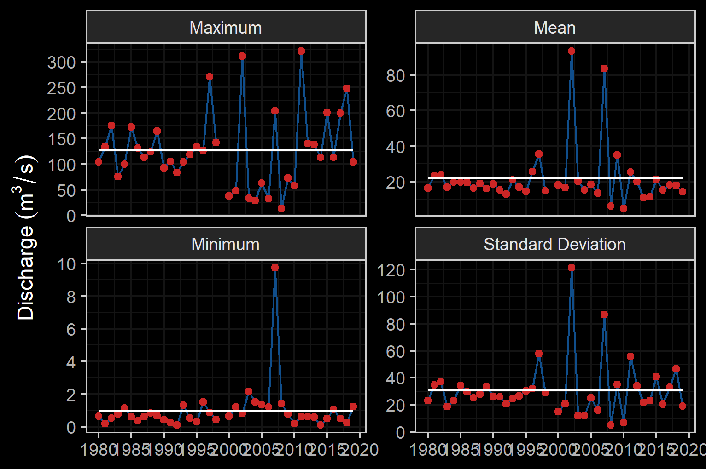

--- 
title: "DRAFT - Bulkley River and Morice River Watershed Groups Fish Passage Restoration Planning"
author: |
 |
 |
 | Prepared for
 | Habitat Conservation Trust Fund
 | BC Fish Passage Remediation Program
 | Canadian Wildlife Federation
 |
 |
 | Prepared by
 | Al Irvine, B.Sc., R.P.Bio.
 | New Graph Environment
 | 6 Regent St
 | Nelson, BC V1L 2P1
 |  
 | on behalf of
 | Society for Ecosytem Restoration Northern BC
date: |
 |
 | DRafT - Version 0.0.1
 | 
 | `r format(Sys.Date(), "%Y-%m-%d")`
toc-title: Table of Contents
site: bookdown::bookdown_site
output: bookdown::gitbook
documentclass: book
bibliography: [book.bib, packages.bib]
biblio-style: apalike
link-citations: no
github-repo: rstudio/bookdown-demo
description: "My Description."

---


```{r setup, include = TRUE, echo =FALSE, message=FALSE, warning=FALSE}
knitr::opts_chunk$set(echo=FALSE, message=FALSE, warning=FALSE, dpi=60, out.width = "100%")
options(scipen=999)
options(knitr.kable.NA = '--')

gitbook_on <- TRUE
# gitbook_on <- FALSE

```

```{r settings-gitbook, eval= gitbook_on}
photo_width <- "100%"
font_set <- 11

```

```{r settings-paged-html, eval= identical(gitbook_on, FALSE)}
photo_width <- "80%"
font_set <- 9

```


```{r}
source('R/packages.R')
source('R/functions.R')
source('R/functions-phase2.R')
source('R/0310-tables.R')
source('R/0320-tables-phase2.R')
source('R/0330-tables-phase1-cost-estimate.R')
source('R/0340-tables-phase2-cost-estimate.R') ##the order of these matters to much - should fix.  need to make cost estimate table seperate
source('R/0350-tables-reporting.R')
source('R/0380-extract-fish-to-hab-con-density-summary.R')
source('R/functions-fish.R')
```


```{r include=FALSE}
# automatically create a bib database for R packages
knitr::write_bib(c(
  .packages(), 'bookdown', 'knitr', 'rmarkdown'
), 'packages.bib')
```


# Executive Summary {.front-matter .unnumbered}

New Graph Environment was retained by the Habitat Conservation Trust, the Provincial Fish Passage Remediation Program and the Canadian Wildlife Federation in 2020 to plan and conduct fish passage and habitat confirmation assessments at road-stream crossings as part of connectivity restoration planning. Although planning was conducted for both the Morice River watershed group and the Bulkley River watershed group, on the ground surveys in 2020 focused primarily within Bulkley River tributaries. 

<br>

A total of `r n_distinct(pscis_phase1_reassessments$my_crossing_reference)` Phase 1 assessments were conducted with `r pscis_phase1_reassessments %>% filter(barrier_result == 'Passable') %>% nrow()` crossings considered "passable", `r pscis_phase1_reassessments %>% filter(barrier_result == 'Potential') %>% nrow() %>% english::as.english()` crossings considered "potential" barriers and `r pscis_phase1_reassessments %>% filter(barrier_result == 'Barrier') %>% nrow()` crossings considered "barriers" according to threshold values based on culvert embedment, outlet drop, slope, diameter (relative to channel size) and length.

<br>

Habitat confirmation assessments were conducted at `r hab_site_priorities %>% nrow()` sites with a total of approximately 18 km of stream assessed. `r hab_site_priorities %>% filter(priority %ilike% 'high') %>% nrow() %>% english::as.english() %>% str_to_title()` crossings were rated as high priorities for proceeding to design for replacement, `r hab_site_priorities %>% filter(priority %ilike% 'Moderate') %>% nrow() %>% english::as.english()` crossings were rated as moderate priorities for proceeding to design for replacement, `r hab_site_priorities %>% filter(priority %ilike% 'Low') %>% nrow() %>% english::as.english()` crossings were rated as a low priority.


```{js, logo-header, echo = FALSE, eval= gitbook_on}
title=document.getElementById('header');
title.innerHTML = '' + title.innerHTML
```


<!--chapter:end:index.Rmd-->


# Introduction {#intro}
```{r}
# New Graph Environment was retained by the Canadian Wildlife Federation and Nupgu Limited Partnership in the fall of 2020 to plan and conduct fish passage and habitat confirmation assessments at road-stream crossings as part of connectivity restoration planning targeting westslope cutthrout trout. Although some planning was conducted for both the Elk River watershed upstream of the Elko Dam near Elko, BC and the Flathead River, on the ground surveys in 2020 focused on the Elk River and tributaries located upstream of the Elko Dam. 
```


<br>

The health and viability of freshwater fish populations can depend on access to tributary and off channel areas which provide refuge during high flows, opportunities for foraging, overwintering habitat, spawning habitat and summer rearing habitat [@Bramblett_2002; @swalesRoleOffChannelPonds1989; @diebel_etal2015EffectsRoad].  Culverts can present barriers to fish migration due to low water depth, increased water velocity, turbulence, a vertical drop at the culvert outlet and/or maintenance issues [@slaneyFishHabitatRehabilitation1997; @cote_etal2005Fishpassage]. Reconnection of fragmented habitats by culvert removal or replacement is a management action that can generate high ecological returns relative to other habitat restoration techniques [@saldicaromileStreamHabitatRestoration2004; @roni_etal2008GlobalReview]. As road crossing structures are commonly upgraded or removed there are numerous opportunities to restore connectivity by ensuring that fish passage considerations are incorporated into repair, replacement and deactivation designs.

<!--chapter:end:0100-intro.Rmd-->


# Background

As a result of high-level direction from the provincial government, a Fish Passage Strategic Approach protocol has been developed for British Columbia to ensure that the greatest opportunities for restoration of fish passage are pursued.  A Fish Passage Technical Working Group has been formed to coordinate the protocol and data is continuously amalgamated within the Provincial Steam Crossing Inventory System (PSCIS).  The strategic approach protocol involves a four-phase process as described in @fishpassagetechnicalworkinggroupFishPassageStrategic2014 :

 * Phase 1: Fish Passage Assessment – Fish stream crossings within watersheds with high fish values are assessed to determine barrier status of structures and document a general assessment of adjacent habitat quality and quantity.
 * Phase 2: Habitat Confirmation – Assessments of crossings prioritized for follow up in Phase 1 studies are conducted to confirm quality and quantity of habitat upstream and down as well as to scope for other potential nearby barriers that could affect the practicality of remediation.
 * Phase 3: Design – Site plans and designs are drawn for priority crossings where high value fish habitat has been confirmed. 
 * Phase 4: Remediation – Reconnection of isolated habitats through replacement, rehabilitation or removal of prioritized crossing structure barriers. 
 
  
<br>

## Project Location

The project area includes the Bulkley River and Morice River watershed groups (Figure \@ref(fig:overview-map)) and is  within the  traditional territories of the Gitxsan and Wet'suwet'en. The valley  bottom has  seen  extensive  settlement  over  the  past hundred years with major population centers including the Village of Hazelton, the Town of Smithers, the Village of Telkwa and the District Municipality of Houston.  The watersheds are within the Skeena, Stikine, and the Nadina Natural Resource Districts. 

<br>

The Bukley River  is an 8th  order stream that drains an area of 7,762 km^2^ in a generally northerly direction from Bulkley Lake on the Nechako Plateau to its confluence with the Skeena River at Hazleton. It has a mean annual discharge of `r round(fasstr::calc_longterm_mean(station_number = "08EE004")$LTMAD,1)` m^3^/s at station 08EE004 located near Quick and `r round(fasstr::calc_longterm_mean(station_number = "08EE003")$LTMAD,1)` m^3^/s at station 08EE003 located upstream near Houston.  Flow patterns are typical of high elevation watersheds on the west side of the northern Rocky Mountains which receive large amounts of precipitation as snow leading to peak levels of discharge during snowmelt, typically from May to July (Figures \@ref(fig:hydrology-plot) - \@ref(fig:hydrology-stats)). 

<br>

```{r overview-map, fig.cap = 'Overview map of Study Areas',eval=T}
knitr::include_graphics("fig/BulkelyMoriceOverview2.jpeg")
```

<br>

```{r fig-sub, fig.cap='two plots', fig.show="hold", out.width="50%", eval=F}
par(mar = c(4, 4, .1, .1))
plot(1:10)
plot(rnorm(10), pch=19)
```


```{r hydrology-plot, fig.cap = 'Hydrograph for Bulkley River at Quick (Station #08EE004 - daily discharge data from 1930 to 2018) and near Houston (Station #08EE003 - daily discharge data from 1980 to 2018.', fig.show="hold", out.width= c("49.5%","1%","49.5%"), eval=T}
knitr::include_graphics("fig/hydrograph_08EE004.png")
knitr::include_graphics("fig/pixel.png")
knitr::include_graphics("fig/hydrograph_08EE003.png")
```

<br>

```{r hydrology-stats, fig.cap = 'Summary of hydrology statistics for Bulkley River at Quick (Station #08EE004) and near Houston (Station #08EE003).', fig.show="hold", out.width= c("49.5%","1%","49.5%"), eval=T}

knitr::include_graphics("fig/hydrology_stats_08EE004.png")
knitr::include_graphics("fig/pixel.png")


```


<br>

```{r}
### Wet'suwet'en

### Gitxsan
```

## Wet'suwet'en

Wet'suwet'en hereditary territory covers an area of 22,000km^2^ including the Bulkley River and Morice River watersheds and portions of the Nechako River watershed.  The Wet'suwet'en people are a matrilineal society organized into the Gilseyhu (Big Frog), Laksilyu (Small Frog), Tsayu (Beaver clan), Gitdumden (Wolf/Bear) and Laksamshu (Fireweed) clans. Within each of the clans there are are a number of kin-based groups known as Yikhs or House groups. The Yikh is a partnership between the people and the territory. Thirteen Yikhs with Hereditary Chiefs manage a total of 38 distinct territories upon which they have jurisdiction.  Within a clan, the head Chief is entrusted with the stewardship of the House territory to ensure the Land is managed in a sustainable manner. Inuk Nu’at’en (Wet'suwet'en law) governing the harvesting of fish within their lands are based on values founded on thousands of years of social, subsistence and environmental dynamics. The Yintahk (Land) is the centre of life as well as culture and it's management is intended to provide security for sustaining salmon, wildlife, and natural foods to ensure the health and well-being of the Wet'suwet'en [@officeofthewetsuweten2013Wetsuwet; @OfficeoftheWetsuweten2021; @flnrord2017NaturalResource].


<br>

## Gitxsan

The Gitxsan Laxyip (traditional territories) covers an area of 33,000km^2^ within the Skeena River and Nass River watersheds.  The Laxyip is governed by 60 Simgiigyet (Hereditary Chiefs), within the traditional hereditary system made up of Wilps (House groups).  Traditional governance of the Gitxsan is guided by the principles of Ayookw (Gitxsan law) [@GitxsanHuwilpGovernment2021]. 


## Fisheries


<br>

```{r fiss-species-table, eval=F}
readr::read_csv(file = paste0(getwd(), '/data/raw_input/fiss_species_table.csv')) %>% 
  filter(`Species Code` != 'CT') %>% 
  my_kable(caption_text = 'Fish species recorded in the Bulkley River watershed group.')


# Fish species recorded in the Elk River watershed group are detailed in Table \@ref(tab:fiss-species-table) [@data_fish_obs].  Bull trout and westslope cutthrout trout are considered of special concern (blue-listed) provincially and westslope cutthrout trout (Pacific populations) are are listed under the *Species at Risk Act* by the Committee on the Status of Endangered Wildlife in Canada as a species of special concern [@bcspeciesecosystemexplorer2020Salvelinusconfluentusa; @bcspeciesecosystemexplorer2020Oncorhynchusclarkii; @schweigert_etal2017COSEWICassessment].  The focus of 2020 field work was to assess potential impacts of road-stream crossings on habitat connectivity for westslope cutthrout trout.

```


```{r fish-fiss-summary, eval=T}
fiss_sum <- readr::read_csv(file = paste0(getwd(), '/data/extracted_inputs/fiss_sum.csv'))
fiss_sum_grad <- readr::read_csv(file = paste0(getwd(), '/data/extracted_inputs/fiss_sum_grad.csv'))
fiss_sum_width <- readr::read_csv(file = paste0(getwd(), '/data/extracted_inputs/fiss_sum_width.csv'))

# A summary of historical westslope cutthrout trout observations in the Elk River watershed group by average gradient category of associated stream segment is provided in Figure \@ref(fig:fish-wct-bar). Of `r wct_elkr_grad %>% filter(gradient_id == 3) %>% pull(total)` observations, `r wct_elkr_grad %>% filter(gradient_id == 3) %>% pull(Percent) + wct_elkr_grad %>% filter(gradient_id == 5) %>% pull(Percent) + wct_elkr_grad %>% filter(gradient_id == 8) %>% pull(Percent)`% were within stream segments with average gradients ranging from 0 - 8%.  A total of `r wct_elkr_grad %>% filter(gradient_id == 3) %>% pull(Percent)`% of historic observations were within stream segments with gradients between 0 - 3%, `r wct_elkr_grad %>% filter(gradient_id == 5) %>% pull(Percent)`% were within stream segments with gradients ranging from 3 - 5% and `r wct_elkr_grad %>% filter(gradient_id == 5) %>% pull(Percent)`% were within stream segments with gradients between 5 - 8% [@data_fish_obs; @norris2020bcfishobs]. 

```


<br>

```{r fish-plot-grad, out.width = photo_width, fig.cap= 'Summary of historic salmonid observations vs. stream gradient category for the Bulkley River watershed group.', eval=T}
##bar graph
plot_grad <- fiss_sum_grad %>% 
  filter(gradient_id != 99) %>% 
  ggplot(aes(x = Gradient, y = Percent)) +
  geom_bar(stat = "identity")+
  facet_wrap(~species_code, ncol = 2)+
  theme_bw(base_size = 11)+
  labs(x = "Average Stream Gradient", y = "Occurrences (%)")
plot_grad

```

<br>

```{r fish-plot-width, out.width = photo_width, fig.cap= 'Summary of historic salmonid observations vs. channel width category for the Bulkley River watershed group.', eval=T}
##bar graph
plot_width <- fiss_sum_width %>% 
  filter(!is.na(width_id)) %>%
  ggplot(aes(x = Width, y = Percent)) +
  geom_bar(stat = "identity")+
  facet_wrap(~species_code, ncol = 2)+
  theme_bw(base_size = 11)+
  labs(x = "Channel Width", y = "Occurrences (%)")
plot_width
```

<br>

```{r fish-plot-wshed, out.width = photo_width, fig.cap= 'Summary of historic salmonid observations vs. watershed size category for the Bulkley River watershed group.', eval=T}
##bar graph
fiss_sum_wshed_filter <- fiss_sum %>% 
  filter(upstream_area_ha < 10000)

bin_1 <- 0
# bin_1 <- floor(min(fiss_sum_wshed_filter$upstream_area_ha, na.rm = TRUE)/5)*5
bin_n <- ceiling(max(fiss_sum_wshed_filter$upstream_area_ha, na.rm = TRUE)/5)*5
bins <- seq(bin_1,bin_n, by = 1000)

plot_wshed_hist <- ggplot(fiss_sum_wshed_filter, aes(x=upstream_area_ha
                                           # fill=alias_local_name
                                           # color = alias_local_name
)) +
  geom_histogram(breaks = bins, 
                 position="identity", size = 0.75)+
  labs(x = "Upstream Watershed Area (ha)", y = "Count Fish (#)") +
  facet_wrap(~species_code, ncol = 2)+
  # scale_color_grey() +
  # scale_fill_grey() +
  theme_bw(base_size = 11)+
  scale_x_continuous(breaks = bins[seq(1, length(bins), by = 2)])+
  # scale_color_manual(values=c("grey90", "grey60", "grey30", "grey0"))+
  # theme(axis.text.x = element_text(angle = 45, hjust = 1))+
  geom_histogram(aes(y=..density..), breaks = bins, alpha=0.5,
                 position="identity", size = 0.75)
plot_wshed_hist
```


<!--chapter:end:0200-background.Rmd-->

# Methods

Workflows for the project have been classified into planning, fish passage assessments, habitat confirmation assessments and reporting. All components leveraged the `R` programming language and environment for statistical computing to facilitate workflow tracking and reproducibility [@rcoreteam2020languageenvironment]. 


```{r eval=F}
source('R/packages.R')
source('R/tables.R')
# or the development version
# devtools::install_github("rstudio/bookdown")
```

## Planning

 
To identify priorities for crossing structure rehabilitation, background literature, fisheries information, PSCIS, `Fish Habitat Model` outputs modified from @fish_habitat_model and `bcfishpass` [@norrisBcfishpass2020] outputs were reviewed. The `Fish Habitat Model` was developed by the BC Ministry of Environment to provide estimates of the amount of fish habitat potentially accessible to fish upstream of crossing locations. The model calculates the average gradient of BC Freshwater Atlas [stream network lines](https://catalogue.data.gov.bc.ca/dataset/freshwater-atlas-stream-network) at minimum 100m long intervals starting from the downstream end of the streamline segment and working upstream.  The network lines are broken into max gradient categories with new segments created when the average gradient of the stream lines exceeds user provided gradient thresholds.  

<br>

 `bcfishpass` is comprised of sql and python based shell script libraries that "generate a simple model of aquatic habitat connectivity by identifying natural barriers to fish passage (plus hydro dams that are not feasible to remediate) and classifying all streams not upstream of these barriers as 'potentially accessible'" [@norrisBcfishpass2020]. On potentially accessible streams, `bcfishpass` scripts "identify known barriers and additional anthropogenic features (primarily road/railway stream crossings, i.e. culverts) that are potentially barriers. To prioritize these features for assessment or remediation," the scripts  "report on how much modelled potentially accessible aquatic habitat the barriers may obstruct. The model can be refined with known fish observations. Depending on the modelling scenario, all aquatic habitat downstream of a given fish observation can be classified as 'observed accessible', overriding any downstream barriers."


<br>
 
Following delineation of "non-fish habitat" with the `Fish Habitat Model`, the *average* gradient of each stream segment within habitat classified as below the 22% threshold was calculated and summed using `bcfishpass` to quantify upstream habitat potentially available for salmonids and facilitate stream line symbology based on stream morphology.  `bcfishpass` summed average gradients of stream network line segments within seven categories (0 - 3%, 3 - 5%, 5 - 8%, 8 - 15%, 15 - 22%, 22 - 30% and >30%) with these outputs further amalgamated to summarize and symbolize potential upstream habitat in four categories: riffle/cascade (0 - 5%), step-pool (5 - 15%), step-pool very steep (15-22%) and extremely steep (22 - 30%) (Table \@ref(tab:tablethreshaverage)). For each crossing location, the the area of lake and wetland habitat upstream, species documented upstream and an estimate of watershed area was also collated using `bcfishpass`, `fwapg` [@norris2020fwapg] and `bcfishobs` [@norris2020bcfishobs] to provide an indication of the potential quantity and quality of habitat potentially gained should fish passage be restored.  


<br>


```{r tablethreshaverage, eval= T}
#threshold and average gradient table
table_thresh_average <- tibble::tibble(`Gradient` = c('0 - 5%', '5 - 15%', '15 - 22%', '22 - 30%', '>30%'),
                                       `Channel Type` = c('Riffle and cascade pool', 'Step pool', 'Step pool - very steep', 'Step pool - extremely steep (bull trout only)', 'Non fish habitat'))

table_thresh_average %>% 
    my_kable(caption_text = 'Stream gradient categories (threshold and average) and associated channel type.')
```


<br>

To prepare for Phase 1 and 2 assessments in the study area, past fish passage assessment reports for the Bulkley River and Morice River watershed groups were first reviewed to identify crossing structures not yet assessed or previously ranked as priorities for rehabilitation [@casselman_stanley2010BulkleyFulton; @irvine2018AnalysisPriority; @mccarthy_fernando20152015Inventory; @smith2018AssessingBarriers; @wilson_rabnett2007FishPassage].  To determine which of those crossings had not yet been assessed with Phase 1 and Phase 2 assessments we cross-referenced these reports with the PSCIS database, available background info and viewed sites within the output of the `Fish Habitat Model` and `bcfishpass`.  Outputs for modelled and PSCIS crossings (barriers and potential barriers) that met the following criteria underwent a detailed review to facilitate prioritization for Phase1 - Fish Passage Assessments and Phase 2 - Habitat Confirmations.

 * Confirmed fish presence upstream of the structure.
 * Stream width documented as > 2.0m in PSCIS.
 * Linear lengths of modelled upstream habitat <22% gradient for ≥1km for PSCIS crossings or ≥2km for modelled crossings.
 * Crossings located on streams classified as 3rd order or higher.
 * Crossings located on streams with >5 ha of modeled wetland and/or lake habitat upstream.
 * Habitat value rated as "medium" or “high” in PSCIS.  
 

<br>


## Fish Passage Assessments

In the field, crossings prioritized for follow-up were first assessed for fish passage following the procedures outlined in “Field Assessment for Determining Fish Passage Status of Closed Bottomed Structures” [@fish_passage_assessments]. Crossings surveyed included closed bottom structures (CBS), open bottom structures (OBS) and crossings considered “other” (i.e. fords).  Photos were taken at surveyed crossings and when possible included images of the road, crossing inlet, crossing outlet, crossing barrel, channel downstream and channel upstream of the crossing and any other relevant features.  The following information was recorded for all surveyed crossings: date of inspection, crossing reference, crew member initials, Universal Transverse Mercator (UTM) coordinates, stream name, road name and kilometer, road tenure information, crossing type, crossing subtype, culvert diameter or span for OBS, culvert length or width for OBS.  A more detailed “full assessment” was completed for all closed bottom structures and included the following parameters: presence/absence of continuous culvert embedment (yes/no), average depth of embedment, whether or not the culvert bed resembled the native stream bed, presence of and percentage backwatering, fill depth, outlet drop, outlet pool depth, inlet drop, culvert slope, average downstream channel width, stream slope, presence/absence of beaver activity, presence/absence of fish at time of survey, type of valley fill, and a habitat value rating.  Habitat value ratings were based on channel morphology, flow characteristics (perennial, intermittent, ephemeral), fish migration patterns, the presence/absence of deep pools, un-embedded boulders, substrate, woody debris, undercut banks, aquatic vegetation and overhanging riparian vegetation (Table \@ref(tab:tab-hab-value)).  For crossings determined to be potential barriers or barriers based on the data (see [Barrier Scoring]), a culvert fix and recommended diameter/span was proposed.  

<br>


 
```{r tab-hab-value}
tab_habvalue %>% 
  knitr::kable(caption = 'Habitat value criteria (Fish Passage Technical Working Group, 2011).', booktabs = T) %>% 
    kableExtra::column_spec(column = 1, width_min = '1.5in') %>% 
    kableExtra::kable_styling(c("condensed"), full_width = T, font_size = font_set) 
  
```
 
<br>

### Barrier Scoring

Fish passage potential was determined for each stream crossing identified as a closed bottom structure as per @fish_passage_assessments.  The combined scores from five criteria: depth and degree to which the structure is embedded, outlet drop, stream width ratio, culvert slope, and culvert length were used to screen whether each culvert was a likely barrier to some fish species and life stages (Table \@ref(tab:tab-barrier-scoring), Table \@ref(tab:tab-barrier-result). These criteria were developed based on data obtained from various studies and reflect an estimation for the passage of a juvenile salmon or small resident rainbow trout [@clarkinNationalInventoryAssessment2005 ;@bellFisheriesHandbookEngineering1991; @thompsonAssessingFishPassage2013].  

<br>

```{r tab-barrier-scoring, eval=T}
tab <- as_tibble(t(tab_barrier_scoring)) %>% 
  mutate(V4 = names(tab_barrier_scoring)) %>% 
  select(V4, everything()) %>% 
  janitor::row_to_names(1) %>%  ##turn the table sideways
  mutate(Risk = case_when(Risk == 'Value' ~ '  Value',
                          T ~ Risk))

tab %>% 
  my_kable(caption_text = 'Fish Barrier Risk Assessment (MoE 2011).')


```

<br>


```{r tab-barrier-result}
tab_barrier_result %>% 
  my_kable(caption_text = 'Fish Barrier Scoring Results (MoE 2011).') 

```

<br>

### Cost Benefit Analysis

A cost benefit analysis was conducted for each crossing determined to be a barrier based on an estimate of cost associated with remediation or replacement of the crossing with a structure that facilitates fish passage and the amount of potential habitat that would be made available by remediating fish passage at the site (habitat gain index).  

<br>

#### Habitat Gain Index

The habitat gain index is the quantity of modelled habitat upstream of the subject crossing and represents an estimate of habitat gained with remediation of fish passage at the crossing.  For this project, a gradient threshold between accessible and non-accessible habitat was set at 20% (for a minimimum length of 100m) intended to represent the maximum gradient of which anadromous species are likely to be able to migrate upstream.  For Phase 1 assessments a "net" value of habitat quantity output from `bcfishpass` was used to estimate the amount of habitat upstream of each crossing less than 20% gradient before either a falls of height >5m - as recorded in @ProvincialObstaclesFish, a road-stream crossing recorded in PSCIS as a barrier, or a modelled unassessed crossing.  For Phase 2 assessments, to provide a conservative estimate of habitat to be potentially gained by fish passage restoration, the amount of habitat upstream of each crossing was estimated by measuring the amount of mainstem and stream segments > 1st order upstream of the crossing using the measure tool within QGIS [@QGIS_software].

<br>


Potential options to remediate fish passage were selected from @fish_passage_assessments and included:  

 + Removal (RM) - Complete removal of the structure and deactivation of the road. 
 + Open Bottom Structure (OBS) - Replacement of the culvert with a bridge or other open bottom structure.  For this project we considered bridges as the only viable option for OBS type based on consultation with FLNR road crossing engineering experts.  It should be noted however, that box culverts could be considered a viable and economical option as they have been observed as successfully facilitating fish passage on the west coast of the province (Betty Rebellato, Canadian Wildlife Federation - Project Biologist).
 + Streambed Simulation (SS) - Replacement of the structure with a streambed simulation design culvert.  Often achieved by embedding the culvert by 40% or more. Based on consultation with FLNR engineering experts, we considered crossings on streams with a channel width of <2m and a stream gradient of <8% as candidates for replacement with streambed simulations.
 + Additional Substrate Material (EM) - Add additional substrate to the culvert and/or downstream weir to embed culvert and reduce overall velocity/turbulence.  This option was considered only when outlet drop = 0, culvert slope <1.0% and stream width ratio < 1.0.
 + Backwater (BW) - Backwatering of the structure to reduce velocity and turbulence. This option was considered only when outlet drop < 0.3m, culvert slope <2.0%, stream width ratio < 1.2 and stream profiling indicates it would be effective..
 
 <br>

Cost estimates for structure replacement with bridges and embedded culverts were generated based on the channel width, slope of the culvert, depth of fill, road class and road surface type. Road details were sourced from @flnrordForestTenureRoad2020 and @flnrordDigitalRoadAtlas2020 through `bcfishpass`. Interviews with Phil MacDonald, Engineering Specialist FLNR - Kootenay, Steve Page, Area Engineer - FLNR - Northern Engineering Group and Matt Hawkins - MoTi - Design Supervisor for Highway Design and Survey - Nelson were utilized to helped refine estimates.  Base costs for installation of bridges on forest service roads and permit roads with surfaces specified in provincial GIS road layers as rough and loose was estimated at \$12500/linear m and assumed that the road could be closed during construction. For streams with channel widths <2m, embedded culverts were reported as an effective solution with total installation costs estimated at $25k/crossing (pers. comm. Phil MacDonald, Steve Page). For larger streams, an additional 2m was added to the replacement structure's estimated span width for each 1m of channel width >5m.  For crossings with large amounts of fill, the size of replacement structure was increase by 3m for each 1m or fill >3m to account for cutslopes to the stream at a 1.5:1 ratio. To account for road type, a multiplier table was also generated to estimate incremental cost increases with costs estimated for structure replacement on paved surfaces, railways and arterial/highways costing up to 20 times more than forest service roads due to expenses associate with design/engineering requirements, traffic control and paving.  The cost multiplier table (Table \@ref(tab:tab-cost-mult)) should be considered very approximate with refinement recommended for future projects.  

<br>

\pagebreak

```{r tab-cost-mult}
# print_tab_cost_mult(caption_text = 'Cost multiplier table based on road class and surface type.')
tab_cost_rd_mult_report %>%
  my_kable(caption_text = 'Cost multiplier table based on road class and surface type.')
```

<br>

## Habitat Confirmation Assessments

Following fish passage assessments, habitat confirmations were completed in accordance with procedures outlined in the document “A Checklist for Fish Habitat Confirmation Prior to the Rehabilitation of a Stream Crossing” [@confirmation_checklist_2011]. The main objective of the field surveys was to document upstream habitat quantity and quality and to determine if any other obstructions exist above or below the crossing.  Habitat value was assessed based on channel morphology, flow characteristics (perennial, intermittent, ephemeral), the presence/absence of deep  pools, un-embedded  boulders, substrate, woody debris, undercut banks, aquatic vegetation and overhanging riparian vegetation. Criteria used to rank habitat value was based on guidelines in @confirmation_checklist_2011 (Table \@ref(tab:tab-hab-value)). 

<br>

During habitat confirmations, to standardize data collected and facilitate submission of the data to provincial databases, information was collated on ["Site Cards"](https://www2.gov.bc.ca/gov/content/environment/natural-resource-stewardship/laws-policies-standards-guidance/inventory-standards/aquatic-ecosystems). Habitat characteristics recorded included channel widths, wetted widths, residual pool depths, gradients, bankfull depths, stage, temperature, conductivity, pH, cover by type, substrate and channel morphology (among others). When possible, the crew surveyed downstream of the crossing to the point where fish presence had been previously confirmed and upstream to a minimum distance of 600m. Any  potential  obstacles  to  fish  passage  were  inventoried  with  photos, physical  descriptions  and  locations  recorded on site cards.  Surveyed routes were recorded with time-signatures on handheld GPS units.   

<br>

Fish sampling was conducted a subset of sites when biological data was considered to add significant value to the physical habitat assessment information. When possible, electrofishing was utilized within discrete site units both upstream and downstream of the subject crossing with electrofisher settings, water quality parameters (i.e. conductivity, temperature and ph), start location, length of site and wetted widths (average of a minimum of three) recorded.  For each fish captured, fork length and species was recorded, with results included within the fish data submission spreadsheet.  Fish information and habitat data will be submitted to the province under scientific fish collection permit CB20-611971.

<br>

\pagebreak

## Reporting

This pdf report and an online [interactive report](https://newgraphenvironment.github.io/fish_passage_bulkley_2020_reporting/) were generated with `bookdown` [@bookdown2016] from `Rmarkdown` [@R-rmarkdown] documents processing raw data available at the [New Graph Environment Github Site ](https://github.com/NewGraphEnvironment/fish_passage_bulkley_2020_reporting). In addition to numerous spatial layers sourced through the BC Data Catalogue, data inputs for this project can be sourced [here](https://github.com/NewGraphEnvironment/fish_passage_bulkley_2020_reporting/tree/master/data) and include: 

 + Populated [Fish Data Submission Spreadsheet Template - V 2.0, January 20, 2020 ](https://www2.gov.bc.ca/gov/content/environment/plants-animals-ecosystems/fish/fish-and-fish-habitat-data-information/fish-data-submission/submit-fish-data#submitfish) 

 + Populated [pscis_assessment_template_v24.xls](https://www2.gov.bc.ca/gov/content/environment/plants-animals-ecosystems/fish/aquatic-habitat-management/fish-passage/fish-passage-technical/assessment-projects)
 
 
 + [`Fish Habitat Model`/`bcfishpass`](https://github.com/NewGraphEnvironment/fish_passage_bulkley_2020_reporting/blob/master/data/bcfishpass-phase2.csv) outputs.


 + [Custom Excel Spreadsheet](https://github.com/NewGraphEnvironment/fish_passage_bulkley_2020_reporting/raw/master/data/habitat_confirmations_priorities.xlsx) detailing Phase 2 site:
     - priority level for proceeding to design for replacement
     - length of survey upstream and downstream
     - a conservative estimate of mainstem habitat potentially available upstream of the crossing 
     - fish species confirmed as present upstream of the crossing

 + [GPS tracks](https://github.com/NewGraphEnvironment/fish_passage_bulkley_2020_reporting/tree/master/data/habitat_confirmation_tracks.gpx) from field surveys.  

 + [Photos and photo metadata.](https://github.com/NewGraphEnvironment/fish_passage_bulkley_2020_reporting/tree/master/data/photos) 
 
 

 


<!--chapter:end:0300-method.Rmd-->

# Results and Discussion

Field assessments were conducted between `r format(min(pscis_phase1$date), format="%B %d %Y")` and `r format(max(pscis_phase1$date), format="%B %d %Y")` by Allan Irvine, R.P.Bio, New Graph Environment and Kyle Prince, P,Biol. `r if(gitbook_on)knitr::asis_output("Results of Phase 1 and Phase 2 assessments are summarized in Figure \\@ref(fig:map-interactive) with additional details provided in sections below.")` 

<br>

```{r map-interactive, eval= gitbook_on, fig.cap='Map of fish passage and habitat confirmation results'}
##make colors for the priorities
pal <- 
   colorFactor(palette = c("red", "yellow", "grey", "black"), 
               levels = c("high", "moderate", "low", "no fix"))

pal_phase1 <- 
   colorFactor(palette = c("red", "yellow", "grey", "black"), 
               levels = c("high", "moderate", "low", NA))

tab_map_phase2 <- tab_map %>% filter(source %like% 'phase2')
#https://stackoverflow.com/questions/61026700/bring-a-group-of-markers-to-front-in-leaflet
# marker_options <- markerOptions(  
#   zIndexOffset = 1000)
tracks <- sf::read_sf("./data/habitat_confirmation_tracks.gpx", layer = "tracks")
# wshds <- sf::read_sf('data/fishpass_mapping.gpkg', layer = 'hab_wshds_ltree') %>% 
#   filter(!pscis_crossing_id %in% c(62423, 62426, 50181, 50159)) %>% ##these ones are not correct - fix later
#   st_transform(crs = 4326)
wshd_study_areas <- sf::read_sf('data/fishpass_mapping.gpkg', layer = 'wshd_study_areas') %>%
  st_transform(crs = 4326)
# photo_metadata <- readr::read_csv(file = 'data/photo_metadata.csv')
  
  
map <- leaflet(height=500, width=780) %>%
  # leaflet() %>% 
  addTiles()  %>% 
  # leafem::addMouseCoordinates(proj4 = 26911) %>% ##can't seem to get it to render utms yet
  # addProviderTiles(providers$"Esri.DeLorme") %>% 
  addProviderTiles("Esri.WorldTopoMap", group = "Topo") %>%
  addProviderTiles("Esri.WorldImagery", group = "ESRI Aerial") %>% 
  # addPolygons(data = wshds, color = "#0859C6", weight = 1, smoothFactor = 0.5,
  #   opacity = 1.0, fillOpacity = 0.25,
  #   fillColor = "#00DBFF") %>%
  addPolygons(data = wshd_study_areas %>% filter(watershed_group_code == 'BULK'), color = "#F29A6E", weight = 1, smoothFactor = 0.5,
    opacity = 1.0, fillOpacity = 0.25,
    fillColor = "#F29A6E", label = 'Bulkley River') %>%
  addPolygons(data = wshd_study_areas %>% filter(watershed_group_code == 'MORR'), color = "#C39D50", weight = 1, smoothFactor = 0.5,
    opacity = 1.0, fillOpacity = 0.25,
    fillColor = "#C39D50", label = 'Morice River') %>%
  # addPolylines(data=drake::readd(fish_habitat_model_lines),  opacity=1, color = '#6498d2',
  #              fillOpacity = 0.75, weight=2) %>% 
  # addPolylines(data=forest_tenure_road_lines,  opacity=1, color = '#ff7f00',
  #              fillOpacity = 0.75, weight=2) %>%
    addLegend(
    position = "topright",
    colors = c("red", "yellow", "grey", "black"),
    labels = c("High", "Moderate", "Low", 'No fix'), opacity = 1,
    title = "Fish Passage Priorities",
  ) %>%
    addCircleMarkers(data=tab_map %>% filter(source %like% 'phase1' | source %like% 'pscis_reassessments'),
    label = tab_map$pscis_crossing_id,
    labelOptions = labelOptions(noHide = F, textOnly = TRUE),
    popup = leafpop::popupTable(x = select((tab_map %>% st_set_geometry(NULL) %>% filter(source %like% 'phase1' | source %like% 'pscis_reassessments')),
                                           Site = pscis_crossing_id, Priority = priority_phase1, Stream = stream_name, Road = road_name, `Habitat value`= habitat_value, `Barrier Result` = barrier_result, `Culvert data` = data_link, `Culvert photos` = photo_link),
                                feature.id = F,
                                row.numbers = F),
    radius = 9,
    fillColor = ~pal_phase1(priority_phase1),
    color= "#ffffff",
    stroke = TRUE,
    fillOpacity = 1.0,
    weight = 2,
    opacity = 1.0,
    group = "Phase 1"
    ) %>% 
    addPolylines(data=tracks,  
                 opacity=0.75, color = '#e216c4',
               fillOpacity = 0.75, weight=5, group = "Phase 2") %>%
  # addAwesomeMarkers(
  #   lng = photo_metadata$gpslongitude,lat = photo_metadata$gpslatitude,
  #                   popup = leafpop::popupImage(photo_metadata$url, src = "remote"),
  #                   clusterOptions = markerClusterOptions(),
  #                   group = "Phase 2") %>%
    addCircleMarkers(
    data=tab_hab_map,
    label = tab_hab_map$pscis_crossing_id,
    labelOptions = labelOptions(noHide = T, textOnly = TRUE),
    popup = leafpop::popupTable(x = select((tab_hab_map %>% st_set_geometry(NULL)),
                                           Site = pscis_crossing_id, Priority = priority, Stream = stream_name, Road = road_name, `Habitat (m)`= upstream_habitat_length_m, Comments = comments, `Culvert data` = data_link, `Culvert photos` = photo_link),
                                feature.id = F,
                                row.numbers = F),
    radius = 9,
    fillColor = ~pal(priority),
    color= "#ffffff",
    stroke = TRUE,
    fillOpacity = 1.0,
    weight = 2,
    opacity = 1.0,
    group = "Phase 2"
    ) %>%
  #     # addScaleBar(position = 'bottomleft', options = scaleBarOptions(imperial = FALSE)) %>% 
  addLayersControl(
    baseGroups = c(
      "Esri.DeLorme",
      "ESRI Aerial"),
    overlayGroups = c("Phase 1", "Phase 2"),
    options = layersControlOptions(collapsed = F)) %>%
  leaflet.extras::addFullscreenControl() %>% 
  addMiniMap(tiles = providers$"Esri.NatGeoWorldMap",
             zoomLevelOffset = -6, width = 100, height = 100)

map %>% 
  hideGroup("Phase 2")
```


```{r eval=F}
pscis_historic <- readr::read_csv(file = paste0(getwd(), '/data/raw_input/pscis_study_area.csv'))
pscis_historic_phase2 <- readr::read_csv(file = paste0(getwd(), '/data/raw_input/pscis_phase2_study_area.csv'))


# ## Planning
# Review of the PSCIS database indicated that prior to 2020, `r pscis_historic %>% filter(study_area %ilike% 'elk' & assessment_date < '2020-01-01') %>% nrow()` assessments for fish passage (Phase 1) and `r pscis_historic_phase2 %>% filter(study_area %ilike% 'elk' & assmt_date < '2020-01-01') %>% nrow()` habitat confirmations (Phase 2) have been conducted at crossing structures within the Upper Elk River.  Within the Flathead River watershed `r pscis_historic %>% filter(study_area %ilike% 'flathead' & assessment_date < '2020-01-01') %>% nrow()` fish passage assessments and `r pscis_historic_phase2 %>% filter(study_area %ilike% 'flathead' & assmt_date < '2020-01-01') %>% nrow() %>% english::as.english()` habitat confirmations had been conducted.  Following review of background literature, fisheries information, PSCIS and `bcfishpass` outputs, both modelled and PSCIS sites were selected for follow up with Phase 1 and 2 assessments. Results are included as a zipped package of Google Earth kml files stored  [here](https://github.com/NewGraphEnvironment/fish_passage_elk_2020_reporting_cwf/raw/master/data/planning_kmls/elk_planning_kmls.zip).
```

 

<br>

## Phase 1

During 2020 field surveys, a total of `r n_distinct(pscis_phase1$my_crossing_reference)` Phase 1 assessments were conducted with `r pscis_phase1 %>% filter(barrier_result == 'Passable') %>% nrow()` crossings considered "passable", `r pscis_phase1 %>% filter(barrier_result == 'Potential') %>% nrow() %>% english::as.english()` crossings considered "potential" barriers and `r pscis_phase1 %>% filter(barrier_result == 'Barrier') %>% nrow()` crossings considered "barriers" according to threshold values based on culvert embedment, outlet drop, slope, diameter (relative to channel size) and length [@fish_passage_assessments].  Site details and photos are presented in [Appendix - Phase 1 Fish Passage Assessment Data and Photos] with maps stored [here](https://hillcrestgeo.ca/outgoing/fishpassage/projects/bulkley/).  A cost benefit analysis for Phase 1 sites that were determined to be barriers or potential barriers is presented in Table \@ref(tab:cost-est-phase-1). 

<br>

Barrier passability criteria used in this project follows @fish_passage_assessments, and reflects an estimation for the passage of a juvenile salmon or small resident rainbow trout [@clarkinNationalInventoryAssessment2005 ;@bellFisheriesHandbookEngineering1991; @thompsonAssessingFishPassage2013].  As noted in @bourne_etal2011Barriersfish, with a detailed review of different criteria in @kemp_ohanley2010Proceduresevaluating, passability of barriers can be quantified in many different ways. Fish physiology (i.e. species, length, swim speeds) as well as the temporal variation of physical characteristics (ex. due to flow volumes/velocities a particular culvert is passable 50% of the time to fish with a defined physiological capacity) make defining passability difficult with important implications for watershed connectivity modelling [@bourne_etal2011Barriersfish; @shaw_etal2016Importancepartial; @mahlum_etal2014EvaluatingBarrier; @kemp_ohanley2010Proceduresevaluating].

<br>

```{r cost-est-phase-1}
if(gitbook_on){
  tab_cost_est_phase1 %>% 
  my_kable_scroll(caption_text = 'Upstream habitat estimates and cost benefit analysis for Phase 1 assessments.  ')
} else tab_cost_est_phase1 %>% 
  my_kable(caption_text = 'Upstream habitat estimates and cost benefit analysis for Phase 1 assessments.')
```

<br>

## Phase 2

 
Habitat confirmation assessments were conducted at `r hab_site_priorities %>% nrow()` sites with a total of approximately 15 km of stream assessed. `r hab_site_priorities %>% filter(priority %ilike% 'high') %>% nrow() %>% english::as.english() %>% str_to_title()` crossings were rated as high priorities for proceeding to design for replacement, `r hab_site_priorities %>% filter(priority %ilike% 'Moderate') %>% nrow() %>% english::as.english() %>% str_to_title()` crossings were rated as moderate priorities for proceeding to design for replacement, `r hab_site_priorities %>% filter(priority %ilike% 'Low') %>% nrow() %>% english::as.english()` crossings were rated as a low priority and `r hab_site_priorities %>% filter(priority %ilike% 'no fix') %>% nrow() %>% english::as.english()` rated as "no fix". Results are summarized in `r if(gitbook_on){knitr::asis_output("Figure \\@ref(fig:map-interactive) and ")}`Tables \@ref(tab:tab-overview) - \@ref(tab:tab-habitat-summary) with raw habitat and fish sampling data included in digital format as [Attachment 2](https://github.com/NewGraphEnvironment/fish_passage_bulkley_2020_reporting/raw/master/data/habitat_confirmations.xls).  Detailed information for each site assessed with Phase 2 assessments is included within site specific reports included as appendices to this document with pdf maps stored [here](https://hillcrestgeo.ca/outgoing/fishpassage/projects/bulkley/confirmations/).


<br>

```{r tab-overview}
if(gitbook_on){
tab_overview %>% 
  select(-Tenure) %>%
  my_tab_overview_scroll(caption_text = 'Overview of habitat confirmation sites.')
} else tab_overview %>% 
  select(-Tenure) %>%
  my_tab_overview(caption_text = 'Overview of habitat confirmation sites.')
```

<br>

\pagebreak

```{r}

make_tab_cv(dat = pscis_phase2) %>% 
  my_kable(caption_text = 'Summary of Phase 2 fish passage reassessments.')
```

<br>

```{r cost-est-phase-2}
tab_cost_est_phase2_report %>% 
  my_kable(caption_text = 'Cost benefit analysis for Phase 2 assessments.')
  # kable(caption = 'Modelled upstream habitat estimate and cost benefit.',
  #       escape = T) %>% 
  # kableExtra::kable_styling(c("condensed"), full_width = T, font_size = 11) %>% 
  # kableExtra::scroll_box(width = "100%", height = "500px")

```

<br>

```{r tab-habitat-summary}
tab_hab_summary %>% 
  filter(Location %ilike% 'upstream') %>% 
  select(-Location) %>% 
  rename(`PSCIS ID` = Site, `Length surveyed upstream (m)` = `Length Surveyed (m)`) %>%
  my_kable(caption_text = 'Summary of Phase 2 habitat confirmation details.')

```
```{r}
## Fish Sampling

# Fish sampling was conducted at five sites with a total of `r tab_fish_summary %>% filter(species_code == 'WCT') %>% pull(count_fish) %>% sum()` westslope cutthout trout,  `r tab_fish_summary %>% filter(species_code == 'EB') %>% pull(count_fish) %>% sum()` eastern brook trout and `r tab_fish_summary %>% filter(species_code == 'BT') %>% pull(count_fish) %>% sum()` bull trout captured.  Westslope cutthrout trout were captured at three of the sites sampled with fork length data delineated into life stages: fry (&le;60mm), parr (>60 to 110mm), juvenile (>110mm to 140mm) and adult (>140mm) by visually assessing the histogram presented in Figure \@ref(fig:fish-histogram).  Fish sampling results are presented in detail within individual habitat confirmation site memos within the appendices of this document with westslope cutthrout trout density results also presented in Figure \@ref(fig:plot-fish-all).  
```

<br>


<br>

```{r fish-histogram, fig.cap= 'Histogram of westslope cutthrout trout captured during electrofishing surveys.', eval = F}
knitr::include_graphics("fig/fish_histogram.png")

```

<br>

```{r plot-fish-all, fig.cap='Boxplots of densities (fish/100m2) of westslope cutthrout trout captured by life stage and site for data collected during habitat confirmation assessments.', eval=F}
plot_fish_box_all()
```


<!--chapter:end:0400-results.Rmd-->

# Appendix - Phase 1 Fish Passage Assessment Data and Photos {-}

`r knit(text = unlist(tabs_phase1))`

<!--chapter:end:0600-appendix.Rmd-->


```{r setup-58159, eval = F}
knitr::opts_chunk$set(echo=FALSE, message=FALSE, warning=FALSE)
source('R/packages.R')
source('R/functions.R')
source('R/functions-phase2.R')
source('R/tables-phase2.R')
source('R/tables.R')
source('R/extract-fish.R')
source('R/functions-fish.R')


```


```{r  load-data-58159}
my_site <- 58159
my_site2 <- 58158

```

`r appendix_title()`

## Site Location {-}

PSCIS crossing `r as.character(my_site)` is located on `r my_pscis_info() %>% pull(stream_name)` on the `r my_overview_info() %>% pull(road_name)` accessed from Houston, BC. The `r my_overview_info() %>% pull(road_name)` is a private road owned by the Woodmere Nursery.  At the time of field surveys it was used to access a newly constructed agricultural facility and by nursery operations to access a waste storage/burn pile area.

```{r eval=F}
##idon't think we need this here but...
#During 2020 surveys, PSCIS culvert 197669 was documented on `r my_pscis_info() %>% pull(stream_name)`, 1.2km upstream of the FSR.

```

<br>

## Background {-}


`r my_pscis_info() %>% pull(stream_name)` drains McDowell Lake (35ha), Dorsay Lake (4ha) and one other unnamed lake (9ha) flowing from McDowell Lake in a south then west direction for approximately 9km to the confluence with the Bulkley River. At crossing `r as.character(my_site)`, `r my_pscis_info() %>% pull(stream_name)` is a `r my_bcfishpass() %>% pull(stream_order) %>% english::ordinal()` order stream with a watershed area upstream of the crossing of approximately `r round(my_bcfishpass() %>% pull(watershed_upstr_ha)/100,1)`km^2^. The elevation of the watershed ranges from a maximum of 1000 to 520m at PSCIS crossing `r as.character(my_site)`. `r my_pscis_info() %>% pull(stream_name)` is known to contain coho and rainbow trout upstream of the subject culvert [@data_fish_obs]. 

<br>


PSCIS stream crossings `r as.character(my_site)` and `r as.character(my_site2)` were rated as high priorities for follow up by both @irvine2018AnalysisPriority and @smith2018AssessingBarriers due to significant quantities of upstream habitat suitable for salmonid rearing. A map of the watershed is provided in map attachment [`r my_bcfishpass() %>% pull(dbm_mof_50k_grid)`](`r my_mapsheet()`).

<br>

## Stream Characteristics at Crossing {-}

At the time of the survey, the culvert was un-embedded, non-backwatered and considered a barrier to upstream fish passage. The pipe was `r my_pscis_info() %>% pull(diameter_or_span_meters)`m in diameter with a pipe length of `r my_pscis_info() %>% pull(length_or_width_meters)`m, a culvert slope of `r my_pscis_info() %>% pull(culvert_slope_percent)`%, a stream width ratio of `r my_pscis_info() %>% pull(stream_width_ratio)` and an outlet drop of `r my_pscis_info() %>% pull(outlet_drop_meters)`m (Table \@ref(tab:tab-culvert-58159)). Water temperature was `r my_habitat_info() %>% filter(rowname == 'temperature c') %>% pull(us)`$^\circ$C, pH was `r my_habitat_info() %>% filter(rowname == 'p h') %>% pull(us)` and conductivity was `r my_habitat_info() %>% filter(rowname == 'conductivity m s cm') %>% pull(us)`uS/cm.  


<br>

```{r eval=F}
##this is useful to get some comments for the report
hab_site %>% filter(site == my_site & location == 'us') %>% pull(comments)
my_priority <-  my_priority_info()

```

## Stream Characteristics Downstream {-}

The stream was surveyed downstream from the culvert for `r my_priority_info(loc = 'ds') %>% pull(survey_length_m)`m `r if(gitbook_on){knitr::asis_output("(Figures \\@ref(fig:photo-58159-01) - \\@ref(fig:photo-58159-02))")}else(knitr::asis_output("(Figure \\@ref(fig:photo-58159-d1))"))`. Overall, total cover amount was rated as `r my_habitat_info2(loc = 'ds') %>% filter(rowname == 'total cover') %>% pull(v)` with  `r my_habitat_info2(loc = 'ds') %>% filter(v == 'dominant') %>% pull(rowname)` dominant. Cover was also present as `r my_habitat_info2(loc = 'ds') %>% filter(v == 'sub-dominant') %>% pull(rowname) %>% knitr::combine_words()` (Table \@ref(tab:tab-habitat-summary-58159)). The average channel width was `r my_habitat_info3(loc = 'ds', row = 'avg channel width m')`m, the average wetted width was `r my_habitat_info3(loc = 'ds', row = 'avg wetted width m')`m and the average gradient was `r my_habitat_info3(loc = 'ds', row = 'average gradient percent')`%. The dominant substrate was `r my_habitat_info3(loc = 'ds', row = "bed material dominant")` with `r my_habitat_info3(loc = 'ds', row = "bed material subdominant")` subdominant. Habitat was rated as `r my_priority_info(loc = 'ds') %>%  pull(hab_value)` as it was considered an important migration corridor with moderate value habitat for fry/juvenile salmonid rearing.  

<br>

## Stream Characteristics Upstream {-}

The stream was surveyed upstream from `r as.character(my_site)` for `r my_priority_info(loc = 'us') %>% pull(survey_length_m)`m `r if(gitbook_on){knitr::asis_output("(Figures \\@ref(fig:photo-58159-03) - \\@ref(fig:photo-58159-04))")} else(knitr::asis_output("(Figure \\@ref(fig:photo-58159-d2))"))`. Within the area surveyed, total cover amount was rated as `r my_habitat_info2(loc = 'us') %>% filter(rowname == 'total cover') %>% pull(v)` with  `r my_habitat_info2(loc = 'us') %>% filter(v == 'dominant') %>% pull(rowname)` dominant. Cover was also present as `r my_habitat_info2(loc = 'us') %>% filter(v == 'sub-dominant') %>% pull(rowname) %>% knitr::combine_words()` (Table \@ref(tab:tab-habitat-summary-58159)). The average channel width was `r my_habitat_info3(loc = 'us', row = 'avg channel width m')`m, the average wetted width was `r my_habitat_info3(loc = 'us', row = 'avg wetted width m')`m and the average gradient was `r my_habitat_info3(loc = 'us', row = 'average gradient percent')`%.  Habitat value was rated as `r my_priority_info(loc = 'us') %>% pull(hab_value)` for salmonid rearing and spawning. 


<br>

PSCIS culvert `r as.character(my_site2)` was documented on `r my_pscis_info() %>% pull(stream_name)`, 500m upstream on Highway 16. The culvert has been newly replaced and is baffled with a natural type substrate throughout.  Although ranked as a barrier to upstream fish passage using the provincial metric the crossing is likely not a barrier during most flows for adult anadromous salmon and fluvial salmonids migrating upstream from the Bulkley River. The pipe was `r my_pscis_info(dat = pscis_all, site = my_site2) %>% pull(diameter_or_span_meters)`m in diameter with a pipe length of `r my_pscis_info(dat = pscis_all, site = my_site2) %>% pull(length_or_width_meters)`m, a culvert slope of `r my_pscis_info(dat = pscis_all, site = my_site2) %>% pull(culvert_slope_percent)`%, a stream width ratio of `r my_pscis_info(dat = pscis_all, site = my_site2) %>% pull(stream_width_ratio)` and an outlet drop of `r my_pscis_info(dat = pscis_all, site = my_site2) %>% pull(outlet_drop_meters)`m (Table \@ref(tab:tab-culvert-58158)).

<br>


## Fish Sampling {-}

To assess potential impacts of the culvert on fisheries values in the stream, electrofishing was conducted upstream and downstream of the crossing.  A total of `r tab_fish_summary %>% filter(site_id == paste0(my_site, '_ds') & species_code == 'CO') %>% pull(count_fish)` coho were captured downstream with `r tab_fish_summary %>% filter(site_id == paste0(my_site, '_us') & species_code == 'CO') %>% pull(count_fish)` coho captured upstream. Although there is only moderate confidence in their identification, `r tab_fish_summary %>% filter(site_id == paste0(my_site, '_ds') & species_code == 'CH') %>% pull(count_fish)` fish captured were identified as chinook.  With the exception of one coho, only rainbow trout (`r tab_fish_summary %>% filter(site_id == paste0(my_site, '_us') & species_code == 'RB') %>% pull(count_fish)` fish) were captured upstream. Sampling results are summarized in Tables \@ref(tab:tab-fish-site-58159) - \@ref(tab:tab-fish-dens-58159) and Figure \@ref(fig:plot-fish-box-58159).


<br>

## Structure Remediation and Cost Estimate {-}

Structure replacement with a bridge (`r my_pscis_info() %>% pull(recommended_diameter_or_span_meters)`m span) is recommended to provide access to the habitat located upstream of PSCIS crossing `r as.character(my_site)`. The cost of the work is estimated at \$`r format(my_cost_estimate() %>% pull(cost_est_1000s) * 1000, big.mark = ',')` for a cost benefit of `r as.character(my_cost_estimate() %>% pull(cost_net))` linear m/\$1000 and `r as.character(my_cost_estimate() %>% pull(cost_area_net))`m^2^/\$1000.


<br>


## Conclusion {-}

There is `r my_priority_info() %>% pull(upstream_habitat_length_km)`km of habitat upstream of crossing `r as.character(my_site)`.  Habitat in this area was rated as `r my_priority_info(sit = my_site, loc = 'us') %>% pull(hab_value)` value for salmonid rearing/spawning.  `r my_overview_info() %>% pull(road_name)` is on private land owned by the Woodmere Nursury.  The crossing was ranked as a `r my_priority_info() %>% pull(priority)` priority for proceeding to design for replacement. 

<br>

```{r tab-culvert-58159, eval = T}
print_tab_summary()

```


<br>


```{r tab-culvert-58158, eval = T}
print_tab_summary(site = my_site2, dat = pscis_reassessments, site_photo_id = my_site2)

```


<br>

```{r tab-habitat-summary-58159}
tab_hab_summary %>% 
  filter(Site  == my_site) %>% 
  # select(-Site) %>% 
  my_kable(caption_text = paste0('Summary of habitat details for PSCIS crossing ', my_site, '.'))

```

<br>


```{r photo-58159-01-prep, eval=T}
my_photo1 = pull_photo_by_str(str_to_pull = '_d1_')

my_caption1 = paste0('Typical habitat downstream of PSCIS crossing ', my_site, '.')

```

```{r photo-58159-01, fig.cap= my_caption1, out.width = photo_width, eval=gitbook_on}
grid::grid.raster(get_img(photo = my_photo1))
```

<br>

```{r photo-58159-02-prep}
my_photo2 = pull_photo_by_str(str_to_pull = '_df1_')

my_caption2 = paste0('Chinook captured downstream of PSCIS crossing ', my_site, '.')
```

```{r photo-58159-02, fig.cap= my_caption2, out.width = photo_width, eval=gitbook_on}
grid::grid.raster(get_img(photo = my_photo2))

```

<br>

```{r photo-58159-d01, fig.cap = my_caption, fig.show="hold", out.width= c("49.5%","1%","49.5%"), eval=identical(gitbook_on, FALSE)}
##we could put 2 photos in on box but it is lots of extra work with the crossreferences. pdfs suck anyway.  Don't get too custom with it!!!

# my_photo1 = pull_photo_by_str(str_to_pull = '_d1_')
# my_caption1 = paste0('Typical habitat downstream of PSCIS crossing ', my_site, '.')
# 
# my_photo2 = pull_photo_by_str(str_to_pull = '_u1_')
# my_caption2 = paste0('Typical habitat upstream of PSCIS crossing ', my_site, '.')

my_caption <- paste0('Left: ', my_caption1, ' Right: ', my_caption2)

knitr::include_graphics(get_img_path(photo = my_photo1))
knitr::include_graphics("fig/pixel.png")
knitr::include_graphics(get_img_path(photo = my_photo2))
```


```{r photo-58159-03-prep}
my_photo1 = pull_photo_by_str(str_to_pull = '_u1_')

my_caption1 = paste0('Typical habitat upstream of PSCIS crossing ', my_site, '.')

```

```{r photo-58159-03, fig.cap= my_caption1, out.width = photo_width, eval=gitbook_on}
grid::grid.raster(get_img(photo = my_photo1))

```

<br>

```{r photo-58159-04-prep}
my_photo2 = pull_photo_by_str(str_to_pull = '_uf1_')

my_caption2 = paste0('Coho captured upstream of PSCIS crossing ', my_site, '.')

```

```{r photo-58159-04, fig.cap= my_caption2, out.width = photo_width, eval=gitbook_on}
grid::grid.raster(get_img(photo = my_photo2))
```

```{r photo-58159-d02, fig.cap = my_caption, fig.show="hold", out.width= c("49.5%","1%","49.5%"), eval=identical(gitbook_on, FALSE)}

my_caption <- paste0('Left: ', my_caption1, ' Right: ', my_caption2)

knitr::include_graphics(get_img_path(photo = my_photo1))
knitr::include_graphics("fig/pixel.png")
knitr::include_graphics(get_img_path(photo = my_photo2))
```

<br>

```{r tab-fish-site-58159, eval=T}
my_caption <- paste0('Electrofishing sites for PSCIS crossing ', my_site, '.')

tab_fish_site() %>% 
  my_kable(caption_text = my_caption)
```


<br>

```{r tab-fish-dens-58159, eval=T}
my_caption <- paste0('Fish densities (fish/100m2) for PSCIS crossing ', my_site, '.')

tab_fish_dens() %>% 
  my_kable(caption_text = my_caption)
```

<br>

```{r plot-fish-box-58159, fig.cap= my_caption, eval=T}
my_caption <- paste0('Densities of fish captured (fish/100m2) during electrofishing upstream and downstream of PSCIS crossing ', my_site, '.')

plot_fish_box() 

```


<!--chapter:end:0800-appendix-058159.Rmd-->


```{r setup-195290, eval = F}
knitr::opts_chunk$set(echo=FALSE, message=FALSE, warning=FALSE)
source('R/packages.R')
source('R/functions.R')
source('R/functions-phase2.R')
source('R/tables-phase2.R')
source('R/tables.R')
source('R/extract-fish.R')
source('R/functions-fish.R')


```


```{r  load-data-195290}
my_site <- 195290
my_site2 <- 195288
my_site2_xref <- 14000079
```

`r appendix_title2()`

## Site Location {-}

PSCIS crossing `r as.character(my_site)` is located on `r my_pscis_info() %>% pull(stream_name)` on `r my_overview_info() %>% pull(road_name)` approximately 10km south of Telkwa, BC. PSCIS crossing `r as.character(my_site2)` is also located on `r my_pscis_info(site = my_site2) %>% pull(stream_name)` on `r my_overview_info(site = my_site2) %>% pull(road_name)` approximately 1.5km upstream of `r as.character(my_site)`. Both roads are the responsibility of the Ministry of Transportation and Infrastructure. 

<br>

## Background {-}


`r my_pscis_info() %>% pull(stream_name)` flows through an estimated `r my_bcfishpass() %>% pull(steelhead_wetland_ha)`ha of wetland type habitat into Deep Creek approximately `r my_priority_info(loc = 'ds') %>% pull(survey_length_m)`m downstream of the crossing `r as.character(my_site)`. From the confluence with Gibson Creek, Deep Creek flows for approximately 1.5km to the Bulkley River.  At the crossing location, `r my_pscis_info() %>% pull(stream_name)` is a `r my_bcfishpass() %>% pull(stream_order) %>% english::ordinal()` order stream with a watershed area upstream of the highway of approximately `r round(my_bcfishpass() %>% pull(watershed_upstr_ha)/100,1)`km^2^. The elevation of the watershed ranges from a maximum of 1300 to 575m at PSCIS crossing `r as.character(my_site)`. `r my_pscis_info() %>% pull(stream_name)` is known to contain rainbow trout and cutthrout trout upstream of `r as.character(my_site)` [@data_fish_obs].   

<br>

PSCIS stream crossings `r as.character(my_site)` and `r as.character(my_site2)` were rated high priorities for follow up by both @irvine2018AnalysisPriority and @smith2018AssessingBarriers due to significant quantities of habitat suitable for salmonid rearing. A map of the watershed is provided in map attachment [`r my_bcfishpass() %>% pull(dbm_mof_50k_grid)`](`r my_mapsheet()`).

<br>

## Stream Characteristics at Crossing {-}

Surveys were conducted with a remotely piloted aircraft immediately upstream and downstream of both crossings. The resulting images were stitched into orthomosaics and 3-dimensional models (4cm resolution) `r if(gitbook_on){knitr::asis_output(" with models presented in Figures \\@ref(fig:model-caption-195290) - \\@ref(fig:model-caption-195288) and downloadable as a google earth kmz files [here](https://github.com/NewGraphEnvironment/fish_passage_bulkley_2020_reporting/raw/master/data/outputs_uav/gibson195290202020210121.kmz) and [here.](https://github.com/NewGraphEnvironment/fish_passage_bulkley_2020_reporting/raw/master/data/outputs_uav/gibson195288202020210120.kmz)")} else knitr::asis_output("with models presented [here](https://www.mapsmadeeasy.com/maps/public_3D/9ee5bee50be8436abbeb1dc83f4235cb/) and [here](https://www.mapsmadeeasy.com/maps/public/345c333761aa431cac06f62c8d2f0291).  Google earth model kmz files are downloadable  [here](https://github.com/NewGraphEnvironment/fish_passage_bulkley_2020_reporting/raw/master/data/outputs_uav/gibson195290202020210121.kmz) and [here](https://github.com/NewGraphEnvironment/fish_passage_bulkley_2020_reporting/raw/master/data/outputs_uav/gibson195288202020210120.kmz).")`

<br>

```{r model-195290, eval = identical(gitbook_on, TRUE)}
model_url <- '<iframe src="https://www.mapsmadeeasy.com/maps/public_3D/9ee5bee50be8436abbeb1dc83f4235cb" scrolling="no" title="Maps Made Easy" width="100%" height="500" frameBorder ="0"></iframe>'

knitr::asis_output(model_url)
```


```{r model-caption-195290, fig.cap= my_caption, out.width = "0.01%", eval=T}
my_photo = 'fig/pixel.png'

my_caption = paste0('Interactive 3D model of habitat immediately upstream and downstream of PSCIS crossing ', my_site, '.')

knitr::include_graphics(my_photo, dpi = NA)

```

<br>

```{r model-195288, eval = identical(gitbook_on, TRUE)}
model_url <- '<iframe src="https://www.mapsmadeeasy.com/maps/public_3D/345c333761aa431cac06f62c8d2f0291" scrolling="no" title="Maps Made Easy" width="100%" height="500" frameBorder ="0"></iframe>'

knitr::asis_output(model_url)
```


```{r model-caption-195288, fig.cap= my_caption, out.width = "0.01%", eval=T}
my_photo = 'fig/pixel.png'

my_caption = paste0('Interactive 3D model of habitat immediately upstream and downstream of PSCIS crossing ', my_site2, '.')

knitr::include_graphics(my_photo, dpi = NA)

```

At the time of the survey, the `r as.character(my_site)` was un-embedded, non-backwatered and considered a barrier to upstream fish passage. The pipe was `r my_pscis_info() %>% pull(diameter_or_span_meters)`m in diameter with a pipe length of `r my_pscis_info() %>% pull(length_or_width_meters)`m, a culvert slope of `r my_pscis_info() %>% pull(culvert_slope_percent)`%, a stream width ratio of `r my_pscis_info() %>% pull(stream_width_ratio)` and an outlet drop of `r my_pscis_info() %>% pull(outlet_drop_meters)`m (Table \@ref(tab:tab-culvert-195290)). Crossing `r as.character(my_site2)` on `r my_overview_info(site = my_site2) %>% pull(road_name)` was also un-embedded, non-backwatered and ranked as a barrier to upstream fish passage. The pipe was `r my_pscis_info(site = my_site2) %>% pull(diameter_or_span_meters)`m in diameter with a pipe length of `r my_pscis_info(site = my_site2) %>% pull(length_or_width_meters)`m, a culvert slope of `r my_pscis_info(site = my_site2) %>% pull(culvert_slope_percent)`%, a stream width ratio of `r my_pscis_info(site = my_site2) %>% pull(stream_width_ratio)` and an outlet drop of `r my_pscis_info(site = my_site2) %>% pull(outlet_drop_meters)`m (Table \@ref(tab:tab-culvert-195288)). Water temperature was `r my_habitat_info() %>% filter(rowname == 'temperature c') %>% pull(us)`$^\circ$C, pH was `r my_habitat_info() %>% filter(rowname == 'p h') %>% pull(us)` and conductivity was `r my_habitat_info() %>% filter(rowname == 'conductivity m s cm') %>% pull(us)`uS/cm.  

<br>

```{r eval=F}
##this is useful to get some comments for the report
hab_site %>% filter(site == my_site & location == 'ds') %>% pull(comments)
my_priority <-  my_priority_info()

```

## Stream Characteristics Downstream {-}

The stream was surveyed downstream from the culvert for `r my_priority_info(loc = 'ds') %>% pull(survey_length_m)`m to the confluence with Deep Creek `r if(gitbook_on){knitr::asis_output("(Figures \\@ref(fig:photo-197360-01) - \\@ref(fig:photo-197360-02))")}else(knitr::asis_output("(Figure \\@ref(fig:photo-197360-d1))"))`.  Overall, total cover amount was rated as `r my_habitat_info2(loc = 'ds') %>% filter(rowname == 'total cover') %>% pull(v)` with  `r my_habitat_info2(loc = 'ds') %>% filter(v == 'dominant') %>% pull(rowname)` dominant. Cover was also present as `r my_habitat_info2(loc = 'ds') %>% filter(v == 'sub-dominant') %>% pull(rowname) %>% knitr::combine_words()` (Table \@ref(tab:tab-habitat-summary-195290)). The average channel width was `r my_habitat_info3(loc = 'ds', row = 'avg channel width m')`m, the average wetted width was `r my_habitat_info3(loc = 'ds', row = 'avg wetted width m')`m and the average gradient was `r my_habitat_info3(loc = 'ds', row = 'average gradient percent')`%. The dominant substrate was `r my_habitat_info3(loc = 'ds', row = "bed material dominant")` with `r my_habitat_info3(loc = 'ds', row = "bed material subdominant")` subdominant. Riparian vegetation consisted primarily of a well developed shrub layer and there were occasional pockets of small gravesl present suitable for resident salmonid spawning. Habitat was rated as `r my_priority_info(loc = 'ds') %>%  pull(hab_value)` as it was considered an important migration corridor with moderate value habitat for fry/juvenile salmonid rearing.

<br>

## Stream Characteristics Upstream of `r as.character(my_site)` and downstream of `r as.character(my_site2)`{-}

The stream was surveyed upstream from `r as.character(my_site)` for `r my_priority_info(loc = 'us') %>% pull(survey_length_m)`m to where survey conditions because difficult due to the wetland type habitat `r if(gitbook_on){knitr::asis_output("(Figures \\@ref(fig:photo-197360-03) - \\@ref(fig:photo-197360-04))")} else(knitr::asis_output("(Figure \\@ref(fig:photo-197360-d2))"))`. Immediately upstream of the crossing for approximately 50m, the riparian area is dominated by well developed shrub and mature primarily deciduous forest. Upstream of this location the riparian area transitions to dense shrub and grass with a narrow and deep channel influenced by beaver activity. Within the area surveyed, total cover amount was rated as `r my_habitat_info2(loc = 'us') %>% filter(rowname == 'total cover') %>% pull(v)` with  `r my_habitat_info2(loc = 'us') %>% filter(v == 'dominant') %>% pull(rowname)` dominant. Cover was also present as `r my_habitat_info2(loc = 'us') %>% filter(v == 'sub-dominant') %>% pull(rowname) %>% knitr::combine_words()` (Table \@ref(tab:tab-habitat-summary-195290)). The average channel width was `r my_habitat_info3(loc = 'us', row = 'avg channel width m')`m, the average wetted width was `r my_habitat_info3(loc = 'us', row = 'avg wetted width m')`m and the average gradient was `r my_habitat_info3(loc = 'us', row = 'average gradient percent')`%.  Abundant gravels and small cobbles suitable for resident, fluvial, adfluvial and anadromous salmonid spawning were present throughout the area surveyed. Habitat value was rated as `r my_priority_info(loc = 'us') %>% pull(hab_value)` for salmonid rearing and spawning.


<br>

## Stream Characteristics Upstream of `r as.character(my_site2)`{-}

`r my_pscis_info() %>% pull(stream_name)` was surveyed upstream from `r as.character(my_site2)` for `r my_priority_info(sit = my_site2, loc = 'us') %>% pull(survey_length_m)`m via remotely piloted vehicle as survey conditions were difficult due to the wetland type habitat present.  Images acquired from the survey were stitched into an orthomosaic with stream habitat measurements estimated based on interpretation of the orthomosaic. The average channel width was estimated at `r my_habitat_info3(sit = my_site2, loc = 'us', row = 'avg channel width m')`m, the average wetted width was estimated at `r my_habitat_info3(sit = my_site2, loc = 'us', row = 'avg wetted width m')`m and the average gradient was estimated at `r my_habitat_info3(sit = my_site2, loc = 'us', row = 'average gradient percent')`%. Habitat value was rated as `r my_priority_info(sit = my_site2, loc = 'us') %>% pull(hab_value)` as it was considered an important migration corridor with moderate value habitat for fry/juvenile salmonid rearing.

<br>


## Fish Sampling {-}

To assess potential impacts of the culvert on fisheries values in the stream, electrofishing and minnowtrapping was conducted upstream and downstream of the crossing.  A total of `r tab_fish_summary %>% filter(site_id == paste0(my_site, '_us')) %>% group_by(site_id) %>% janitor::adorn_totals() %>% filter(site_id == 'Total') %>% pull(count_fish)` fish were captured upstream with `r tab_fish_summary %>% filter(site_id == paste0(my_site, '_ds')) %>% group_by(site_id) %>% janitor::adorn_totals() %>% filter(site_id == 'Total') %>% pull(count_fish)` fish captured downstream (Figure \@ref(fig:photo-195290-03)). Species captured downstream included coho, bull trout (or potentially dolly varden) and rainbow trout.  Only rainbow trout were captured upstream.  Electrofishing results are summarized in Tables \@ref(tab:tab-fish-site-195290) - \@ref(tab:tab-fish-dens-195290) and Figure \@ref(fig:plot-fish-box-195290).


<br>

## Structure Remediation and Cost Estimate {-}

Structure replacement with bridges for `r as.character(my_site)` (`r my_pscis_info() %>% pull(recommended_diameter_or_span_meters)`m span) and `r as.character(my_site2)` (`r my_pscis_info(site = my_site2) %>% pull(recommended_diameter_or_span_meters)`m span) are recommended to provide access to the habitat located upstream. An estimate of cost for replacement of `r as.character(my_site)` is \$`r format(my_cost_estimate() %>% pull(cost_est_1000s) * 1000, big.mark = ',')` resulting in cost benefits of `r as.character(my_cost_estimate() %>% pull(cost_net))` linear m/\$1000 and `r as.character(my_cost_estimate() %>% pull(cost_area_net))`m^2^/\$1000. An estimate of cost for replacement of `r as.character(my_site2)` is \$`r format(my_cost_estimate(site = my_site2) %>% pull(cost_est_1000s) * 1000, big.mark = ',')` resulting in cost benefits of `r as.character(my_cost_estimate(site = my_site2) %>% pull(cost_net))` linear m/\$1000 and `r as.character(my_cost_estimate(site = my_site2) %>% pull(cost_area_net))`m^2^/\$1000.

<br>


## Conclusion {-}

There is `r my_priority_info() %>% pull(upstream_habitat_length_km)`km of habitat upstream of crossing `r as.character(my_site)` and downstream of PSCIS barrier culvert `r as.character(my_site2)`.  Upstream of `r as.character(my_site2)` there is another `r my_bcfishpass(site = my_site2) %>% pull(steelhead_slopeclass05_km)`km of habitat modelled as <5% and containing wetland areas suitable for coho rearing. Habitat in the areas surveyed was rated as `r my_priority_info(sit = my_site, loc = 'us') %>% pull(hab_value)` value for salmonid rearing/spawning.  `r my_overview_info() %>% pull(road_name)` and `r my_overview_info(dat = pscis_all, site = my_site2) %>% pull(road_name)` are the responsibility of the Ministry of Transportation and Infrastructure. Although the sample size is small, the presence of coho downstream of the crossing and absense of this species at sites upstream indicates that the crossing may be blocking upstream migration of this species.  The large outlet drop at `r as.character(my_site)` (`r my_pscis_info() %>% pull(outlet_drop_meters)`m), long pipe length (`r my_pscis_info() %>% pull(length_or_width_meters)`m) and high stream width ratio (`r my_pscis_info() %>% pull(stream_width_ratio)`) are good indicators that the crossing is likely not passable in an upstream direction by any species or lifestage. The crossings were ranked as `r my_priority_info() %>% pull(priority)` priorities for proceeding to design for replacement. 

<br>

```{r tab-culvert-195290, eval = T}
print_tab_summary()

```


<br>

```{r tab-culvert-195288, eval = T}
print_tab_summary(dat = pscis_all, site = my_site2, site_photo_id = my_site2)

```

<br>


```{r photo-195290-01-prep, eval=T}
my_photo1 = pull_photo_by_str(str_to_pull = '_d1_')

my_caption1 = paste0('Typical habitat downstream of PSCIS crossing ', my_site, '.')

```

```{r photo-195290-01, fig.cap= my_caption1, out.width = photo_width, eval=gitbook_on}
grid::grid.raster(get_img(photo = my_photo1))
```

<br>

```{r photo-195290-02}
my_photo2 = pull_photo_by_str(str_to_pull = '_f1_')

my_caption2 = paste0('Coho captured downstream of PSCIS crossing ', my_site, '.')
```

```{r photo-195290-02-print, fig.cap= my_caption2, out.width = photo_width, eval=gitbook_on}
grid::grid.raster(get_img(photo = my_photo2))

```

<br>

```{r photo-195290-d01, fig.cap = my_caption, fig.show="hold", out.width= c("49.5%","1%","49.5%"), eval=identical(gitbook_on, FALSE)}
my_caption <- paste0('Left: ', my_caption1, ' Right: ', my_caption2)

knitr::include_graphics(get_img_path(photo = my_photo1))
knitr::include_graphics("fig/pixel.png")
knitr::include_graphics(get_img_path(photo = my_photo2))
```


```{r photo-195290-03}
my_photo1 = pull_photo_by_str(str_to_pull = '_u1_')

my_caption1 = paste0('Typical habitat upstream of PSCIS crossing ', my_site, '.')

```

```{r photo-195290-03-print, fig.cap= my_caption1, out.width = photo_width, eval=gitbook_on}
grid::grid.raster(get_img(photo = my_photo1))

```

<br>

```{r photo-195290-04}
my_photo2 = pull_photo_by_str(str_to_pull = '_u2_')

my_caption2 = paste0('Wetland habitat upstream of PSCIS crossing ', my_site, '.')

```

```{r photo-195290-04-print, fig.cap= my_caption2, out.width = photo_width, eval=gitbook_on}
grid::grid.raster(get_img(photo = my_photo2))
```

```{r photo-195290-d02, fig.cap = my_caption, fig.show="hold", out.width= c("49.5%","1%","49.5%"), eval=identical(gitbook_on, FALSE)}

my_caption <- paste0('Left: ', my_caption1, ' Right: ', my_caption2)

knitr::include_graphics(get_img_path(photo = my_photo1))
knitr::include_graphics("fig/pixel.png")
knitr::include_graphics(get_img_path(photo = my_photo2))
```

<br>

```{r tab-habitat-summary-195290}
tab_hab_summary %>% 
  filter(Site  == my_site | Site  == my_site2) %>% 
  # select(-Site) %>% 
  my_kable(caption_text = paste0('Summary of habitat details for PSCIS crossings ', my_site, 'and ', my_site2, '.'))

```

<br>

```{r tab-fish-site-195290, eval=T}
my_caption <- paste0('Electrofishing sites for PSCIS crossing ', my_site, '.')

tab_fish_site() %>% 
  my_kable(caption_text = my_caption)
```


<br>

```{r tab-fish-dens-195290, eval=T}
my_caption <- paste0('Densities of fish captured (fish/100m2) during electrofishing upstream and downstream of PSCIS crossing ', my_site, '.')

tab_fish_dens() %>% 
  my_kable(caption_text = my_caption)
```

<br>

```{r plot-fish-box-195290, fig.cap= my_caption, eval=T}
my_caption <- paste0('Densites of fish (fish/100m2) capture upstream and downstream of PSCIS crossing ', my_site, '.')

plot_fish_box() 

```


<!--chapter:end:0800-appendix-195290.Rmd-->


```{r setup-197360, eval = F}
knitr::opts_chunk$set(echo=FALSE, message=FALSE, warning=FALSE)
source('R/packages.R')
source('R/functions.R')
source('R/functions-phase2.R')
source('R/tables-phase2.R')
source('R/tables.R')
source('R/extract-fish.R')
source('R/functions-fish.R')


```


```{r  load-data-197360}
my_site <- 197360
my_site2 <- 197669
my_site2_xref <- 14000079
```

`r appendix_title()`

## Site Location {-}

PSCIS crossing `r as.character(my_site)` is located on `r my_pscis_info() %>% pull(stream_name)` at km 47 of the `r my_overview_info() %>% pull(road_name)` accessed from Houston, BC. The `r my_overview_info() %>% pull(road_name)` is a forest tenure road and the responsibility of the BC Ministry of Forests, Lands, Natural Resource Operations & Rural Development (FLNR) - Nadina District. The area immediately to the south of the subject crossing is a conservation area manged by the Nature Trust of British Columbia.

```{r eval=F}
##idon't think we need this here but...
#During 2020 surveys, PSCIS culvert 197669 was documented on `r my_pscis_info() %>% pull(stream_name)`, 1.2km upstream of the FSR.

```

<br>

## Background {-}


`r my_pscis_info() %>% pull(stream_name)` flows through an extensive area of wetland type habitat into the top end of Owen Lake approximately 1km downstream of the crossing.  Owen Lake is drained by Owen Creek emptying into the Morice River approximately 20km to the north.  At the crossing location, `r my_pscis_info() %>% pull(stream_name)` is a 4th order stream with a watershed area upstream of the highway of approximately 29km^2^. The elevation of the watershed ranges from a maximum of 1140 to 750m at PSCIS crossing `r as.character(my_site)`. `r my_pscis_info() %>% pull(stream_name)` is known to contain longnose sucker and rainbow trout usptream of the subject culvert [@data_fish_obs]. On the north side of the upper watershed, at an elevation of 1160m, are the 25ha Neuch Lakes. The limit of fish distribution in the `r my_pscis_info() %>% pull(stream_name)` mainstem is documented by @davidbustardandassociatesltd_1999StreamInventory as a 6m high waterfall located 2.4km upstream of the FSR  with the three main tributary systems classified as either non-fish bearing or fish bearing for only short distances (<200m) from the mainstem.  

<br>

At the time of reporting, as an initiative of the Forest and Range Evaluation Program as well as the Bulkley Valley Research Centre, FLNR and the BC Ministry of Environment and Climate Change Strategy were undertaking a watershed status evaluation of the Owen Creek watershed [@pickard_etalDRAFTOwen].  The evaluation uses remotely sensed and field based surveys to interpret the current functioning condition of the watershed as well as its possible future state as a result of continuing human and natural activities by ranking eight indicators of watershed pressure related to riparian health, fish passage and fine sediment delivery [@pickard_etal2014FishValues; @porter_etal2019WatershedStatus]. 

<br>

PSCIS stream crossing `r as.character(my_site)` was prioritized for follow up with a habitat confirmation through consultation with Lars Reese-Hansen (Aquatic Habitat Specialist, FLNR) and Don Morgan (Wildlife Habitat Specialist, MoE). They indicated (pers comm.) that following fish passage assessments in 2014 (implemented through watershed status evaluation field surveys throughout the Owen Creek watershed), Riddeck Creek upstream of the crossing contained the highest value habitat potentially blocked by a road-stream crossing barrier. A map of the watershed is provided in map attachment [`r my_bcfishpass() %>% pull(dbm_mof_50k_grid)`](`r my_mapsheet()`).

<br>

## Stream Characteristics at Crossing {-}

At the time of the survey, the culvert was un-embedded, non-backwatered and considered a barrier to upstream fish passage. The pipe was `r my_pscis_info() %>% pull(diameter_or_span_meters)`m in diameter with a pipe length of `r my_pscis_info() %>% pull(length_or_width_meters)`m, a culvert slope of `r my_pscis_info() %>% pull(culvert_slope_percent)`%, a stream width ratio of `r my_pscis_info() %>% pull(stream_width_ratio)` and an outlet drop of `r my_pscis_info() %>% pull(outlet_drop_meters)`m (Table \@ref(tab:tab-culvert-197360)). Water temperature was `r my_habitat_info() %>% filter(rowname == 'temperature c') %>% pull(us)`$^\circ$C, pH was `r my_habitat_info() %>% filter(rowname == 'p h') %>% pull(us)` and conductivity was `r my_habitat_info() %>% filter(rowname == 'conductivity m s cm') %>% pull(us)`uS/cm.  

<br>

A survey was conducted with a remotely piloted aircraft immediately upstream and downstream of the crossing. The resulting images were stitched into a 3-dimensional model (4cm resolution) covering an area of approximatley 12ha `r if(gitbook_on){knitr::asis_output("presented in Figure \\@ref(fig:model-caption-197360) and downloadable as a google earth kmz file [here.](https://github.com/NewGraphEnvironment/fish_passage_bulkley_2020_reporting/raw/master/data/outputs_uav/riddeck202020210118.kmz)")} else knitr::asis_output("presented [here](https://www.mapsmadeeasy.com/maps/public_3D/421d3b7404d74cacad6471612260bb41/ and downloadable as a google earth kmz file [here](https://github.com/NewGraphEnvironment/fish_passage_bulkley_2020_reporting/raw/master/data/outputs_uav/riddeck202020210118.kmz).")`

<br>

```{r model-197360, eval = identical(gitbook_on, TRUE)}
model_url <- '<iframe src="https://www.mapsmadeeasy.com/maps/public_3D/421d3b7404d74cacad6471612260bb41" scrolling="no" title="Maps Made Easy" width="100%" height="500" frameBorder ="0"></iframe>'

knitr::asis_output(model_url)
```


```{r model-caption-197360, fig.cap= my_caption, out.width = "0.01%", eval=T}
##here we insert a tiny blank png so that the caption looks good.

my_photo = 'fig/pixel.png'

my_caption = paste0('Interactive 3D model of habitat immediately upstream and downstream of PSCIS crossing ', my_site, '.')

knitr::include_graphics(my_photo, dpi = NA)

```

<br>

```{r eval=F}
##this is useful to get some comments for the report
hab_site %>% filter(site == my_site & location == 'us') %>% pull(comments)
my_priority <-  my_priority_info()

```

## Stream Characteristics Downstream {-}

The stream was surveyed downstream from the culvert for `r my_priority_info(loc = 'ds') %>% pull(survey_length_m)`m `r if(gitbook_on){knitr::asis_output("(Figures \\@ref(fig:photo-197360-01) - \\@ref(fig:photo-197360-02))")}else(knitr::asis_output("(Figure \\@ref(fig:photo-197360-d1))"))`. Overall, total cover amount was rated as `r my_habitat_info2(loc = 'ds') %>% filter(rowname == 'total cover') %>% pull(v)` with  `r my_habitat_info2(loc = 'ds') %>% filter(v == 'dominant') %>% pull(rowname)` dominant. Cover was also present as `r my_habitat_info2(loc = 'ds') %>% filter(v == 'sub-dominant') %>% pull(rowname) %>% knitr::combine_words()` (Table \@ref(tab:tab-habitat-summary-197360)). The average channel width was `r my_habitat_info3(loc = 'ds', row = 'avg channel width m')`m, the average wetted width was `r my_habitat_info3(loc = 'ds', row = 'avg wetted width m')`m and the average gradient was `r my_habitat_info3(loc = 'ds', row = 'average gradient percent')`%. The dominant substrate was `r my_habitat_info3(loc = 'ds', row = "bed material dominant")` with `r my_habitat_info3(loc = 'ds', row = "bed material subdominant")` subdominant. A somewhat recent burn was noted within a forested area on left bank of stream.  Habitat was rated as `r my_priority_info(loc = 'ds') %>%  pull(hab_value)` as it was considered an important migration corridor with moderate value habitat for fry/juvenile salmonid rearing.  

<br>

## Stream Characteristics Upstream {-}

The stream was surveyed upstream from `r as.character(my_site)` for `r my_priority_info(loc = 'us') %>% pull(survey_length_m)`m `r if(gitbook_on){knitr::asis_output("(Figures \\@ref(fig:photo-197360-03) - \\@ref(fig:photo-197360-04))")} else(knitr::asis_output("(Figure \\@ref(fig:photo-197360-d2))"))`. Immediately upstream of the crossing for a distance of approximately 150m is a beaver influenced wetland with a beaver dam structure located approximately 40m upstream of the road.  Within the area surveyed, total cover amount was rated as `r my_habitat_info2(loc = 'us') %>% filter(rowname == 'total cover') %>% pull(v)` with  `r my_habitat_info2(loc = 'us') %>% filter(v == 'dominant') %>% pull(rowname)` dominant. Cover was also present as `r my_habitat_info2(loc = 'us') %>% filter(v == 'sub-dominant') %>% pull(rowname) %>% knitr::combine_words()` (Table \@ref(tab:tab-habitat-summary-197360)). The average channel width was `r my_habitat_info3(loc = 'us', row = 'avg channel width m')`m, the average wetted width was `r my_habitat_info3(loc = 'us', row = 'avg wetted width m')`m and the average gradient was `r my_habitat_info3(loc = 'us', row = 'average gradient percent')`%.  Abundant gravels and small cobbles suitable for resident, fluvial, adfluvial and anadromous salmonid spawning were present throughout the area surveyed. Habitat value was rated as `r my_priority_info(loc = 'us') %>% pull(hab_value)` for salmonid rearing and spawning. 


<br>

PSCIS culvert `r as.character(my_site2)` was documented on `r my_pscis_info() %>% pull(stream_name)`, 1.2km upstream of the FSR and PSCIS crossing `r as.character(my_site)`. The culvert was un-embedded, non-backwatered and considered a barrier to upstream fish passage. The pipe was `r my_pscis_info(dat = pscis_all, site = my_site2) %>% pull(diameter_or_span_meters)`m in diameter with a pipe length of `r my_pscis_info(dat = pscis_all, site = my_site2) %>% pull(length_or_width_meters)`m, a culvert slope of `r my_pscis_info(dat = pscis_all, site = my_site2) %>% pull(culvert_slope_percent)`%, a stream width ratio of `r my_pscis_info(dat = pscis_all, site = my_site2) %>% pull(stream_width_ratio)` and an outlet drop of `r my_pscis_info(dat = pscis_all, site = my_site2) %>% pull(outlet_drop_meters)`m (Table \@ref(tab:tab-culvert-197669)).

<br>


## Fish Sampling {-}

To assess potential impacts of the culvert on fisheries values in the stream, electrofishing was conducted upstream and downstream of the crossing.  Two sites were sampled upstream and one site was sampled downstream.  A total of `r tab_fish_summary %>% filter(site_id == paste0(my_site, '_us') & species_code == 'RB') %>% pull(count_fish)` rainbow trout captured upstream with `r tab_fish_summary %>% filter(site_id == paste0(my_site, '_ds') & species_code == 'RB') %>% pull(count_fish)` rainbow trout captured downstream. Raw results are included in digital format as [Attachment 2](https://github.com/NewGraphEnvironment/fish_passage_bulkley_2020_reporting/raw/master/data/habitat_confirmations.xls) and summarized in Tables \@ref(tab:tab-fish-site-197360) - \@ref(tab:tab-fish-dens-197360) and Figure \@ref(fig:plot-fish-box-197360).


<br>

## Structure Remediation and Cost Estimate {-}

Structure replacement with a bridge (`r my_pscis_info() %>% pull(recommended_diameter_or_span_meters)`m span) is recommended to provide access to the habitat located upstream of PSCIS crossing `r as.character(my_site)`.  In addition to not facilitating high velocities and erosion due resulting from flow constriction, structures with large openings in relation to stream channel size have been demonstrated to reduce the likelyhood of structure blockage due to beaver [@jensen_etal2001HabitatStructural]. The cost of the work is estimated at \$`r format(my_cost_estimate() %>% pull(cost_est_1000s) * 1000, big.mark = ',')` for a cost benefit of `r as.character(my_cost_estimate() %>% pull(cost_net))` linear m/\$1000 and `r as.character(my_cost_estimate() %>% pull(cost_area_net))`m^2^/\$1000.


<br>


## Conclusion {-}

There is `r my_priority_info() %>% pull(upstream_habitat_length_km)`km of habitat upstream of crossing `r as.character(my_site)` and downstream of PSCIS barrier culvert `r as.character(my_site2)`.  Habitat in this area was rated as `r my_priority_info(sit = my_site, loc = 'us') %>% pull(hab_value)` value for salmonid rearing/spawning.  Remediation of PSCIS culvert `r as.character(my_site2)` would facilitate fish passage to an additional 1.5km of habitat upstream of the area surveyed and should also be considered. Densities of rainbow trout fry captured at upstream sites were higher than the density of fish captured downstream however this may have been a result of habitat differences and difficult electrofishing conditions downstream including thick shrub overhead cover and areas deep water. Although only rainbow trout were captured both upstream and downstream the stream contains habitat likely suitable for spawning and rearing for other species including lamprey, burbot, coho salmon and others. In order to delineate pre-road channel locations/conditions and to inform the positioning of a replacement bridge, a pre-road hydrology assessment could be undertaken. `r my_overview_info() %>% pull(road_name)` is under tenure of the Ministry of Forests, Lands, Natural Resource Operations & Rural Development.  The crossing was ranked as a `r my_priority_info() %>% pull(priority)` priority for proceeding to design for replacement. 

<br>

```{r tab-culvert-197360, eval = T}
print_tab_summary()

```


<br>

```{r tab-habitat-summary-197360}
tab_hab_summary %>% 
  filter(Site  == my_site) %>% 
  # select(-Site) %>% 
  my_kable(caption_text = paste0('Summary of habitat details for PSCIS crossing ', my_site, '.'))

```

<br>


```{r photo-197360-01-prep, eval=T}
my_photo1 = pull_photo_by_str(str_to_pull = '_d1_')

my_caption1 = paste0('Typical habitat downstream of PSCIS crossing ', my_site, '.')

```

```{r photo-197360-01, fig.cap= my_caption1, out.width = photo_width, eval=gitbook_on}
grid::grid.raster(get_img(photo = my_photo1))
```

<br>

```{r photo-197360-02-prep}
my_photo2 = pull_photo_by_str(str_to_pull = '_d2_')

my_caption2 = paste0('Aerial view of typical habitat downstream of PSCIS crossing ', my_site, '.')
```

```{r photo-197360-02, fig.cap= my_caption2, out.width = photo_width, eval=gitbook_on}
source('R/packages.R')
grid::grid.raster(get_img(photo = my_photo2))
```

<br>

```{r photo-197360-d01, fig.cap = my_caption, fig.show="hold", out.width= c("49.5%","1%","49.5%"), eval=identical(gitbook_on, FALSE)}
my_caption <- paste0('Left: ', my_caption1, ' Right: ', my_caption2)

knitr::include_graphics(get_img_path(photo = my_photo1))
knitr::include_graphics("fig/pixel.png")
knitr::include_graphics(get_img_path(photo = my_photo2))
```


```{r photo-197360-03-prep}
my_photo1 = pull_photo_by_str(str_to_pull = '_u1_')

my_caption1 = paste0('Typical habitat upstream of PSCIS crossing ', my_site, '.')

```

```{r photo-197360-03, fig.cap= my_caption1, out.width = photo_width, eval=gitbook_on}
grid::grid.raster(get_img(photo = my_photo1))

```

<br>

```{r photo-197360-04-prep}
my_photo2 = pull_photo_by_str(str_to_pull = '_f1_')

my_caption2 = paste0('Rainbow trout captured upstream of PSCIS crossing ', my_site, '.')

```

```{r photo-197360-04, fig.cap= my_caption2, out.width = photo_width, eval=gitbook_on}
grid::grid.raster(get_img(photo = my_photo2))
```

```{r photo-197360-d02, fig.cap = my_caption, fig.show="hold", out.width= c("49.5%","1%","49.5%"), eval=identical(gitbook_on, FALSE)}

my_caption <- paste0('Left: ', my_caption1, ' Right: ', my_caption2)

knitr::include_graphics(get_img_path(photo = my_photo1))
knitr::include_graphics("fig/pixel.png")
knitr::include_graphics(get_img_path(photo = my_photo2))
```

<br>

```{r tab-culvert-197669, eval = T}
print_tab_summary(dat = pscis_all, site = my_site2, site_photo_id = my_site2_xref)

```

<br>

```{r tab-fish-site-197360, eval=T}
my_caption <- paste0('Electrofishing sites for PSCIS crossing ', my_site, '.')

tab_fish_site() %>% 
  my_kable(caption_text = my_caption)
```


<br>

```{r tab-fish-dens-197360, eval=T}
my_caption <- paste0('Rainbow trout densities (fish/100m2) for PSCIS crossing ', my_site, '.')

tab_fish_dens() %>% 
  my_kable(caption_text = my_caption)
```

<br>

```{r plot-fish-box-197360, fig.cap= my_caption, eval=T}
my_caption <- paste0('Densites of rainbow trout (fish/100m2) capture upstream and downstream of PSCIS crossing ', my_site, '.')

plot_fish_box() 

```


<!--chapter:end:0800-appendix-197360.Rmd-->


```{r setup-197662, eval = F}
knitr::opts_chunk$set(echo=FALSE, message=FALSE, warning=FALSE)
source('R/packages.R')
source('R/functions.R')
source('R/functions-phase2.R')
source('R/tables-phase2.R')
source('R/tables.R')
source('R/extract-fish.R')
source('R/functions-fish.R')


```


```{r  load-data-197662}
my_site <- 197662

```

`r appendix_title()`

## Site Location {-}

PSCIS crossing `r as.character(my_site)` is located on `r my_pscis_info() %>% pull(stream_name)` on `r my_overview_info() %>% pull(road_name)` approximately from Houston, BC and approximatley 1km upstream from the confluence with the Bulkley River. `r my_overview_info() %>% pull(road_name)` is the responsibility of the Ministry of Transportation and Infrastructure.

```{r eval=F}
##idon't think we need this here but...
#During 2020 surveys, PSCIS culvert 197669 was documented on `r my_pscis_info() %>% pull(stream_name)`, 1.2km upstream of the FSR.

```

<br>

## Background {-}


`r my_pscis_info() %>% pull(stream_name)` drains one of the largest tributary watersheds in the upper Bulkley River.  At crossing `r as.character(my_site)`, `r my_pscis_info() %>% pull(stream_name)` is a `r my_bcfishpass() %>% pull(stream_order) %>% english::ordinal()` order stream with a watershed area upstream of the crossing of approximately `r round(my_bcfishpass() %>% pull(watershed_upstr_ha)/100,1)`km^2^. The elevation of the watershed ranges from a maximum of 1660 to 680m at PSCIS crossing `r as.character(my_site)`. Upstream of the highway, `r my_pscis_info() %>% pull(stream_name)` is known to contain coho, chinook, steelhead, rainbow trout, longnose dace and longnose sucker [@data_fish_obs]. A bridge (modelled crossing 1805593) is located under the railway approximately 830m downstream of the crossing which is reported by @wilson_rabnett2007FishPassage to constrict the channel.  Although numerous modelled crossings are located upstream of the highway an impassable waterfall is located approximately 2km upstream of the highway (pers. comm. Jonathan Van Barneveld, Forester - FLNR).


<br>

In the summer of 1998,  the Nadina Community Futures Development Corporation (NCFDC) contracted the Britis Columbia Conservation Foundation to carry out a detailed Level 1 Fish, Fish Habitat and Riparian Assessment in Richfield Creek and several other large Upper Bulkley River tributary streams.  Building on these assessments and detailed fish sampling, @ncfdc1998MidBulkleyDetailed developed restoration prescriptions for the lower reaches of the watershed were developed based on the following assessment of impacts:

 * loss of riparian forest and soil compaction in areas used for agriculture, the powerline corridor, transportation corridors and at housing developments within the floodplain.
 * loss of the shrub/herb layer and soil compaction from cattle grazing where overstory still present.
 * removal of large woody debris which controls lateral channel movement and plant community distribution on the floodplain.
 
 <br>
 
A water temperature monitoring station has been operational on Richfield Creek just upstream of the highway since November 2014 and a continuous water level monitoring station is proposed on the stream [@westcott2020UpperBulkley].


<br>


Although in 2007, @wilson_rabnett2007FishPassage reported that fish passage at `r as.character(my_site)` was not hindered by the culverts at that time the site was rated as a priority for follow up following background review and a Phase 1 assessment in 2020 indicating that the crossing was not passable according to provincial metrics and due to the presence of significant quantities of upstream habitat suitable for salmonid rearing and spawning. A map of the watershed is provided in map attachment [`r my_bcfishpass() %>% pull(dbm_mof_50k_grid)`](`r my_mapsheet()`).


## Stream Characteristics at Crossing {-}

At the time of the survey, the two culverts under Highway 16 were un-embedded, non-backwatered and considered a barrier to upstream fish passage. The pipes were `r my_pscis_info() %>% pull(diameter_or_span_meters)`m in diameter with lengths of `r my_pscis_info() %>% pull(length_or_width_meters)`m, a culvert slope of `r my_pscis_info() %>% pull(culvert_slope_percent)`%, a stream width ratio of `r my_pscis_info() %>% pull(stream_width_ratio)` and an outlet drop of `r my_pscis_info() %>% pull(outlet_drop_meters)`m (Table \@ref(tab:tab-culvert-197662)). Water temperature was `r my_habitat_info() %>% filter(rowname == 'temperature c') %>% pull(us)`$^\circ$C, pH was `r my_habitat_info() %>% filter(rowname == 'p h') %>% pull(us)` and conductivity was `r my_habitat_info() %>% filter(rowname == 'conductivity m s cm') %>% pull(us)`uS/cm.  


<br>

```{r eval=F}
##this is useful to get some comments for the report
hab_site %>% filter(site == my_site & location == 'us') %>% pull(comments)
my_priority <-  my_priority_info()

```

## Stream Characteristics Downstream {-}

The stream was surveyed downstream from the culvert for `r my_priority_info(loc = 'ds') %>% pull(survey_length_m)`m `r if(gitbook_on){knitr::asis_output("(Figures \\@ref(fig:photo-197662-01) - \\@ref(fig:photo-197662-02))")}else(knitr::asis_output("(Figure \\@ref(fig:photo-197662-d1))"))`. Overall, total cover amount was rated as `r my_habitat_info2(loc = 'ds') %>% filter(rowname == 'total cover') %>% pull(v)` with  `r my_habitat_info2(loc = 'ds') %>% filter(v == 'dominant') %>% pull(rowname)` dominant. Cover was also present as `r my_habitat_info2(loc = 'ds') %>% filter(v == 'sub-dominant') %>% pull(rowname) %>% knitr::combine_words()` (Table \@ref(tab:tab-habitat-summary-197662)). The average channel width was `r my_habitat_info3(loc = 'ds', row = 'avg channel width m')`m, the average wetted width was `r my_habitat_info3(loc = 'ds', row = 'avg wetted width m')`m and the average gradient was `r my_habitat_info3(loc = 'ds', row = 'average gradient percent')`%. The dominant substrate was `r my_habitat_info3(loc = 'ds', row = "bed material dominant")` with `r my_habitat_info3(loc = 'ds', row = "bed material subdominant")` subdominant. Habitat was rated as `r my_priority_info(loc = 'ds') %>%  pull(hab_value)` as it was considered an important migration corridor with moderate value habitat for fry/juvenile salmonid rearing.  

<br>

## Stream Characteristics Upstream {-}

The stream was surveyed upstream from `r as.character(my_site)` for `r my_priority_info(loc = 'us') %>% pull(survey_length_m)`m `r if(gitbook_on){knitr::asis_output("(Figures \\@ref(fig:photo-197662-03) - \\@ref(fig:photo-197662-04))")} else(knitr::asis_output("(Figure \\@ref(fig:photo-197662-d2))"))`. Within the area surveyed, total cover amount was rated as `r my_habitat_info2(loc = 'us') %>% filter(rowname == 'total cover') %>% pull(v)` with  `r my_habitat_info2(loc = 'us') %>% filter(v == 'dominant') %>% pull(rowname)` dominant. Cover was also present as `r my_habitat_info2(loc = 'us') %>% filter(v == 'sub-dominant') %>% pull(rowname) %>% knitr::combine_words()` (Table \@ref(tab:tab-habitat-summary-197662)). The average channel width was `r my_habitat_info3(loc = 'us', row = 'avg channel width m')`m, the average wetted width was `r my_habitat_info3(loc = 'us', row = 'avg wetted width m')`m and the average gradient was `r my_habitat_info3(loc = 'us', row = 'average gradient percent')`%.  Habitat value was rated as `r my_priority_info(loc = 'us') %>% pull(hab_value)` for salmonid rearing and spawning. 


<br>


## Fish Sampling {-}

To assess potential impacts of the culvert on fisheries values in the stream, minnowtrapping was conducted with three traps set overnight upstream as well as downstream of the crossing.  A total of `r tab_fish_summary %>% filter(site_id == paste0(my_site, '_ds') & species_code == 'CO') %>% pull(count_fish)` coho and `r tab_fish_summary %>% filter(site_id == paste0(my_site, '_ds') & species_code == 'RB') %>% pull(count_fish)` were captured downstream.  Only rainbow trout (`r tab_fish_summary %>% filter(site_id == paste0(my_site, '_us') & species_code == 'RB') %>% pull(count_fish)` fish) were captured upstream (Table \@ref(tab:tab-fish-dens-197662) and `r if(gitbook_on){knitr::asis_output("(Figures \\@ref(fig:photo-197662-05) - \\@ref(fig:photo-197662-06))")}else(knitr::asis_output("(Figure \\@ref(fig:photo-197662-d03))"))`.


<br>

## Structure Remediation and Cost Estimate {-}

Structure replacement with a bridge (`r my_pscis_info() %>% pull(recommended_diameter_or_span_meters)`m span) is recommended to provide access to the habitat located upstream of PSCIS crossing `r as.character(my_site)`. The cost of the work is estimated at \$`r format(my_cost_estimate() %>% pull(cost_est_1000s) * 1000, big.mark = ',')` for a cost benefit of `r as.character(my_cost_estimate() %>% pull(cost_net))` linear m/\$1000 and `r as.character(my_cost_estimate() %>% pull(cost_area_net))`m^2^/\$1000.


<br>


## Conclusion {-}

There is `r my_priority_info() %>% pull(upstream_habitat_length_km)`km of habitat upstream of crossing `r as.character(my_site)`.  Habitat in this area was rated as `r my_priority_info(sit = my_site, loc = 'us') %>% pull(hab_value)` value for salmonid rearing/spawning.  `r my_overview_info() %>% pull(road_name)` is the responsibility of the Ministry of Transportation and Infrastructure.  The crossing was ranked as a `r my_priority_info() %>% pull(priority)` priority for proceeding to design for replacement. 

<br>

```{r tab-culvert-197662, eval = T}
print_tab_summary()

```


<br>

```{r tab-habitat-summary-197662}
tab_hab_summary %>% 
  filter(Site  == my_site) %>% 
  # select(-Site) %>% 
  my_kable(caption_text = paste0('Summary of habitat details for PSCIS crossing ', my_site, '.'))

```


<br>

```{r tab-fish-dens-197662, eval=T}
my_caption <- paste0('Fish captured in minnowtraps set overnight upstream and downstream of PSCIS crossing ', my_site, '.')

tab_fish_mt() %>% 
  my_kable(caption_text = my_caption)
```

<br>


```{r photo-197662-01-prep, eval=T}
my_photo1 = pull_photo_by_str(str_to_pull = '_d1_')

my_caption1 = paste0('Typical habitat downstream of PSCIS crossing ', my_site, '.')

```

```{r photo-197662-01, fig.cap= my_caption1, out.width = photo_width, eval=gitbook_on}
grid::grid.raster(get_img(photo = my_photo1))
```

<br>

```{r photo-197662-02-prep}
my_photo2 = pull_photo_by_str(str_to_pull = '_d2_')

my_caption2 = paste0('Typical habitat downstream of PSCIS crossing ', my_site, '.')
```

```{r photo-197662-02, fig.cap= my_caption2, out.width = photo_width, eval=gitbook_on}
grid::grid.raster(get_img(photo = my_photo2))

```

<br>

```{r photo-197662-d01, fig.cap = my_caption, fig.show="hold", out.width= c("49.5%","1%","49.5%"), eval=identical(gitbook_on, FALSE)}

my_caption <- paste0('Left: ', my_caption1, ' Right: ', my_caption2)

knitr::include_graphics(get_img_path(photo = my_photo1))
knitr::include_graphics("fig/pixel.png")
knitr::include_graphics(get_img_path(photo = my_photo2))
```


```{r photo-197662-03-prep}
my_photo1 = pull_photo_by_str(str_to_pull = '_u1_')

my_caption1 = paste0('Gravel and cobble substrate upstream of PSCIS crossing ', my_site, '.')

```

```{r photo-197662-03, fig.cap= my_caption1, out.width = photo_width, eval=gitbook_on}
grid::grid.raster(get_img(photo = my_photo1))

```

<br>

```{r photo-197662-04-prep}
my_photo2 = pull_photo_by_str(str_to_pull = '_u2_')

my_caption2 = paste0('Typical habitat upstream of PSCIS crossing ', my_site, '.')

```

```{r photo-197662-04, fig.cap= my_caption2, out.width = photo_width, eval=gitbook_on}
grid::grid.raster(get_img(photo = my_photo2))
```

```{r photo-197662-d02, fig.cap = my_caption, fig.show="hold", out.width= c("49.5%","1%","49.5%"), eval=identical(gitbook_on, FALSE)}

my_caption <- paste0('Left: ', my_caption1, ' Right: ', my_caption2)

knitr::include_graphics(get_img_path(photo = my_photo1))
knitr::include_graphics("fig/pixel.png")
knitr::include_graphics(get_img_path(photo = my_photo2))
```

<br>


```{r photo-197662-05-prep}
my_photo1 = pull_photo_by_str(str_to_pull = '_df1_')

my_caption1 = paste0('Coho captured downstream of PSCIS crossing ', my_site, '.')

```

```{r photo-197662-05, fig.cap= my_caption1, out.width = photo_width, eval=gitbook_on}
grid::grid.raster(get_img(photo = my_photo1))

```

<br>

```{r photo-197662-06-prep}
my_photo2 = pull_photo_by_str(str_to_pull = '_uf1_')

my_caption2 = paste0('Rainbow trout captured upstream of PSCIS crossing ', my_site, '.')

```

```{r photo-197662-06, fig.cap= my_caption2, out.width = photo_width, eval=gitbook_on}
grid::grid.raster(get_img(photo = my_photo2))
```

```{r photo-197662-d03, fig.cap = my_caption, fig.show="hold", out.width= c("49.5%","1%","49.5%"), eval=identical(gitbook_on, FALSE)}

my_caption <- paste0('Left: ', my_caption1, ' Right: ', my_caption2)

knitr::include_graphics(get_img_path(photo = my_photo1))
knitr::include_graphics("fig/pixel.png")
knitr::include_graphics(get_img_path(photo = my_photo2))
```


<!--chapter:end:0800-appendix-197662.Rmd-->

`r if (knitr::is_html_output()){ '
# References {-}
<div id="refs"></div>
'}`

```{r}
#https://github.com/rstudio/bookdown/issues/8 how to put the references wherever we want.

# `r if (knitr::is_html_output()){ '
# # References {-}
# <div id="refs"></div>
# '}`
```


<!--chapter:end:2000-references.Rmd-->

