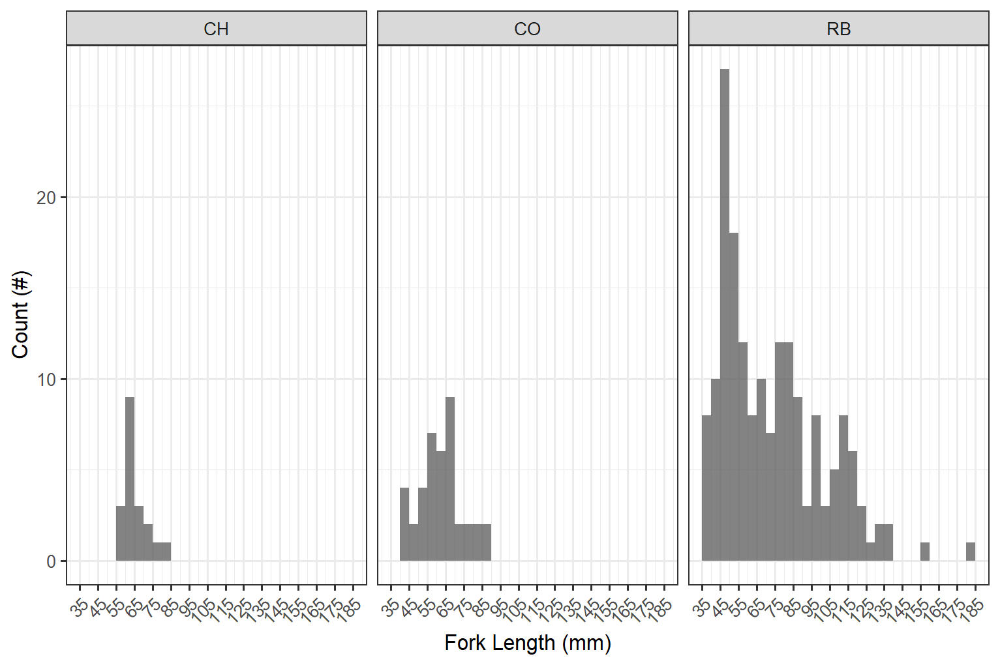

--- 
title: "Bulkley River Watershed Group Fish Passage Restoration Planning"
author:
 - Prepared for Habitat Conservation Trust Fund
 - Prepared by Al Irvine, B.Sc., R.P.Bio.
 - New Graph Environment
 - Version 0.0.1
date: "2021-01-15 DRafT"
toc-title: Table of Contents
site: bookdown::bookdown_site
output: bookdown::gitbook
documentclass: book
bibliography: [book.bib, packages.bib]
biblio-style: apalike
link-citations: no
github-repo: rstudio/bookdown-demo
description: "My Description."


---


```{r setup, include = TRUE, echo =FALSE, message=FALSE, warning=FALSE}
knitr::opts_chunk$set(echo=FALSE, message=FALSE, warning=FALSE, dpi=60, out.width = "100%")

##define a picture specific output width you can put in chunk headers
##we need a switch to turn off html only so the printed version looks ok
photo_width <- "100%"
html_on <- TRUE

##these are the settings for the pagedown version!! DONT FORGET THE FONT DOWN BELOW TOO!!!!!!!!!!!!!!
# photo_width <- "80%"
# html_on <- FALSE


##try to fix the kable caption size https://stackoverflow.com/questions/45018397/changing-the-font-size-of-figure-captions-in-rmarkdown-html-output

# fig.align="center", out.width = "90%",
source('R/packages.R')
source('R/functions.R')
source('R/functions-phase2.R')
source('R/0310-tables.R')
source('R/0320-tables-phase2.R')
source('R/0330-tables-phase1-cost-estimate.R')
source('R/0340-tables-phase2-cost-estimate.R') ##the order of these matters to much - should fix.  need to make cost estimate table seperate
source('R/0350-tables-reporting.R')
# source('R/extract-fish.R')
# source('R/functions-fish.R')

##set the font default size for the tables.  had a crash and think this might have been it so put after functions.R
##seems odd but not risking again for now.
font_set <- 11
# font_set <- 9


```

```{r include=FALSE}
# automatically create a bib database for R packages
knitr::write_bib(c(
  .packages(), 'bookdown', 'knitr', 'rmarkdown'
), 'packages.bib')
```


# Executive Summary {.front-matter .unnumbered}

New Graph Environment was retained by the Habitat Conservation Trust, the Provincial Fish Passage Remediation Program and the Canadian Wildlife Federation in 2020 to plan and conduct fish passage and habitat confirmation assessments at road-stream crossings as part of connectivity restoration planning. Although planning was conducted for both the Morice River watershed group and the Bulkley River watershed group, on the ground surveys in 2020 focused primarily within Bulkley River tributaries. 

<br>

A total of `r n_distinct(pscis_phase1_reassessments$my_crossing_reference)` Phase 1 assessments were conducted with `r pscis_phase1_reassessments %>% filter(barrier_result == 'Passable') %>% nrow()` crossings considered "passable", `r pscis_phase1_reassessments %>% filter(barrier_result == 'Potential') %>% nrow() %>% english::as.english()` crossings considered "potential" barriers and `r pscis_phase1_reassessments %>% filter(barrier_result == 'Barrier') %>% nrow()` crossings considered "barriers" according to threshold values based on culvert embedment, outlet drop, slope, diameter (relative to channel size) and length.

<br>

Habitat confirmation assessments were conducted at `r hab_site_priorities %>% nrow()` sites with a total of approximately 18 km of stream assessed. `r hab_site_priorities %>% filter(priority %ilike% 'high') %>% nrow() %>% english::as.english() %>% str_to_title()` crossings were rated as high priorities for proceeding to design for replacement, `r hab_site_priorities %>% filter(priority %ilike% 'Moderate') %>% nrow() %>% english::as.english()` crossings were rated as moderate priorities for proceeding to design for replacement, `r hab_site_priorities %>% filter(priority %ilike% 'Low') %>% nrow() %>% english::as.english()` crossings were rated as a low priority and `r hab_site_priorities %>% filter(priority %ilike% 'no fix') %>% nrow() %>% english::as.english()` crossing was rated as "no fix".


<!--chapter:end:index.Rmd-->


# Introduction {#intro}
```{r}
# New Graph Environment was retained by the Canadian Wildlife Federation and Nupgu Limited Partnership in the fall of 2020 to plan and conduct fish passage and habitat confirmation assessments at road-stream crossings as part of connectivity restoration planning targeting westslope cutthrout trout. Although some planning was conducted for both the Elk River watershed upstream of the Elko Dam near Elko, BC and the Flathead River, on the ground surveys in 2020 focused on the Elk River and tributaries located upstream of the Elko Dam. 
```


<br>

The health and viability of freshwater fish populations can depend on access to tributary and off channel areas which provide refuge during high flows, opportunities for foraging, overwintering habitat, spawning habitat and summer rearing habitat [@Bramblett_2002; @swalesRoleOffChannelPonds1989; @diebel_etal2015EffectsRoad].  Culverts can present barriers to fish migration due to low water depth, increased water velocity, turbulence, a vertical drop at the culvert outlet and/or maintenance issues [@slaneyFishHabitatRehabilitation1997; @cote_etal2005Fishpassage]. Reconnection of fragmented habitats by culvert removal or replacement is a management action that can generate high ecological returns relative to other habitat restoration techniques [@saldicaromileStreamHabitatRestoration2004; @roni_etal2008GlobalReview]. As road crossing structures are commonly upgraded as part of road maintenance there are numerous opportunities to restore connectivity by ensuring that fish passage considerations are incorporated into repair and replacement designs.

<!--chapter:end:0100-intro.Rmd-->

# Background

As a result of high-level direction from the provincial government, a Fish Passage Strategic Approach protocol has been developed for British Columbia to ensure that the greatest opportunities for restoration of fish passage are pursued.  A Fish Passage Technical Working Group has been formed to coordinate the protocol and data is continuously amalgamated within the Provincial Steam Crossing Inventory System (PSCIS).  The strategic approach protocol involves a four-phase process as described in @fishpassagetechnicalworkinggroupFishPassageStrategic2014 :

 * Phase 1: Fish Passage Assessment – Fish stream crossings within watersheds with high fish values are assessed to determine barrier status of structures and document a general assessment of adjacent habitat quality and quantity.
 * Phase 2: Habitat Confirmation – Assessments of crossings prioritized for follow up in Phase 1 studies are conducted to confirm quality and quantity of habitat upstream and down as well as to scope for other potential nearby barriers that could affect the practicality of remediation.
 * Phase 3: Design – Site plans and designs are drawn for priority crossings where high value fish habitat has been confirmed. 
 * Phase 4: Remediation – Reconnection of isolated habitats through replacement, rehabilitation or removal of prioritized crossing structure barriers. 
 
  
<br>

## Project Location

To focus the project area on habitat with high value for conservation of westslope cutthrout trout, the project included the upper Elk River watershed upstream of the Elko Dam with planning also conducted for the Flathead River watershed (Figure \@ref(fig:overview-map).  

<br>

The Bukley River has a mean annual discharge of `r round(fasstr::calc_longterm_mean(station_number = "08EE004")$LTMAD,1)` m^3^/s at station 08EE004 located near Quick and `r round(fasstr::calc_longterm_mean(station_number = "08EE003")$LTMAD,1)` m^3^/s at station 08EE003 located upstream near Houston.  Flow patterns are typical of high elevation watersheds on the west side of the northern Rocky Mountains which receive large amounts of precipitation as snow leading to peak levels of discharge during snowmelt, typically from May to July (Figures \@ref(fig:hydrology-plot) - \@ref(fig:hydrology-stats)). 

<br>

```{r overview-map, fig.cap = 'Overview map of Study Areas',eval=FALSE}
knitr::include_graphics("fig/ElkOverview_2020-12-23_v2.png")
```

<br>

```{r hydrology-plot, fig.cap = 'Hydrograph for Bulkley River At Quick (Station #08EE004 - Lat 54.62 Lon -126.90). Available daily discharge data from 1930 to 2018.', eval=T}
knitr::include_graphics("fig/hydrograph_08EE004.png")
```

<br>

```{r hydrology-stats, fig.cap = 'Summary of hydrology statistics for Bulkley River At Quick (Station #08EE004)', eval=T}
knitr::include_graphics("fig/hydrology_stats_08EE004.png")
```


<br>

```{r}
### Wet'suwet'en

### Gitxsan
```


<br>


## Fisheries


<br>

```{r fiss-species-table, eval=F}
readr::read_csv(file = paste0(getwd(), '/data/raw_input/fiss_species_table.csv')) %>% 
  filter(`Species Code` != 'CT') %>% 
  my_kable(caption_text = 'Fish species recorded in the Bulkley River watershed group.')


# Fish species recorded in the Elk River watershed group are detailed in Table \@ref(tab:fiss-species-table) [@data_fish_obs].  Bull trout and westslope cutthrout trout are considered of special concern (blue-listed) provincially and westslope cutthrout trout (Pacific populations) are are listed under the *Species at Risk Act* by the Committee on the Status of Endangered Wildlife in Canada as a species of special concern [@bcspeciesecosystemexplorer2020Salvelinusconfluentusa; @bcspeciesecosystemexplorer2020Oncorhynchusclarkii; @schweigert_etal2017COSEWICassessment].  The focus of 2020 field work was to assess potential impacts of road-stream crossings on habitat connectivity for westslope cutthrout trout.

```

<br>

 

<br>

```{r fish-wct-fiss-summary, eval=FALSE}
wct_elkr_grad <- readr::read_csv(file = paste0(getwd(), '/data/raw_input/wct_elkr_grad.csv'))

# A summary of historical westslope cutthrout trout observations in the Elk River watershed group by average gradient category of associated stream segment is provided in Figure \@ref(fig:fish-wct-bar). Of `r wct_elkr_grad %>% filter(gradient_id == 3) %>% pull(total)` observations, `r wct_elkr_grad %>% filter(gradient_id == 3) %>% pull(Percent) + wct_elkr_grad %>% filter(gradient_id == 5) %>% pull(Percent) + wct_elkr_grad %>% filter(gradient_id == 8) %>% pull(Percent)`% were within stream segments with average gradients ranging from 0 - 8%.  A total of `r wct_elkr_grad %>% filter(gradient_id == 3) %>% pull(Percent)`% of historic observations were within stream segments with gradients between 0 - 3%, `r wct_elkr_grad %>% filter(gradient_id == 5) %>% pull(Percent)`% were within stream segments with gradients ranging from 3 - 5% and `r wct_elkr_grad %>% filter(gradient_id == 5) %>% pull(Percent)`% were within stream segments with gradients between 5 - 8% [@data_fish_obs; @norris2020bcfishobs]. 

```


<br>

```{r fish-wct-bar, out.width = photo_width, fig.cap= 'Summary of historic westslope cutthrout trout observations vs. stream gradient category.', eval=F}
##bar graph
plot_wct_elkr_grad <- wct_elkr_grad %>% 
  ggplot(aes(x = Gradient, y = Percent)) +
  geom_bar(stat = "identity")+
  theme_bw(base_size = 8)+
  labs(x = "Stream Gradient", y = "WCT Occurrences (%)")
plot_wct_elkr_grad

```

  

<!--chapter:end:0200-background.Rmd-->

# Methods

Workflows for the project can be classified into planning, fish passage assessments, habitat confirmation assessments and reporting. All components leveraged the R programming language and environment for statistical computing to facilitate workflow tracking and reproducibility [@rcoreteam2020languageenvironment]. 


```{r eval=F}
source('R/packages.R')
source('R/tables.R')
# or the development version
# devtools::install_github("rstudio/bookdown")
```

## Planning

 
To identify priorities for crossing structure rehabilitation, background literature, fisheries information, PSCIS, `Fish Habitat Model` outputs modified from @fish_habitat_model and `bcfishpass` [@norrisBcfishpass2020] outputs were reviewed. The `Fish Habitat Model` was developed by the BC Ministry of Environment to provide estimates of the amount of fish habitat potentially accessible to fish upstream of crossing locations. The model calculates the average gradient of BC Freshwater Atlas [stream network lines](https://catalogue.data.gov.bc.ca/dataset/freshwater-atlas-stream-network) at minimum 100m long intervals starting from the downstream end of the streamline segment and working upstream.  The network lines are broken into max gradient categories with new segments created when the average gradient of the stream lines exceeds user provided gradient thresholds.  

<br>

 `bcfishpass` is comprised of sql and python based shell script libraries that "generate a simple model of aquatic habitat connectivity by identifying natural barriers to fish passage (plus hydro dams that are not feasible to remediate) and classifying all streams not upstream of these barriers as 'potentially accessible'" [@norrisBcfishpass2020]. On potentially accessible streams, `bcfishpass` scripts "identify known barriers and additional anthropogenic features (primarily road/railway stream crossings, i.e. culverts) that are potentially barriers. To prioritize these features for assessment or remediation," the scripts  "report on how much modelled potentially accessible aquatic habitat the barriers may obstruct. The model can be refined with known fish observations. Depending on the modelling scenario, all aquatic habitat downstream of a given fish observation can be classified as 'observed accessible', overriding any downstream barriers."


<br>
 
Following delineation of "non-fish habitat" with the `Fish Habitat Model`, the *average* gradient of each stream segment within habitat classified as below the 22% threshold was calculated and summed using `bcfishpass` to quantify upstream habitat potentially available for westslope cutthrout trout and facilitate stream line symbology based on stream morphology.  `bcfishpass` summed average gradients of stream network line segments within seven categories (0 - 3%, 3 - 5%, 5 - 8%, 8 - 15%, 15 - 22%, 22 - 30% and >30%) with these outputs further amalgamated to summarize and symbolize potential upstream habitat in four categories: riffle/cascade (0 - 5%), step-pool (5 - 15%), step-pool very steep (15-22%) and extremely steep (22 - 30%) (Table \@ref(tab:tablethreshaverage)). For each crossing location, the the area of lake and wetland habitat upstream, species documented upstream and an estimate of watershed area was also collated using `bcfishpass`, `fwapg` [@norris2020fwapg] and `bcfishobs` [@norris2020bcfishobs] to provide an indication of the potential quantity and quality of habitat potentially gained should fish passage be restored.  


<br>


```{r tablethreshaverage, eval= T}
#threshold and average gradient table
table_thresh_average <- tibble::tibble(`Gradient` = c('0 - 5%', '5 - 15%', '15 - 22%', '22 - 30%', '>30%'),
                                       `Channel Type` = c('Riffle and cascade pool', 'Step pool', 'Step pool - very steep', 'Step pool - extremely steep (bull trout only)', 'Non fish habitat'))

table_thresh_average %>% 
    my_kable(caption_text = 'Stream gradient categories (threshold and average) and associated channel type.')
```


<br>

To prepare for Phase 1 and 2 assessments in the study area, past fish passage assessment reports for the Elk River watershed group were first reviewed to identify crossing structures not yet assessed or previously ranked as priorities for rehabilitation in @vastFishPassage2013 and @grainger2011FishPassage2011.  To determine which of those crossings had not yet been assessed with Phase 1 and Phase 2 assessments we cross-referenced these reports with the Phase 2 report previously completed in the study area by @masseEKConfirmation2015 and reviewed outputs from PSCIS as well as the `Fish Habitat Model` and `bcfishpass`.  Outputs for modelled and PSCIS crossings (barriers and potential barriers) that met the following criteria underwent a detailed review to facilitate prioritization for Phase1 - Fish Passage Assessments and Phase 2 - Habitat Confirmations.

 * Confirmed fish presence upstream of the structure.
 * Stream width documented as > 2.0m in PSCIS.
 * Linear lengths of modelled upstream habitat <22% gradient for ≥1km for PSCIS crossings or ≥2km for modelled crossings.
 * Crossings located on streams classified as 3rd order or higher.
 * Crossings located on streams with >5 ha of modeled wetland and/or lake habitat upstream.
 * Habitat value rated as "medium" or “high” in PSCIS.  
 

<br>


## Fish Passage Assessments

In the field, crossings prioritized for follow-up were first assessed for fish passage following the procedures outlined in “Field Assessment for Determining Fish Passage Status of Closed Bottomed Structures” [@fish_passage_assessments]. Crossings surveyed included closed bottom structures (CBS), open bottom structures (OBS) and crossings considered “other” (i.e. fords).  Photos were taken at surveyed crossings and when possible included images of the road, crossing inlet, crossing outlet, crossing barrel, channel downstream and channel upstream of the crossing and any other relevant features.  The following information was recorded for all surveyed crossings: date of inspection, crossing reference, crew member initials, Universal Transverse Mercator (UTM) coordinates, stream name, road name and kilometer, road tenure information, crossing type, crossing subtype, culvert diameter or span for OBS, culvert length or width for OBS.  A more detailed “full assessment” was completed for all closed bottom structures and included the following parameters: presence/absence of continuous culvert embedment (yes/no), average depth of embedment, whether or not the culvert bed resembled the native stream bed, presence of and percentage backwatering, fill depth, outlet drop, outlet pool depth, inlet drop, culvert slope, average downstream channel width, stream slope, presence/absence of beaver activity, presence/absence of fish at time of survey, type of valley fill, and a habitat value rating.  Habitat value ratings were based on channel morphology, flow characteristics (perennial, intermittent, ephemeral), fish migration patterns, the presence/absence of deep pools, un-embedded boulders, substrate, woody debris, undercut banks, aquatic vegetation and overhanging riparian vegetation (Table \@ref(tab:tab-hab-value)).  For crossings determined to be potential barriers or barriers based on the data (see [Barrier Scoring]), a culvert fix and recommended diameter/span was proposed.  

<br>


 
```{r tab-hab-value}
tab_habvalue %>% 
  knitr::kable(caption = 'Habitat value criteria (Fish Passage Technical Working Group, 2011).', booktabs = T) %>% 
    kableExtra::column_spec(column = 1, width_min = '1.5in') %>% 
    kableExtra::kable_styling(c("condensed"), full_width = T, font_size = font_set) 
  
```
 
<br>

### Barrier Scoring

Fish passage potential was determined for each stream crossing identified as a closed bottom structure as per @fish_passage_assessments.  The combined scores from five criteria: depth and degree to which the structure is embedded, outlet drop, stream width ratio, culvert slope, and culvert length were used to screen whether each culvert was a likely barrier to some fish species and life stages (Table \@ref(tab:tab-barrier-scoring), Table \@ref(tab:tab-barrier-result). These criteria were developed based on data obtained from various studies and reflect an estimation for the passage of a juvenile salmon or small resident rainbow trout [@clarkinNationalInventoryAssessment2005 ;@bellFisheriesHandbookEngineering1991; @thompsonAssessingFishPassage2013].  

<br>

```{r tab-barrier-scoring, eval=T}
tab <- as_tibble(t(tab_barrier_scoring)) %>% 
  mutate(V4 = names(tab_barrier_scoring)) %>% 
  select(V4, everything()) %>% 
  janitor::row_to_names(1) %>%  ##turn the table sideways
  mutate(Risk = case_when(Risk == 'Value' ~ '  Value',
                          T ~ Risk))

tab %>% 
  my_kable(caption_text = 'Fish Barrier Risk Assessment (MoE 2011).')


```

<br>


```{r tab-barrier-result}
tab_barrier_result %>% 
  my_kable(caption_text = 'Fish Barrier Scoring Results (MoE 2011).') 

```

<br>

### Cost Benefit Analysis

A cost benefit analysis was conducted for each crossing determined to be a barrier based on an estimate of cost associated with remediation or replacement of the crossing with a structure that facilitates fish passage and the amount of potential habitat that would be made available by remediating fish passage at the site (habitat gain index).  

<br>

#### Habitat Gain Index

The habitat gain index is the quantity of modelled habitat upstream of the subject crossing and represents an estimate of habitat gained with remediation of fish passage at the crossing.  For this project, a gradient threshold between accessible and non-accessible habitat was set at 20% (for a minimimum length of 100m) intended to represent the maximum gradient of which westslope cutthrout trout are likely to be able to migrate upstream.  For Phase 1 assessments a "net" value of habitat quantity output from `bcfishpass` was used to estimate the amount of habitat upstream of each crossing less than 20% gradient before either a falls of height >5m - as recorded in @ProvincialObstaclesFish, a road-stream crossing recorded in PSCIS as a barrier, or a modelled unassessed crossing.  For Phase 2 assessments, to provide a conservative estimate of habitat to be potentially gained by fish passage restoration, the amount of habitat upstream of each crossing was estimated by measuring the amount of mainstem and stream segments > 1st order upstream of the crossing using the measure tool within QGIS [@QGIS_software].

<br>


Potential options to remediate fish passage were selected from @fish_passage_assessments and included:  

 + Removal (RM) - Complete removal of the structure and deactivation of the road. 
 + Open Bottom Structure (OBS) - Replacement of the culvert with a bridge or other open bottom structure.  For this project we considered bridges as the only viable option for OBS type based on consultation with FLNR road crossing engineering experts.  It should be noted however, that box culverts could be considered a viable and economical option as they have been observed as successfully facilitating fish passage on the west coast of the province (Betty Rebellato, Canadian Wildlife Federation - Project Biologist).
 + Streambed Simulation (SS) - Replacement of the structure with a streambed simulation design culvert.  Often achieved by embedding the culvert by 40% or more. Based on consultation with FLNR engineering experts, we considered crossings on streams with a channel width of <2m and a stream gradient of <8% as candidates for replacement with streambed simulations.
 + Additional Substrate Material (EM) - Add additional substrate to the culvert and/or downstream weir to embed culvert and reduce overall velocity/turbulence.  This option was considered only when outlet drop = 0, culvert slope <1.0% and stream width ratio < 1.0.
 + Backwater (BW) - Backwatering of the structure to reduce velocity and turbulence. This option was considered only when outlet drop < 0.3m, culvert slope <2.0%, stream width ratio < 1.2 and stream profiling indicates it would be effective..
 
 <br>

Cost estimates for structure replacement with bridges and embedded culverts were generated based on the channel width, slope of the culvert, depth of fill, road class and road surface type. Road details were sourced from @flnrordForestTenureRoad2020 and @flnrordDigitalRoadAtlas2020 through `bcfishpass`. Interviews with Phil MacDonald, Engineering Specialist FLNR - Kootenay, Steve Page, Area Engineer - FLNR - Northern Engineering Group and Matt Hawkins - MoTi - Design Supervisor for Highway Design and Survey - Nelson were utilized to helped refine estimates.  Base costs for installation of bridges on forest service roads and permit roads with surfaces specified in provincial GIS road layers as rough and loose was estimated at \$12500/linear m and assumed that the road could be closed during construction. For streams with channel widths <2m, embedded culverts were reported as an effective solution with total installation costs estimated at $25k/crossing (pers. comm. Phil MacDonald, Steve Page). For larger streams, an additional 2m was added to the replacement structure's estimated span width for each 1m of channel width >5m.  For crossings with large amounts of fill, the size of replacement structure was increase by 3m for each 1m or fill >3m to account for cutslopes to the stream at a 1.5:1 ratio. To account for road type, a multiplier table was also generated to estimate incremental cost increases with costs estimated for structure replacement on paved surfaces, railways and arterial/highways costing up to 20 times more than forest service roads due to expenses associate with design/engineering requirements, traffic control and paving.  The cost multiplier table (Table \@ref(tab:tab-cost-mult)) should be considered very approximate with refinement recommended for future projects.  

<br>

\pagebreak

```{r tab-cost-mult}
# print_tab_cost_mult(caption_text = 'Cost multiplier table based on road class and surface type.')
tab_cost_rd_mult_report %>%
  my_kable(caption_text = 'Cost multiplier table based on road class and surface type.')
```

<br>

## Habitat Confirmation Assessments

Following fish passage assessments, habitat confirmations were completed in accordance with procedures outlined in the document “A Checklist for Fish Habitat Confirmation Prior to the Rehabilitation of a Stream Crossing” [@confirmation_checklist_2011]. The main objective of the field surveys was to document upstream habitat quantity and quality and to determine if any other obstructions exist above or below the crossing.  Habitat value was assessed based on channel morphology, flow characteristics (perennial, intermittent, ephemeral), the presence/absence of deep  pools, un-embedded  boulders, substrate, woody debris, undercut banks, aquatic vegetation and overhanging riparian vegetation. Criteria used to rank habitat value was based on guidelines in @confirmation_checklist_2011 (Table \@ref(tab:tab-hab-value)). 

<br>

During habitat confirmations, to standardize data collected and facilitate submission of the data to provincial databases, information was collated on ["Site Cards"](https://www2.gov.bc.ca/gov/content/environment/natural-resource-stewardship/laws-policies-standards-guidance/inventory-standards/aquatic-ecosystems). Habitat characteristics recorded included channel widths, wetted widths, residual pool depths, gradients, bankfull depths, stage, temperature, conductivity, pH, cover by type, substrate and channel morphology (among others). When possible, the crew surveyed downstream of the crossing to the point where fish presence had been previously confirmed and upstream to a minimum distance of 600m. Any  potential  obstacles  to  fish  passage  were  inventoried  with  photos, physical  descriptions  and  locations  recorded on site cards.  Surveyed routes were recorded with time-signatures on handheld GPS units.   

<br>

Fish sampling was conducted a subset of sites when biological data was considered to add significant value to the physical habitat assessment information. When possible, electrofishing was utilized within discrete site units both upstream and downstream of the subject crossing with electrofisher settings, water quality parameters (i.e. conductivity, temperature and ph), start location, length of site and wetted widths (average of a minimum of three) recorded.  For each fish captured, fork length and species was recorded, with results included within the fish data submission spreadsheet.  Fish information and habitat data will be submitted to the province under scientific fish collection permit CB20-611971.

<br>

\pagebreak

## Reporting

This pdf report and an online [interactive report](https://newgraphenvironment.github.io/fish_passage_bulkley_2020_reporting/) were generated with `bookdown` [@bookdown2016] from `Rmarkdown` [@R-rmarkdown] documents processing raw data available at the [New Graph Environment Github Site ](https://github.com/NewGraphEnvironment/fish_passage_bulkley_2020_reporting). In addition to numerous spatial layers sourced through the BC Data Catalogue, data inputs for this project can be sourced [here](https://github.com/NewGraphEnvironment/fish_passage_bulkley_2020_reporting/tree/master/data) and include: 

 + Populated [Fish Data Submission Spreadsheet Template - V 2.0, January 20, 2020 ](https://www2.gov.bc.ca/gov/content/environment/plants-animals-ecosystems/fish/fish-and-fish-habitat-data-information/fish-data-submission/submit-fish-data#submitfish) 

 + Populated [pscis_assessment_template_v24.xls](https://www2.gov.bc.ca/gov/content/environment/plants-animals-ecosystems/fish/aquatic-habitat-management/fish-passage/fish-passage-technical/assessment-projects)
 
 
 + [`Fish Habitat Model`/`bcfishpass`](https://github.com/NewGraphEnvironment/fish_passage_bulkley_2020_reporting/blob/master/data/bcfishpass-phase2.csv) outputs.


 + [Custom Excel Spreadsheet](https://github.com/NewGraphEnvironment/fish_passage_bulkley_2020_reporting/raw/master/data/habitat_confirmations_priorities.xlsx) detailing Phase 2 site:
     - priority level for proceeding to design for replacement
     - length of survey upstream and downstream
     - a conservative estimate of mainstem habitat potentially available upstream of the crossing 
     - fish species confirmed as present upstream of the crossing

 + [GPS tracks](https://github.com/NewGraphEnvironment/fish_passage_bulkley_2020_reporting/tree/master/data/habitat_confirmation_tracks.gpx) from field surveys.  

 + [Photos and photo metadata.](https://github.com/NewGraphEnvironment/fish_passage_bulkley_2020_reporting/tree/master/data/photos) 
 
 

 


<!--chapter:end:0300-method.Rmd-->

# Results and Discussion

Field assessments were conducted between `r format(min(pscis_phase1$date), format="%B %d %Y")` and `r format(max(pscis_phase1$date), format="%B %d %Y")` by Allan Irvine, R.P.Bio, New Graph Environment and Kyle Prince, P,Biol. `r if(html_on)knitr::asis_output("Results of Phase 1 and Phase 2 assessments are summarized in Figure \\@ref(fig:map-interactive) with additional details provided in sections below.")` 

<br>

```{r map-interactive, eval= html_on, fig.cap='Map of fish passage and habitat confirmation results'}
##make colors for the priorities
pal <- 
   colorFactor(palette = c("red", "yellow", "grey", "black"), 
               levels = c("high", "moderate", "low", "no fix"))

pal_phase1 <- 
   colorFactor(palette = c("red", "yellow", "grey", "black"), 
               levels = c("high", "moderate", "low", NA))
#https://stackoverflow.com/questions/61026700/bring-a-group-of-markers-to-front-in-leaflet
# marker_options <- markerOptions(  
#   zIndexOffset = 1000)
# tracks <- sf::read_sf("./data/habitat_confirmation_tracks.gpx", layer = "tracks") 
# wshds <- sf::read_sf('data/fishpass_mapping.gpkg', layer = 'hab_wshds_ltree') %>% 
#   filter(!pscis_crossing_id %in% c(62423, 62426, 50181, 50159)) %>% ##these ones are not correct - fix later
#   st_transform(crs = 4326)
# wshd_study_elk <- sf::read_sf('data/fishpass_mapping.gpkg', layer = 'wshd_study_elk') %>% 
#   st_transform(crs = 4326)
# wshd_study_flathead <- sf::read_sf('data/fishpass_mapping.gpkg', layer = 'wshd_study_flathead') %>% 
#   st_transform(crs = 4326) 
# photo_metadata <- readr::read_csv(file = 'data/photo_metadata.csv')
  
  
map <- leaflet(height=500, width=780) %>%
  # leaflet() %>% 
  addTiles()  %>% 
  # leafem::addMouseCoordinates(proj4 = 26911) %>% ##can't seem to get it to render utms yet
  # addProviderTiles(providers$"Esri.DeLorme") %>% 
  addProviderTiles("Esri.WorldTopoMap", group = "Topo") %>%
  addProviderTiles("Esri.WorldImagery", group = "ESRI Aerial") %>% 
  # addPolygons(data = wshds, color = "#0859C6", weight = 1, smoothFactor = 0.5,
  #   opacity = 1.0, fillOpacity = 0.25,
  #   fillColor = "#00DBFF") %>%
  # addPolygons(data = wshd_study_elk, color = "#F29A6E", weight = 1, smoothFactor = 0.5,
  #   opacity = 1.0, fillOpacity = 0.25,
  #   fillColor = "#F29A6E", label = 'Upper Elk River') %>% 
  # addPolygons(data = wshd_study_flathead, color = "#C39D50", weight = 1, smoothFactor = 0.5,
  #   opacity = 1.0, fillOpacity = 0.25,
  #   fillColor = "#C39D50", label = 'Flathead River') %>%
  # addMeasure() %>% 
  # setView(lng = -105.644, lat = 51.618, zoom = 3)
  
  # addPolylines(data=drake::readd(fish_habitat_model_lines),  opacity=1, color = '#6498d2',
  #              fillOpacity = 0.75, weight=2) %>% 
  # addPolylines(data=forest_tenure_road_lines,  opacity=1, color = '#ff7f00',
  #              fillOpacity = 0.75, weight=2) %>%
    addLegend(
    position = "topright",
    colors = c("red", "yellow", "grey", "black"),
    labels = c("High", "Moderate", "Low", 'No fix'), opacity = 1,
    title = "Fish Passage Priorities",
  ) %>% 
    addCircleMarkers(
    data=tab_phase1_map,
    label = tab_phase1_map$pscis_crossing_id,
    labelOptions = labelOptions(noHide = F, textOnly = TRUE),
    popup = leafpop::popupTable(x = select((tab_phase1_map %>% st_set_geometry(NULL)),
                                           Site = pscis_crossing_id, Priority = priority_phase1, Stream = stream_name, Road = road_name, `Habitat value`= habitat_value, `Barrier Result` = barrier_result, `Culvert data` = data_link, `Culvert photos` = photo_link),
                                feature.id = F,
                                row.numbers = F),
    radius = 9,
    fillColor = ~pal_phase1(priority_phase1),
    color= "#ffffff",
    stroke = TRUE,
    fillOpacity = 1.0,
    weight = 2,
    opacity = 1.0,
    group = "Phase 1"
    ) %>%
  #   addPolylines(
  #     data=tracks,  opacity=0.75, color = '#e216c4',
  #              fillOpacity = 0.75, weight=5, group = "Phase 2") %>%
  # addAwesomeMarkers(
  #   lng = photo_metadata$gpslongitude,lat = photo_metadata$gpslatitude,
  #                   popup = leafpop::popupImage(photo_metadata$url, src = "remote"),
  #                   clusterOptions = markerClusterOptions(),
  #                   group = "Phase 2") %>%
  #   addCircleMarkers(
  #   data=tab_hab_map,
  #   label = tab_hab_map$pscis_crossing_id, 
  #   labelOptions = labelOptions(noHide = T, textOnly = TRUE),
  #   popup = leafpop::popupTable(x = select((tab_hab_map %>% st_set_geometry(NULL)), 
  #                                          Site = pscis_crossing_id, Priority = priority, Stream = stream_name, Road = road_name, `Habitat (m)`= upstream_habitat_length_m, Comments = comments, `Culvert data` = data_link, `Culvert photos` = photo_link),
  #                               feature.id = F,
  #                               row.numbers = F), 
  #   radius = 9,
  #   fillColor = ~pal(priority),
  #   color= "#ffffff",
  #   stroke = TRUE, 
  #   fillOpacity = 1.0,
  #   weight = 2,
  #   opacity = 1.0,
  #   group = "Phase 2"
  #   ) %>% 
  #     # addScaleBar(position = 'bottomleft', options = scaleBarOptions(imperial = FALSE)) %>% 
  addLayersControl(
    baseGroups = c(
      "Esri.DeLorme",
      "ESRI Aerial"),
    overlayGroups = c("Phase 1", "Phase 2"),
    options = layersControlOptions(collapsed = F)) %>%
  leaflet.extras::addFullscreenControl() %>% 
  addMiniMap(tiles = providers$"Esri.NatGeoWorldMap",
             zoomLevelOffset = -6, width = 100, height = 100)

map 
  # hideGroup("Phase 2") 
```


```{r eval=F}
pscis_historic <- readr::read_csv(file = paste0(getwd(), '/data/raw_input/pscis_study_area.csv'))
pscis_historic_phase2 <- readr::read_csv(file = paste0(getwd(), '/data/raw_input/pscis_phase2_study_area.csv'))


# ## Planning
# Review of the PSCIS database indicated that prior to 2020, `r pscis_historic %>% filter(study_area %ilike% 'elk' & assessment_date < '2020-01-01') %>% nrow()` assessments for fish passage (Phase 1) and `r pscis_historic_phase2 %>% filter(study_area %ilike% 'elk' & assmt_date < '2020-01-01') %>% nrow()` habitat confirmations (Phase 2) have been conducted at crossing structures within the Upper Elk River.  Within the Flathead River watershed `r pscis_historic %>% filter(study_area %ilike% 'flathead' & assessment_date < '2020-01-01') %>% nrow()` fish passage assessments and `r pscis_historic_phase2 %>% filter(study_area %ilike% 'flathead' & assmt_date < '2020-01-01') %>% nrow() %>% english::as.english()` habitat confirmations had been conducted.  Following review of background literature, fisheries information, PSCIS and `bcfishpass` outputs, both modelled and PSCIS sites were selected for follow up with Phase 1 and 2 assessments. Results are included as a zipped package of Google Earth kml files stored  [here](https://github.com/NewGraphEnvironment/fish_passage_elk_2020_reporting_cwf/raw/master/data/planning_kmls/elk_planning_kmls.zip).
```

 

<br>

## Phase 1

During 2020 field surveys, a total of `r n_distinct(pscis_phase1$my_crossing_reference)` Phase 1 assessments were conducted with `r pscis_phase1 %>% filter(barrier_result == 'Passable') %>% nrow()` crossings considered "passable", `r pscis_phase1 %>% filter(barrier_result == 'Potential') %>% nrow() %>% english::as.english()` crossings considered "potential" barriers and `r pscis_phase1 %>% filter(barrier_result == 'Barrier') %>% nrow()` crossings considered "barriers" according to threshold values based on culvert embedment, outlet drop, slope, diameter (relative to channel size) and length [@fish_passage_assessments].  Site details and photos are presented in [Appendix - Phase 1 Fish Passage Assessment Data and Photos] with maps stored [here](https://hillcrestgeo.ca/outgoing/fishpassage/projects/bulkley/).  A cost benefit analysis for Phase 1 sites that were determined to be barriers or potential barriers is presented in Table \@ref(tab:cost-est-phase-1). 

<br>

Barrier passability criteria used in this project follows @fish_passage_assessments, and reflects an estimation for the passage of a juvenile salmon or small resident rainbow trout [@clarkinNationalInventoryAssessment2005 ;@bellFisheriesHandbookEngineering1991; @thompsonAssessingFishPassage2013].  As noted in @bourne_etal2011Barriersfish, with a detailed review of different criteria in @kemp_ohanley2010Proceduresevaluating, passability of barriers can be quantified in many different ways. Fish physiology (i.e. species, length, swim speeds) as well as the temporal variation of physical characteristics (ex. due to flow volumes/velocities a particular culvert is passable 50% of the time to fish with a defined physiological capacity) make defining passability difficult with important implications for watershed connectivity modelling [@bourne_etal2011Barriersfish; @shaw_etal2016Importancepartial; @mahlum_etal2014EvaluatingBarrier; @kemp_ohanley2010Proceduresevaluating].

<br>

```{r cost-est-phase-1}
if(html_on){
  tab_cost_est_phase1 %>% 
  my_kable_scroll(caption_text = 'Upstream habitat estimates and cost benefit analysis for Phase 1 assessments.  ')
} else tab_cost_est_phase1 %>% 
  my_kable(caption_text = 'Upstream habitat estimates and cost benefit analysis for Phase 1 assessments.')
```

<br>

## Phase 2

 
Habitat confirmation assessments were conducted at `r hab_site_priorities %>% nrow()` sites with a total of approximately 15 km of stream assessed. `r hab_site_priorities %>% filter(priority %ilike% 'high') %>% nrow() %>% english::as.english() %>% str_to_title()` crossings were rated as high priorities for proceeding to design for replacement, `r hab_site_priorities %>% filter(priority %ilike% 'Moderate') %>% nrow() %>% english::as.english() %>% str_to_title()` crossings were rated as moderate priorities for proceeding to design for replacement, `r hab_site_priorities %>% filter(priority %ilike% 'Low') %>% nrow() %>% english::as.english()` crossings were rated as a low priority and `r hab_site_priorities %>% filter(priority %ilike% 'no fix') %>% nrow() %>% english::as.english()` rated as "no fix". Results are summarized in `r if(html_on){knitr::asis_output("Figure \\@ref(fig:map-interactive) and ")}`Tables \@ref(tab:tab-overview) - \@ref(tab:tab-habitat-summary) with raw habitat and fish sampling data included in digital format as [Attachment 2](https://github.com/NewGraphEnvironment/fish_passage_bulkley_2020_reporting/raw/master/data/habitat_confirmations.xls).  Detailed information for each site assessed with Phase 2 assessments is included within site specific reports included as appendices to this document with pdf maps stored [here](https://hillcrestgeo.ca/outgoing/fishpassage/projects/bulkley/confirmations/).


<br>

```{r tab-overview}
if(html_on){
tab_overview %>% 
  select(-Tenure) %>%
  my_tab_overview_scroll(caption_text = 'Overview of habitat confirmation sites.')
} else tab_overview %>% 
  select(-Tenure) %>%
  my_tab_overview(caption_text = 'Overview of habitat confirmation sites.')
```

<br>

\pagebreak

```{r}

make_tab_cv(dat = pscis_phase2) %>% 
  my_kable(caption_text = 'Summary of Phase 2 fish passage reassessments.')
```

<br>

```{r cost-est-phase-2}
tab_cost_est_phase2_report %>% 
  my_kable(caption_text = 'Cost benefit analysis for Phase 2 assessments.')
  # kable(caption = 'Modelled upstream habitat estimate and cost benefit.',
  #       escape = T) %>% 
  # kableExtra::kable_styling(c("condensed"), full_width = T, font_size = 11) %>% 
  # kableExtra::scroll_box(width = "100%", height = "500px")

```

<br>

```{r tab-habitat-summary}
tab_hab_summary %>% 
  filter(Location %ilike% 'upstream') %>% 
  select(-Location) %>% 
  rename(`PSCIS ID` = Site) %>% 
  my_kable(caption_text = 'Summary of Phase 2 habitat confirmation details.')

```
```{r}
## Fish Sampling

# Fish sampling was conducted at five sites with a total of `r tab_fish_summary %>% filter(species_code == 'WCT') %>% pull(count_fish) %>% sum()` westslope cutthout trout,  `r tab_fish_summary %>% filter(species_code == 'EB') %>% pull(count_fish) %>% sum()` eastern brook trout and `r tab_fish_summary %>% filter(species_code == 'BT') %>% pull(count_fish) %>% sum()` bull trout captured.  Westslope cutthrout trout were captured at three of the sites sampled with fork length data delineated into life stages: fry (&le;60mm), parr (>60 to 110mm), juvenile (>110mm to 140mm) and adult (>140mm) by visually assessing the histogram presented in Figure \@ref(fig:fish-histogram).  Fish sampling results are presented in detail within individual habitat confirmation site memos within the appendices of this document with westslope cutthrout trout density results also presented in Figure \@ref(fig:plot-fish-all).  
```

<br>


<br>

```{r fish-histogram, fig.cap= 'Histogram of westslope cutthrout trout captured during electrofishing surveys.', eval = F}


```

<br>

```{r plot-fish-all, fig.cap='Boxplots of densities (fish/100m2) of westslope cutthrout trout captured by life stage and site for data collected during habitat confirmation assessments.', eval=F}
plot_fish_box_all()
```


<!--chapter:end:0400-results.Rmd-->

# Recommendations

```{r}
# Recommended next steps for fish passage restoration in the Elk River watershed group include:
# 
# 
#  * Continue to collaborate with potential partners to build relationships, explore perspectives and develop “road maps” for fish passage restoration in different situations (MoT roads, rail lines, permit roads of different usages, FSRs, etc.) – documenting the people involved, discussions and process that are undertaken, funding options, etc.
#  * Continue to develop `bcfishpass` and build a connectivity index for the study area watersheds to inform a connectivity remediation plan.
#  * Acquire funding to procure site plans and replacement designs for structures identified as high priorities for restoration. 
#  * Conduct fish passage and habitat confirmation assessments at road and rail stream crossings identified as high and moderate priorities in the Elk and Flathead River study areas through this project and future connectivity modelling analysis.
#  * Refine passability thresholds for road-stream crossing structures to explore metrics specific to life stage and life history for westslope cutthrout trout to focus quantification of impacts of structures on connectivity within spawning and/or rearing habitats.
#  * Work with regulators, the Elk Valley Cumulative Effects Management Framework Working Group and others to explore previously developed habitat suitablity indices for westslope cutthrout trout in the region as well as to analyze historic electrofishing data to determine catch per unit effort by species, area of habitat surveyed and timed electrofishing effort for sites within the study area. Results should be overlaid onto GIS (size/elevation of the watershed, length of modelled upstream channel, channel gradient, substrate type, etc.) to model species specific fish densities in habitats similiar to those found upstream and downstream of culvert locations.  This will facilitate estimations of the carrying capacities of habitats potentially blocked by road-stream crossing structures, allowing assessment of impacts of stream crossings on associated fish populations and quantification of the value of crossing remediations. 
#  * Drafting and implementation of a collaborative plan for assessing the impacts of fish passage restoration investments.  The plan should be designed to provide data necessary to effectively monitor the outcomes of restoration efforts, inform future investments and build capacity/momentum for ecosystem restoration activities in the region.
```


<!--chapter:end:0500-recomendations.Rmd-->

# Appendix - Phase 1 Fish Passage Assessment Data and Photos {-}

`r knit(text = unlist(tabs_phase1))`

<!--chapter:end:0600-appendix.Rmd-->

`r if (knitr::is_html_output()){ '
# References {-}
<div id="refs"></div>
'}`

```{r}
#https://github.com/rstudio/bookdown/issues/8 how to put the references wherever we want.

# `r if (knitr::is_html_output()){ '
# # References {-}
# <div id="refs"></div>
# '}`
```


<!--chapter:end:2000-references.Rmd-->

