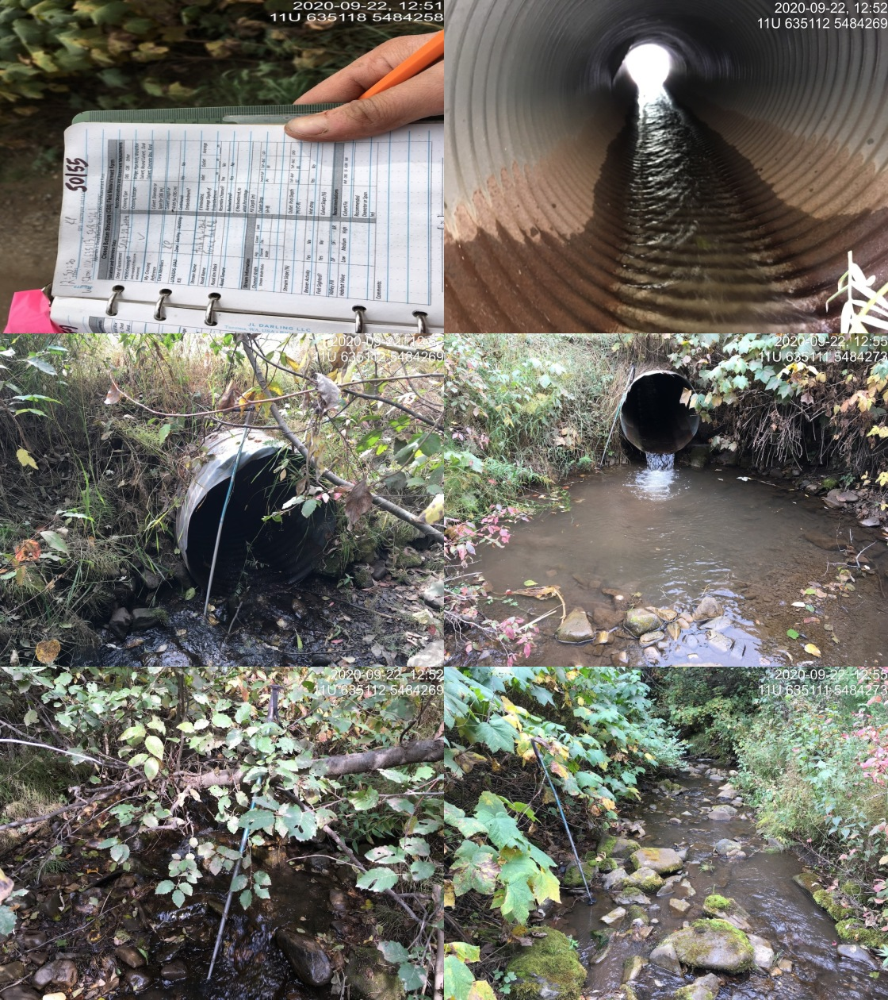
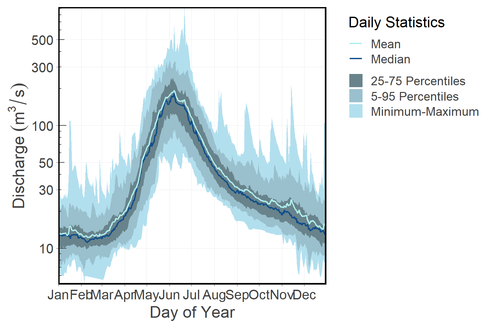

--- 
title: "Elk River Watershed Group Fish Passage Restoration Planning"
author: "Al Irvine, B.Sc., R.P.Bio." 
date: "`r Sys.Date()`"
site: bookdown::bookdown_site
output: 
  bookdown::word_document2:
    reference_docx: C:/Users/allan/OneDrive/New_Graph/Current/Code/R/Templates/RMDTemplates/R/word_template.docx
    bibliography: book.bib
    toc: no
    fig_caption: yes
documentclass: book
bibliography: [book.bib, packages.bib]
biblio-style: apalike
link-citations: yes
github-repo: rstudio/bookdown-demo
description: "My Description."
---

```{r setup, include = TRUE, echo =FALSE, message=FALSE, warning=FALSE}
knitr::opts_chunk$set(echo=FALSE, message=FALSE, warning=FALSE, fig.pos = "!ht", out.extra = "")
# fig.align="center", out.width = "90%",
source('R/packages.R')
source('R/functions.R')
source('R/functions-phase2.R')
source('R/tables.R')
source('R/tables-phase2.R')
source('R/tables-phase1-cost-estimate.R')
source('R/tables-phase2-cost-estimate.R')
source('R/extract-fish.R')
source('R/functions-fish.R')

##bookdown::gitbook

```


```{r include=FALSE}
# automatically create a bib database for R packages
knitr::write_bib(c(
  .packages(), 'bookdown', 'knitr', 'rmarkdown'
), 'packages.bib')
```


# Executive Summary {-}

<br>

<!--chapter:end:index.Rmd-->


# Introduction {#intro}
New Graph Environment and Nupqu Limited Partnership were retained by the Canadian Wildlife Federation in the fall of 2020 to plan and conduct fish passage assessments of stream crossings within the Elk River watershed upstream of the Elko Dam near Elko, BC. The work was carried out in accordance with the BC Ministry of Environment: Field Assessment  for Determining Fish Passage at Closed  Bottom  Structures,  4th  Edition [@fish_passage_assessments] and Fish Passage Strategic Approach: Protocol for Prioritizing Sites for Fish Passage Remediation: 4th Edition [@fishpassagetechnicalworkinggroupFishPassageStrategic2014].

<br>

The health and viability of freshwater fish populations can depend on access to tributary and off channel areas which provide refuge during high flows, opportunities for foraging, overwintering habitat, spawning habitat and summer rearing habitat [@Bramblett_2002; @swalesRoleOffChannelPonds1989].  Culverts can present barriers to fish migration due to increased water velocity, turbulence, a vertical drop at the culvert outlet and/or maintenance issues [@slaneyFishHabitatRehabilitation1997]. Reconnection of fragmented habitats is a management action that can generate some of the highest ecological returns on economic investments relative to other habitat restoration techniques [@saldicaromileStreamHabitatRestoration2004].

```{r eval=F}


```


<!--chapter:end:0100-intro.Rmd-->

# Background


```{r}

```

As a result of high-level direction from the provincial government, a Fish Passage Strategic Approach protocol has been developed for British Columbia to ensure that the greatest opportunities for restoration of fish passage are pursued.  A Fish Passage Technical Working Group has been formed to coordinate the protocol and data is continuously amalgamated within the Provincial Steam Crossing Inventory System (PSCIS).  The strategic approach protocol involves a four-phase process as described in @fishpassagetechnicalworkinggroupFishPassageStrategic2014 :

 * Phase 1: Fish Passage Assessment – Fish stream crossings within watersheds with high fish values are assessed to determine barrier status of structures and document a general assessment of adjacent habitat quality and quantity.
 * Phase 2: Habitat Confirmation – Assessments of crossings prioritized for follow up in Phase 1 studies are conducted to confirm quality and quantity of habitat upstream and down as well as to scope for other potential nearby barriers that could affect the practicality of remediation.
 * Phase 3: Design – Site plans and designs are drawn for priority crossings where high value fish habitat has been confirmed. 
 * Phase 4: Remediation – Reconnection of isolated habitats through replacement, rehabilitation or removal of prioritized crossing structure barriers. 
 
  
 <br>
 
The scope of 2020/2021 project activities reported on in this document includes planning for and implementation of the first phase of fish passage assessment in the Elk River watershed upstream of the Elko Dam.

## Project Location
The project was focused within the upper Elk River watershed upstream of the Elko Dam located at Elko, BC.  




## Fisheries


<!--chapter:end:0200-background.Rmd-->

# Methods


```{r eval=F}
source('R/packages.R')
source('R/tables.R')
# or the development version
# devtools::install_github("rstudio/bookdown")
```

## Planning

We produced detailed maps of the project area identifying all locations where 1:20,000 scale TRIM map streams where intersected with roads. To determine target field sites we reviewed background habitat confirmation reports from [@masseEKConfirmation2015]

which crossings on fish habitat with significant quantities of fish habitat upstream had not yet been assessed, we used the Fish Habitat Model to the estimate the quantity and quality of fish habitat potentially upstream of crossings.  Using the criteria below we screen previously cross reference modelled crossing locations with sites already within the Provincial Stream Crossing Summary System. Target crossings were identified as previously unnassessed crossings on streams with likely significant quantities of fish habitat upstream.


## Fish Passage Assessments


In the field, crossings surveyed included closed bottom structures (CBS), open bottom structures (OBS) and crossings considered “other” (fords, weirs, etc.).  Six digit numerical crossing identifiers were generated for each crossings modeled.  Crossings identified in the field that had no corresponding GIS generated ID were given unique identifiers beginning with the date in YYYYMMDD format appended with an identifier between 1 and 10 (ex. 2020091601).  Photos were taken at surveyed crossings and when possible included images of the road, crossing inlet, crossing outlet, crossing barrel, channel downstream and channel upstream of the crossing and any relevant features.  Additionally, the following information was recorded for all surveyed crossings: date of inspection, crossing reference, crew member initials, Universal Transverse Mercator (UTM) coordinates, stream name, road name and kilometer, road tenure information, crossing type, crossing subtype, culvert diameter or span for OBS, culvert length or width for OBS.  A more detailed “full assessment” was completed for all closed bottom structures.

<br>

Full assessments also included the following parameters: presence/absence of continuous culvert embedment (yes/no), average depth of embedment, whether or not the culvert bed resembled the native stream bed, presence of and percentage backwatering, fill depth, outlet drop, outlet pool depth, inlet drop, culvert slope, average downstream channel width, stream slope, presence/absence of beaver activity, presence/absence of fish at time of survey, type of valley fill, and a habitat value rating.  Habitat value ratings were based on channel morphology, flow characteristics (perennial, intermittent, ephemeral), fish migration patterns, the presence/absence of deep pools, un-embedded boulders, substrate, woody debris, undercut banks, aquatic vegetation and overhanging riparian vegetation (Table \@ref(tab:tab-hab-value)).  For crossings determined to be potential barriers or barriers based on the data (see section 2.3.2), a culvert fix and recommended diameter/span was proposed.  

<br>


All field data collected including photos were uploaded to the Provincial Stream Crossing Inventory System (PSCIS).


 
```{r tab-hab-value}
tab_habvalue %>% 
  knitr::kable(caption = 'Habitat value criteria (Fish Passage Technical Working Group, 2011).') %>% 
    kableExtra::column_spec(column = 1, width_min = '1.5in') %>% 
    kableExtra::kable_styling(c("condensed"), full_width = T) 
  
```
 
<br>

## Barrier Scoreing

Fish passage potential was determined for each stream crossing identified as a closed bottom structure on fish bearing and potentially fish bearing stream reaches.  The combined scores from five criteria: depth and degree to which the structure is embedded, outlet drop, stream width ratio, culvert slope, and culvert length were used to screen whether each culvert was a likely barrier to some fish species and life stages (Table \@ref(tab:tab-barrier-scoring), Table \@ref(tab:tab-barrier-result). These criteria were developed based on data obtained from various studies and reflect an estimation for the passage of a juvenile salmon or small resident rainbow trout [@clarkinNationalInventoryAssessment2005 ;@bellFisheriesHandbookEngineering1991; @thompsonAssessingFishPassage2013].

<br>

```{r tab-barrier-scoring, eval=T}
knitr::kable(tab_barrier_scoring,
             caption = 'Fish Barrier Scoring (Fish Passage Technical Working Group 2011).') %>% 
  # kableExtra::column_spec(column = 2, width_min = '0.5in') %>% 
  kableExtra::kable_styling(latex_options = "scale_down", htmltable_class = "lightable-minimal") %>%
  kableExtra::row_spec(0 ,  bold = T, extra_css = 'vertical-align: middle !important;') %>% 
  kableExtra::scroll_box(width = "100%", height = "500px")
  # kable_styling(latex_options = "scale_down")

```

<br>

```{r tab-barrier-result}
knitr::kable(tab_barrier_result,
             caption = 'Fish Barrier Scoring Results (Fish Passage Technical Working Group 2011).') 

```


## Cost Benefit Analysis

A cost benefit analysis was conducted for each crossing considered a barrier based on the amount of potential habitat to be made available by remediating fish passage at the site and an estimate of associated costs.  

## Habitat Gain Index
The habitat gain index is the quantity of modelled habitat upstream of the subject crossing and represents an estimate of habitat gained with remediation of fish passage at the crossing.  For this project we set the threshold between fish and non-fish habitat at a gradient of 20% representing the gradient limit accessible to downstream populations.  A "net" value for the index used meaning that if there is a documented PSCIS barrier crossing upstream of the subject crossing or a modelled unassessed crossing the amount of habitat is totaled to that point.


Potential options to remediate fish passage included:  removal of the structure, backwatering 

Cost estimates for structure replacement were generated based on the channel width, slope of the culvert, depth of fill and the road type.  Base costs for installation of bridges and embedded culverts were estimated based on interviews with Phil MacDonald, Engineering Specialist FLNR - Kootenay and Steve Page, Area Engineer - FLNR - Northern Engineering Group.  Costs for installation of bridges on forest service roads was estimated at $12.5K/m and assumes that the road can be closed during construction. For streams with channel widths <2m embedded culverts can be effective with installation costs estimated at $25k  


<!--chapter:end:0300-method.Rmd-->

# Results

## Phase 1

A total of XXX assessments were conducted between xxx and xxxxxxxxxx.  Site details and photos are presented in 

The analysis phase is summarized in Table \@ref(tab:cost-est) [test][test]

<br>

```{r cost-est-phase-1}
tab_cost_est_phase1 %>% 
  my_kable_scroll(caption_text = 'Modelled upstream habitat estimate and cost benefit for Phase 1 assessments.')
  # kable(caption = 'Modelled upstream habitat estimate and cost benefit.',
  #       escape = T) %>% 
  # kableExtra::kable_styling(c("condensed"), full_width = T, font_size = 11) %>% 
  # kableExtra::scroll_box(width = "100%", height = "500px")

```


## Phase 2


Raw results are included in digital format as [Attachment 2](https://github.com/NewGraphEnvironment/fish_passage_elk_2020_reporting/raw/master/data/habitat_confirmations.xls) and summarized in Tables \@ref(tab:tab-overview) - \@ref(tab:tab-habitat-summary)


<br>

```{r tab-overview}
# tab_overview %>% 
#   kable(caption = 'Overview of habitat confirmation sites.') %>% 
#   kableExtra::kable_styling(c("condensed"), full_width = T, font_size = 11) %>% 
#   kableExtra::scroll_box(width = "100%", height = "500px")

tab_overview %>% 
  my_kable_scroll(caption_text = 'Overview of habitat confirmation sites.')
```

<br>

```{r}
make_tab_cv(dat = pscis2) %>% 
  my_kable(caption_text = 'Summary of Phase 2 fish passage reassessments.')
```

<br>

```{r cost-est-phase-2}
tab_cost_est_phase2 %>% 
  my_kable_scroll(caption_text = 'Cost benefit analysis for Phase 2 assessments.')
  # kable(caption = 'Modelled upstream habitat estimate and cost benefit.',
  #       escape = T) %>% 
  # kableExtra::kable_styling(c("condensed"), full_width = T, font_size = 11) %>% 
  # kableExtra::scroll_box(width = "100%", height = "500px")

```

<br>

```{r tab-habitat-summary}
tab_hab_summary %>% 
  filter(Location == 'upstream') %>% 
  select(-Location) %>% 
  my_kable(caption_text = 'Summary of Phase 2 habitat confirmation details.')

```


<!--chapter:end:0400-results.Rmd-->

# Conclusion


<!--chapter:end:0500-conclusion.Rmd-->

# Appendix - Site Assessment Data and Photos {-}


```{r results='asis'}
print_tab_summary_all <- function(x, y, z){
  kable(x, booktabs = T) %>%
    kableExtra::add_footnote(label = paste0('Comments: ', y[[1]]), notation = 'none') %>% #this grabs the comments out
    kableExtra::add_footnote(label = paste0('Photos: ', z[[1]], z[[2]]), notation = 'none')
}
 
tabs <- mapply(print_tab_summary_all, x = tab_summary, y = tab_summary_comments, z = tab_photo_url)


##this is a test


```


`r knit(text = unlist(tabs))`

```{r}

```


<!--chapter:end:0700-appendix.Rmd-->


```{r setup-01, eval = F}
knitr::opts_chunk$set(echo=FALSE, message=FALSE, warning=FALSE)
source('R/packages.R')
source('R/functions.R')
source('R/functions-phase2.R')
source('R/tables-phase2.R')
source('R/tables.R')
source('R/extract-fish.R')
source('R/functions-fish.R')


```


```{r  load-data-01}
my_site <- 50155
```


`r paste0('# Appendix - Crossing ', my_site)`{-} 
`r paste0('**', my_overview_info() %>% pull(road_name), ' - ', my_overview_info() %>% pull(stream_name), '**')`


## Site Location {-}

Crossing `r as.character(my_site)` is located on a `r my_pscis_info() %>% pull(stream_name)`, approximately 75m upstream from the confluence with Lizard Creek. The stream is located approximately 100m east of the location where it is mapped on the freshwater atlas stream layer. Island Lake Lodge Road is an extension of Mt.Fernie Park Road with access to Highway 3 located within Fernie city limits.  The are is a popular recreational destination for hikers and mountain bikers.  Island Lake Lodge is a year round tourist destination providing accomodations, guided hiking and backcountry catskiing for clients.


<br>

## Background {-}

At the crossing location, the stream is 2nd order with a watershed area upstream of the road of approximately 1.8km^2^. The elevation of the watershed ranges from a maximum of 1945m to 1080m at the culvert. One 12m long bridge (PSCIS 197543) is located upstream of the subject crossing approximately 575m on the Lazy Lizard bike trail and another 7m long bridge structure is located downstream also on a recreational trail. A search of provincial records yielded no fisheries information for the stream [@moeStreamInventorySample]. Downstream, Lizard Creek supports westslope cutthroat trout, bull trout, mountain whitefish, brook trout, longnose sucker and longnose dace [@data_fish_obs].

<br>

PSCIS stream crossing `r as.character(my_site)` was ranked as a high priority for follow up with habitat confirmation due to the large size of the stream relative to other tributary streams in the watershed, the previously rated high value habitat and because it was prioritized for follow up by @vastFishPassage2013. The habitat confirmation was completed on `r my_pscis_info() %>% pull(date) %>% format(., format = "%B %d, %Y")`. A map of the watershed including areas surveyed is provided in Attachment 1 – Map [`r my_bcfishpass() %>% pull(map_tile_display_name)`](`r my_mapsheet()`).

<br>

## Stream Characteristics at Crossing {-}

At the time of the survey, the un-embedded and non-backwatered `r my_pscis_info() %>% pull(diameter_or_span_meters)`m diameter crossing was considered a barrier to upstream fish passage with a pipe length of `r my_pscis_info() %>% pull(length_or_width_meters)`m, a culvert slope of `r my_pscis_info() %>% pull(culvert_slope_percent)`%, a stream width ratio of `r my_pscis_info() %>% pull(stream_width_ratio)` an outlet drop of `r my_pscis_info() %>% pull(outlet_drop_meters)`m (Table \@ref(tab:tab-culvert-010)). Water temperature was `r my_habitat_info() %>% filter(rowname == 'temperature c') %>% pull(us)`$^\circ$C, pH was `r my_habitat_info() %>% filter(rowname == 'p h') %>% pull(us)` and conductivity was `r my_habitat_info() %>% filter(rowname == 'conductivity m s cm') %>% pull(us)`uS/cm.  

<br>


```{r eval=F}
##this is useful to get some comments for the report
hab_site %>% filter(site == my_site & location == 'us') %>% pull(comments)

```
## Stream Characteristics Downstream {-}

The stream was surveyed downstream from the culvert for `r my_priority_info(loc = 'ds') %>% pull(survey_length_m)`m to Lizard Creek. Overall, total cover amount was rated as `r my_habitat_info2(loc = 'ds') %>% filter(rowname == 'total cover') %>% pull(v)` with  `r my_habitat_info2(loc = 'ds') %>% filter(v == 'dominant') %>% pull(rowname)` dominant. Cover was also present as `r my_habitat_info2(loc = 'ds') %>% filter(v == 'sub-dominant') %>% pull(rowname) %>% knitr::combine_words()` (Table \@ref(tab:tab-habitat-summary-020), Figure \@ref(fig:photo-001)). The average channel width was `r my_habitat_info3(loc = 'ds', row = 'avg channel width m')`m, the average wetted width was `r my_habitat_info3(loc = 'ds', row = 'avg wetted width m')`m and the average gradient was `r my_habitat_info3(loc = 'ds', row = 'average gradient percent')`%.  Habitat value was rated as medium with good potential for fry/juvenile salmonid rearing but a lack of deep pools for adult overwintering and rearing. 

<br>

## Stream Characteristics Upstream {-}

The stream was surveyed upstream from the culvert for `r my_priority_info(loc = 'us') %>% pull(survey_length_m)`m. Overall, total cover amount was rated as `r my_habitat_info2(loc = 'us') %>% filter(rowname == 'total cover') %>% pull(v)` with  `r my_habitat_info2(loc = 'us') %>% filter(v == 'dominant') %>% pull(rowname)` dominant. Cover was also present as `r my_habitat_info2(loc = 'us') %>% filter(v == 'sub-dominant') %>% pull(rowname) %>% knitr::combine_words()` (Table \@ref(tab:tab-habitat-summary-020), Figure \@ref(fig:photo-002)). The average channel width was `r my_habitat_info3(loc = 'us', row = 'avg channel width m')`m, the average wetted width was `r my_habitat_info3(loc = 'us', row = 'avg wetted width m')`m and the average gradient was `r my_habitat_info3(loc = 'us', row = 'average gradient percent')`%.  There were frequent areas of gravels suitable for resident westslope cutthrout trout spawning.  Frequent pools to 40cm deep were present and associated with small and large woody debris. Habitat value was rated as `r my_priority_info(loc = 'us') %>% pull(hab_value)` for fry and juvenile westslope cutthrout rearing. 

<br>

## Fish Sampling {-}

To assess potential impacts of the culvert on fish densities in the stream we electrofished upstream and downstream of the crossing.  Three sites were sampled upstream and one site  was sampled downstream. A total of `r tab_fish_summary %>% filter(site_id == paste0(my_site, '_us') & species_code == 'WCT') %>% pull(count_fish)` westslope cutthrout trout and `r tab_fish_summary %>% filter(site_id == paste0(my_site, '_us') & species_code == 'EB') %>% pull(count_fish)` eastern brook trout were captured upstream with `r tab_fish_summary %>% filter(site_id == paste0(my_site, '_ds') & species_code == 'WCT') %>% pull(count_fish)` westslope cutthrout trout and `r tab_fish_summary %>% filter(site_id == paste0(my_site, '_ds') & species_code == 'EB') %>% pull(count_fish)` eastern brook trout captured downstream.  Raw results are included in digital format as [Attachment 2](https://github.com/NewGraphEnvironment/fish_passage_elk_2020_reporting/raw/master/data/habitat_confirmations.xls) and summarized in Tables \@ref(tab:tab-fish-site-010) - \@ref(tab:tab-fish-dens-010) and Figure \@ref(fig:plot-fish-box-010).

<br>

## Structure Remediation and Cost Estimate {-}

Structure replacement with an open bottomed culvert is recommended to provide unconstained access to the habitat located upstream of PSCIS crossing `r as.character(my_site)`.  The cost for work is estimated at \$`r as.character(my_cost_estimate() %>% pull(cost_est_1000s) * 1000)` for a cost benefit of \$`r as.character(my_cost_estimate() %>% pull(cost_net) * 1000)`/linear m and \$`r as.character(my_cost_estimate() %>% pull(cost_area_net) * 1000)`/m^2^.


## Conclusion {-}

There is an estimated `r my_priority_info() %>% pull(upstream_habitat_length_km)`km of mainstem habitat upstream of crossing `r as.character(my_site)` with habitat in the areas surveyed upstream of the crossing rated as high value for fry and juvenile salmonid rearing. Although potentially attributable to the lower gradient habitat downstream and the proximity to the Lizard Creek mainstem, fish sampling results indicated that the crossing is potentially negatively impacting habitat capacity upstream of the crossing as higher densities of westslope cutthrout trout were captured downstream of the crossing than above. The road may be part of the Island Lake Recreational tenure or solely the responsiblity of the Ministry of Forests, Lands, Natural Resource Operations & Rural Development. The crossing was ranked as a `r my_priority_info() %>% pull(priority)` priority for proceeding to design for replacement with an open bottomed structure.

<br>

```{r tab-culvert-010, eval = T}
print_tab_summary()

```

<br>

```{r tab-habitat-summary-010}
tab_hab_summary %>% 
  filter(Site  == my_site) %>% 
  select(-Site) %>% 
  my_kable(caption_text = paste0('Summary of habitat details for PSCIS crossing ', my_site, '.'))

```

<br>

```{r tab-fish-site-010, eval=T}
my_caption <- paste0('Electrofishing sites for PSCIS crossing ', my_site, '.')

tab_fish_site() %>% 
  my_kable_scroll_no_height(caption_text = my_caption)
```

<br>

```{r tab-fish-dens-010, eval=T}
my_caption <- paste0('Westslope cuthrout trout densities (fish/100m2) for PSCIS crossing ', my_site, '.')

tab_fish_dens() %>% 
  my_kable_scroll_no_height(caption_text = my_caption)
```

<br>

```{r plot-fish-box-010, fig.cap= my_caption, eval=T}
my_caption <- paste0('Fish densities (fish/100m2) for PSCIS crossing ', my_site, '.')

p <- plot_fish_box() 
p
```


<br>

```{r photo-001, fig.cap= my_caption, eval=T}
my_photo = '20200922_131045_k.JPG'

my_caption = paste0('Typical habitat downstream of PSCIS crossing ', my_site, '.')

grid::grid.raster(get_img())

# knitr::include_graphics(get_img_path())
```

<br>

```{r photo-002, fig.cap= my_caption, eval=T}

# 
my_photo = 'IMG_3304_k.JPG'

my_caption = paste0('Typical habitat upstream of PSCIS crossing ', my_site, '.')

grid::grid.raster(get_img())
# knitr::include_graphics(get_img_path())
```


<!--chapter:end:0800-appendix-050155.Rmd-->


```{r setup-02, eval = F}
knitr::opts_chunk$set(echo=FALSE, message=FALSE, warning=FALSE)
source('R/packages.R')
source('R/functions.R')
source('R/functions-phase2.R')
source('R/tables-phase2.R')
source('R/tables.R')
source('R/extract-fish.R')
source('R/functions-fish.R')


```


```{r  load-data-02}
my_site <- 50159
```


`r paste0('# Appendix - Crossing ', my_site)`{-} 
`r paste0('**', my_overview_info() %>% pull(road_name), ' - ', my_overview_info() %>% pull(stream_name), '**')`


## Site Location {-}

Crossing `r as.character(my_site)` is located on a `r my_pscis_info() %>% pull(stream_name)`, approximately `r my_priority_info(loc = 'ds') %>% pull(survey_length_m)`m upstream from the confluence with Lizard Creek. This crossing has also been recorded in PSCIS as crossing 62510.  Island Lake Lodge Road is an extension of Mt.Fernie Park Road which is accessed from Highway 3 within Fernie city limits.  The area is a popular recreational destination for hikers and mountain bikers.  Island Lake Lodge is located at 1400m of elevation near Island Lake and is a year round tourist destination providing accommodations, guided hiking and backcountry catskiing for clients. The subject stream is not mapped in the freshwater atlas stream layer and may have been diverted as part of a micro-hydro facilty for Island Lake Lodge.  A small building that could be a generating station was observed on aerial imagery approximately 1500m upstream of the road.


<br>

## Background {-}

At the crossing location, the stream had good flow and is located within an area of old growth cedar adjacent to a recreation trail. At the time of the survey the stream was the highest volume tributary to Lizard Creek located on the east side of the valley. No fisheries information was available for the stream [@moeStreamInventorySample], however, Lizard Creek supports westslope cutthroat trout, bull trout, mountain whitefish, brook trout, longnose sucker and longnose dace [@data_fish_obs].

<br>

PSCIS stream crossing `r as.character(my_site)` was ranked as a high priority for follow up with habitat confirmation due to the relatively large size of the stream recorded in PSCIS (channel width = 3.5m) relative to other tributary streams in the Lizard Creek watershed and because it was rated as containing high value habitat by @vastFishPassage2013 and @grainger2011FishPassage2011. The habitat confirmation was completed on `r my_pscis_info() %>% pull(date) %>% format(., format = "%B %d, %Y")`. A map of the watershed including areas surveyed is provided in Attachment 1 – Map [`r my_bcfishpass() %>% pull(map_tile_display_name)`](`r my_mapsheet()`).

<br>

## Stream Characteristics at Crossing {-}

At the time of the survey, the un-embedded and non-backwatered `r my_pscis_info() %>% pull(diameter_or_span_meters)`m diameter crossing was considered a barrier to upstream fish passage with a pipe length of `r my_pscis_info() %>% pull(length_or_width_meters)`m, a culvert slope of `r my_pscis_info() %>% pull(culvert_slope_percent)`%, a stream width ratio of `r my_pscis_info() %>% pull(stream_width_ratio)` and an outlet drop of `r my_pscis_info() %>% pull(outlet_drop_meters)`m (Table \@ref(tab:tab-culvert-020)). Water temperature was `r my_habitat_info() %>% filter(rowname == 'temperature c') %>% pull(us)`$^\circ$C, pH was `r my_habitat_info() %>% filter(rowname == 'p h') %>% pull(us)` and conductivity was `r my_habitat_info() %>% filter(rowname == 'conductivity m s cm') %>% pull(us)`uS/cm.  

<br>


```{r eval=F}
##this is useful to get some comments for the report
hab_site %>% filter(site == my_site & location == 'us') %>% pull(comments)

```
## Stream Characteristics Downstream {-}

The stream was surveyed downstream from the culvert for `r my_priority_info(loc = 'ds') %>% pull(survey_length_m)`m to Lizard Creek. Overall, total cover amount was rated as `r my_habitat_info2(loc = 'ds') %>% filter(rowname == 'total cover') %>% pull(v)` with  `r my_habitat_info2(loc = 'ds') %>% filter(v == 'dominant') %>% pull(rowname)` dominant. Cover was also present as `r my_habitat_info2(loc = 'ds') %>% filter(v == 'sub-dominant') %>% pull(rowname) %>% knitr::combine_words()` (Table \@ref(tab:tab-habitat-summary-010), Figure \@ref(fig:photo-001)). The average channel width was `r my_habitat_info3(loc = 'ds', row = 'avg channel width m')`m, the average wetted width was `r my_habitat_info3(loc = 'ds', row = 'avg wetted width m')`m and the average gradient was `r my_habitat_info3(loc = 'ds', row = 'average gradient percent')`%.  The dominant substrate was `r my_habitat_info3(loc = 'ds', row = "bed material dominant")` with `r my_habitat_info3(loc = 'ds', row = "bed material subdominant")` subdominant. Some small pools and steps of 0.2 - 0.6m in height were present throughout the area surveyed. Large woody debris steps ranging from 0.4 - 0.8m high were spaced sporadically throughout area surveyed.  The stream contained relatively flatter sections from 3 - 8% and steeper sections of 15 - 18% for first 350m above culvert (UTM: 11 U 632810 5484842) where the stream becomes too steep for upstream salmonid passage (35%). Habitat value was rated as moderate for salmonid fry/juvenile rearing and high value habitat for spawning.  

<br>

## Stream Characteristics Upstream {-}

The stream was surveyed upstream from the culvert for `r my_priority_info(loc = 'us') %>% pull(survey_length_m)`m. Overall, total cover amount was rated as `r my_habitat_info2(loc = 'us') %>% filter(rowname == 'total cover') %>% pull(v)` with  `r my_habitat_info2(loc = 'us') %>% filter(v == 'dominant') %>% pull(rowname)` dominant. Cover was also present as `r my_habitat_info2(loc = 'us') %>% filter(v == 'sub-dominant') %>% pull(rowname) %>% knitr::combine_words()` (Table \@ref(tab:tab-habitat-summary-010), Figure \@ref(fig:photo-002)). The average channel width was `r my_habitat_info3(loc = 'us', row = 'avg channel width m')`m, the average wetted width was `r my_habitat_info3(loc = 'us', row = 'avg wetted width m')`m and the average gradient was `r my_habitat_info3(loc = 'us', row = 'average gradient percent')`%.  There were frequent areas of gravels suitable for resident westslope cutthrout trout spawning.  Frequent pools to 40cm deep were present and associated with small and large woody debris. Habitat value was rated as `r my_priority_info(loc = 'us') %>% pull(hab_value)` for fry and juvenile westslope cutthrout rearing. 


<br>

## Structure Remediation and Cost Estimate {-}

Structure replacement with a bridge is recommended to provide access to the habitat located upstream of PSCIS crossing `r as.character(my_site)`.  The cost for the work is estimated at \$`r as.character(my_cost_estimate() %>% pull(cost_est_1000s) * 1000)` for a cost benefit of \$`r as.character(my_cost_estimate() %>% pull(cost_net) * 1000)`/linear m and \$`r as.character(my_cost_estimate() %>% pull(cost_area_net) * 1000)`/m^2^.


## Conclusion {-}

There is `r my_priority_info() %>% pull(upstream_habitat_length_km)`km of mainstem habitat upstream of crossing `r as.character(my_site)` with habitat in the areas surveyed upstream of the crossing rated as high value for fry and juvenile salmonid rearing. The road may be part of the Island Lake Recreational tenure or solely the responsiblity of the Ministry of Forests, Lands, Natural Resource Operations & Rural Development. The crossing was ranked as a `r my_priority_info() %>% pull(priority)` priority for proceeding to design for replacement with an open bottomed structure.

<br><br><br><br>

```{r tab-culvert-020, eval = T}
##had to pull this object out of the table push for some reason
print_tab_summary()

```

<br>

```{r tab-habitat-summary-020}
tab_hab_summary %>% 
  filter(Site  == my_site) %>% 
  select(-Site) %>% 
  my_kable(caption_text = paste0('Summary of habitat details for PSCIS crossing ', my_site, '.'))

```


<br>

```{r photo-020, fig.cap= my_caption, eval=T}
my_photo = '20200922_122212_k_.JPG'

my_caption = paste0('Typical habitat downstream of PSCIS crossing ', my_site, '.')

grid::grid.raster(get_img())

# knitr::include_graphics(get_img_path())
```

<br>

```{r photo-021, fig.cap= my_caption, eval=T}

# 
my_photo = 'IMG_3287_k_.JPG'

my_caption = paste0('Typical habitat upstream of PSCIS crossing ', my_site, '.')

grid::grid.raster(get_img())
# knitr::include_graphics(get_img_path())
```


<!--chapter:end:0800-appendix-050159.Rmd-->


```{r setup-03, eval = F}
knitr::opts_chunk$set(echo=FALSE, message=FALSE, warning=FALSE)
source('R/packages.R')
source('R/functions.R')
source('R/functions-phase2.R')
source('R/tables-phase2.R')
source('R/tables.R')
source('R/extract-fish.R')
source('R/functions-fish.R')


```


```{r  load-data-03}
my_site <- 50185

```


```{r eval = F}
my_bcfish <- my_bcfishpass() ##can be useful to look at
```


`r paste0('# Appendix - Crossing ', my_site)`{-} 
`r paste0('**', my_overview_info() %>% pull(road_name), ' - ', my_overview_info() %>% pull(stream_name), '**')`


## Site Location {-}

Crossing `r as.character(my_site)` is located on a `r my_pscis_info() %>% pull(stream_name)`, approximately `r my_priority_info(loc = 'ds') %>% pull(survey_length_m)`m upstream from the confluence with Morrisey Creek. The crossing is located on River Road just south of Morrissey approximately 15km south of Fernie.  The road is accessed off of Lodgepole FSR via the Morrissey Bridge over the Elk River adjacent to Highway 3. River Road is a gravel forest tenure road (forest file id `r my_bcfishpass() %>%  pull(forest_file_id)` with active log hauling at the time of the survey. 


<br>

## Background {-}

At the crossing location, the stream is 4th order with a watershed area upstream of the road of approximately 12km^2^. The elevation of the watershed ranges from a maximum of 2000 to 970m at the culvert. Upstream of the crossing, there are no anthropogenic barriers on the mainstem however PSCIS crossing 50181 (also recorded as PSCIS 103033) is documented as a barrier located on a significantly sized tributary entering the stream from the north-east approximately 2.8km upstream of River Road. A wetland type area is mapped at the top of the watershed (area `r my_bcfishpass() %>%  pull(wetland_area_ha)`ha). No fisheries information was available for the stream [@moeStreamInventorySample] however westslope cutthroat trout, bull trout, mountain whitefish, brook trout, longnose sucker and longnose dace have been recorded downstream in Morrissey Creek [@data_fish_obs].   

<br>

PSCIS stream crossing `r as.character(my_site)` was ranked as a high priority for follow up with habitat confirmation due to the large size of the stream relative to other tributary streams in the watershed, the previously rated moderate value habitat as rated by @vastFishPassage2013. The habitat confirmation was completed on `r my_pscis_info() %>% pull(date) %>% format(., format = "%B %d, %Y")`. A map of the watershed including areas surveyed is provided in Attachment 1 – Map [`r my_bcfishpass() %>% pull(map_tile_display_name)`](`r my_mapsheet()`).

<br>

## Stream Characteristics at Crossing {-}

At the time of the survey, the un-embedded and non-backwatered `r my_pscis_info() %>% pull(diameter_or_span_meters)`m diameter crossing was considered a barrier to upstream fish passage with a pipe length of `r my_pscis_info() %>% pull(length_or_width_meters)`m, a culvert slope of `r my_pscis_info() %>% pull(culvert_slope_percent)`%, a stream width ratio of `r my_pscis_info() %>% pull(stream_width_ratio)` and an outlet drop of `r my_pscis_info() %>% pull(outlet_drop_meters)`m (Table \@ref(tab:tab-culvert-030)). Water temperature was `r my_habitat_info() %>% filter(rowname == 'temperature c') %>% pull(us)`$^\circ$C, pH was `r my_habitat_info() %>% filter(rowname == 'p h') %>% pull(us)` and conductivity was `r my_habitat_info() %>% filter(rowname == 'conductivity m s cm') %>% pull(us)`uS/cm. It appeared as though fish passage restoration works had taken place at the site historically as there were what appeared to be boulder riffle structures installed downstream of the crossing.  The structures appeared to be effective at reducing the outlet drop size but had created a rock drop (0.4m) and were not resulting in backwatering of the culvert. 

<br>


```{r eval=F}
##this is useful to get some comments for the report
hab_site %>% filter(site == my_site & location == 'ds') %>% pull(comments)
my_hab_info <- my_habitat_info()
```
## Stream Characteristics Downstream {-}

The stream was surveyed downstream from the culvert for `r my_priority_info(loc = 'ds') %>% pull(survey_length_m)`m to the confluence with Morrisey Creek. The mouth of the stream is located approximately 500m upstream from the confluence of Morrissey Creek and the Elk River. Overall, total cover amount was rated as `r my_habitat_info2(loc = 'ds') %>% filter(rowname == 'total cover') %>% pull(v)` with  `r my_habitat_info2(loc = 'ds') %>% filter(v == 'dominant') %>% pull(rowname)` dominant. Cover was also present as `r my_habitat_info2(loc = 'ds') %>% filter(v == 'sub-dominant') %>% pull(rowname) %>% knitr::combine_words()` (Table \@ref(tab:tab-habitat-summary-030), Figure \@ref(fig:photo-030)). The average channel width was `r my_habitat_info3(loc = 'ds', row = 'avg channel width m')`m, the average wetted width was `r my_habitat_info3(loc = 'ds', row = 'avg wetted width m')`m and the average gradient was `r my_habitat_info3(loc = 'ds', row = 'average gradient percent')`%.  The dominant substrate was `r my_habitat_info3(loc = 'ds', row = "bed material dominant")` with `r my_habitat_info3(loc = 'ds', row = "bed material subdominant")` subdominant.  There were frequent pools formed by small and large woody debris ranging from 0.3 - 0.75m in depth (average residual depth = `r my_habitat_info3(loc = 'ds', row = "average residual pool depth m")`m).  Pockets of small gravels suitable for resident salmonid spawning were also present. Habitat value was rated as `r my_priority_info(loc = 'ds') %>%  pull(hab_value)` with good potential for fry/juvenile salmonid rearing.


```{r eval=F}
##this is useful to get some comments for the report
hab_site %>% filter(site == my_site & location == 'us') %>% pull(comments)
my_hab_info <- my_habitat_info()
```


<br>

## Stream Characteristics Upstream {-}

The stream was surveyed upstream from the culvert for `r my_priority_info(loc = 'us') %>% pull(survey_length_m)`m. Overall, total cover amount was rated as `r my_habitat_info2(loc = 'us') %>% filter(rowname == 'total cover') %>% pull(v)` with  `r my_habitat_info2(loc = 'us') %>% filter(v == 'dominant') %>% pull(rowname)` dominant. Cover was also present as `r my_habitat_info2(loc = 'us') %>% filter(v == 'sub-dominant') %>% pull(rowname) %>% knitr::combine_words()` (Table \@ref(tab:tab-habitat-summary-030), Figure \@ref(fig:photo-031)). The average channel width was `r my_habitat_info3(loc = 'us', row = 'avg channel width m')`m, the average wetted width was `r my_habitat_info3(loc = 'us', row = 'avg wetted width m')`m and the average gradient was `r my_habitat_info3(loc = 'us', row = 'average gradient percent')`%.  The dominant substrate was `r my_habitat_info3(loc = 'us', row = "bed material dominant")` with `r my_habitat_info3(loc = 'us', row = "bed material subdominant")` subdominant. The stream had good flows with fry observed throughout the area surveyed.  Pools to 0.6m deep (average residual depth =`r my_habitat_info3(loc = 'us', row = "average residual pool depth m")`m) were present with pockets of gravel suitable for spawning throughout.  Infrequent large woody debris jams to 0.5m high were also observed. There were frequent areas of gravels suitable for resident westslope cutthrout trout spawning. Habitat value was rated as `r my_priority_info(loc = 'us') %>% pull(hab_value)` for fry and juvenile westslope cutthrout trout rearing. 

<br>

## Fish Sampling {-}

To assess potential impacts of the culvert on fish densities in the stream electrofishing was conducted upstream and downstream of the crossing.  Four sites were sampled upstream and five sites  were sampled downstream. A total of `r tab_fish_summary %>% filter(site_id == paste0(my_site, '_us') & species_code == 'WCT') %>% pull(count_fish)` westslope cutthrout trout and `r tab_fish_summary %>% filter(site_id == paste0(my_site, '_us') & species_code == 'EB') %>% pull(count_fish)` eastern brook trout were captured upstream with `r tab_fish_summary %>% filter(site_id == paste0(my_site, '_ds') & species_code == 'WCT') %>% pull(count_fish)` westslope cutthrout trout and `r tab_fish_summary %>% filter(site_id == paste0(my_site, '_ds') & species_code == 'EB') %>% pull(count_fish)` eastern brook trout captured downstream (Figure \@ref(fig:photo-032)).  Raw results are included in digital format as [Attachment 2](https://github.com/NewGraphEnvironment/fish_passage_elk_2020_reporting/raw/master/data/habitat_confirmations.xls) and summarized in Tables \@ref(tab:tab-fish-site-030) - \@ref(tab:tab-fish-dens-030) and Figure \@ref(fig:plot-fish-box-030).

<br>

## Structure Remediation and Cost Estimate {-}

Structure replacement with an open bottomed structure is recommended to provide access to the habitat located upstream of PSCIS crossing `r as.character(my_site)`.  The cost of the work is estimated at \$`r as.character(my_cost_estimate() %>% pull(cost_est_1000s) * 1000)` for a cost benefit of \$`r as.character(my_cost_estimate() %>% pull(cost_net) * 1000)`/linear m and \$`r as.character(my_cost_estimate() %>% pull(cost_area_net) * 1000)`/m^2^.


## Conclusion {-}

There is an estimated `r my_priority_info() %>% pull(upstream_habitat_length_km)`km of mainstem habitat upstream of crossing `r as.character(my_site)` with habitat in the areas surveyed upstream of the crossing rated as high value for fry and juvenile salmonid rearing. Fish sampling results indicated that densities of westslope cutthrout trout fry and parr were similiar upstream and downstream of the crossing with a general trend of higher densities below the crossing for both life stages. River Road is under tenure of the Ministry of Forests, Lands, Natural Resource Operations & Rural Development. The crossing was ranked as a `r my_priority_info() %>% pull(priority)` priority for proceeding to design for replacement with an open bottomed structure.

<br>

```{r tab-culvert-030, eval = T}
print_tab_summary()

```

<br>

```{r tab-habitat-summary-030}
tab_hab_summary %>% 
  filter(Site  == my_site) %>% 
  select(-Site) %>% 
  my_kable(caption_text = paste0('Summary of habitat details for PSCIS crossing ', my_site, '.'))

```


<br>

```{r tab-fish-site-030, eval=T}
my_caption <- paste0('Electrofishing sites for PSCIS crossing ', my_site, '.')

tab_fish_site() %>% 
  my_kable(caption_text = my_caption)
```

<br>

```{r tab-fish-dens-030, eval=T}
my_caption <- paste0('Westslope cuthrout trout densities (fish/100m2) for PSCIS crossing ', my_site, '.')

tab_fish_dens() %>% 
  my_kable(caption_text = my_caption)
```

<br>

```{r plot-fish-box-030, fig.cap= my_caption, eval=T}
my_caption <- paste0('Fish densities (fish/100m2) for PSCIS crossing ', my_site, '.')

p <- plot_fish_box() 
p
```


<br>

```{r photo-030, fig.cap= my_caption, eval=T}
my_photo = '20200921_114215_k_.JPG'

my_caption = paste0('Typical habitat downstream of PSCIS crossing ', my_site, '.')

grid::grid.raster(get_img())

# knitr::include_graphics(get_img_path())
```

<br>

```{r photo-031, fig.cap= my_caption, eval=T}

# 
my_photo = 'IMG_3248_k_.JPG'

my_caption = paste0('Typical habitat upstream of PSCIS crossing ', my_site, '.')

grid::grid.raster(get_img())
# knitr::include_graphics(get_img_path())
```

<br>

```{r photo-032, fig.cap= my_caption, eval=T}

# 
my_photo = 'IMG_3254_k_.JPG'

my_caption = paste0('Westslope cutthrout trout captured upstream of PSCIS crossing ', my_site, '.')

grid::grid.raster(get_img())
# knitr::include_graphics(get_img_path())
```


<!--chapter:end:0800-appendix-050185.Rmd-->


```{r setup-62423, eval = F}
knitr::opts_chunk$set(echo=FALSE, message=FALSE, warning=FALSE)
source('R/packages.R')
source('R/functions.R')
source('R/functions-phase2.R')
source('R/tables-phase2.R')
source('R/tables.R')
source('R/extract-fish.R')
source('R/functions-fish.R')


```


```{r  load-data-62423}
my_site <- 62423
```


`r paste0('# Appendix - Crossing ', my_site)`{-} 
`r paste0('**', my_overview_info() %>% pull(road_name), ' - ', my_overview_info() %>% pull(stream_name), '**')`


## Site Location {-}

Crossing `r as.character(my_site)` is located on `r my_pscis_info() %>% pull(stream_name)`, approximately `r my_priority_info(loc = 'ds') %>% pull(survey_length_m)`m upstream from the confluence with Grave Creek and accessed from Grave Creek Forest Service Road.  Although the freshwater atlas stream layer mapping incorrectly indicates the subject stream is the mainstem of Grave Creek it is actually a small drainage that joins Harriet Lake Creek which flows primarily from the 6ha Harriet Lake located to the north at an elevation of 2100m approximately 4km upstream of the crossing.

<br>

## Background {-}

Harriet Lake was stocked with "wild" westslope cutthrout trout five times between 1985 and 2002 [@bcmoeFishInventoriesData2020].  Downstream, Grave Creek is known to contain westslope cutthrout trout, rainbow trout and bull trout [@data_fish_obs]. Two habitat confirmation assessments were conducted downstream on the mainstem of Grave Creek in 2014 at PSCIS crossings 62421 and 62422 [@masseEKConfirmation2015]. Although Heather Lamson - MoE Fisheries Biologist recommended the culverts not be removed to prevent potential hybridization of westslope cutthrout trout with stocked rainbow trout downstream [@masseEKConfirmation2015], both structures had been replaced with bridges at the time of the surveys. Designs and remediations of these crossings were not recorded in PSCIS. Reassessments of these crossings were conducted by our team in 2020 and results will be loaded to PSCIS. In the field, Lotic Environmental Ltd. field teams were observed conducting two-pass closed site electrofishing in Grave Creek as part of a westslope cutthrout trout population assessment and aquatic monitoring program. Data from the program is uploaded to the Fisheries Information Summary System annually and is made available through the BC Data Catalog [@data_fish_obs; @moeStreamInventorySample].

<br>

 
Although the modelling of potential habitat upstream of this crossing was considered not accurate due to the incorrect mapping of Grave Creek, during field work planning, PSCIS stream crossing `r as.character(my_site)` was ranked as a high priority for follow up with habitat confirmation due to the large size of the modelled stream network upstream (20km) and because it was located on a stream with habitat rated as moderate value by @vastFishPassage2013. A bridge (PSCIS 62413) is located approximately 1km upstream of the crossing. The habitat confirmation was completed on `r my_pscis_info() %>% pull(date) %>% format(., format = "%B %d, %Y")`.  A map of the watershed including areas surveyed is provided in Attachment 1 – Map [`r my_bcfishpass() %>% pull(map_tile_display_name)`](`r my_mapsheet()`).

<br>


## Stream Characteristics at Crossing {-}

At the time of the survey, the un-embedded and non-backwatered `r my_pscis_info() %>% pull(diameter_or_span_meters)`m diameter crossing was considered a barrier to upstream fish passage with a pipe length of `r my_pscis_info() %>% pull(length_or_width_meters)`m, a culvert slope of `r my_pscis_info() %>% pull(culvert_slope_percent)`%, a stream width ratio of `r my_pscis_info() %>% pull(stream_width_ratio)` and an outlet drop of `r my_pscis_info() %>% pull(outlet_drop_meters)`m (Table \@ref(tab:tab-culvert-62423)). The stream was dry at the crossing location at the time of the survey. 

<br>


```{r eval=F}
##this is useful to get some comments for the report
hab_site %>% filter(site == my_site & location == 'us') %>% pull(comments)

```
## Stream Characteristics Downstream {-}

The stream was surveyed downstream from the culvert for `r my_priority_info(loc = 'ds') %>% pull(survey_length_m)`m to Grave Creek. Overall, total cover amount was rated as `r my_habitat_info2(loc = 'ds') %>% filter(rowname == 'total cover') %>% pull(v)` with  `r my_habitat_info2(loc = 'ds') %>% filter(v == 'dominant') %>% pull(rowname)` dominant. Cover was also present as `r my_habitat_info2(loc = 'ds') %>% filter(v == 'sub-dominant') %>% pull(rowname) %>% knitr::combine_words()` (Table \@ref(tab:tab-habitat-summary-62423), Figure \@ref(fig:photo-62423-01)). The average channel width was `r my_habitat_info3(loc = 'ds', row = 'avg channel width m')`m, and the average gradient was `r my_habitat_info3(loc = 'ds', row = 'average gradient percent')`%.  The dominant substrate was `r my_habitat_info3(loc = 'ds', row = "bed material dominant")` with `r my_habitat_info3(loc = 'ds', row = "bed material subdominant")` subdominant. Habitat value was rated as `r my_priority_info(loc = 'ds') %>% pull(hab_value)` value due to a lack of flow.  

<br>

## Stream Characteristics Upstream {-}

The stream was surveyed upstream from the culvert in the general location of the mapped Grave Creek streamline for `r my_priority_info(loc = 'us') %>% pull(survey_length_m)`m. As Harriet Lake Creek was the primary source of flow for the area and enters the surveyed tributary 150m upstream of the crossing location, flows were very minimal and substrate was primarily fines above its confluence. There was however, a visible channel in this location with a ford (PSCIS 197563) located approximately 600m upstream fo PSCSIS `r as.character(my_site)`. Overall, total cover amount was rated as `r my_habitat_info2(loc = 'us') %>% filter(rowname == 'total cover') %>% pull(v)` with  `r my_habitat_info2(loc = 'us') %>% filter(v == 'dominant') %>% pull(rowname)` dominant. Cover was also present as `r my_habitat_info2(loc = 'us') %>% filter(v == 'sub-dominant') %>% pull(rowname) %>% knitr::combine_words()` (Table \@ref(tab:tab-habitat-summary-62423), Figure \@ref(fig:photo-62423-02)). The average channel width was `r my_habitat_info3(loc = 'us', row = 'avg channel width m')`m, the average wetted width was `r my_habitat_info3(loc = 'us', row = 'avg wetted width m')`m and the average gradient was `r my_habitat_info3(loc = 'us', row = 'average gradient percent')`%.  Harriet Lake Creek  gradients modelled at 19% just upstream of the bridge located 1km upstream and too steep for upstream westslope cutthrout passage (>20%) at 2.2km.Habitat value was rated as `r my_priority_info(loc = 'us') %>% pull(hab_value)` for fry and juvenile westslope cutthrout rearing in Harriet Creek and low in the unnamed tributary mapped as Grave Creek due to a lack of flow. 


<br>

## Structure Remediation and Cost Estimate {-}

Structure replacement with an embedded culvert is recommended to provide access to the habitat located upstream of PSCIS crossing `r as.character(my_site)`.  The cost for the work is estimated at \$`r as.character(my_cost_estimate() %>% pull(cost_est_1000s) * 1000)` for a cost benefit of \$`r as.character(my_cost_estimate() %>% pull(cost_net) * 1000)`/linear m and \$`r as.character(my_cost_estimate() %>% pull(cost_area_net) * 1000)`/m^2^.


## Conclusion {-}

There is `r my_priority_info() %>% pull(upstream_habitat_length_km)`km of mainstem habitat upstream of crossing `r as.character(my_site)` with habitat in the areas surveyed upstream of the crossing rated as `r my_priority_info(loc = 'us') %>% pull(hab_value)` value. Although the provincial forest tenure road layer does not include Grave Creek FSR, it is likely that it is a tenure road under the responsibility of the Ministry of Forests, Lands, Natural Resource Operations and Rural Development.  The crossing was ranked as a `r my_priority_info() %>% pull(priority)` priority for proceeding to design for replacement with an open bottomed structure.

<br>

```{r tab-culvert-62423, eval = T}
##had to pull this object out of the table push for some reason
print_tab_summary()

```

<br>

```{r tab-habitat-summary-62423}
tab_hab_summary %>% 
  filter(Site  == my_site) %>% 
  select(-Site) %>% 
  my_kable(caption_text = paste0('Summary of habitat details for PSCIS crossing ', my_site, '.'))

```


<br>

```{r photo-62423-02, fig.cap= my_caption, eval=T}
my_photo = '20200920_110902_k_d01_.JPG'

my_caption = paste0('Typical habitat downstream of PSCIS crossing ', my_site, '.')

grid::grid.raster(get_img())

# knitr::include_graphics(get_img_path())
```

<br>

```{r photo-62423-01, fig.cap= my_caption, eval=T}

# 
my_photo = '20200920_113417_k_u01_.JPG'

my_caption = paste0('Typical habitat upstream of PSCIS crossing ', my_site, '.')

grid::grid.raster(get_img())
# knitr::include_graphics(get_img_path())
```


<!--chapter:end:0800-appendix-062423.Rmd-->


```{r setup-62425, eval = F}
knitr::opts_chunk$set(echo=FALSE, message=FALSE, warning=FALSE)
source('R/packages.R')
source('R/functions.R')
source('R/functions-phase2.R')
source('R/tables-phase2.R')
source('R/tables.R')
source('R/extract-fish.R')
source('R/functions-fish.R')


```


```{r  load-data-62425}
my_site <- 62425
my_site2 <- 62426
```


`r paste0('# Appendix - Crossings ', my_site, ' and ', my_site2)`{-} 
`r paste0('**', my_overview_info() %>% pull(road_name), ' - ', my_overview_info() %>% pull(stream_name), '**')`


## Site Location {-}

PSCIS crossings `r as.character(my_site)` and `r as.character(my_site2)` are located on `r my_pscis_info() %>% pull(stream_name)`, approximately `r my_priority_info(loc = 'ds') %>% pull(survey_length_m)`m and 185m upstream from where Grave Creek splits into two channels with the majority of flow originating from the other channel flowing from the south.  Of note, the confluence of Grave Creek and the other channel is located approximately 175 to the west of where the confluence is mapped - likely due to a channel redirection approximately 375m upstream that appears to have occurred due to a large woody debris jam. Three PSCIS crossings (62427, 62428 and 62429) and one un-assessed modelled crossing (modelled ID 4601159) are located upstream of `r as.character(my_site2)` however, there are very minimal quantities of potential habitat upstream of their locations. Although mapped within the digital road atlas it is suspected that the road on which both culverts are located is a forest tenure road (Canfor Forest Products Ltd. tenure) as it is located immediately adjacent to another forest tenure road and within an area utilized for forestry.  


<br>

## Background {-}

Grave Creek is known to contain westslope cutthrout trout, rainbow trout  and bull trout downstream of the subject culverts and westslope cutthrout trout above [@data_fish_obs]. Two habitat confirmation assessments were conducted downstream on the mainstem of Grave Creek in 2014 at PSCIS crossings 62421 and 62422 [@masseEKConfirmation2015]. Although Heather Lamson - MoE Fisheries Biologist recommended the culverts not be removed to prevent potential hybridization of westslope cutthrout trout with stocked rainbow trout downstream [@masseEKConfirmation2015], both structures had been replaced with bridges at the time of the surveys. Designs and remediations of these crossings were not recorded in PSCIS. Reassessments of these crossings were conducted by our team in 2020 and results will be loaded to PSCIS. In the field, Lotic Environmental Ltd. field teams were observed conducting two-pass closed site electrofishing in Grave Creek as part of a westslope cutthrout trout population assessment and aquatic monitoring program. Data from the program is uploaded to the Fisheries Information Summary System annually and is made available through the BC Data Catalog [@data_fish_obs; @moeStreamInventorySample].

<br>

PSCIS stream crossings `r as.character(my_site)` and `r as.character(my_site2)` were ranked as moderate priorities for follow up with habitat confirmation due to the relatively large size of the stream network upstream (3.5km) and because they contained habitat rated as moderate value  by @vastFishPassage2013. The habitat confirmation was completed on `r my_pscis_info() %>% pull(date) %>% format(., format = "%B %d, %Y")`. A map of the watershed including areas surveyed is provided in Attachment 1 – Map [`r my_bcfishpass() %>% pull(map_tile_display_name)`](`r my_mapsheet()`).

<br>

## Stream Characteristics at Crossing {-}

At the time of the survey, both culverts were un-embedded, non-backwatered and considered barriers to upstream fish passage. PSCIS crossing `r as.character(my_site)` was `r my_pscis_info() %>% pull(diameter_or_span_meters)`m in diameter with a pipe length of `r my_pscis_info() %>% pull(length_or_width_meters)`m, a culvert slope of `r my_pscis_info() %>% pull(culvert_slope_percent)`%, a stream width ratio of `r my_pscis_info() %>% pull(stream_width_ratio)` and an outlet drop of `r my_pscis_info() %>% pull(outlet_drop_meters)`m (Table \@ref(tab:tab-culvert-62425)). PSCIS crossing `r as.character(my_site2)` was `r my_pscis_info(site = my_site2) %>% pull(diameter_or_span_meters)`m in diameter with a pipe length of `r my_pscis_info(site = my_site2) %>% pull(length_or_width_meters)`m, a culvert slope of `r my_pscis_info(site = my_site2) %>% pull(culvert_slope_percent)`%, a stream width ratio of `r my_pscis_info(site = my_site2) %>% pull(stream_width_ratio)` and an outlet drop of `r my_pscis_info(site = my_site2) %>% pull(outlet_drop_meters)`m (Table \@ref(tab:tab-culvert-62426)). Water temperature was `r my_habitat_info() %>% filter(rowname == 'temperature c') %>% pull(us)`$^\circ$C, pH was `r my_habitat_info() %>% filter(rowname == 'p h') %>% pull(us)` and conductivity was `r my_habitat_info() %>% filter(rowname == 'conductivity m s cm') %>% pull(us)`uS/cm.  

<br>


```{r eval=F}
##this is useful to get some comments for the report
hab_site %>% filter(site == my_site & location == 'us') %>% pull(comments)
hab_site %>% filter(site == 62426 & location == 'us') %>% pull(comments)
my_priority <-  my_priority_info()

```

## Stream Characteristics Downstream of `r as.character(my_site)` {-}

The stream was surveyed downstream from the culvert for `r my_priority_info(loc = 'ds') %>% pull(survey_length_m)`m to where the stream joins the flow entering the valley from the south. Overall, total cover amount was rated as `r my_habitat_info2(loc = 'ds') %>% filter(rowname == 'total cover') %>% pull(v)` with  `r my_habitat_info2(loc = 'ds') %>% filter(v == 'dominant') %>% pull(rowname)` dominant. Cover was also present as `r my_habitat_info2(loc = 'ds') %>% filter(v == 'sub-dominant') %>% pull(rowname) %>% knitr::combine_words()` (Table \@ref(tab:tab-habitat-summary-62425), Figure \@ref(fig:photo-62425-01)). The average channel width was `r my_habitat_info3(loc = 'ds', row = 'avg channel width m')`m, the average wetted width was `r my_habitat_info3(loc = 'ds', row = 'avg wetted width m')`m and the average gradient was `r my_habitat_info3(loc = 'ds', row = 'average gradient percent')`%.  The dominant substrate was `r my_habitat_info3(loc = 'ds', row = "bed material dominant")` with `r my_habitat_info3(loc = 'ds', row = "bed material subdominant")` subdominant.  Downstream of the crossing there were frequent sections of gravels suitable for salmonid spawning and no barriers or obstacles to fish passage. Habitat was rated as `r my_priority_info(loc = 'ds') %>%  pull(hab_value)` value for fry/juvenile salmonid rearing.  

<br>

## Stream Characteristics Upstream of `r as.character(my_site)` and Downstream of `r as.character(my_site2)`{-}

The stream was surveyed upstream from `r as.character(my_site)` for `r my_priority_info(loc = 'us') %>% pull(survey_length_m)`m to `r as.character(my_site2)`. Overall, total cover amount was rated as `r my_habitat_info2(loc = 'us') %>% filter(rowname == 'total cover') %>% pull(v)` with  `r my_habitat_info2(loc = 'us') %>% filter(v == 'dominant') %>% pull(rowname)` dominant. Cover was also present as `r my_habitat_info2(loc = 'us') %>% filter(v == 'sub-dominant') %>% pull(rowname) %>% knitr::combine_words()` (Table \@ref(tab:tab-habitat-summary-62425), Figure \@ref(fig:photo-62425-02)). The average channel width was `r my_habitat_info3(loc = 'us', row = 'avg channel width m')`m, the average wetted width was `r my_habitat_info3(loc = 'us', row = 'avg wetted width m')`m and the average gradient was `r my_habitat_info3(loc = 'us', row = 'average gradient percent')`%.  There were abundant gravels suitable for resident westslope cutthrout trout spawning throughout (Figure \@ref(fig:photo-62425-03)).  Some debris jam steps to 0.8m in height were observed and there were approximately 15 westslope cutthrout trout (approximately 170mm long) in the outlet pool for crossing `r as.character(my_site2)`. Habitat value was rated as `r my_priority_info(loc = 'us') %>% pull(hab_value)` for fry/juvenile salmonid rearing. 


<br>

## Stream Characteristics Upstream of `r as.character(my_site2)`{-}

The stream was surveyed upstream from `r as.character(my_site2)` for `r my_priority_info(sit = my_site2, loc = 'us') %>% pull(survey_length_m)`m. Overall, total cover amount was rated as `r my_habitat_info2(sit = my_site2, loc = 'us') %>% filter(rowname == 'total cover') %>% pull(v)` with  `r my_habitat_info2(sit = my_site2, loc = 'us') %>% filter(v == 'dominant') %>% pull(rowname)` dominant. Cover was also present as `r my_habitat_info2(sit = my_site2,, loc = 'us') %>% filter(v == 'sub-dominant') %>% pull(rowname) %>% knitr::combine_words()` (Table \@ref(tab:tab-habitat-summary-62425), Figure \@ref(fig:photo-62425-02)). The average channel width was `r my_habitat_info3(loc = 'us', row = 'avg channel width m')`m, the average wetted width was `r my_habitat_info3(sit = my_site2, loc = 'us', row = 'avg wetted width m')`m and the average gradient was `r my_habitat_info3(sit = my_site2, loc = 'us', row = 'average gradient percent')`%.  This stream channel showed evidence of recent disturbance with eroding banks, multiple channels and aggraded sections throughout.  Steps (0.6 - 0.9m in height) due to large woody debris debris jams were frequent throughout surveyed area and at a point approximately 200 m upstream of the road-stream crossing to the top end of the area surveyed, cover was limited to sporadic pools up to 0.3m deep. As mentioned previously, the historic channel was abandoned at 175m upstream of `r as.character(my_site2)` (UTM: 11 U 661748 5524558, Figure \@ref(fig:photo-62425-03)) with no flow observed within its banks. One of the tributaries that enters Grave Creek approximately 250m upstream of `r as.character(my_site2)` was accessed off of an adjacent spur road with a raped assessment conducted 250m upstream from the confluence with Grave Creek (UTM: 11U 662083 5524708).  The average channel width at this location was 1.9m and the average gradient was 9%.  Immediately upstream, the gradient in this tributary was 20% representing grades not likely  passable for westslope cutthrout trout migrting upstream. Overall, habitat value upstream of `r as.character(my_site2)` within the mainstem of Grave Creek was rated as `r my_priority_info(sit = my_site2, loc = 'us') %>% pull(hab_value)` with moderate rearing potential for fry/juvenile westslope cutthrout trout. 


<br>

## Structure Remediation and Cost Estimate {-}

Replacing PSCIS crossings `r as.character(my_site)` and 62426 with bridges is recommended to provide access to the habitat located upstream.  The costs are estimated at \$`r as.character(my_cost_estimate() %>% pull(cost_est_1000s) * 1000)` and \$`r as.character(my_cost_estimate(site = 62426) %>% pull(cost_est_1000s) * 1000)` respectively for a combined cost benefit of \$`r as.character(my_cost_estimate() %>% pull(cost_net) * 1000 + my_cost_estimate(site = 62426) %>% pull(cost_net) * 1000)`/linear m and \$`r as.character(my_cost_estimate() %>% pull(cost_area_net) * 1000  + my_cost_estimate(site = 62426) %>% pull(cost_area_net) * 1000)`/m^2^.


## Conclusion {-}

There is `r my_priority_info() %>% pull(upstream_habitat_length_km)`km of habitat upstream of crossing `r as.character(my_site)` with habitat rated as `r my_priority_info(loc = 'us') %>% pull(hab_value)` value for fry and juvenile salmonid rearing and another `r my_priority_info(sit = my_site2) %>% pull(upstream_habitat_length_km)`km upstream of `r as.character(my_site2)` rated as `r my_priority_info(sit = my_site, loc = 'us') %>% pull(hab_value)`. Although mapped within the digital road atlas it is suspected that the road on which both culverts are located is a forest tenure road (Canfor Forest Products Ltd. permit) as it is located immediately adjacent to another forest tenure road under permit to Canfor and within an area utilized for forestry. If this is the case, the underlying responsibility for the road belongs to the Ministry of Forests, Lands, Natural Resource Operations and Rural Development with Canfor responsible for maintenance and upgrades. The crossing was ranked as `r my_priority_info() %>% pull(priority)` priority for proceeding to design for replacement.

<br>

```{r tab-culvert-62425, eval = T}
##had to pull this object out of the table push for some reason
print_tab_summary()

```

<br>

```{r tab-culvert-62426, eval = T}
print_tab_summary(site = my_site2)

```

<br>

```{r tab-habitat-summary-62425}
tab_hab_summary %>% 
  filter(Site  == my_site | Site  == my_site2) %>% 
  # select(-Site) %>% 
  my_kable(caption_text = paste0('Summary of habitat details for PSCIS crossings ', my_site, ' and ', my_site2, '.'))

```


<br>

```{r photo-62425-01, fig.cap= my_caption, eval=T}
my_photo = 'IMG_3202_k_d01_.JPG'

my_caption = paste0('Typical habitat downstream of PSCIS crossing ', my_site, '.')

grid::grid.raster(get_img())

# knitr::include_graphics(get_img_path())
```

<br>

```{r photo-62425-02, fig.cap= my_caption, eval=T}
my_photo = 'IMG_3197_k_d01.JPG'

my_caption = paste0('Typical habitat upstream of PSCIS crossing ', my_site, ' and downstream of PSCIS crossing 62426.')

grid::grid.raster(get_img(site = my_site2))
# knitr::include_graphics(get_img_path())
```

<br>

```{r photo-62425-03, fig.cap= my_caption, eval=T}
my_photo = 'IMG_3181_k_u_split_.JPG'

my_caption = paste0('Grave Creek redirection out of historic channel located upstream of PSCIS crossing 62426.')

grid::grid.raster(get_img(site = my_site2))
# knitr::include_graphics(get_img_path())
```


<!--chapter:end:0800-appendix-062425.Rmd-->


```{r setup-04, eval = F}
knitr::opts_chunk$set(echo=FALSE, message=FALSE, warning=FALSE)
source('R/packages.R')
source('R/functions.R')
source('R/functions-phase2.R')
source('R/tables-phase2.R')
source('R/tables.R')
source('R/extract-fish.R')
source('R/functions-fish.R')


```


```{r  load-data-04}
my_site <- 62516
```


`r paste0('# Appendix - Crossing ', my_site)`{-} 
`r paste0('**', my_overview_info() %>% pull(road_name), ' - ', my_overview_info() %>% pull(stream_name), '**')`


## Site Location {-}

Crossing `r as.character(my_site)` is located on a `r my_pscis_info() %>% pull(stream_name)`, approximately `r my_priority_info(loc = 'ds') %>% pull(survey_length_m)`m upstream from the confluence with Lizard Creek. This culvert has also been recorded in PSCIS as crossing 50153. The stream has been diverted from its historic channel and runs adjacent to a historic road to Lizard Creek approximately 500 downstream of the location of the confluence in the freshwater atlas.  Island Lake Lodge Road is an extension of Mt.Fernie Park Road which is accessed from Highway 3 within Fernie city limits.  The Mt.Fernie Provincial Park is a popular recreational destination for hikers, sightseers and mountain bikers.  Island Lake Lodge is located at 1400m of elevation near Island Lake and is a year round tourist destination providing accommodations, guided hiking and backcountry catskiing. 


<br>

## Background {-}

At the crossing location, the stream had good flow and is located within an area of old growth cedar adjacent to a recreation trail. At the time of the survey the stream was the highest volume tributary to Lizard Creek located on the east side of the valley. No fisheries information was available for the stream [@moeStreamInventorySample]. Downstream however, Lizard Creek supports westslope cutthroat trout, bull trout, mountain whitefish, brook trout, longnose sucker and longnose dace [@data_fish_obs].

<br>

PSCIS stream crossing `r as.character(my_site)` was ranked as a high priority for follow up with habitat confirmation due to the relatively large size of the stream recorded in PSCIS (channel width = 3.5m) relative to other tributary streams in the Lizard Creek watershed and because it was rated as containing high value habitat by @vastFishPassage2013 and @grainger2011FishPassage2011. There is a bridge (PSCIS 197566) located on the Lazy Lizard recreation trail approximatley 350m upstream of the crossing and an unassessed modelled crossing (modelled ID 4600929) approximately 950m upstream.  Downstream approximately 400m there is a foot bridge (PSCIS 197544) on a recreational hiking/biking trail.  The habitat confirmation was completed on `r my_pscis_info() %>% pull(date) %>% format(., format = "%B %d, %Y")`. A map of the watershed including areas surveyed is provided in Attachment 1 – Map [`r my_bcfishpass() %>% pull(map_tile_display_name)`](`r my_mapsheet()`).

<br>

## Stream Characteristics at Crossing {-}

Th culvert located at PSCIS `r as.character(my_site)` appeared to have been replaced in 2020 with fresh rock and road fill present.  At the time of the survey, the un-embedded and non-backwatered `r my_pscis_info() %>% pull(diameter_or_span_meters)`m diameter crossing was considered a barrier to upstream fish passage with a pipe length of `r my_pscis_info() %>% pull(length_or_width_meters)`m, a culvert slope of `r my_pscis_info() %>% pull(culvert_slope_percent)`%, a stream width ratio of `r my_pscis_info() %>% pull(stream_width_ratio)` and an outlet drop of `r my_pscis_info() %>% pull(outlet_drop_meters)`m (Table \@ref(tab:tab-culvert-040)). Water temperature was `r my_habitat_info() %>% filter(rowname == 'temperature c') %>% pull(us)`$^\circ$C, pH was `r my_habitat_info() %>% filter(rowname == 'p h') %>% pull(us)` and conductivity was `r my_habitat_info() %>% filter(rowname == 'conductivity m s cm') %>% pull(us)`uS/cm.  

<br>


```{r eval=F}
##this is useful to get some comments for the report
hab_site %>% filter(site == my_site & location == 'us') %>% pull(comments)
my_priority <-  my_priority_info()

```

## Stream Characteristics Downstream {-}

The stream was surveyed downstream from the culvert for `r my_priority_info(loc = 'ds') %>% pull(survey_length_m)`m to Lizard Creek. Overall, total cover amount was rated as `r my_habitat_info2(loc = 'ds') %>% filter(rowname == 'total cover') %>% pull(v)` with  `r my_habitat_info2(loc = 'ds') %>% filter(v == 'dominant') %>% pull(rowname)` dominant. Cover was also present as `r my_habitat_info2(loc = 'ds') %>% filter(v == 'sub-dominant') %>% pull(rowname) %>% knitr::combine_words()` (Table \@ref(tab:tab-habitat-summary-040), Figure \@ref(fig:photo-040)). The average channel width was `r my_habitat_info3(loc = 'ds', row = 'avg channel width m')`m, the average wetted width was `r my_habitat_info3(loc = 'ds', row = 'avg wetted width m')`m and the average gradient was `r my_habitat_info3(loc = 'ds', row = 'average gradient percent')`%.  The dominant substrate was `r my_habitat_info3(loc = 'ds', row = "bed material dominant")` with `r my_habitat_info3(loc = 'ds', row = "bed material subdominant")` subdominant. Adjacent to the historic road, on the right bank of stream, there was very limited shrub and tree riparian vegetation. Downstream of the crossing there were frequent sections of gravels suitable for salmonid spawning and no barriers or obstacles to fish passage. Habitat was rated as `r my_priority_info(loc = 'ds') %>%  pull(hab_value)` value for fry/juvenile salmonid rearing.  

<br>

## Stream Characteristics Upstream {-}

The stream was surveyed upstream from the culvert for `r my_priority_info(loc = 'us') %>% pull(survey_length_m)`m. Overall, total cover amount was rated as `r my_habitat_info2(loc = 'us') %>% filter(rowname == 'total cover') %>% pull(v)` with  `r my_habitat_info2(loc = 'us') %>% filter(v == 'dominant') %>% pull(rowname)` dominant. Cover was also present as `r my_habitat_info2(loc = 'us') %>% filter(v == 'sub-dominant') %>% pull(rowname) %>% knitr::combine_words()` (Table \@ref(tab:tab-habitat-summary-040), Figure \@ref(fig:photo-040)). The average channel width was `r my_habitat_info3(loc = 'us', row = 'avg channel width m')`m, the average wetted width was `r my_habitat_info3(loc = 'us', row = 'avg wetted width m')`m and the average gradient was `r my_habitat_info3(loc = 'us', row = 'average gradient percent')`%.  There were abundant gravels suitable for resident westslope cutthrout trout spawning throughout (Figure \@ref(fig:photo-040)).  Fry were observed within the area surveyed to 540m upstream of the culvert where gradients increased to >20% for a distance of approximately 15m.  Although no sampling was conducted, no fish were observed above this high gradient section. Habitat value was rated as `r my_priority_info(loc = 'us') %>% pull(hab_value)` for fry/juvenile salmonid rearing. 


<br>

## Structure Remediation and Cost Estimate {-}

Structure replacement with an open bottomed structure is recommended to provide access to the habitat located upstream of PSCIS crossing `r as.character(my_site)`.  The cost of the work is estimated at \$`r as.character(my_cost_estimate() %>% pull(cost_est_1000s) * 1000)` for a cost benefit of \$`r as.character(my_cost_estimate() %>% pull(cost_net) * 1000)`/linear m and \$`r as.character(my_cost_estimate() %>% pull(cost_area_net) * 1000)`/m^2^.

<br>


## Conclusion {-}

There is `r my_priority_info() %>% pull(upstream_habitat_length_km)`km of mainstem habitat upstream of crossing `r as.character(my_site)` with habitat rated as high value for fry and juvenile salmonid rearing. The road may be part of the Island Lake Recreational tenure or solely the responsiblity of the Ministry of Forests, Lands, Natural Resource Operations & Rural Development. The crossing was ranked as a `r my_priority_info() %>% pull(priority)` priority for proceeding to design for replacement.

<br>

```{r tab-culvert-040, eval = T}
print_tab_summary()
```

<br>

```{r tab-habitat-summary-040}
tab_hab_summary %>% 
  filter(Site  == my_site) %>% 
  select(-Site) %>% 
  my_kable(caption_text = paste0('Summary of habitat details for PSCIS crossing ', my_site, '.'))

```


<br>

```{r photo-040, fig.cap= my_caption, eval=T}
my_photo = 'IMG_3366_k_.JPG'

my_caption = paste0('Typical habitat downstream of PSCIS crossing ', my_site, '.')

grid::grid.raster(get_img())

# knitr::include_graphics(get_img_path())
```

<br>

```{r photo-041, fig.cap= my_caption, eval=T}
my_photo = '20200923_115923_k_.JPG'

my_caption = paste0('Typical habitat upstream of PSCIS crossing ', my_site, '.')

grid::grid.raster(get_img())
# knitr::include_graphics(get_img_path())
```

<br>

```{r photo-042, fig.cap= my_caption, eval=T}
my_photo = '20200923_115933_u_g_.JPG'

my_caption = paste0('Gravels suitable for spawning upstream of PSCIS crossing ', my_site, '.')

grid::grid.raster(get_img())
# knitr::include_graphics(get_img_path())
```


<!--chapter:end:0800-appendix-062516.Rmd-->


```{r setup-197533, eval = F}
knitr::opts_chunk$set(echo=FALSE, message=FALSE, warning=FALSE)
source('R/packages.R')
source('R/functions.R')
source('R/functions-phase2.R')
source('R/tables-phase2.R')
source('R/tables.R')
source('R/extract-fish.R')
source('R/functions-fish.R')


```


```{r  load-data-197533}
my_site <- 197533
my_site2 <- 197559
my_site_xref <- 4600183
my_site2_xref <- 4600070
```


`r paste0('# Appendix - Crossings ', my_site, ' and ', my_site2)`{-} 
`r paste0('**', my_overview_info() %>% pull(road_name), ' and ', my_overview_info(site = my_site2) %>% pull(road_name), ' - ', my_overview_info() %>% pull(stream_name), '**')`


## Site Location {-}

PSCIS crossings `r as.character(my_site)` and `r as.character(my_site2)` are located north of Sparwood, BC on `r my_pscis_info() %>% pull(stream_name)`, approximately 600m and 725m upstream from the Elk River.  During our 2020 surveys two fords (PSCIS 197535 and 197536) were documented 700m and 2km upstream of crossing `r as.character(my_site2)` respectively.  Although several un-assessed crossings are modelled upstream of Ford 197536, review of aerial imagery indicates that the only crossing on the mainstem of Brule Creek is a bridge (modelled crossing 24706664) and the remaining crossings are modelled on small and/or very steep tributaries streams only and unlikely to be blocking access to significant amounts of important habitat. Both Busato Road and Highway 43 are the responsibility of the Ministry of Transportation and Infrastructure.   


<br>

## Background {-}


At the crossing locations, Brule Creek is a 5th order stream with a watershed area upstream of the road of approximately 87km^2^. The elevation of the watershed ranges from a maximum of 2800 to 1200m at  PSCIS crossing `r as.character(my_site)`. Brule Creek is known to contain westslope cutthrout trout, rainbow trout and bull trout downstream and upstream of the subject culverts [@data_fish_obs]. On the south side of the watershed at an elevation of 2000m is Josephine Lake (A.K.A. Big Lake) which is 5ha in area.  Although the lake contained no fish in a biophysical inventory in 1983, it was stocked with westslope cutthrout trout from 1983 - 2000 [@data_fish_obs; @FishInventoriesData2020].

<br>

PSCIS stream crossings `r as.character(my_site)` and `r as.character(my_site2)` were ranked as high priorities for follow up with habitat confirmation due to the large size of the stream network upstream (`r my_bcfishpass() %>% pull(wct_network_km)`km) and because Brule Creek is a 5th order stream. The habitat confirmation was completed on `r my_pscis_info() %>% pull(date) %>% format(., format = "%B %d, %Y")`. A map of the watershed including areas surveyed is provided in Attachment 1 – Map [`r my_bcfishpass() %>% pull(map_tile_display_name)`](`r my_mapsheet()`).

<br>

## Stream Characteristics at Crossing {-}

At the time of the survey, both culverts were un-embedded, non-backwatered and considered barriers to upstream fish passage. PSCIS crossing `r as.character(my_site)` was `r my_pscis_info() %>% pull(diameter_or_span_meters)`m in diameter with a pipe length of `r my_pscis_info() %>% pull(length_or_width_meters)`m, a culvert slope of `r my_pscis_info() %>% pull(culvert_slope_percent)`%, a stream width ratio of `r my_pscis_info() %>% pull(stream_width_ratio)` and an outlet drop of `r my_pscis_info() %>% pull(outlet_drop_meters)`m (Table \@ref(tab:tab-culvert-197533)). PSCIS crossing `r as.character(my_site2)` was `r my_pscis_info(site = my_site2) %>% pull(diameter_or_span_meters)`m in diameter with a pipe length of `r my_pscis_info(site = my_site2) %>% pull(length_or_width_meters)`m, a culvert slope of `r my_pscis_info(site = my_site2) %>% pull(culvert_slope_percent)`%, a stream width ratio of `r my_pscis_info(site = my_site2) %>% pull(stream_width_ratio)` and an outlet drop of `r my_pscis_info(site = my_site2) %>% pull(outlet_drop_meters)`m (Table \@ref(tab:tab-culvert-197559)). Water temperature was `r my_habitat_info() %>% filter(rowname == 'temperature c') %>% pull(us)`$^\circ$C, pH was `r my_habitat_info() %>% filter(rowname == 'p h') %>% pull(us)` and conductivity was `r my_habitat_info() %>% filter(rowname == 'conductivity m s cm') %>% pull(us)`uS/cm.  

<br>


```{r eval=F}
##this is useful to get some comments for the report
hab_site %>% filter(site == my_site & location == 'us') %>% pull(comments)
hab_site %>% filter(site == 197559 & location == 'us') %>% pull(comments)
my_priority <-  my_priority_info()

```

## Stream Characteristics Downstream of `r as.character(my_site)` {-}

The stream was surveyed downstream from the culvert for `r my_priority_info(loc = 'ds') %>% pull(survey_length_m)`m to where the stream joins the flow entering the valley from the south. Overall, total cover amount was rated as `r my_habitat_info2(loc = 'ds') %>% filter(rowname == 'total cover') %>% pull(v)` with  `r my_habitat_info2(loc = 'ds') %>% filter(v == 'dominant') %>% pull(rowname)` dominant. Cover was also present as `r my_habitat_info2(loc = 'ds') %>% filter(v == 'sub-dominant') %>% pull(rowname) %>% knitr::combine_words()` (Table \@ref(tab:tab-habitat-summary-197533), Figure \@ref(fig:photo-197533-01)). The average channel width was `r my_habitat_info3(loc = 'ds', row = 'avg channel width m')`m, the average wetted width was `r my_habitat_info3(loc = 'ds', row = 'avg wetted width m')`m and the average gradient was `r my_habitat_info3(loc = 'ds', row = 'average gradient percent')`%.  The dominant substrate was `r my_habitat_info3(loc = 'ds', row = "bed material dominant")` with `r my_habitat_info3(loc = 'ds', row = "bed material subdominant")` subdominant.  Downstream of the crossing there were frequent sections of gravels suitable for salmonid spawning and no barriers or obstacles to fish passage. Habitat was rated as `r my_priority_info(loc = 'ds') %>%  pull(hab_value)` value for fry/juvenile salmonid rearing.  

<br>

## Stream Characteristics Upstream of `r as.character(my_site)` and Downstream of `r as.character(my_site2)`{-}

The stream was surveyed upstream from `r as.character(my_site)` for `r my_priority_info(loc = 'us') %>% pull(survey_length_m)`m to `r as.character(my_site2)`. Overall, total cover amount was rated as `r my_habitat_info2(loc = 'us') %>% filter(rowname == 'total cover') %>% pull(v)` with  `r my_habitat_info2(loc = 'us') %>% filter(v == 'dominant') %>% pull(rowname)` dominant. Cover was also present as `r my_habitat_info2(loc = 'us') %>% filter(v == 'sub-dominant') %>% pull(rowname) %>% knitr::combine_words()` (Table \@ref(tab:tab-habitat-summary-197533), Figure \@ref(fig:photo-197533-02)). The average channel width was `r my_habitat_info3(loc = 'us', row = 'avg channel width m')`m, the average wetted width was `r my_habitat_info3(loc = 'us', row = 'avg wetted width m')`m and the average gradient was `r my_habitat_info3(loc = 'us', row = 'average gradient percent')`%.  There were abundant gravels suitable for resident westslope cutthrout trout spawning throughout (Figure \@ref(fig:photo-197533-03)).  Some debris jam steps to 0.8m in height were observed and there were approximately 15 westslope cutthrout trout (approximately 170mm long) in the outlet pool for crossing `r as.character(my_site2)`. Habitat value was rated as `r my_priority_info(loc = 'us') %>% pull(hab_value)` for fry/juvenile salmonid rearing. 


<br>

## Stream Characteristics Upstream of `r as.character(my_site2)`{-}

The stream was surveyed upstream from `r as.character(my_site2)` for `r my_priority_info(sit = my_site2, loc = 'us') %>% pull(survey_length_m)`m. Overall, total cover amount was rated as `r my_habitat_info2(sit = my_site2, loc = 'us') %>% filter(rowname == 'total cover') %>% pull(v)` with  `r my_habitat_info2(sit = my_site2, loc = 'us') %>% filter(v == 'dominant') %>% pull(rowname)` dominant. Cover was also present as `r my_habitat_info2(sit = my_site2,, loc = 'us') %>% filter(v == 'sub-dominant') %>% pull(rowname) %>% knitr::combine_words()` (Table \@ref(tab:tab-habitat-summary-197533), Figure \@ref(fig:photo-197533-02)). The average channel width was `r my_habitat_info3(loc = 'us', row = 'avg channel width m')`m, the average wetted width was `r my_habitat_info3(sit = my_site2, loc = 'us', row = 'avg wetted width m')`m and the average gradient was `r my_habitat_info3(sit = my_site2, loc = 'us', row = 'average gradient percent')`%.  This stream channel showed evidence of recent disturbance with eroding banks, multiple channels and aggraded sections throughout.  Steps (0.6 - 0.9m in height) due to large woody debris debris jams were frequent throughout surveyed area and at a point approximately 200 m upstream of the road-stream crossing to the top end of the area surveyed, cover was limited to sporadic pools up to 0.3m deep. As mentioned previously, the historic channel was abandoned at 175m upstream of `r as.character(my_site2)` (UTM: 11 U 661748 5524558, Figure \@ref(fig:photo-197533-03)) with no flow observed within its banks. One of the tributaries that enters Grave Creek approximately 250m upstream of `r as.character(my_site2)` was accessed off of an adjacent spur road with a raped assessment conducted 250m upstream from the confluence with Grave Creek (UTM: 11U 662083 5524708).  The average channel width at this location was 1.9m and the average gradient was 9%.  Immediately upstream, the gradient in this tributary was 20% representing grades not likely  passable for westslope cutthrout trout migrting upstream. Overall, habitat value upstream of `r as.character(my_site2)` within the mainstem of Grave Creek was rated as `r my_priority_info(sit = my_site2, loc = 'us') %>% pull(hab_value)` with moderate rearing potential for fry/juvenile westslope cutthrout trout. 


<br>

## Structure Remediation and Cost Estimate {-}

Replacing PSCIS crossings `r as.character(my_site)` and 197533 with bridges is recommended to provide access to the habitat located upstream.  The costs are estimated at \$`r as.character(my_cost_estimate() %>% pull(cost_est_1000s) * 1000)` and \$`r as.character(my_cost_estimate(site = my_site2) %>% pull(cost_est_1000s) * 1000)` respectively for a combined cost benefit of `r paste0('$', as.character(my_cost_estimate() %>% pull(cost_net) * 1000 + my_cost_estimate(site = my_site2) %>% pull(cost_net) * 1000))`/linear m and \$`r as.character(my_cost_estimate() %>% pull(cost_area_net) * 1000  + my_cost_estimate(site = my_site2) %>% pull(cost_area_net) * 1000)`/m^2^.


## Conclusion {-}

There is `r my_priority_info() %>% pull(upstream_habitat_length_km)`km of habitat upstream of crossing `r as.character(my_site)` with habitat rated as `r my_priority_info(loc = 'us') %>% pull(hab_value)` value for fry and juvenile salmonid rearing and another `r my_priority_info(sit = my_site2) %>% pull(upstream_habitat_length_km)`km upstream of `r as.character(my_site2)` rated as `r my_priority_info(sit = my_site, loc = 'us') %>% pull(hab_value)`. Although mapped within the digital road atlas it is suspected that the road on which both culverts are located is a forest tenure road (Canfor Forest Products Ltd. permit) as it is located immediately adjacent to another forest tenure road under permit to Canfor and within an area utilized for forestry. If this is the case, the underlying responsibility for the road belongs to the Ministry of Forests, Lands, Natural Resource Operations and Rural Development with Canfor responsible for maintenance and upgrades. The crossing was ranked as `r my_priority_info() %>% pull(priority)` priority for proceeding to design for replacement.

<br>

```{r tab-culvert-197533, eval = T}
print_tab_summary()

```

<br>

```{r tab-culvert-197559, eval = T}
##had to pull this object out of the table push for some reason
print_tab_summary(site = my_site2)

```

<br>

```{r tab-habitat-summary-197533}
tab_hab_summary %>% 
  filter(Site  == my_site | Site  == my_site2) %>% 
  # select(-Site) %>% 
  my_kable(caption_text = paste0('Summary of habitat details for PSCIS crossings ', my_site, ' and ', my_site2, '.'))

```


<br>

```{r photo-197533-01, fig.cap= my_caption, eval=T}
my_photo = '20200918_111231_k_d_01_.JPG'

my_caption = paste0('Typical habitat downstream of PSCIS crossing ', my_site, '.')

grid::grid.raster(get_img(site = my_site_xref))

# knitr::include_graphics(get_img_path())
```

<br>

```{r photo-197533-02, fig.cap= my_caption, eval=T}
my_photo = '20200918_114535_k_u01_.JPG'

my_caption = paste0('Typical habitat upstream of PSCIS crossing ', my_site, ' and downstream of PSCIS crossing ', my_site, '.')

grid::grid.raster(get_img(site = my_site_xref))
# knitr::include_graphics(get_img_path())
```

<br>

```{r photo-197533-03, fig.cap= my_caption, eval=T}
my_photo = 'IMG_3080_k_u01_.JPG'

my_caption = paste0('Subsurface flow area upstream of PSCIS crossing ', my_site2, '.')

grid::grid.raster(get_img(site = my_site2_xref))
# knitr::include_graphics(get_img_path())
```

<br>

```{r photo-197533-04, fig.cap= my_caption, eval=T}
my_photo = 'IMG_3080_k_u01_.JPG'

my_caption = paste0('Typical habitat above dewatered area upstream of PSCIS crossing ', my_site, '.')

grid::grid.raster(get_img(site = my_site2_xref))
# knitr::include_graphics(get_img_path())
```

<br>

```{r photo-197533-05, fig.cap= my_caption, eval=T}
my_photo = 'IMG_3110_k_u03_ef_.JPG'

my_caption = paste0('Habitat within electrofishing site upstream of PSCIS crossing ', my_site, '.')

grid::grid.raster(get_img(site = my_site2_xref))
# knitr::include_graphics(get_img_path())
```


<!--chapter:end:0800-appendix-197533.Rmd-->


```{r setup-09, eval = F}
knitr::opts_chunk$set(echo=FALSE, message=FALSE, warning=FALSE)
source('R/packages.R')
source('R/functions.R')
source('R/functions-phase2.R')
source('R/tables-phase2.R')
source('R/tables.R')
source('R/extract-fish.R')
source('R/functions-fish.R')


```


```{r  load-data-09}
my_site <- 197555

```


```{r eval = F}
my_bcfish <- my_bcfishpass() ##can be useful to look at
my_pscis <- my_pscis_info()
```


`r paste0('# Appendix - Crossing ', my_site)`{-} 
`r paste0('**', my_overview_info() %>% pull(road_name), ' - ', my_overview_info() %>% pull(stream_name), '**')`


## Site Location {-}

Crossing `r as.character(my_site)` is located on a `r my_pscis_info() %>% pull(stream_name)`, approximately 900m upstream from the confluence with the Elk River. The crossing is located on the Elk River FSR approximately 10km north of Elkford, BC. The Elk River FSR is a gravel forest tenure road (forest file id `r my_bcfishpass() %>%  pull(forest_file_id)` with active log hauling at the time of the survey. 


<br>

## Background {-}

At the crossing location, the stream is 4th order with a watershed area upstream of the road of approximately 17km^2^. The elevation of the watershed ranges from a maximum of 2900 to 1400m at the culvert. Upstream of the crossing, there are no anthropogenic barriers on the mainstem.  Although there are two modelled crossings on small tributaries that enter the stream approximately 1.5km upstream of the road, machinery operators encountered onsite indicated that they had been removed during road deactivation.  No fisheries information was available for the stream [@moeStreamInventorySample] however westslope cutthroat trout, bull trout, mountain whitefish, brook trout, longnose sucker and longnose dace (among other species) have been recorded downstream in the Elk River [@data_fish_obs].   

<br>

PSCIS stream crossing `r as.character(my_site)` was ranked as a high priority for follow up with habitat confirmation due to the large amount of habitat modelled upstream of the crossing. The habitat confirmation was completed on `r my_pscis_info() %>% pull(date) %>% format(., format = "%B %d, %Y")`. A map of the watershed including areas surveyed is provided in Attachment 1 – Map [`r my_bcfishpass() %>% pull(map_tile_display_name)`](082J.103).

<br>

## Stream Characteristics at Crossing {-}

At the time of the survey, the un-embedded and non-backwatered `r my_pscis_info() %>% pull(diameter_or_span_meters)`m diameter crossing was considered a barrier to upstream fish passage with a pipe length of `r my_pscis_info() %>% pull(length_or_width_meters)`m, a culvert slope of `r my_pscis_info() %>% pull(culvert_slope_percent)`%, a stream width ratio of `r my_pscis_info() %>% pull(stream_width_ratio)` and an outlet drop of `r my_pscis_info() %>% pull(outlet_drop_meters)`m (Table \@ref(tab:tab-culvert-090)). Water temperature was `r my_habitat_info() %>% filter(rowname == 'temperature c') %>% pull(us)`$^\circ$C, pH was `r my_habitat_info() %>% filter(rowname == 'p h') %>% pull(us)` and conductivity was `r my_habitat_info() %>% filter(rowname == 'conductivity m s cm') %>% pull(us)`uS/cm.  

<br>


```{r eval=F}
##this is useful to get some comments for the report
hab_site %>% filter(site == my_site & location == 'ds') %>% pull(comments)
my_hab_info <- my_habitat_info()
my_pscis <- my_pscis_info() 
```
## Stream Characteristics Downstream {-}

The stream was surveyed downstream from the culvert for `r my_priority_info(loc = 'ds') %>% pull(survey_length_m)`m. Overall, total cover amount was rated as `r my_habitat_info2(loc = 'ds') %>% filter(rowname == 'total cover') %>% pull(v)` with  `r my_habitat_info2(loc = 'ds') %>% filter(v == 'dominant') %>% pull(rowname)` dominant. Cover was also present as `r my_habitat_info2(loc = 'ds') %>% filter(v == 'sub-dominant') %>% pull(rowname) %>% knitr::combine_words()` (Table \@ref(tab:tab-habitat-summary-090), Figure \@ref(fig:photo-090)). The average channel width was `r my_habitat_info3(loc = 'ds', row = 'avg channel width m')`m, the average wetted width was `r my_habitat_info3(loc = 'ds', row = 'avg wetted width m')`m and the average gradient was `r my_habitat_info3(loc = 'ds', row = 'average gradient percent')`%.  The dominant substrate was `r my_habitat_info3(loc = 'ds', row = "bed material dominant")` with `r my_habitat_info3(loc = 'ds', row = "bed material subdominant")` subdominant .  There were frequent pools formed by small and large woody debris ranging from 0.3 - 0.75m in depth (average residual depth = `r my_habitat_info3(loc = 'ds', row = "average residual pool depth m")`m). Frequent pockets of gravels suitably sized for resident and fluvial salmonid spawning were also present. Habitat value was rated as `r my_priority_info(loc = 'ds') %>%  pull(hab_value)` with good potential for fry/juvenile salmonid rearing.


```{r eval=F}
##this is useful to get some comments for the report
hab_site %>% filter(site == my_site & location == 'us') %>% pull(comments)
my_hab_info <- my_habitat_info()
```


<br>

## Stream Characteristics Upstream {-}

The stream was surveyed upstream from the culvert for `r my_priority_info(loc = 'us') %>% pull(survey_length_m)`m. Overall, total cover amount was rated as `r my_habitat_info2(loc = 'us') %>% filter(rowname == 'total cover') %>% pull(v)` with  `r my_habitat_info2(loc = 'us') %>% filter(v == 'dominant') %>% pull(rowname)` as the dominant type. Cover was also present as `r my_habitat_info2(loc = 'us') %>% filter(v == 'sub-dominant') %>% pull(rowname) %>% knitr::combine_words()` (Table \@ref(tab:tab-habitat-summary-090), Figure \@ref(fig:photo-091)). The average channel width was `r my_habitat_info3(loc = 'us', row = 'avg channel width m')`m, the average wetted width was `r my_habitat_info3(loc = 'us', row = 'avg wetted width m')`m and the average gradient was `r my_habitat_info3(loc = 'us', row = 'average gradient percent')`%.  The dominant substrate was `r my_habitat_info3(loc = 'us', row = "bed material dominant")` with `r my_habitat_info3(loc = 'us', row = "bed material subdominant")` subdominant. The stream had good flows with fry observed throughout the area surveyed.  Pools to 0.6m deep (average residual depth = `r my_habitat_info3(loc = 'us', row = "average residual pool depth m")`m) were present with pockets of gravel suitable for spawning throughout.  Infrequent large woody debris jams to 0.5m high were also observed. Pockets of gravel suitable for resident and fluvial salmonid spawning were present throughout the area surveyed. Habitat value was rated as `r my_priority_info(loc = 'us') %>% pull(hab_value)` for fry and juvenile westslope cutthrout trout and bull trout rearing. 

<br>

## Fish Sampling {-}

To assess potential impacts of the culvert on fish communities in the stream, electrofishing was conducted upstream and downstream of the crossing.  One 150m site was sampled upstream and one 315m site was sampled downstream. One bull trout was captured downstream and no fish were captured upstream (Figure \@ref(fig:photo-092)).  Raw results are included in digital format as [Attachment 2](https://github.com/NewGraphEnvironment/fish_passage_elk_2020_reporting/raw/master/data/habitat_confirmations.xls) and summarized in Table \@ref(tab:tab-fish-site-090).

<br>

## Structure Remediation and Cost Estimate {-}

Structure replacement with an open bottomed culvert is recommended to provide access to the habitat located upstream of PSCIS crossing `r as.character(my_site)`.  Due to the large amount of fill on the road (`r my_pscis_info() %>% pull(fill_depth_meters)`) the size of a replacement bridge was estimated at `r my_pscis_info() %>% pull(recommended_diameter_or_span_meters)`m. The cost for work is estimated at \$`r as.character(my_cost_estimate() %>% pull(cost_est_1000s) * 1000)` for a cost benefit of \$`r as.character(my_cost_estimate() %>% pull(cost_net) * 1000)`/linear m and \$`r as.character(my_cost_estimate() %>% pull(cost_area_net) * 1000)`/m^2^.


## Conclusion {-}

There is an estimated `r my_priority_info() %>% pull(upstream_habitat_length_km)`km of mainstem habitat upstream of crossing `r as.character(my_site)` with habitat in the areas surveyed upstream of the crossing rated as high value for fry and juvenile salmonid rearing. However, fish sampling results indicate that westslope cutthrout trout are not currently utilizing the stream and densities of bull trout are very low.  This could be the result of the cold water conditions due to the positioning of the watershed at high elevation in the generally cold Rocky Mountain setting. Elk River FSR is a forest tenure liscensee road of the Ministry of Forests, Lands, Natural Resource Operations & Rural Development. The crossing was ranked as a `r my_priority_info() %>% pull(priority)` priority for proceeding to design for replacement with an open bottomed structure.

<br>

```{r tab-culvert-090, eval = T}
##had to pull this object out of the table push for some reason
print_tab_summary()

```

<br>

```{r tab-habitat-summary-090}
tab_hab_summary %>% 
  filter(Site  == my_site) %>% 
  select(-Site) %>% 
  my_kable(caption_text = paste0('Summary of habitat details for PSCIS crossing ', my_site, '.'))

```

<br>

```{r tab-fish-site-090, eval=T}
my_caption <- paste0('Electrofishing sites for PSCIS crossing ', my_site, '.')

tab_fish_site() %>% 
  my_kable(caption_text = my_caption)
```

<br>

```{r tab-fish-dens-090, eval=F}
my_caption <- paste0('Westslope cuthrout trout densities (fish/100m2) for PSCIS crossing ', my_site, '.')

tab_fish_dens() %>% 
  my_kable(caption_text = my_caption)
```

<br>

```{r plot-fish-box-090, fig.cap= my_caption, eval=F}
my_caption <- paste0('Fish densities (fish/100m2) for PSCIS crossing ', my_site, '.')

p <- plot_fish_box() 
p
```


<br>

```{r photo-090, fig.cap= my_caption, eval=T}
my_photo = '20200917_123657_k_.JPG'

my_caption = paste0('Typical habitat downstream of PSCIS crossing ', my_site, '.')

grid::grid.raster(get_img(site = 4605732))

# knitr::include_graphics(get_img_path())
```

<br>

```{r photo-091, fig.cap= my_caption, eval=T}

# 
my_photo = 'IMG_3058_k_.JPG'

my_caption = paste0('Typical habitat upstream of PSCIS crossing ', my_site, '.')

grid::grid.raster(get_img(site = 4605732))
# knitr::include_graphics(get_img_path())
```

<br>

```{r photo-092, fig.cap= my_caption, eval=T}

# 
my_photo = '20200917_151420.JPG'

my_caption = paste0('Bull trout captured downstream of PSCIS crossing ', my_site, '.')

grid::grid.raster(get_img(site = 4605732))
# knitr::include_graphics(get_img_path())
```


<!--chapter:end:0800-appendix-197555.Rmd-->

`r if (knitr::is_html_output()){ '
# References {-}
<div id="refs"></div>
'}`

```{r}
#https://github.com/rstudio/bookdown/issues/8 how to put the references wherever we want.

# `r if (knitr::is_html_output()){ '
# # References {-}
# <div id="refs"></div>
# '}`
```


<!--chapter:end:2000-references.Rmd-->

