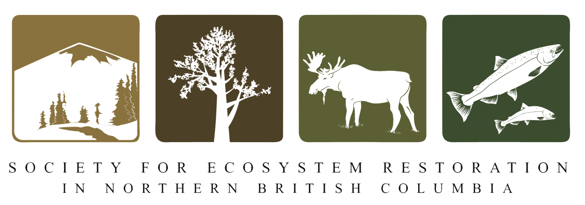

--- 
title: "DRAFT - Bulkley River and Morice River Watershed Groups Fish Passage Restoration Planning"
author: |
 |
 |
 | Prepared for
 | Habitat Conservation Trust Fund
 | BC Fish Passage Remediation Program
 | Canadian Wildlife Federation
 |
 |
 | Prepared by
 | Al Irvine, B.Sc., R.P.Bio.
 | New Graph Environment
 | 6 Regent St
 | Nelson, BC V1L 2P1
 |  
 | on behalf of
 | Society for Ecosytem Restoration Northern BC
date: |
 |
 | DRafT - Version 0.0.7
 | `r format(Sys.Date(), "%Y-%m-%d")`
toc-title: Table of Contents
site: bookdown::bookdown_site
output: bookdown::gitbook
documentclass: book
bibliography: [book.bib, references.bib, packages.bib]
biblio-style: apalike
link-citations: no
github-repo: rstudio/bookdown-demo
description: "My Description."

---


```{r setup, include = TRUE, echo =FALSE, message=FALSE, warning=FALSE}
knitr::opts_chunk$set(echo=FALSE, message=FALSE, warning=FALSE, dpi=60, out.width = "100%")
options(scipen=999)
options(knitr.kable.NA = '--')
options(knitr.kable.NAN = '--')

gitbook_on <- TRUE
# gitbook_on <- FALSE  ##we just need turn  this on and off to switch between gitbook and pdf via paged.js

```

```{r settings-gitbook, eval= gitbook_on}
photo_width <- "100%"
font_set <- 11

```

```{r settings-paged-html, eval= identical(gitbook_on, FALSE)}
photo_width <- "80%"
font_set <- 9

```


```{r}
source('R/packages.R')
source('R/functions.R')
source('R/functions-phase2.R')
source('R/0310-tables.R')
source('R/0320-tables-phase2.R')
source('R/0330-tables-phase1-cost-estimate.R')
source('R/0340-tables-phase2-cost-estimate.R') ##the order of these matters to much - should fix.  need to make cost estimate table seperate
source('R/0350-tables-reporting.R')
source('R/0380-extract-fish-to-hab-con-density-summary.R')
source('R/functions-fish.R')
source('R/0315-tables-bcfishpass.R')
```


```{r include=FALSE}
# automatically create a bib database for R packages
knitr::write_bib(c(
  .packages(), 'bookdown', 'knitr', 'rmarkdown'
), 'packages.bib')
```

# Acknowledgement {.front-matter .unnumbered}

The Bulkley River and Morice River watersheds are within Wet’suwet’en and Gitxsan territory. 

<br>

Modern civilization has a long journey ahead to acknowledge and address the historic and ongoing impacts of colonialism that have resulted in harm to the ecosystems in Northern British Columbia.  That harm naturally extends to the cultures and livelihoods of those that have lived in harmony with the Yintahk/Laxyip (land) for many thousands of years.

<br>

The Skeena Fisheries Commission honoured us when they put us in touch with their members in the fall of 2019 and hosted a forum for us to give a presentation about our project in the spring of 2020.  Thank you for having the patience to listen to our story which is a story you told us. Thank you Stu Barnes, Ryneld Starr, Allison Oliver, and the rest of the teams.

<br>


Mike Risdale, David Dewit, walter Joseph and Dallas Nikal from the Office of Wet'suwet'en (and the Witset First Nation) were incredibly generous with our team, provided a letter of support for the project, allowed us into their territory and shared some of their timeless knowledge of the Yintahk.  This continues to open our eyes to incredibly wise perspectives.  Misiyh.

<br>


The Gitskan Watershed Authority had the grace to share their past fish passage work with us and provide valuable input into our study plan. Ham i yaa Alecia Fernando and the rest of the teams.

<br>

Thank you to Kenny Rabnett for all the great work over the years that fed much of the background information for this report as well as for taking the time to answer questions and provide encouragement in 2017.

<br>


The contribution of all the Bulkley River watershed fish passage working group members has been wonderful and critical. Thank you Maureen Luggi, Jesse Stoeppler, Bill Blackwater, Brian Williams, Gordon Sebastian, Sean Staplin, Elaine Sampson and the rest of the current as well as future members.

<br>


We are very grateful for the financial support of the the Habitat Conservation Trust Fund, the Provincial Fish Passage Remediation Program and the Canadian Wildlife Federation. Thank you.

<br>


Our fish passage connection to the watershed began with the trust of Craig Mount, Richard Thompson, Dave Maloney and the rest of the British Columbia Fish Passage Technical Working group through a 2017 project commissioned by the Ministry of Environment and Climate Change Strategy (MoE). Thank you.


<br>


Much gratitude to Simon Norris from Hillcrest Geographics and Craig Mount from MoE for leveraging decades of hard work and ongoing investments towards the database management, GIS, modeling and mapping that has been absolutely essential to this work since the beginning. 

<br>


We feel privileged to benefit from a great amount of hard work and meaningful investments of the Canadian Wildlife Federation towards the open source tools we use and develop for the analysis of study area streams/watersheds/landscapes/climates.  We also recognize that CWF's work to coordinate the Bulkley River Fish Passage Working Group is one more massive step towards actionable plans. Thank you Nick LaPointe, David Browne, Betty Rebellato, Nick Mazany-Wright, Sarah Sra, olivia Baudet, Alex Laudadio, Sami Kurani, Nick O'Hanley and Dave Hillary.  

<br>

Thank you to David Wilford, Glen Buhr, Greg Tamblyn, Robyn Vaniderstine, Jesse Fraser, Chris Schell, Kenji Miyazaki, Dean Peard, Brian Kolman, Megan Peloso, Troy Larden, Beth Eagles and Julie Sheppard from FLNRORD for your insight, advise, and assistance. Among the manyu other things you have done for us, helping us tie our project to some of the numerous initiatives in your areas has been invaluable.

<br>

Thank you to Ron Ptolemy from MoE for enlightening discussions regarding the fish density modelling work  he has been developing over many years.

<br>


Thank you to Karla Graf from CN Rail and Kathryn Graham from the Ministry of Transportation and Infrastructure (MoTi) for reviewing target sites, providing insight/background for individual crossings, for providing letters of support for the project and for their continuous encouragement. 

<br>


Thank you so much to Steve Page, Darren Loverin, Ron Donnelly, Tom Bosch, Mark Dewit, Visti Mosumgaard and Miro Kosalko from the FLNRORD northern engineering and forestry team for sharing their experience, knowledge and know-how related to road engineering in their regions. 

<br>


Thank you to the crew at DFO who put us in touch with the powers and places that be, attended numerous meetings while providing support and encouragement. Thank you Sandra Devcic, Peter Dekoning, Lana Miller and Natalie Newman.

<br>


Thank you to Don Morgan from MoE, Lars Reese-Hanson from FLNRORD, Mike Risdale from the Office of Wet'suwet'en, Jesse Fraser from FLNRORD (and many others) for sharing their work with watershed status indicators and efforts/systems of the Environmental Stewardship Initiative.  Thank you also for introducing us to amazing places in the Owen Creek watershed. Whoa. Thank you.

<br>


Thank you to the crew at Eclipse Geomatics for all your help since 2017 and your invaluable curating of important knowledge and technology. Thank you Johanna Pfalz, Lizzy Hoffman and Ekaterina Daviel.

<br>


Thank you to Marc Gaboury for making space to discuss his work with Wet’suwet’en First Nation and Mike Smith (LGL Limited) to prescribe/implement fish passage restoration works and a series of other innovative restoration prescriptions within the upper Bulkley River.

<br>


We are extremely glad that Jonathan Van Barneveld, Forester - FLNRORD hunts waterfalls and is very very good at it. His input was monstrous for connectivity planning in the watershed. Thank you.

<br>


Michael Price is busy enough to undertake huge amounts of research with enormous depth yet found the time to attend our meetings and explore options for collaboration. Thank you.

<br>


Ian Sharpe helps coordinate incredible stewardship programs (Morice Watershed Monitoring Trust) of great importance and authors wonderful documents (including one that inspired this report's acknowledgment section - Upper Bulkley and Morice Water and Salmon Sustainability Views - 2019) yet also finds the time to return phone calls, share details of local initiatives and provide encouragement.

<br>


Cindy Verbeek from the Upper Bulkley Streamkeepers took time off from running the Canfor Buck Creek hatchery and from building the new Watershed Stewardship Centre in Houston to tour us on some key sites in the field, fill us in on important Upper Bulkley River context and to vouch for us with the kind and generous local land owner - Roger Groot. Thank you.

<br>


Thank you to Matt Sear and Dave Ripmeester from Pacific Inland Resources as well as Jesse Ahtiainen, Kevin Skarda and Vince Ross from Canadian Forest Products Ltd.  You saved us a ton of field work by taking the time for meetings, answering emails and sharing your valuable information.  

<br>


Thank you Jeff Anderson from Geomorphic Consulting for helping us see a bigger picture.

<br>


Our gratitude to Phil MacDonald from BC Timber Sales, Matt Hawkins from MoTI and Steve Page from FLNRORD for sharing their experience to help advise on how to devise tools to estimate costs for remedial works.

<br>

Thank you to Lee Hesketh from British Columbia Cattlemen’s Association for some encouraging conversations about a promising future for salmon in our  agriculturally modified landscapes.

<br>

Thanks so much to Living Lakes for finding the space for Kyle Prince to team up on the project.  We all know he is about as good as it gets in the field and a certified riot to work with. Thank you Kat Hartwig, Raegan Malinson and the rest of the teams. 

<br>


Thank you to Joe Thorley from Poisson Consulting Ltd.  The probability of better advise is negligible.


<br>


Many thanks to John DeGagne and Marc Steynen from SERNbc for their guidance, insight and encouragement for numerous aspects of the project. 

<br>


Field work for the project was completed by Allan Irvine, R.P.Bio. and Kyle Prince, P.Biol. Hard work, good times, cold water and open sky.  Misiyh. Ham i yaa. Thank you.

<br>


There are many others to which we owe our gratitude and please accept our apologies for leaving people out. It has been a great journey catching up to you all and we are so thankful for everyone willing to help.  Please reach out if we did not include you or others yet since the acknowledgment is well deserved.  

<br>


Fish passage is a wonderful example of how all things are connected and interdependent.  The barriers that divide will eventually fall once we understand together where, how and why they stand between.

<br>


Dzïn scudïlh’iy misiyh. Hami yaa nee loosim.


```{js, logo-header, echo = FALSE, eval= T}
title=document.getElementById('header');
title.innerHTML = '' + title.innerHTML
```

